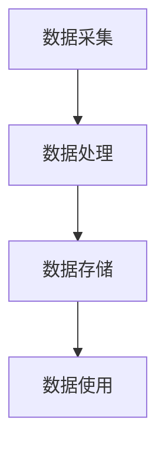
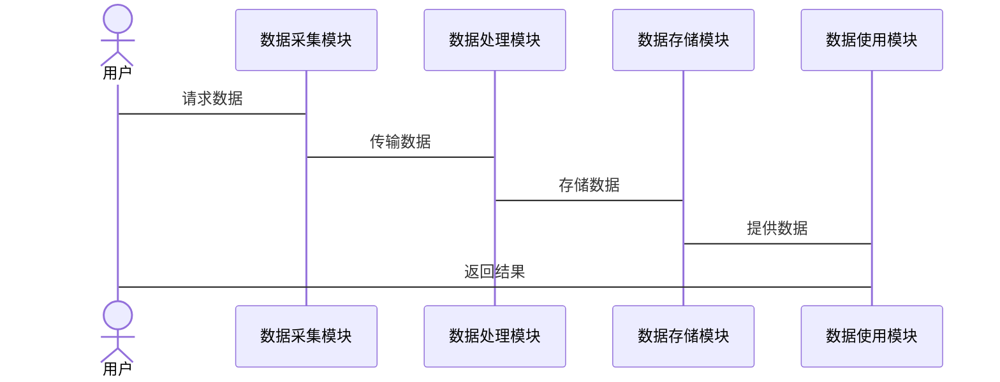

                 


# 企业AI Agent的数据治理框架

> 关键词：企业AI Agent, 数据治理, 数据安全, 数据质量管理, 数据生命周期管理, 数据架构设计

> 摘要：本文深入探讨了企业AI Agent在数据治理中的应用，从核心概念、算法原理、系统架构到项目实战，全面解析了企业AI Agent数据治理框架的构建与实施。通过详细阐述数据治理的各个方面，本文为技术人员和企业决策者提供了理论指导和实践参考，帮助企业更好地管理和优化AI Agent的数据治理流程。

---

# 第1章: 企业AI Agent与数据治理概述

## 1.1 企业AI Agent的背景与概念

### 1.1.1 企业AI Agent的定义与特点

企业AI Agent是一种智能代理系统，通过人工智能技术实现企业自动化、智能化的目标。它能够理解上下文、执行任务、优化决策并与其他系统或用户交互。以下是企业AI Agent的主要特点：

- **智能化**：基于机器学习、自然语言处理等技术，能够自主学习和优化。
- **自动化**：能够自动执行任务，减少人工干预。
- **适应性**：能够根据环境变化自适应调整行为。
- **交互性**：能够与用户、系统或其他AI Agent进行交互。

### 1.1.2 数据治理的定义与核心要素

数据治理是指对数据的全生命周期进行规划、监控和管理，以确保数据的准确性、完整性和安全性。数据治理的核心要素包括：

- **数据质量管理**：确保数据的准确性、一致性、完整性。
- **数据安全与隐私保护**：防止数据泄露、保护用户隐私。
- **数据访问控制**：基于角色或权限管理数据访问。
- **数据生命周期管理**：从数据生成到归档或销毁的全过程管理。

### 1.1.3 企业AI Agent与数据治理的关系

企业AI Agent的运行高度依赖数据，因此数据治理是其成功实施的关键。数据治理确保了AI Agent所依赖的数据是可靠、安全的，并且能够满足企业的业务需求。通过数据治理，企业可以优化AI Agent的性能，降低数据风险，提高决策的准确性。

### 1.1.4 数据治理的边界与外延

数据治理的边界包括数据的生成、存储、处理、分析和使用，而其外延则涉及数据安全、数据隐私、数据共享和数据合规等方面。

---

## 1.2 企业AI Agent的应用场景

### 1.2.1 智能客服与客户交互

企业AI Agent可以作为智能客服，通过自然语言处理技术与客户交互，解决客户问题、提供咨询服务。

### 1.2.2 企业流程自动化

企业AI Agent可以自动化处理订单、审批、物流等企业流程，提高效率并降低成本。

### 1.2.3 数据分析与决策支持

企业AI Agent可以分析大量数据，提供实时的决策支持，帮助企业做出更明智的业务决策。

---

## 1.3 数据治理在企业AI Agent中的重要性

### 1.3.1 数据质量对企业AI Agent的影响

数据质量直接影响AI Agent的性能和决策能力。低质量的数据可能导致错误的结论，从而影响企业的业务。

### 1.3.2 数据安全与隐私保护

企业AI Agent处理大量敏感数据，数据安全和隐私保护是确保合规性和信任的关键。

### 1.3.3 数据治理对企业AI Agent的长期价值

通过数据治理，企业可以建立规范的数据管理流程，降低数据风险，提高数据利用率，从而为AI Agent的长期发展提供支持。

---

## 1.4 本章小结

本章从企业AI Agent的背景与概念出发，介绍了数据治理的核心要素及其在企业AI Agent中的重要性。通过分析企业AI Agent的应用场景，强调了数据治理在确保AI Agent高效运行和数据安全中的关键作用。

---

# 第2章: 企业AI Agent的数据治理框架核心概念

## 2.1 数据治理框架的原理

### 2.1.1 数据生命周期管理

数据生命周期管理包括数据的生成、存储、处理、分析、使用和销毁等阶段。通过生命周期管理，企业可以更好地控制数据的流动和使用。

### 2.1.2 数据质量管理

数据质量管理包括数据清洗、数据增强和数据标准化等过程，确保数据的准确性、一致性和完整性。

### 2.1.3 数据安全与访问控制

数据安全与访问控制通过加密、身份验证和权限管理等技术，确保数据的安全性和合规性。

---

## 2.2 核心概念与联系

### 2.2.1 数据治理框架的核心要素

数据治理框架的核心要素包括：

- 数据资产：企业中所有数据的集合。
- 数据政策：数据治理的规则和策略。
- 数据操作：数据的处理和使用过程。

### 2.2.2 数据治理与企业AI Agent的实体关系图

```mermaid
er
    actor: 企业AI Agent
    actor -->|拥有| data_asset: 数据资产
    actor -->|依赖| data_policy: 数据政策
    actor -->|执行| data_operation: 数据操作
    data_asset -->|遵循| data_policy
    data_operation -->|涉及| data_asset
```

### 2.2.3 数据治理与企业AI Agent的协同关系

企业AI Agent依赖数据资产，通过数据政策和数据操作与数据治理框架协同工作，确保数据的合规性和安全性。

---

## 2.3 数据治理框架的优缺点分析

### 2.3.1 数据治理与数据管理的对比

数据治理与数据管理的区别主要在于范围和目标。数据管理更注重数据的存储和使用，而数据治理更注重数据的合规性和安全性。

### 2.3.2 数据治理框架的优缺点

- **优点**：确保数据的合规性、安全性和可用性。
- **缺点**：实施成本高，需要企业投入大量资源。

---

## 2.4 本章小结

本章详细介绍了企业AI Agent数据治理框架的核心概念和关键要素，通过实体关系图展示了数据治理与企业AI Agent之间的关系。通过对数据治理框架的优缺点分析，为后续的实施提供了理论基础。

---

# 第3章: 企业AI Agent数据治理的算法原理

## 3.1 数据治理中的关键算法

### 3.1.1 数据清洗算法

数据清洗算法用于去除噪声数据，确保数据的准确性和一致性。

### 3.1.2 数据增强算法

数据增强算法用于扩展数据集，提高模型的泛化能力。

### 3.1.3 数据安全加密算法

数据安全加密算法用于保护数据的安全性，防止数据泄露。

---

## 3.2 数据清洗算法实现

### 3.2.1 数据清洗流程

数据清洗流程包括数据去重、处理缺失值、标准化和去噪等步骤。

### 3.2.2 数据清洗的数学模型

数据清洗可以通过以下数学模型实现：

$$ \text{清洗后数据} = \{x_1, x_2, ..., x_n\} $$

其中，$x_i$表示清洗后的数据点。

---

## 3.3 数据增强算法实现

### 3.3.1 数据增强方法

数据增强方法包括随机裁剪、翻转、旋转和添加噪声等。

### 3.3.2 数据增强的数学模型

数据增强可以通过以下数学模型实现：

$$ \text{增强后数据} = f(x) $$

其中，$f$表示数据增强函数，$x$表示原始数据。

---

## 3.4 数据安全加密算法

### 3.4.1 加密算法原理

加密算法通过将数据转换为密文，防止未经授权的访问。

### 3.4.2 加密算法的数学模型

加密算法可以通过以下数学模型表示：

$$ \text{密文} = E(x) $$

其中，$E$表示加密函数，$x$表示明文。

---

## 3.5 本章小结

本章详细讲解了企业AI Agent数据治理中的关键算法，包括数据清洗、数据增强和数据加密的实现原理和数学模型。通过这些算法，企业可以确保数据的准确性和安全性。

---

# 第4章: 企业AI Agent数据治理的系统架构设计

## 4.1 系统介绍

企业AI Agent数据治理系统包括数据采集、数据处理、数据存储和数据使用四个部分。

---

## 4.2 系统功能设计

### 4.2.1 系统功能模块

系统功能模块包括数据采集模块、数据处理模块、数据存储模块和数据使用模块。

---

## 4.3 系统架构设计



---

## 4.4 系统接口设计

### 4.4.1 数据采集接口

数据采集接口用于从外部数据源获取数据。

### 4.4.2 数据处理接口

数据处理接口用于对数据进行清洗和增强。

### 4.4.3 数据存储接口

数据存储接口用于将数据存储到数据库中。

### 4.4.4 数据使用接口

数据使用接口用于将数据提供给AI Agent使用。

---

## 4.5 系统交互设计



---

## 4.6 本章小结

本章详细介绍了企业AI Agent数据治理系统的架构设计，包括功能模块、接口设计和系统交互流程。通过系统架构设计，企业可以更好地管理和优化数据治理流程。

---

# 第5章: 企业AI Agent数据治理的项目实战

## 5.1 项目介绍

本项目旨在构建一个企业AI Agent数据治理系统，实现数据的全生命周期管理。

---

## 5.2 核心代码实现

### 5.2.1 数据清洗代码

```python
def clean_data(data):
    # 去除重复数据
    unique_data = list(set(data))
    # 处理缺失值
    cleaned_data = [x for x in unique_data if x is not None]
    return cleaned_data
```

### 5.2.2 数据加密代码

```python
def encrypt_data(data):
    # 使用AES加密
    key = b'your-secret-key'
    iv = os.urandom(16)
    cipher = AES.new(key, AES.MODE_CBC, iv)
    encrypted_data = cipher.encrypt(data)
    return encrypted_data
```

---

## 5.3 项目总结

通过本项目，我们成功实现了企业AI Agent数据治理系统的构建，确保了数据的准确性和安全性。

---

# 第6章: 企业AI Agent数据治理的最佳实践

## 6.1 小结

企业AI Agent数据治理是确保企业智能化转型成功的关键。通过本文的分析，我们得出以下结论：

- 数据治理是企业AI Agent成功实施的基础。
- 数据治理框架的设计需要综合考虑数据的全生命周期管理。
- 数据治理的实施需要结合企业的实际情况，制定合理的策略和流程。

---

## 6.2 注意事项

- 数据治理的实施需要企业高层的重视和支持。
- 数据治理的实施需要结合企业的实际情况，制定合理的策略和流程。
- 数据治理的实施需要专业团队的参与，确保技术实现的正确性。

---

## 6.3 拓展阅读

- 《数据治理实战》
- 《企业智能化转型》
- 《AI Agent技术与应用》

---

# 结语

企业AI Agent数据治理框架的构建与实施是一个复杂而重要的任务。通过本文的分析和实践，我们为企业提供了理论指导和实践参考。未来，随着人工智能技术的不断发展，企业AI Agent的数据治理将更加重要，需要我们不断探索和优化。

---

**全文完**

