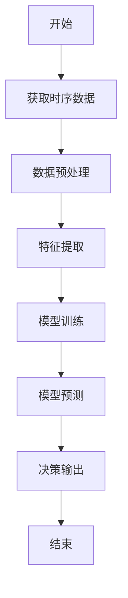

                 


# 企业AI Agent的时序数据库设计与应用

## 关键词：
企业AI Agent、时序数据库、数据管理、系统架构、算法优化

## 摘要：
本文探讨了企业在应用AI Agent时面临的时序数据管理挑战，并详细分析了时序数据库的核心原理、设计方法及其在AI Agent中的应用。通过对比分析，展示了时序数据库在支持AI Agent决策中的独特优势，并提供了实际项目设计与优化的解决方案。

---

## 第一部分: 引言

### 第1章: 背景介绍

#### 1.1 问题背景

##### 1.1.1 企业AI Agent的发展现状
企业AI Agent作为人工智能技术的重要应用，广泛应用于智能监控、自动化运维和预测分析等领域。随着企业数字化转型的推进，AI Agent需要处理的数据规模越来越大，尤其是时序数据。

##### 1.1.2 时序数据库的定义与特点
时序数据库专门用于存储和查询时间序列数据，具有高时间分辨率、数据连续性等特性，适合处理传感器数据、日志数据等时序信息。

##### 1.1.3 企业AI Agent与时序数据库的结合
AI Agent需要实时处理和分析时序数据，例如传感器数据、用户行为数据等，以支持决策和预测。

#### 1.2 问题描述

##### 1.2.1 企业AI Agent的核心需求
AI Agent需要实时处理大量时序数据，快速响应和决策。

##### 1.2.2 时序数据的重要性
时序数据是AI Agent进行预测和决策的重要依据，例如历史销售数据、系统日志等。

##### 1.2.3 当前企业AI Agent在时序数据库应用中的痛点
现有数据库无法高效处理时序数据，查询效率低，难以支持实时决策。

#### 1.3 问题解决

##### 1.3.1 时序数据库如何支持企业AI Agent
通过优化存储和查询机制，提高时序数据的处理效率，支持实时分析。

##### 1.3.2 时序数据库在AI Agent中的应用场景
用于实时监控、预测分析、异常检测等场景。

##### 1.3.3 解决企业AI Agent时序数据管理的方案
采用专门的时序数据库技术，优化数据存储和查询性能。

#### 1.4 边界与外延

##### 1.4.1 时序数据库的边界
仅处理时间序列数据，不支持其他类型数据的存储和查询。

##### 1.4.2 企业AI Agent的边界
仅负责数据处理和决策，不涉及数据存储。

##### 1.4.3 时序数据库与企业AI Agent的外延关系
AI Agent依赖时序数据库处理数据，但也可以与其他数据源结合使用。

#### 1.5 概念结构与核心要素组成

##### 1.5.1 时序数据库的核心要素
- 时间戳：数据的时间属性。
- 数据点：具体的数据值。
- 存储结构：优化存储时序数据的结构。

##### 1.5.2 企业AI Agent的核心要素
- 数据处理：实时处理和分析数据。
- 决策机制：基于数据做出决策。
- 交互接口：与用户或其他系统交互。

##### 1.5.3 两者的关联关系
AI Agent依赖时序数据库进行数据处理，时序数据库为AI Agent提供高效的数据支持。

### 第2章: 核心概念与联系

#### 2.1 时序数据库的核心原理

##### 2.1.1 时序数据的特性
时序数据具有时间连续性、周期性等特性，适合用时序数据库进行处理。

##### 2.1.2 时序数据库的存储机制
采用压缩存储、分段存储等技术，优化时序数据的存储效率。

##### 2.1.3 时序数据库的查询优化
通过索引优化、时间范围查询等技术，提高查询效率。

#### 2.2 AI Agent的核心原理

##### 2.2.1 AI Agent的定义与组成
AI Agent是一个能够感知环境、自主决策的智能体，通常包括感知、推理、决策和执行四个部分。

##### 2.2.2 AI Agent的决策机制
基于实时数据和历史数据，利用机器学习算法进行预测和决策。

##### 2.2.3 AI Agent的数据需求
需要实时的、连续的时序数据，支持预测和决策。

#### 2.3 时序数据库与AI Agent的联系

##### 2.3.1 时序数据在AI Agent中的作用
时序数据是AI Agent进行预测和决策的基础。

##### 2.3.2 时序数据库对AI Agent的支持
通过高效存储和查询时序数据，支持AI Agent的实时决策。

##### 2.3.3 两者的结合对企业的影响
提高企业的数据分析能力，支持智能化决策。

#### 2.4 核心概念原理对比

##### 2.4.1 时序数据库与传统数据库的对比
| 特性         | 时序数据库         | 传统数据库       |
|--------------|--------------------|------------------|
| 数据类型     | 时间序列数据       | 多种数据类型     |
| 查询优化     | 时间范围查询优化   | 全面查询优化     |
| 存储效率     | 高                | 较低             |

##### 2.4.2 时序数据库与AI Agent的关系
时序数据库为AI Agent提供高效的数据支持，AI Agent利用时序数据进行预测和决策。

---

## 图表展示

### 时序数据库的ER图

```mermaid
erDiagram
    customer {
        id : integer
        name : string
    }
    order {
        id : integer
        customer_id : integer
        order_date : date
    }
    product {
        id : integer
        name : string
    }
    order_line {
        order_id : integer
        product_id : integer
        quantity : integer
    }
    customer_order -- order_line : "orders"
    product_order -- order_line : "contains"
```

### AI Agent的时序数据处理流程



---

## 总结

通过以上分析，我们了解了时序数据库在企业AI Agent中的重要性，以及如何通过优化时序数据库的设计和应用，提升AI Agent的决策能力和效率。接下来的章节将深入探讨时序数据库的具体算法原理和系统设计，结合实际案例进行详细分析。

