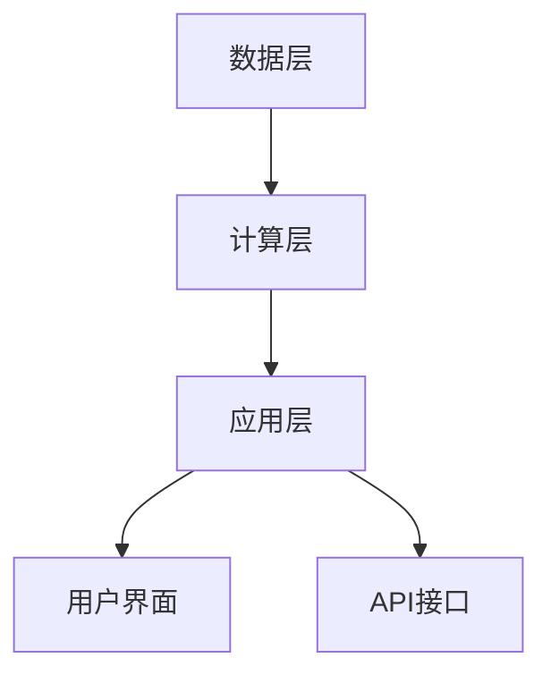

                 


# 企业AI Agent的时序数据预测平台设计

## 关键词：AI Agent，时序数据，预测平台，深度学习，强化学习，系统架构

## 摘要：  
本文系统地探讨了企业级AI Agent在时序数据预测平台设计中的应用。通过分析时序数据预测的核心问题，结合AI Agent的决策机制，提出了基于深度学习和强化学习的解决方案，并详细阐述了平台的系统架构和实现方法。本文还通过实际案例展示了如何将理论应用于实践，并提出了优化建议和未来研究方向。

---

# 第一部分: 企业AI Agent的时序数据预测平台背景与概念

## 第1章: 时序数据预测的背景与问题描述

### 1.1 时序数据预测的背景介绍  
时序数据是指按照时间顺序记录的数据，广泛存在于企业经营、金融分析、工业生产等领域。随着企业对数据驱动决策的需求增加，时序数据预测成为企业智能化转型的重要方向。AI Agent作为一种能够自主决策和执行任务的智能体，为时序数据预测提供了新的技术手段。  

**关键术语**：  
- **时序数据**：按照时间顺序排列的数据，具有时间依赖性。  
- **AI Agent**：具有感知环境和自主决策能力的智能体。  

### 1.2 问题背景与问题描述  
时序数据预测的核心问题是基于历史数据，预测未来趋势。传统方法（如ARIMA、Prophet）在处理复杂场景时存在局限性，例如对异常值敏感、难以捕捉复杂模式等。AI Agent通过结合强化学习和深度学习，能够更好地应对动态变化的环境，提升预测精度和决策能力。  

**核心问题**：  
1. 如何利用AI Agent实现时序数据的动态预测？  
2. 如何设计高效的预测模型以应对复杂场景？  

### 1.3 问题解决与边界定义  
AI Agent通过以下方式解决时序数据预测问题：  
1. **动态学习**：根据环境反馈调整预测模型。  
2. **自主决策**：基于预测结果做出最优决策。  
3. **自我优化**：通过强化学习不断优化预测精度。  

**边界与外延**：  
- 本平台仅关注企业内部数据的预测，不涉及外部数据源。  
- 预测结果用于内部决策，不直接对外提供服务。  

---

# 第二部分: 企业AI Agent的核心概念与原理

## 第2章: AI Agent与时序数据预测的核心概念

### 2.1 AI Agent的核心原理  
AI Agent的核心原理包括感知、决策和执行三个环节：  
1. **感知**：通过传感器或数据源获取环境信息。  
2. **决策**：基于感知信息，利用算法生成决策方案。  
3. **执行**：通过执行器或API将决策转化为具体操作。  

### 2.2 时序数据预测的数学模型  
时序数据预测的数学模型可以分为两类：  
1. **传统模型**：如ARIMA、Prophet，适用于线性趋势和周期性数据。  
2. **深度学习模型**：如LSTM、Transformer，适用于复杂非线性数据。  

**数学公式**：  
- ARIMA模型：$Y_t = \phi Y_{t-1} + \epsilon_t$  
- LSTM模型：$f(x) = \text{LSTM}(x, \text{units}=128, \text{dropout}=0.2)$  

### 2.3 AI Agent与时序预测的结合  
AI Agent通过以下方式与时序预测结合：  
1. **动态调整**：根据实时数据动态调整预测模型。  
2. **多目标优化**：在预测过程中同时优化多个目标（如精度、效率）。  
3. **自我学习**：通过强化学习不断优化预测策略。  

---

# 第三部分: 企业AI Agent时序数据预测平台的设计与实现

## 第3章: 平台系统架构与实现

### 3.1 问题场景分析  
平台需要解决以下问题：  
1. 如何高效处理海量时序数据？  
2. 如何保证预测模型的实时性？  
3. 如何实现AI Agent的自主决策？  

### 3.2 系统功能设计  
系统功能模块包括：  
1. 数据采集模块：从数据库或API获取时序数据。  
2. 预测模型模块：实现LSTM或Transformer模型。  
3. AI Agent模块：负责决策和执行。  
4. 结果展示模块：可视化预测结果和决策过程。  

### 3.3 系统架构设计  
系统架构采用分层设计：  
1. **数据层**：存储原始数据和预测结果。  
2. **计算层**：运行预测模型和AI Agent算法。  
3. **应用层**：提供用户界面和API接口。  

**Mermaid架构图**：  


### 3.4 项目实战与代码实现  

#### 3.4.1 环境安装  
需要安装以下工具：  
- Python 3.8+  
- TensorFlow 2.5+  
- Keras 2.4+  
- Plotly 5.8+  

#### 3.4.2 核心代码实现  
以下是LSTM模型的实现代码：  
```python
import numpy as np
from tensorflow.keras.models import Sequential
from tensorflow.keras.layers import LSTM, Dense, Dropout

def build_lstm_model(input_shape):
    model = Sequential()
    model.add(LSTM(128, input_shape=input_shape, return_sequences=True))
    model.add(Dropout(0.2))
    model.add(LSTM(64, return_sequences=False))
    model.add(Dense(1, activation='linear'))
    model.compile(loss='mean_squared_error', optimizer='adam')
    return model
```

#### 3.4.3 案例分析  
以股票价格预测为例，使用LSTM模型训练并预测未来价格。  

---

## 第4章: 优化建议与未来展望

### 4.1 优化建议  
1. **模型优化**：尝试不同的模型组合（如LSTM+Transformer）。  
2. **算法优化**：引入强化学习（如PPO算法）提升决策能力。  
3. **系统优化**：优化数据存储和计算效率。  

### 4.2 未来展望  
1. **多模态预测**：结合文本、图像等多种数据源。  
2. **边缘计算**：将预测模型部署到边缘设备。  
3. **自适应学习**：实现模型的自适应优化。  

---

## 结语  
企业AI Agent的时序数据预测平台设计是一项复杂的系统工程，涉及算法、架构和工程实现等多个方面。通过结合深度学习和强化学习，AI Agent能够显著提升时序数据预测的精度和效率。未来，随着技术的进步，AI Agent在企业中的应用将更加广泛和深入。

--- 

**附录**：  
- 代码示例的完整实现  
- 数据集的获取方法  
- 优化算法的具体实现

