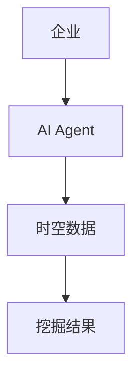
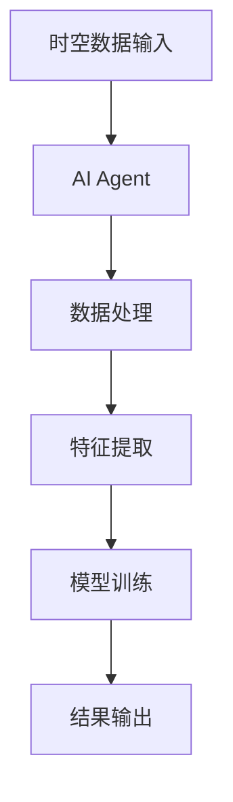
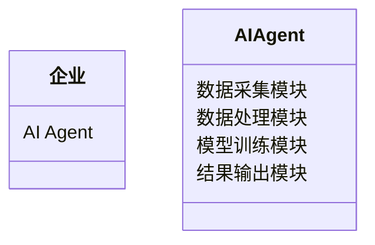
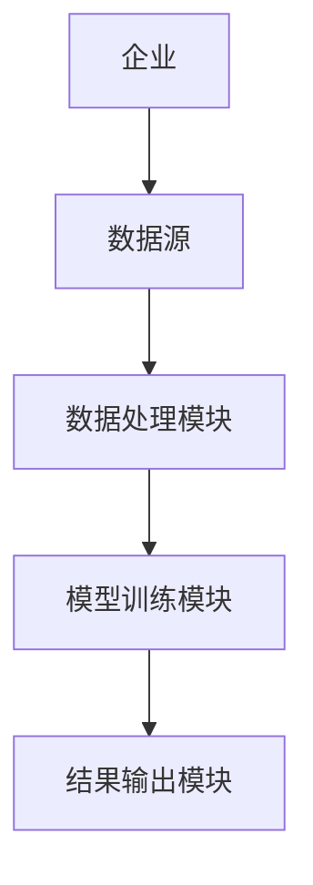
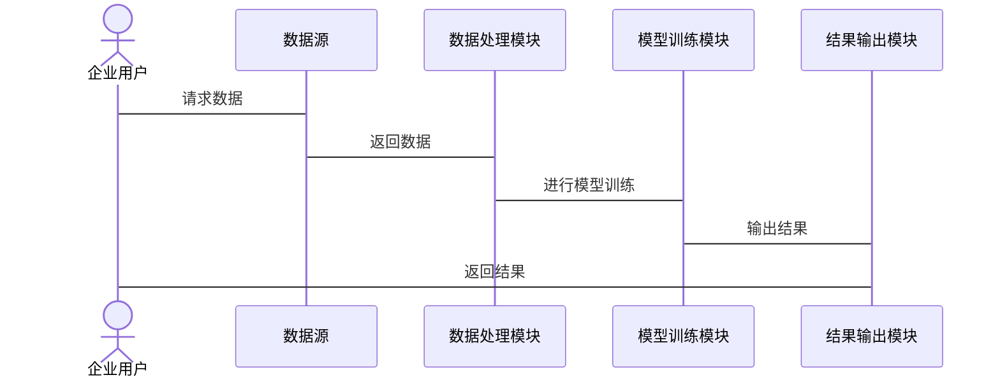

                 


# 企业AI Agent的时空大数据挖掘平台

## 关键词：企业AI Agent、时空大数据、数据挖掘、系统架构、算法原理、项目实战

## 摘要：本文详细探讨了企业AI Agent在时空大数据挖掘中的应用，结合实际案例分析，从算法原理到系统架构，再到项目实战，全面解析了如何构建高效、智能的时空大数据挖掘平台。文章内容涵盖背景介绍、核心概念、算法原理、系统设计、项目实战等多个方面，为读者提供了一套完整的解决方案。

---

# 第一部分：背景介绍

## 第1章：问题背景与核心概念

### 1.1 问题背景介绍

#### 1.1.1 企业AI Agent的定义与特点

企业AI Agent是一种智能代理系统，能够帮助企业自动化处理各种任务，包括数据收集、分析、决策等。其特点包括自主性、反应性、目标导向和学习能力。

#### 1.1.2 时空大数据挖掘的必要性

在企业运营中，时空大数据（如地理位置数据和时间序列数据）的处理变得越来越重要。通过挖掘这些数据，企业可以更好地理解市场趋势、优化资源配置、提高决策效率。

#### 1.1.3 企业AI Agent与时空大数据挖掘的结合

将AI Agent应用于时空大数据挖掘，可以实现数据的实时处理和智能分析，为企业提供实时洞察。

### 1.2 核心概念与问题描述

#### 1.2.1 时空大数据的定义与特征

时空大数据指的是包含时间和空间维度的数据，具有高维性、异构性、时空依赖性等特点。

#### 1.2.2 AI Agent的核心功能与作用

AI Agent在时空大数据中的作用包括数据采集、预处理、特征提取、模型训练和结果输出。

#### 1.2.3 问题解决的目标与边界

目标是通过AI Agent实现对时空数据的高效挖掘，提取有价值的信息。边界包括数据范围、处理时间和资源限制。

#### 1.2.4 概念结构与核心要素组成

概念结构包括数据源、数据处理模块、模型训练模块和结果输出模块。核心要素包括时空数据、AI Agent算法、特征提取方法和决策模型。

---

# 第二部分：核心概念与联系

## 第2章：时空大数据挖掘的原理与方法

### 2.1 时空大数据的特征与属性

时空数据具有空间性和时间性，需要考虑数据的位置和时间关系。

### 2.2 AI Agent的核心原理

AI Agent通过感知、决策和执行来处理数据，实现对时空数据的挖掘。

### 2.3 核心概念的对比分析

#### 2.3.1 时空大数据与传统数据的对比

时空数据具有更高的复杂性和维度，处理难度更大。

#### 2.3.2 AI Agent与传统算法的对比

AI Agent具有更强的自主性和适应性，能够处理动态变化的数据。

### 2.4 实体关系图与流程图

#### 2.4.1 ER实体关系图



#### 2.4.2 核心流程图



---

# 第三部分：算法原理与数学模型

## 第3章：时空大数据挖掘的核心算法

### 3.1 空间数据聚类算法

#### 3.1.1 K-means算法

K-means是一种无监督聚类算法，适用于空间数据的聚类。

#### 3.1.2 DBSCAN算法

DBSCAN是一种基于密度的聚类算法，适用于处理噪声数据。

#### 3.1.3 时间序列聚类

时间序列聚类适用于分析时间数据的变化趋势。

### 3.2 时间序列分析算法

#### 3.2.1 ARIMA模型

ARIMA是一种广泛用于时间序列预测的模型。

#### 3.2.2 LSTM网络

LSTM是一种深度学习模型，适用于时间序列数据的预测。

#### 3.2.3 Prophet模型

Prophet是一种由Facebook开发的时间序列预测模型。

### 3.3 空间插值算法

#### 3.3.1 IDW插值

IDW是一种基于距离的插值方法，适用于空间数据的插值。

#### 3.3.2 Kriging插值

Kriging是一种统计插值方法，适用于处理空间数据的不确定性。

#### 3.3.3 样板插值

样板插值是一种简单的插值方法，适用于数据稀疏的情况。

### 3.4 AI Agent的决策模型

#### 3.4.1 决策树模型

决策树是一种基于树结构的分类和回归模型。

#### 3.4.2 支持向量机

支持向量机是一种监督学习模型，适用于分类和回归任务。

#### 3.4.3 神经网络模型

神经网络是一种仿生的深度学习模型，适用于复杂的模式识别任务。

---

# 第四部分：系统分析与架构设计

## 第4章：系统架构设计

### 4.1 问题场景介绍

企业需要处理大量的时空数据，希望通过AI Agent实现数据的高效挖掘和分析。

### 4.2 系统功能设计

系统功能包括数据采集、数据处理、模型训练和结果输出。

### 4.3 领域模型类图



### 4.4 系统架构图



### 4.5 接口和交互设计

#### 4.5.1 接口设计

AI Agent通过API接口与数据源和外部系统进行交互。

#### 4.5.2 交互设计



---

# 第五部分：项目实战

## 第5章：项目实战

### 5.1 环境安装

安装必要的软件和库，包括Python、Jupyter Notebook、Pandas、Scikit-learn等。

### 5.2 核心代码实现

#### 5.2.1 数据采集模块

```python
import pandas as pd
data = pd.read_csv('data.csv')
```

#### 5.2.2 数据处理模块

```python
from sklearn.preprocessing import StandardScaler
scaler = StandardScaler()
data_scaled = scaler.fit_transform(data)
```

#### 5.2.3 模型训练模块

```python
from sklearn.cluster import KMeans
model = KMeans(n_clusters=3)
model.fit(data_scaled)
```

#### 5.2.4 结果输出模块

```python
print(model.labels_)
```

### 5.3 代码解读与分析

对核心代码进行详细解读，说明每一步的功能和作用。

### 5.4 案例分析与详细讲解

通过实际案例分析，展示AI Agent在时空大数据挖掘中的应用效果。

### 5.5 项目总结

总结项目实施的经验和教训，提出改进建议。

---

# 第六部分：最佳实践与总结

## 第6章：最佳实践

### 6.1 技术选型建议

根据项目需求选择合适的算法和工具。

### 6.2 性能优化技巧

通过数据预处理、模型调优等方法提高系统性能。

### 6.3 安全注意事项

确保数据的安全性和系统的稳定性。

### 6.4 拓展阅读

推荐相关的书籍和资源，供读者深入学习。

---

# 附录：参考文献

列出文章中引用的文献和资料。

---

通过以上目录结构，文章内容将涵盖企业AI Agent的时空大数据挖掘平台的各个方面，从理论到实践，为读者提供全面的指导和参考。

