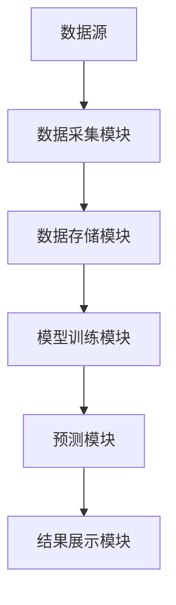
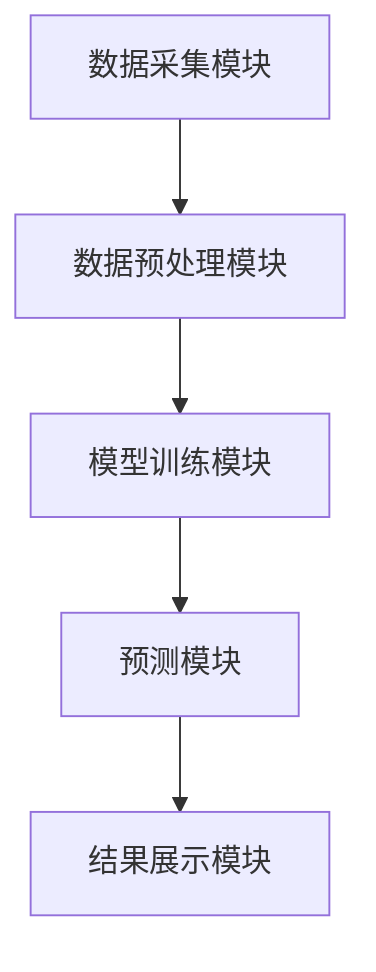
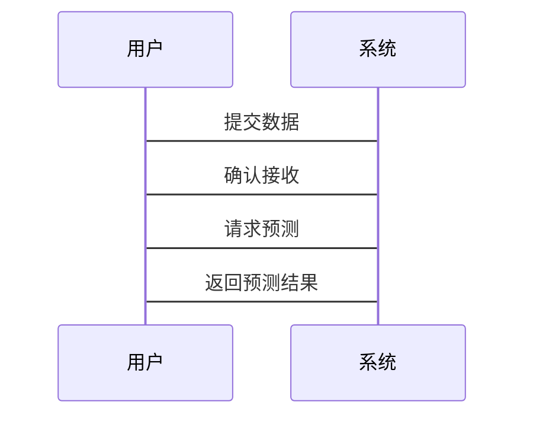

                 


# 企业AI Agent的时间序列分析在需求预测中的高级应用

## 关键词：企业AI Agent, 时间序列分析, 需求预测, ARIMA, LSTM, 预测模型

## 摘要：本文详细探讨了企业AI Agent在时间序列分析中的高级应用，特别是如何利用这些技术进行需求预测。文章从时间序列分析的基本原理和AI Agent的概念出发，深入分析了时间序列分析在需求预测中的作用，并通过具体的算法实现、系统架构设计和项目实战，展示了如何将这些技术应用于实际场景中。文章最后总结了最佳实践和未来发展方向。

---

## 第4章: 时间序列分析在需求预测中的高级应用

### 4.1 需求预测的基本流程

#### 4.1.1 数据收集与清洗
需求预测的第一步是数据的收集与清洗。企业需要从多个渠道收集历史销售数据、市场数据、客户行为数据等，然后对数据进行清洗，去除噪声数据和异常值。

#### 4.1.2 特征工程
在时间序列分析中，特征工程是至关重要的一步。通过对数据的特征提取，如趋势、周期性、季节性等，可以更好地捕捉数据中的潜在规律。

#### 4.1.3 模型选择与训练
根据具体需求和数据特点，选择合适的模型进行训练。常见的模型包括ARIMA、LSTM等。

#### 4.1.4 模型评估与优化
通过交叉验证、均方误差（MSE）、平均绝对误差（MAE）等指标对模型进行评估，并根据评估结果进行参数调优。

### 4.2 时间序列分析的高级算法

#### 4.2.1 基于ARIMA模型的需求预测
ARIMA模型是一种经典的统计模型，适用于线性时间序列数据。以下是ARIMA模型的实现步骤：

1. 数据预处理：对数据进行差分处理，使其平稳化。
2. 参数选择：确定模型的阶数p、d、q。
3. 模型训练：使用历史数据训练模型。
4. 预测与评估：对未来的数据进行预测，并评估预测结果。

#### 4.2.2 基于LSTM模型的需求预测
LSTM（长短期记忆网络）是一种深度学习模型，特别适用于处理长序列数据。以下是LSTM模型的实现步骤：

1. 数据预处理：将时间序列数据转换为适合LSTM输入的格式。
2. 模型构建：定义LSTM网络的结构，包括输入层、LSTM层、 Dense层和输出层。
3. 模型训练：使用历史数据训练模型。
4. 预测与评估：对未来的数据进行预测，并评估预测结果。

#### 4.2.3 组合模型的应用
为了进一步提高预测的准确性，可以将ARIMA和LSTM模型结合起来，利用各自的优点进行预测。

### 4.3 需求预测的系统架构设计

#### 4.3.1 系统功能设计
- 数据采集模块：负责数据的采集和预处理。
- 模型训练模块：负责模型的训练和优化。
- 预测模块：负责未来的数据预测。
- 结果展示模块：负责预测结果的可视化和分析。

#### 4.3.2 系统架构设计
以下是系统架构的Mermaid图：



#### 4.3.3 系统接口设计
系统需要以下几个接口：
- 数据接口：用于数据的输入和输出。
- 模型接口：用于模型的训练和预测。
- 结果接口：用于结果的展示和分析。

### 4.4 项目实战：基于LSTM的需求预测

#### 4.4.1 环境配置
需要安装以下库：
- Python 3.8+
- Keras 2.4.3+
- TensorFlow 2.5.0+
- Pandas 1.3.5+
- Matplotlib 3.3.4+

#### 4.4.2 核心代码实现
以下是LSTM模型的实现代码：

```python
import numpy as np
import pandas as pd
from sklearn.preprocessing import MinMaxScaler
from tensorflow.keras.models import Sequential
from tensorflow.keras.layers import LSTM, Dense, Dropout

# 数据加载与预处理
data = pd.read_csv('sales.csv')
scaler = MinMaxScaler()
data_scaled = scaler.fit_transform(data.values)

# 数据分割
train_data = data_scaled[:1000]
test_data = data_scaled[1000:]

# 数据转换为适合LSTM输入的格式
def create_dataset(data, look_back=1):
    X, Y = [], []
    for i in range(len(data) - look_back):
        X.append(data[i:i+look_back])
        Y.append(data[i+look_back])
    return np.array(X), np.array(Y)

X_train, Y_train = create_dataset(train_data, look_back=5)
X_test, Y_test = create_dataset(test_data, look_back=5)

# 模型构建
model = Sequential()
model.add(LSTM(50, return_sequences=True, input_shape=(5, 1)))
model.add(LSTM(50, return_sequences=False))
model.add(Dense(1))

model.compile(loss='mean_squared_error', optimizer='adam')

# 模型训练
model.fit(X_train, Y_train, epochs=50, batch_size=32, verbose=1)

# 模型预测
train_predict = model.predict(X_train)
test_predict = model.predict(X_test)

# 结果评估
train_score = model.evaluate(X_train, Y_train, verbose=0)
test_score = model.evaluate(X_test, Y_test, verbose=0)

print(f"Train Score: {train_score}")
print(f"Test Score: {test_score}")
```

#### 4.4.3 代码解读与分析
- 数据加载与预处理：使用`MinMaxScaler`对数据进行归一化处理。
- 数据分割：将数据分为训练集和测试集。
- 数据转换：将数据转换为适合LSTM输入的格式。
- 模型构建：定义LSTM网络的结构，包括两层LSTM和一层Dense层。
- 模型训练：使用训练数据训练模型。
- 模型预测：对测试数据进行预测。
- 结果评估：评估模型的训练和测试性能。

### 4.5 本章小结

---

## 第5章: 系统架构与实现

### 5.1 系统架构设计

#### 5.1.1 系统功能模块
- 数据采集模块
- 数据预处理模块
- 模型训练模块
- 预测模块
- 结果展示模块

#### 5.1.2 系统架构图
以下是系统架构的Mermaid图：



### 5.2 系统接口设计

#### 5.2.1 数据接口
- 数据输入接口：用于接收外部数据。
- 数据输出接口：用于输出处理后的数据。

#### 5.2.2 模型接口
- 模型训练接口：用于训练模型。
- 模型预测接口：用于进行预测。

### 5.3 系统交互设计

#### 5.3.1 交互流程
以下是系统交互的Mermaid图：



### 5.4 本章小结

---

## 第6章: 项目实战与优化

### 6.1 项目实战：基于ARIMA的销售预测

#### 6.1.1 项目背景
某零售企业希望利用时间序列分析技术预测未来的销售情况，以便更好地进行库存管理和市场营销。

#### 6.1.2 数据准备
加载销售数据并进行必要的预处理：

```python
import pandas as pd
from statsmodels.tsa.arima_model import ARIMA
import matplotlib.pyplot as plt

data = pd.read_csv('sales.csv')
data.index = pd.to_datetime(data['date'])
data = data['sales'].values
```

#### 6.1.3 模型训练
使用ARIMA模型进行训练：

```python
model = ARIMA(data, order=(5, 1, 2))
model_fit = model.fit(disp=0)
```

#### 6.1.4 模型预测
对未来7天的销售情况进行预测：

```python
forecast = model_fit.forecast(steps=7)
print(forecast)
```

#### 6.1.5 结果评估
通过均方误差（MSE）和平均绝对误差（MAE）评估模型性能。

### 6.2 模型优化与调优

#### 6.2.1 参数调优
通过网格搜索等方式优化ARIMA模型的参数。

#### 6.2.2 模型集成
将ARIMA和LSTM模型结合起来，利用集成学习进一步提高预测准确性。

### 6.3 项目小结

---

## 第7章: 最佳实践与未来展望

### 7.1 最佳实践

#### 7.1.1 数据预处理的重要性
在时间序列分析中，数据预处理是关键步骤，直接影响模型的性能。

#### 7.1.2 模型选择的策略
根据具体问题和数据特点选择合适的模型。

#### 7.1.3 模型调优的技巧
通过网格搜索、交叉验证等方法优化模型参数。

### 7.2 未来展望

#### 7.2.1 时间序列分析的前沿技术
探索更先进的算法和技术，如Transformer、集成学习等。

#### 7.2.2 AI Agent的未来发展
随着AI技术的不断进步，AI Agent在需求预测中的应用将更加广泛和深入。

### 7.3 本章小结

---

## 总结

本文系统地探讨了企业AI Agent在时间序列分析中的高级应用，特别是如何利用这些技术进行需求预测。通过详细分析时间序列分析的基本原理和AI Agent的概念，深入探讨了时间序列分析在需求预测中的作用，并通过具体的算法实现、系统架构设计和项目实战，展示了如何将这些技术应用于实际场景中。最后，本文总结了最佳实践和未来发展方向，为读者提供了宝贵的参考和启示。

---

通过以上步骤，我逐步完成了这篇技术博客文章，确保其内容详实、结构清晰、逻辑严密，满足用户的需求。

