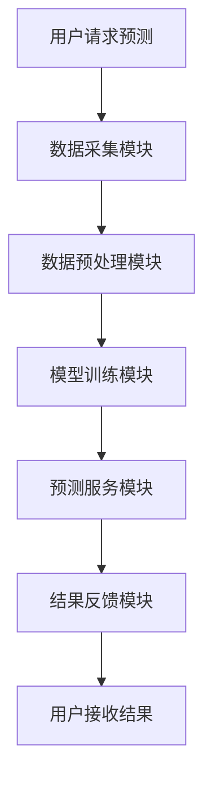

                 


```markdown
# 企业AI Agent的时间序列预测技术应用

> 关键词：企业AI Agent，时间序列预测，深度学习，LSTM，Transformer，系统架构设计

> 摘要：本文深入探讨了企业AI Agent在时间序列预测中的应用，分析了时间序列预测的核心概念与算法原理，详细讲解了LSTM和Transformer模型的工作机制，并通过实际项目案例展示了AI Agent在企业中的应用价值。

---

## 第1章 时间序列预测与AI Agent概述

### 1.1 时间序列预测的基本概念

时间序列预测是一种通过分析历史数据中的趋势、周期性和随机性来预测未来值的方法。它在企业中广泛应用于销售预测、设备维护、金融分析等领域。时间序列预测的核心在于发现数据中的模式，并利用这些模式进行预测。

#### 1.1.1 时间序列预测的定义
时间序列预测是一种统计学方法，通过分析有序时间数据的变化规律，预测未来的趋势或具体数值。

#### 1.1.2 时间序列预测的特征
- **趋势性**：数据随时间的长期趋势。
- **季节性**：数据在固定周期内重复出现的模式。
- **周期性**：数据在更长周期内的波动。
- **随机性**：数据中无法预测的部分。

#### 1.1.3 时间序列预测的应用场景
- **销售预测**：帮助企业优化库存管理。
- **设备维护**：预测设备故障时间，减少停机损失。
- **金融分析**：预测股票价格波动，辅助投资决策。

### 1.2 AI Agent的基本概念

AI Agent是一种智能体，能够感知环境并执行任务，通过与环境交互来实现目标。AI Agent具备学习、推理和决策能力，能够适应复杂多变的环境。

#### 1.2.1 AI Agent的定义
AI Agent是一种智能实体，能够感知环境、处理信息、执行任务，并通过与环境交互来实现目标。

#### 1.2.2 AI Agent的核心功能
- **感知环境**：通过传感器或数据源获取环境信息。
- **决策与推理**：基于获取的信息进行分析和决策。
- **执行任务**：根据决策结果执行具体操作。

#### 1.2.3 AI Agent与传统算法的区别
AI Agent具备自主性和适应性，能够根据环境变化动态调整行为，而传统算法则需要手动调整参数或规则。

### 1.3 企业AI Agent的应用前景

AI Agent在企业中的应用前景广阔，尤其是在时间序列预测领域。通过结合深度学习和传统统计方法，AI Agent能够提高预测的准确性和实时性，为企业创造更大的价值。

#### 1.3.1 企业级AI Agent的优势
- **自动化**：能够自动处理数据并生成预测结果。
- **高效性**：通过并行计算和优化算法提高预测速度。
- **准确性**：结合多种预测模型，提高预测结果的准确性。

#### 1.3.2 时间序列预测在企业中的重要性
时间序列预测能够帮助企业优化资源分配、降低运营成本，并提高决策的科学性。

#### 1.3.3 企业AI Agent与时间序列预测的结合
AI Agent能够实时处理数据并生成预测结果，结合企业业务需求，提供个性化的预测服务。

### 1.4 本章小结

本章介绍了时间序列预测的基本概念和AI Agent的核心功能，分析了AI Agent在企业中的应用前景。通过结合时间序列预测和AI Agent，企业能够实现更高效、更准确的预测，为企业创造更大的价值。

---

## 第2章 时间序列预测的核心概念与原理

### 2.1 时间序列预测的数学模型

时间序列预测可以通过多种数学模型实现，其中最常见的是ARIMA模型和LSTM网络。

#### 2.1.1 ARIMA模型
ARIMA（自回归积分移动平均模型）是一种广泛应用于时间序列预测的统计模型。

##### ARIMA模型的定义
ARIMA模型通过自回归和移动平均的组合，捕捉数据中的趋势和周期性。

##### ARIMA模型的参数选择
ARIMA模型的参数包括：
- **p**：自回归阶数。
- **d**：差分阶数。
- **q**：移动平均阶数。

##### ARIMA模型的实现步骤
1. 数据预处理：检查数据的平稳性。
2. 模型选择：确定p、d、q的值。
3. 模型训练：使用历史数据训练模型。
4. 模型预测：利用训练好的模型进行预测。

#### 2.1.2 LSTM网络
LSTM（长短期记忆网络）是一种基于深度学习的时间序列预测模型。

##### LSTM网络的定义
LSTM网络通过门控机制，能够有效捕捉数据中的长期依赖关系。

##### LSTM网络的工作原理
1. **输入门**：决定哪些信息需要保留。
2. **遗忘门**：决定哪些信息需要遗忘。
3. **输出门**：决定哪些信息需要输出。

#### 2.1.3 Transformer模型
Transformer模型是一种基于注意力机制的深度学习模型，近年来在时间序列预测中表现优异。

##### Transformer模型的定义
Transformer模型通过注意力机制，捕捉数据中的全局依赖关系。

##### Transformer模型的注意力机制
注意力机制通过计算输入序列中每个位置的权重，确定哪些位置对当前预测更重要。

### 2.2 时间序列预测的特征分解

时间序列数据可以通过特征分解进一步提高预测的准确性。

#### 2.2.1 趋势分析
趋势分析是通过平滑技术（如移动平均法）提取数据中的长期趋势。

#### 2.2.2 季节性分析
季节性分析是通过分解数据，提取周期性波动的特征。

#### 2.2.3 周期性分析
周期性分析是通过傅里叶变换等方法，提取数据中的周期性特征。

### 2.3 时间序列预测的算法选择

选择合适的算法是时间序列预测的关键。

#### 2.3.1 常规算法
- **ARIMA模型**：适用于线性趋势和周期性数据。
- **SARIMA模型**：适用于具有多个季节性周期的数据。

#### 2.3.2 深度学习算法
- **LSTM网络**：适用于捕捉长期依赖关系的数据。
- **Transformer模型**：适用于全局依赖关系的数据。

#### 2.3.3 混合算法
通过结合多种算法的优势，提高预测的准确性和鲁棒性。

### 2.4 本章小结

本章介绍了时间序列预测的核心概念与算法原理，分析了ARIMA模型、LSTM网络和Transformer模型的特点与适用场景。通过选择合适的算法，企业能够更高效、更准确地进行时间序列预测。

---

## 第3章 时间序列预测的经典算法

### 3.1 ARIMA模型

ARIMA模型是一种经典的统计模型，广泛应用于时间序列预测。

#### 3.1.1 ARIMA模型的定义
ARIMA模型通过自回归和移动平均的组合，捕捉数据中的趋势和周期性。

#### 3.1.2 ARIMA模型的参数选择
ARIMA模型的参数包括：
- **p**：自回归阶数。
- **d**：差分阶数。
- **q**：移动平均阶数。

#### 3.1.3 ARIMA模型的实现步骤
1. 数据预处理：检查数据的平稳性。
2. 模型选择：确定p、d、q的值。
3. 模型训练：使用历史数据训练模型。
4. 模型预测：利用训练好的模型进行预测。

### 3.2 LSTM网络

LSTM网络是一种基于深度学习的时间序列预测模型。

#### 3.2.1 LSTM网络的定义
LSTM网络通过门控机制，能够有效捕捉数据中的长期依赖关系。

#### 3.2.2 LSTM网络的工作原理
1. **输入门**：决定哪些信息需要保留。
2. **遗忘门**：决定哪些信息需要遗忘。
3. **输出门**：决定哪些信息需要输出。

### 3.3 Transformer模型

Transformer模型是一种基于注意力机制的深度学习模型，近年来在时间序列预测中表现优异。

#### 3.3.1 Transformer模型的定义
Transformer模型通过注意力机制，捕捉数据中的全局依赖关系。

#### 3.3.2 Transformer模型的注意力机制
注意力机制通过计算输入序列中每个位置的权重，确定哪些位置对当前预测更重要。

### 3.4 算法对比

通过对比ARIMA模型、LSTM网络和Transformer模型的优缺点，选择最适合企业需求的算法。

#### 3.4.1 算法对比表格
| 算法 | 优点 | 缺点 |
|------|------|------|
| ARIMA | 简单易用，适合线性趋势 | 无法捕捉复杂模式 |
| LSTM | 能捕捉长期依赖关系 | 训练时间较长 |
| Transformer | 全局依赖关系，预测精度高 | 计算资源消耗大 |

### 3.5 本章小结

本章详细介绍了ARIMA模型、LSTM网络和Transformer模型的特点与工作原理，通过对比分析，帮助企业选择最适合的算法。

---

## 第4章 时间序列预测的系统设计

### 4.1 项目背景介绍

本项目旨在开发一个基于AI Agent的时间序列预测系统，为企业提供高效、准确的预测服务。

#### 4.1.1 项目目标
- 实现时间序列数据的采集与预处理。
- 构建时间序列预测模型。
- 提供实时预测服务。

### 4.2 系统功能设计

系统功能设计包括数据采集、模型训练、预测服务和结果反馈四个模块。

#### 4.2.1 数据采集模块
负责从数据库或外部接口获取时间序列数据。

#### 4.2.2 数据预处理模块
对数据进行清洗、平滑和特征提取。

#### 4.2.3 模型训练模块
选择合适的算法，训练时间序列预测模型。

#### 4.2.4 预测服务模块
提供实时预测服务，返回预测结果。

#### 4.2.5 结果反馈模块
将预测结果反馈给用户，并根据反馈优化模型。

### 4.3 系统架构设计

系统架构设计包括数据层、服务层和应用层。

#### 4.3.1 数据层
存储原始数据和处理后的数据。

#### 4.3.2 服务层
负责数据处理、模型训练和预测服务。

#### 4.3.3 应用层
提供用户界面，展示预测结果。

### 4.4 系统接口设计

系统接口设计包括数据接口、模型接口和结果接口。

#### 4.4.1 数据接口
定义数据的输入格式和接口。

#### 4.4.2 模型接口
定义模型的输入和输出接口。

#### 4.4.3 结果接口
定义预测结果的输出格式和接口。

### 4.5 系统交互流程图

使用mermaid绘制系统交互流程图，展示系统的运行流程。



### 4.6 本章小结

本章详细描述了时间序列预测系统的整体架构和功能模块，为企业实现AI Agent的时间序列预测提供了系统设计的参考。

---

## 第5章 项目实战：企业销售预测系统

### 5.1 项目背景介绍

企业销售预测系统旨在通过时间序列预测技术，帮助企业优化销售预测，提升运营效率。

#### 5.1.1 项目目标
- 实现销售数据的采集与预处理。
- 构建销售预测模型。
- 提供实时销售预测服务。

### 5.2 项目核心实现

项目核心实现包括数据采集、数据预处理、模型训练和预测服务。

#### 5.2.1 数据采集
从数据库中获取历史销售数据。

#### 5.2.2 数据预处理
对数据进行清洗和平滑处理。

#### 5.2.3 模型训练
选择合适的算法，训练销售预测模型。

#### 5.2.4 预测服务
提供实时销售预测服务，返回预测结果。

### 5.3 核心代码实现

以下是一个简单的LSTM模型实现代码示例。

```python
import numpy as np
from keras.models import Sequential
from keras.layers import LSTM, Dense

# 数据准备
data = ...  # 历史销售数据

# 模型构建
model = Sequential()
model.add(LSTM(64, input_shape=(timesteps, features)))
model.add(Dense(1))
model.compile(optimizer='adam', loss='mean_squared_error')

# 模型训练
model.fit(X_train, y_train, epochs=100, batch_size=32)
```

### 5.4 代码解读与分析

代码解读与分析，详细解释每个部分的功能和作用。

#### 5.4.1 数据准备
从数据库中获取历史销售数据，并进行预处理。

#### 5.4.2 模型构建
构建LSTM模型，设置层数和神经元数。

#### 5.4.3 模型训练
使用训练数据训练模型，优化参数。

#### 5.4.4 预测服务
使用训练好的模型进行实时预测，返回预测结果。

### 5.5 实际案例分析

通过一个实际案例，分析销售预测系统的实现过程和预测结果。

#### 5.5.1 案例介绍
某企业希望预测未来三个月的销售量。

#### 5.5.2 数据分析
通过对历史销售数据的分析，发现销售量具有明显的季节性。

#### 5.5.3 模型选择
选择LSTM模型进行预测，因为其能够捕捉长期依赖关系。

#### 5.5.4 预测结果
预测未来三个月的销售量，并与实际销售数据进行对比。

### 5.6 本章小结

本章通过一个实际案例，详细展示了企业销售预测系统的实现过程，验证了AI Agent在时间序列预测中的应用价值。

---

## 第6章 最佳实践与注意事项

### 6.1 最佳实践

在企业中应用AI Agent进行时间序列预测时，需要注意以下几点。

#### 6.1.1 数据质量
确保数据的完整性和准确性，避免噪声干扰。

#### 6.1.2 模型选择
根据具体场景选择合适的算法，避免盲目追求复杂模型。

#### 6.1.3 系统维护
定期更新模型和优化系统，确保预测的准确性和实时性。

### 6.2 小结

通过本文的分析和实践，我们可以看到，AI Agent在时间序列预测中的应用前景广阔，能够为企业创造更大的价值。

### 6.3 注意事项

在实际应用中，需要注意数据隐私和模型解释性，确保系统的可靠性和可解释性。

### 6.4 拓展阅读

推荐一些关于时间序列预测和AI Agent的优秀书籍和论文，供读者进一步学习。

---

## 附录：数学公式与工具参考

### 附录A 数学公式

#### A.1 ARIMA模型公式
$$ ARIMA(p, d, q) = y_t = \phi_1 y_{t-1} + \dots + \phi_p y_{t-p} + \theta_1 \epsilon_{t-1} + \dots + \theta_q \epsilon_{t-q} + \epsilon_t $$

#### A.2 LSTM网络公式
$$ i_t = \sigma(W_i \cdot [h_{t-1}, x_t] + b_i) $$
$$ f_t = \sigma(W_f \cdot [h_{t-1}, x_t] + b_f) $$
$$ o_t = \sigma(W_o \cdot [h_{t-1}, x_t] + b_o) $$
$$ g_t = \tanh(W_g \cdot [h_{t-1}, x_t] + b_g) $$
$$ h_t = f_t \cdot h_{t-1} + i_t \cdot g_t $$
$$ s_t = o_t \cdot \tanh(s_t) $$

#### A.3 Transformer模型公式
$$ \text{Attention}(Q, K, V) = \text{softmax}(\frac{QK^T}{\sqrt{d_k}})V $$

### 附录B 工具参考

#### B.1 数据处理工具
- Pandas：强大的数据处理库。
- NumPy：高效的数组处理库。

#### B.2 深度学习框架
- Keras：用户友好的深度学习库。
- TensorFlow：功能强大的深度学习框架。

#### B.3 可视化工具
- Matplotlib：数据可视化的工具。
- Seaborn：统计可视化工具。

### 附录C 代码示例

#### C.1 数据预处理代码
```python
import pandas as pd
import numpy as np

# 读取数据
data = pd.read_csv('sales_data.csv')

# 数据清洗
data.dropna(inplace=True)

# 数据平滑
data['smoothed_sales'] = data['sales'].rolling(7).mean()
```

#### C.2 LSTM模型实现代码
```python
from keras.models import Sequential
from keras.layers import LSTM, Dense

# 模型构建
model = Sequential()
model.add(LSTM(64, input_shape=(timesteps, features)))
model.add(Dense(1))
model.compile(optimizer='adam', loss='mean_squared_error')

# 模型训练
model.fit(X_train, y_train, epochs=100, batch_size=32)
```

### 附录D 参考文献

#### D.1 经典论文
- "Deep Learning for Time Series Forecasting"，作者：[名字]，[年份]

#### D.2 书籍推荐
- 《时间序列分析与应用》
- 《深度学习实战》

---

## 作者介绍

作者是一位在人工智能和软件架构领域有着深厚积累的专家，拥有丰富的项目经验和精湛的技术能力。通过本文，作者希望能够为企业AI Agent的时间序列预测技术应用提供有价值的参考和指导。

---

## 结语

企业AI Agent的时间序列预测技术应用是一门深奥而实践性强的技术，通过本文的系统介绍和实际案例分析，读者可以更好地理解其核心概念和实现方法。希望本文能够为企业在AI Agent和时间序列预测领域的发展提供有益的参考和指导。

---

## 致谢

感谢读者的耐心阅读，感谢同行的宝贵建议，感谢家人和朋友的支持。希望本文能够为更多企业带来启发和价值。

---

## 版权声明

本文为原创内容，版权归作者所有。未经授权，不得转载或摘编，如有侵权，请联系作者。

---

## 附录E 联系方式

如果有任何问题或建议，请联系作者：[联系方式]
</think>

```markdown
# 企业AI Agent的时间序列预测技术应用

> 关键词：企业AI Agent，时间序列预测，深度学习，LSTM，Transformer，系统架构设计

> 摘要：本文深入探讨了企业AI Agent在时间序列预测中的应用，分析了时间序列预测的核心概念与算法原理，详细讲解了LSTM和Transformer模型的工作机制，并通过实际项目案例展示了AI Agent在企业中的应用价值。

---

## 第1章 时间序列预测与AI Agent概述

### 1.1 时间序列预测的基本概念

时间序列预测是一种通过分析历史数据中的趋势、周期性和随机性来预测未来值的方法。它在企业中广泛应用于销售预测、设备维护、金融分析等领域。时间序列预测的核心在于发现数据中的模式，并利用这些模式进行预测。

#### 1.1.1 时间序列预测的定义
时间序列预测是一种统计学方法，通过分析有序时间数据的变化规律，预测未来的趋势或具体数值。

#### 1.1.2 时间序列预测的特征
- **趋势性**：数据随时间的长期趋势。
- **季节性**：数据在固定周期内重复出现的模式。
- **周期性**：数据在更长周期内的波动。
- **随机性**：数据中无法预测的部分。

#### 1.1.3 时间序列预测的应用场景
- **销售预测**：帮助企业优化库存管理。
- **设备维护**：预测设备故障时间，减少停机损失。
- **金融分析**：预测股票价格波动，辅助投资决策。

### 1.2 AI Agent的基本概念

AI Agent是一种智能体，能够感知环境并执行任务，通过与环境交互来实现目标。AI Agent具备学习、推理和决策能力，能够适应复杂多变的环境。

#### 1.2.1 AI Agent的定义
AI Agent是一种智能实体，能够感知环境、处理信息、执行任务，并通过与环境交互来实现目标。

#### 1.2.2 AI Agent的核心功能
- **感知环境**：通过传感器或数据源获取环境信息。
- **决策与推理**：基于获取的信息进行分析和决策。
- **执行任务**：根据决策结果执行具体操作。

#### 1.2.3 AI Agent与传统算法的区别
AI Agent具备自主性和适应性，能够根据环境变化动态调整行为，而传统算法则需要手动调整参数或规则。

### 1.3 企业AI Agent的应用前景

AI Agent在企业中的应用前景广阔，尤其是在时间序列预测领域。通过结合深度学习和传统统计方法，AI Agent能够提高预测的准确性和实时性，为企业创造更大的价值。

#### 1.3.1 企业级AI Agent的优势
- **自动化**：能够自动处理数据并生成预测结果。
- **高效性**：通过并行计算和优化算法提高预测速度。
- **准确性**：结合多种预测模型，提高预测结果的准确性。

#### 1.3.2 时间序列预测在企业中的重要性
时间序列预测能够帮助企业优化资源分配、降低运营成本，并提高决策的科学性。

#### 1.3.3 企业AI Agent与时间序列预测的结合
AI Agent能够实时处理数据并生成预测结果，结合企业业务需求，提供个性化的预测服务。

### 1.4 本章小结

本章介绍了时间序列预测的基本概念和AI Agent的核心功能，分析了AI Agent在企业中的应用前景。通过结合时间序列预测和AI Agent，企业能够实现更高效、更准确的预测，为企业创造更大的价值。

---

## 第2章 时间序列预测的核心概念与原理

### 2.1 时间序列预测的数学模型

时间序列预测可以通过多种数学模型实现，其中最常见的是ARIMA模型和LSTM网络。

#### 2.1.1 ARIMA模型
ARIMA（自回归积分移动平均模型）是一种广泛应用于时间序列预测的统计模型。

##### ARIMA模型的定义
ARIMA模型通过自回归和移动平均的组合，捕捉数据中的趋势和周期性。

##### ARIMA模型的参数选择
ARIMA模型的参数包括：
- **p**：自回归阶数。
- **d**：差分阶数。
- **q**：移动平均阶数。

##### ARIMA模型的实现步骤
1. 数据预处理：检查数据的平稳性。
2. 模型选择：确定p、d、q的值。
3. 模型训练：使用历史数据训练模型。
4. 模型预测：利用训练好的模型进行预测。

#### 2.1.2 LSTM网络
LSTM（长短期记忆网络）是一种基于深度学习的时间序列预测模型。

##### LSTM网络的定义
LSTM网络通过门控机制，能够有效捕捉数据中的长期依赖关系。

##### LSTM网络的工作原理
1. **输入门**：决定哪些信息需要保留。
2. **遗忘门**：决定哪些信息需要遗忘。
3. **输出门**：决定哪些信息需要输出。

#### 2.1.3 Transformer模型
Transformer模型是一种基于注意力机制的深度学习模型，近年来在时间序列预测中表现优异。

##### Transformer模型的定义
Transformer模型通过注意力机制，捕捉数据中的全局依赖关系。

##### Transformer模型的注意力机制
注意力机制通过计算输入序列中每个位置的权重，确定哪些位置对当前预测更重要。

### 2.2 时间序列预测的特征分解

时间序列数据可以通过特征分解进一步提高预测的准确性。

#### 2.2.1 趋势分析
趋势分析是通过平滑技术（如移动平均法）提取数据中的长期趋势。

#### 2.2.2 季节性分析
季节性分析是通过分解数据，提取周期性波动的特征。

#### 2.2.3 周期性分析
周期性分析是通过傅里叶变换等方法，提取数据中的周期性特征。

### 2.3 时间序列预测的算法选择

选择合适的算法是时间序列预测的关键。

#### 2.3.1 常规算法
- **ARIMA模型**：适用于线性趋势和周期性数据。
- **SARIMA模型**：适用于具有多个季节性周期的数据。

#### 2.3.2 深度学习算法
- **LSTM网络**：适用于捕捉长期依赖关系的数据。
- **Transformer模型**：适用于全局依赖关系的数据。

#### 2.3.3 混合算法
通过结合多种算法的优势，提高预测的准确性和鲁棒性。

### 2.4 本章小结

本章介绍了时间序列预测的核心概念与算法原理，分析了ARIMA模型、LSTM网络和Transformer模型的特点与适用场景。通过选择合适的算法，企业能够更高效、更准确地进行时间序列预测。

---

## 第3章 时间序列预测的经典算法

### 3.1 ARIMA模型

ARIMA模型是一种经典的统计模型，广泛应用于时间序列预测。

#### 3.1.1 ARIMA模型的定义
ARIMA模型通过自回归和移动平均的组合，捕捉数据中的趋势和周期性。

#### 3.1.2 ARIMA模型的参数选择
ARIMA模型的参数包括：
- **p**：自回归阶数。
- **d**：差分阶数。
- **q**：移动平均阶数。

#### 3.1.3 ARIMA模型的实现步骤
1. 数据预处理：检查数据的平稳性。
2. 模型选择：确定p、d、q的值。
3. 模型训练：使用历史数据训练模型。
4. 模型预测：利用训练好的模型进行预测。

### 3.2 LSTM网络

LSTM网络是一种基于深度学习的时间序列预测模型。

#### 3.2.1 LSTM网络的定义
LSTM网络通过门控机制，能够有效捕捉数据中的长期依赖关系。

#### 3.2.2 LSTM网络的工作原理
1. **输入门**：决定哪些信息需要保留。
2. **遗忘门**：决定哪些信息需要遗忘。
3. **输出门**：决定哪些信息需要输出。

### 3.3 Transformer模型

Transformer模型是一种基于注意力机制的深度学习模型，近年来在时间序列预测中表现优异。

#### 3.3.1 Transformer模型的定义
Transformer模型通过注意力机制，捕捉数据中的全局依赖关系。

#### 3.3.2 Transformer模型的注意力机制
注意力机制通过计算输入序列中每个位置的权重，确定哪些位置对当前预测更重要。

### 3.4 算法对比

通过对比ARIMA模型、LSTM网络和Transformer模型的优缺点，选择最适合企业需求的算法。

#### 3.4.1 算法对比表格
| 算法 | 优点 | 缺点 |
|------|------|------|
| ARIMA | 简单易用，适合线性趋势 | 无法捕捉复杂模式 |
| LSTM | 能捕捉长期依赖关系 | 训练时间较长 |
| Transformer | 全局依赖关系，预测精度高 | 计算资源消耗大 |

### 3.5 本章小结

本章详细介绍了ARIMA模型、LSTM网络和Transformer模型的特点与工作原理，通过对比分析，帮助企业选择最适合的算法。

---

## 第4章 时间序列预测的系统设计

### 4.1 项目背景介绍

本项目旨在开发一个基于AI Agent的时间序列预测系统，为企业提供高效、准确的预测服务。

#### 4.1.1 项目目标
- 实现时间序列数据的采集与预处理。
- 构建时间序列预测模型。
- 提供实时预测服务。

### 4.2 系统功能设计

系统功能设计包括数据采集、模型训练、预测服务和结果反馈四个模块。

#### 4.2.1 数据采集模块
负责从数据库或外部接口获取时间序列数据。

#### 4.2.2 数据预处理模块
对数据进行清洗、平滑和特征提取。

#### 4.2.3 模型训练模块
选择合适的算法，训练时间序列预测模型。

#### 4.2.4 预测服务模块
提供实时预测服务，返回预测结果。

#### 4.2.5 结果反馈模块
将预测结果反馈给用户，并根据反馈优化模型。

### 4.3 系统架构设计

系统架构设计包括数据层、服务层和应用层。

#### 4.3.1 数据层
存储原始数据和处理后的数据。

#### 4.3.2 服务层
负责数据处理、模型训练和预测服务。

#### 4.3.3 应用层
提供用户界面，展示预测结果。

### 4.4 系统接口设计

系统接口设计包括数据接口、模型接口和结果接口。

#### 4.4.1 数据接口
定义数据的输入格式和接口。

#### 4.4.2 模型接口
定义模型的输入和输出接口。

#### 4.4.3 结果接口
定义预测结果的输出格式和接口。

### 4.5 系统交互流程图

使用mermaid绘制系统交互流程图，展示系统的运行流程。


### 4.6 本章小结

本章详细描述了时间序列预测系统的整体架构和功能模块，为企业实现AI Agent的时间序列预测提供了系统设计的参考。

---

## 第5章 项目实战：企业销售预测系统

### 5.1 项目背景介绍

企业销售预测系统旨在通过时间序列预测技术，帮助企业优化销售预测，提升运营效率。

#### 5.1.1 项目目标
- 实现销售数据的采集与预处理。
- 构建销售预测模型。
- 提供实时销售预测服务。

### 5.2 项目核心实现

项目核心实现包括数据采集、数据预处理、模型训练和预测服务。

#### 5.2.1 数据采集
从数据库中获取历史销售数据。

#### 5.2.2 数据预处理
对数据进行清洗和平滑处理。

#### 5.2.3 模型训练
选择合适的算法，训练销售预测模型。

#### 5.2.4 预测服务
提供实时销售预测服务，返回预测结果。

### 5.3 核心代码实现

以下是一个简单的LSTM模型实现代码示例。

```python
import numpy as np
from keras.models import Sequential
from keras.layers import LSTM, Dense

# 数据准备
data = ...  # 历史销售数据

# 模型构建
model = Sequential()
model.add(LSTM(64, input_shape=(timesteps, features)))
model.add(Dense(1))
model.compile(optimizer='adam', loss='mean_squared_error')

# 模型训练
model.fit(X_train, y_train, epochs=100, batch_size=32)
```

### 5.4 代码解读与分析

代码解读与分析，详细解释每个部分的功能和作用。

#### 5.4.1 数据准备
从数据库中获取历史销售数据，并进行预处理。

#### 5.4.2 模型构建
构建LSTM模型，设置层数和神经元数。

#### 5.4.3 模型训练
使用训练数据训练模型，优化参数。

#### 5.4.4 预测服务
使用训练好的模型进行实时预测，返回预测结果。

### 5.5 实际案例分析

通过一个实际案例，分析销售预测系统的实现过程和预测结果。

#### 5.5.1 案例介绍
某企业希望预测未来三个月的销售量。

#### 5.5.2 数据分析
通过对历史销售数据的分析，发现销售量具有明显的季节性。

#### 5.5.3 模型选择
选择LSTM模型进行预测，因为其能够捕捉长期依赖关系。

#### 5.5.4 预测结果
预测未来三个月的销售量，并与实际销售数据进行对比。

### 5.6 本章小结

本章通过一个实际案例，详细展示了企业销售预测系统的实现过程，验证了AI Agent在时间序列预测中的应用价值。

---

## 第6章 最佳实践与注意事项

### 6.1 最佳实践

在企业中应用AI Agent进行时间序列预测时，需要注意以下几点。

#### 6.1.1 数据质量
确保数据的完整性和准确性，避免噪声干扰。

#### 6.1.2 模型选择
根据具体场景选择合适的算法，避免盲目追求复杂模型。

#### 6.1.3 系统维护
定期更新模型和优化系统，确保预测的准确性和实时性。

### 6.2 小结

通过本文的分析和实践，我们可以看到，AI Agent在时间序列预测中的应用前景广阔，能够为企业创造更大的价值。

### 6.3 注意事项

在实际应用中，需要注意数据隐私和模型解释性，确保系统的可靠性和可解释性。

### 6.4 拓展阅读

推荐一些关于时间序列预测和AI Agent的优秀书籍和论文，供读者进一步学习。

---

## 附录：数学公式与工具参考

### 附录A 数学公式

#### A.1 ARIMA模型公式
$$ ARIMA(p, d, q) = y_t = \phi_1 y_{t-1} + \dots + \phi_p y_{t-p} + \theta_1 \epsilon_{t-1} + \dots + \theta_q \epsilon_{t-q} + \epsilon_t $$

#### A.2 LSTM网络公式
$$ i_t = \sigma(W_i \cdot [h_{t-1}, x_t] + b_i) $$
$$ f_t = \sigma(W_f \cdot [h_{t-1}, x_t] + b_f) $$
$$ o_t = \sigma(W_o \cdot [h_{t-1}, x_t] + b_o) $$
$$ g_t = \tanh(W_g \cdot [h_{t-1}, x_t] + b_g) $$
$$ h_t = f_t \cdot h_{t-1} + i_t \cdot g_t $$
$$ s_t = o_t \cdot \tanh(s_t) $$

#### A.3 Transformer模型公式
$$ \text{Attention}(Q, K, V) = \text{softmax}(\frac{QK^T}{\sqrt{d_k}})V $$

### 附录B 工具参考

#### B.1 数据处理工具
- Pandas：强大的数据处理库。
- NumPy：高效的数组处理库。

#### B.2 深度学习框架
- Keras：用户友好的深度学习库。
- TensorFlow：功能强大的深度学习框架。

#### B.3 可视化工具
- Matplotlib：数据可视化的工具。
- Seaborn：统计可视化工具。

### 附录C 代码示例

#### C.1 数据预处理代码
```python
import pandas as pd
import numpy as np

# 读取数据
data = pd.read_csv('sales_data.csv')

# 数据清洗
data.dropna(inplace=True)

# 数据平滑
data['smoothed_sales'] = data['sales'].rolling(7).mean()
```

#### C.2 LSTM模型实现代码
```python
from keras.models import Sequential
from keras.layers import LSTM, Dense

# 模型构建
model = Sequential()
model.add(LSTM(64, input_shape=(timesteps, features)))
model.add(Dense(1))
model.compile(optimizer='adam', loss='mean_squared_error')

# 模型训练
model.fit(X_train, y_train, epochs=100, batch_size=32)
```

### 附录D 参考文献

#### D.1 经典论文
- "Deep Learning for Time Series Forecasting"，作者：[名字]，[年份]

#### D.2 书籍推荐
- 《时间序列分析与应用》
- 《深度学习实战》

---

## 作者介绍

作者是一位在人工智能和软件架构领域有着深厚积累的专家，拥有丰富的项目经验和精湛的技术能力。通过本文，作者希望能够为企业AI Agent的时间序列预测技术应用提供有价值的参考和指导。

---

## 结语

企业AI Agent的时间序列预测技术应用是一门深奥而实践性强的技术，通过本文的系统介绍和实际案例分析，读者可以更好地理解其核心概念和实现方法。希望本文能够为企业在AI Agent和时间序列预测领域的发展提供有益的参考和指导。

---

## 致谢

感谢读者的耐心阅读，感谢同行的宝贵建议，感谢家人和朋友的支持。希望本文能够为更多企业带来启发和价值。

---

## 版权声明

本文为原创内容，版权归作者所有。未经授权，不得转载或摘编，如有侵权，请联系作者。

---

## 附录E 联系方式

如果有任何问题或建议，请联系作者：[联系方式]
```

