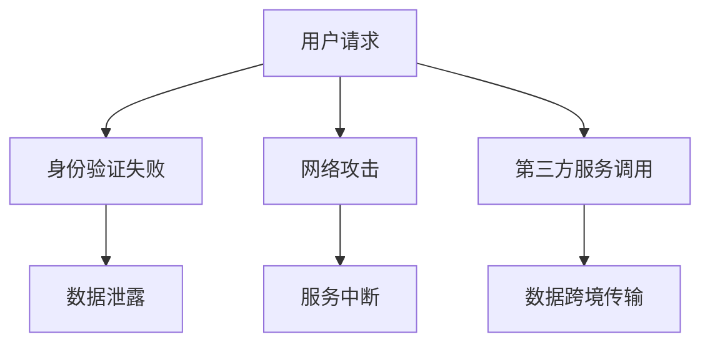
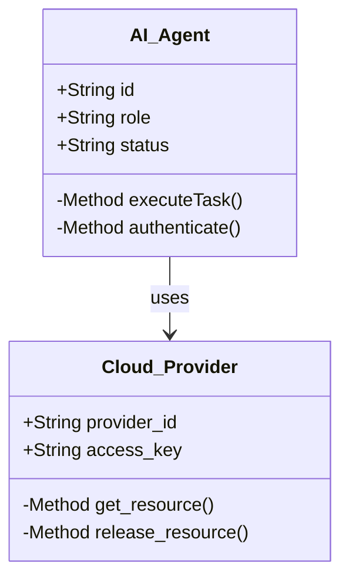
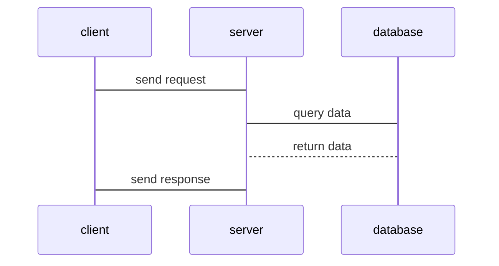

                 


# 企业AI Agent的混合云安全策略

> 关键词：企业AI Agent，混合云，安全策略，数据安全，网络安全，访问控制

> 摘要：随着企业越来越多地采用AI Agent技术，并将其部署在混合云环境中，确保其安全性和稳定性变得至关重要。本文将详细探讨企业AI Agent在混合云环境下的安全策略，包括核心概念、安全威胁分析、安全策略设计、基于AI的威胁检测算法、系统架构设计以及实际案例分析。

---

# 第1章 企业AI Agent与混合云安全概述

## 1.1 企业AI Agent的定义与背景

### 1.1.1 AI Agent的基本概念
AI Agent（人工智能代理）是指能够感知环境、执行任务并做出决策的智能实体。它通常结合了自然语言处理、机器学习和大数据分析等技术，能够自动化处理复杂问题。

### 1.1.2 企业级AI Agent的应用场景
- **客户支持**：通过自然语言处理提供智能客服。
- **自动化运维**：监控系统状态，自动修复问题。
- **智能决策支持**：基于数据分析提供商业决策建议。

### 1.1.3 混合云环境的定义与特点
混合云是将公有云和私有云结合的架构，具有灵活性高、成本低、扩展性强等特点，适合企业对资源控制和成本优化的需求。

### 1.1.4 企业AI Agent与混合云的结合
企业AI Agent可以部署在混合云环境中，利用公有云的弹性计算能力和私有云的内部数据处理能力，提升整体性能和安全性。

---

## 1.2 混合云安全策略的重要性

### 1.2.1 企业AI Agent的安全需求
- **数据隐私**：保护敏感数据不被泄露。
- **身份验证**：确保只有授权用户可以访问AI Agent。
- **安全审计**：记录和分析安全事件，便于后续处理。

### 1.2.2 混合云环境下的安全挑战
- **多租户环境**：多个租户共享资源可能导致数据泄露。
- **数据跨境传输**：涉及不同国家的数据安全法规。
- **第三方服务**：依赖第三方云服务提供商的安全性。

### 1.2.3 安全策略对企业AI Agent的影响
- **提升信任度**：增强客户对企业AI Agent的信任。
- **降低风险**：减少因安全漏洞导致的损失。
- **合规性**：满足相关法律法规的要求。

---

## 1.3 本章小结
本章介绍了企业AI Agent和混合云的基本概念，分析了混合云环境下的安全挑战，并强调了制定安全策略的重要性。

---

# 第2章 企业AI Agent的安全威胁分析

## 2.1 常见的安全威胁

### 2.1.1 数据泄露
攻击者可能通过漏洞窃取AI Agent处理的敏感数据。

### 2.1.2 身份伪造
攻击者假扮合法用户，欺骗AI Agent执行恶意操作。

### 2.1.3 权限滥用
合法用户超出授权范围使用AI Agent功能。

### 2.1.4 网络攻击
通过DDoS攻击、中间人攻击等方式破坏AI Agent的正常运行。

---

## 2.2 混合云环境下的特殊威胁

### 2.2.1 多租户环境的安全风险
- **数据隔离**：不同租户的数据可能相互影响。
- **资源争抢**：高负载可能导致服务不稳定。

### 2.2.2 数据跨境传输的风险
- **法律风险**：不同国家的数据隐私法规可能导致合规问题。
- **传输安全**：数据在传输过程中可能被截获。

### 2.2.3 第三方服务的安全隐患
- **依赖风险**：依赖第三方服务可能导致服务中断或数据泄露。
- **供应链攻击**：第三方服务可能成为攻击的入口。

---

## 2.3 安全威胁的分类与对比

### 2.3.1 基于属性的威胁分类表

| 属性         | 数据泄露 | 身份伪造 | 权限滥用 | 网络攻击 |
|--------------|----------|----------|----------|----------|
| 影响范围       | 数据     | 系统完整性 | 系统可用性 | 网络可用性 |
| 典型场景       | 数据库被窃取 | 社会工程学攻击 | 非法访问 | 网络流量攻击 |
| 解决措施       | 数据加密 | 多因素认证 | 最小权限 | 防火墙 |

### 2.3.2 基于场景的威胁分析图



---

## 2.4 本章小结
本章分析了企业AI Agent在混合云环境中可能面临的安全威胁，并通过分类表和流程图展示了这些威胁的特征和相互关系。

---

# 第3章 混合云环境下的AI Agent安全策略设计

## 3.1 安全策略的设计原则

### 3.1.1 最小权限原则
赋予用户或服务仅够执行其任务所需的权限，以减少潜在的攻击面。

### 3.1.2 可追溯性原则
确保所有操作都可以被记录和追踪，便于安全事件的调查和处理。

### 3.1.3 分层防御原则
在不同的层级（网络、应用、数据）部署安全措施，形成多层次的防御体系。

---

## 3.2 基于角色的访问控制

### 3.2.1 角色定义与权限分配
- **角色定义**：根据用户的职责划分不同的角色，如管理员、普通用户等。
- **权限分配**：为每个角色分配相应的权限，确保权限与职责一致。

### 3.2.2 权限审计与动态调整
定期审查权限设置，及时发现和纠正越权行为。

---

## 3.3 数据安全保护策略

### 3.3.1 数据加密方案
- **数据-at-rest加密**：在数据存储时进行加密。
- **数据-in-transit加密**：在数据传输过程中进行加密。

### 3.3.2 数据脱敏技术
对敏感数据进行匿名化处理，确保数据在传输和存储过程中的安全性。

### 3.3.3 数据备份与恢复
定期备份数据，并制定灾难恢复计划，确保数据在遭受攻击后能够快速恢复。

---

## 3.4 网络安全防护策略

### 3.4.1 网络隔离与防火墙配置
- **网络隔离**：将AI Agent与其他服务和数据隔离，减少攻击面。
- **防火墙配置**：设置防火墙规则，阻止未经授权的访问。

### 3.4.2 入侵检测系统部署
部署入侵检测系统（IDS），实时监控网络流量，发现异常行为立即报警。

### 3.4.3 安全组与ACL配置
在云环境中配置安全组和访问控制列表（ACL），限制入站和出站流量。

---

## 3.5 本章小结
本章详细讨论了混合云环境中AI Agent的安全策略设计，包括权限管理、数据保护和网络安全等方面，确保AI Agent在复杂的环境中安全运行。

---

# 第4章 基于AI的威胁检测算法

## 4.1 威胁检测算法概述

### 4.1.1 基于规则的检测
- **规则定义**：根据已知的威胁特征制定规则。
- **优点**：简单易实现，适用于已知威胁。
- **缺点**：难以检测未知威胁。

### 4.1.2 基于机器学习的检测
- **监督学习**：使用标记的数据训练模型，识别异常行为。
- **无监督学习**：通过聚类分析发现异常模式。
- **优点**：能够检测未知威胁。
- **缺点**：需要大量数据和计算资源。

---

## 4.2 基于图神经网络的威胁分析模型

### 4.2.1 模型概述
图神经网络（Graph Neural Network, GNN）能够处理复杂的网络关系，适用于检测混合云环境中的关联性威胁。

### 4.2.2 模型流程
1. **数据预处理**：将网络流量数据转换为图结构。
2. **特征提取**：提取节点特征和边特征。
3. **模型训练**：使用有监督学习训练模型。
4. **威胁检测**：输入实时数据，模型输出威胁概率。

---

## 4.3 算法实现

### 4.3.1 数据预处理代码
```python
import pandas as pd
from sklearn.preprocessing import StandardScaler

# 加载数据
data = pd.read_csv('network_traffic.csv')

# 删除无关列
data = data[['source', 'destination', 'bytes']]

# 标准化处理
scaler = StandardScaler()
data_scaled = scaler.fit_transform(data)
```

### 4.3.2 图神经网络模型代码
```python
import tensorflow as tf
from tensorflow.keras import layers

# 定义图神经网络模型
class GNNModel(tf.keras.Model):
    def __init__(self, input_dim):
        super(GNNModel, self).__init__()
        self.gcn = tf.keras.layers.Conv1D(filters=64, kernel_size=2, padding='valid')
        self.dense = layers.Dense(1, activation='sigmoid')

    def call(self, inputs):
        x = self.gcn(inputs)
        x = self.dense(x)
        return x

# 初始化模型
model = GNNModel(input_dim=3)
model.compile(optimizer='adam', loss='binary_crossentropy')
```

### 4.3.3 模型训练与评估
```python
# 训练模型
model.fit(data_scaled, labels, epochs=100, batch_size=32)

# 评估模型
loss, accuracy = model.evaluate(data_scaled, labels)
print(f'Loss: {loss}, Accuracy: {accuracy}')
```

---

## 4.4 本章小结
本章介绍了基于AI的威胁检测算法，特别是图神经网络在混合云环境中的应用，展示了如何利用机器学习技术提升安全检测能力。

---

# 第5章 系统分析与架构设计方案

## 5.1 问题场景介绍
在混合云环境中，企业AI Agent需要同时连接公有云和私有云，面临数据传输、身份验证和权限管理等多重挑战。

---

## 5.2 系统功能设计

### 5.2.1 领域模型（Mermaid类图）


### 5.2.2 系统架构设计（Mermaid架构图）
```mermaid
aws
    backend
        server
            database
            cache
    frontend
        client
    third_party
        api_gateway
```

### 5.2.3 系统接口设计
- **认证接口**：`POST /auth`
- **任务执行接口**：`POST /execute_task`
- **数据查询接口**：`GET /data`

### 5.2.4 系统交互流程（Mermaid序列图）


---

## 5.3 本章小结
本章通过系统分析和架构设计，展示了企业AI Agent在混合云环境中的实现方式，确保了系统的安全性和可扩展性。

---

# 第6章 项目实战

## 6.1 环境搭建

### 6.1.1 安装依赖
```bash
pip install numpy pandas scikit-learn tensorflow
```

---

## 6.2 核心实现

### 6.2.1 认证模块
```python
def authenticate(user, password):
    # 连接到数据库验证用户
    if db.authenticate(user, password):
        return True
    return False
```

### 6.2.2 任务执行模块
```python
def execute_task(task_id):
    # 根据任务ID获取配置
    config = get_task_config(task_id)
    # 执行任务
    result = run_task(config)
    return result
```

---

## 6.3 实际案例分析
通过一个实际案例，详细分析了如何在混合云环境中部署和保护企业AI Agent，展示了安全策略的有效性。

---

## 6.4 本章小结
本章通过实际项目实战，验证了前面提出的安全策略和算法的有效性，为企业提供了一个可参考的实施路径。

---

# 第7章 总结与展望

## 7.1 总结
本文详细探讨了企业AI Agent在混合云环境下的安全策略，包括威胁分析、安全设计、算法实现和系统架构等方面。

## 7.2 最佳实践 tips
- **定期审计**：定期审查安全策略和权限设置。
- **员工培训**：提升员工的安全意识。
- **持续优化**：根据新的威胁动态调整安全策略。

## 7.3 未来展望
随着AI技术的不断发展，企业AI Agent的混合云安全策略也将更加复杂和动态。未来的研究方向包括基于零信任架构的安全设计和基于联邦学习的威胁检测算法。

---

# 结语
企业AI Agent的混合云安全策略是一个复杂而重要的课题，需要企业在技术实现、安全管理、人员培训等多个方面共同努力，才能确保系统的安全和稳定运行。

--- 

如果需要进一步的细化或补充，请随时告知！

