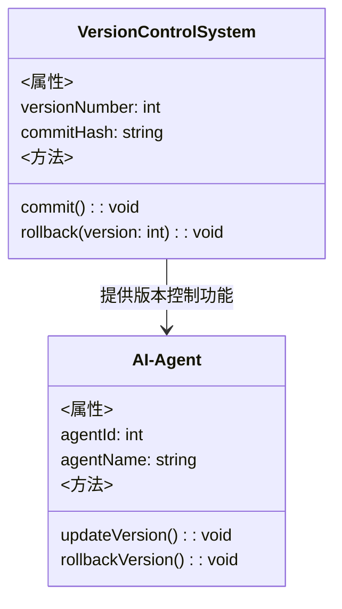

                 


# 企业AI Agent的版本控制与回滚机制设计

---

## 关键词：企业AI Agent，版本控制，回滚机制，系统架构，算法原理，项目实战

---

## 摘要

随着人工智能技术的快速发展，企业AI Agent的应用越来越广泛。为了确保AI系统的稳定性和可维护性，版本控制与回滚机制成为不可或缺的一部分。本文从企业AI Agent的背景出发，详细探讨版本控制与回滚机制的设计原理、实现方法和系统架构，结合实际案例，提供可操作的实现方案和最佳实践。

---

## 第一部分: 企业AI Agent的背景与概念

### 第1章: 企业AI Agent概述

#### 1.1 什么是企业AI Agent

企业AI Agent是一种能够感知环境、自主决策并执行任务的智能实体。它通过数据处理、模型推理和执行操作，为企业提供智能化的解决方案。以下是企业AI Agent的几个关键特点：

- **智能性**：能够理解上下文并做出决策。
- **自主性**：能够在没有人工干预的情况下运行。
- **交互性**：与用户、系统或其他AI Agent进行交互。
- **适应性**：能够根据环境变化调整行为。

**示例场景**：企业AI Agent可以用于客户服务、供应链管理、智能监控等领域。

#### 1.2 企业AI Agent的版本控制需求

企业AI Agent的版本控制需求主要体现在以下几个方面：

- **系统稳定性**：确保系统在更新过程中不会中断服务。
- **可追溯性**：能够追溯到特定版本的变更历史。
- **可恢复性**：在出现问题时能够快速回滚到稳定版本。

**问题背景**：AI模型的更新可能导致系统行为的改变，甚至引入新的错误。因此，版本控制与回滚机制对于保障系统稳定运行至关重要。

### 第2章: 企业AI Agent的版本控制与回滚机制背景

#### 2.1 问题背景

- **动态更新需求**：企业AI Agent需要频繁更新模型和逻辑以适应业务变化。
- **版本控制的必要性**：避免因更新导致系统崩溃或数据丢失。
- **回滚机制的业务价值**：在出现问题时快速恢复到稳定状态。

#### 2.2 问题描述

- **版本控制的复杂性**：AI Agent的版本涉及多个模块，协调更新难度大。
- **回滚机制的技术难点**：需要确保回滚过程中数据一致性和服务可用性。
- **边界与外延**：版本控制不仅限于代码，还包括配置、数据等。

#### 2.3 解决方案

- **分阶段更新**：将更新过程分解为多个阶段，逐步验证每个阶段的稳定性。
- **蓝绿部署**：通过双环境部署，减少更新对业务的影响。
- **回滚策略**：在检测到异常时，自动触发回滚机制。

---

## 第二部分: 核心概念与联系

### 第3章: 核心概念与联系

#### 3.1 核心概念原理

- **版本控制**：通过记录系统状态的变化，确保每个版本的可追溯性。
- **回滚机制**：在出现问题时，将系统恢复到之前的稳定版本。

#### 3.2 核心概念属性对比

| 特性          | 版本控制                | 回滚机制                |
|---------------|------------------------|-------------------------|
| 目标          | 管理版本变更            | 恢复到稳定版本          |
| 实现方式      | 使用版本控制系统（如Git）| 依赖版本控制记录       |
| 优势          | 提高系统可维护性        | 快速恢复系统稳定性      |
| 挑战          | 版本冲突管理            | 回滚过程中的数据一致性 |

#### 3.3 ER实体关系图

以下是企业AI Agent版本控制与回滚机制的ER实体关系图：

```mermaid
erDiagram
    actor User {
        string username
        string password
    }
    role VersionControlSystem {
        int versionNumber
        string commitHash
        datetime commitTime
    }
    entity AI-Agent {
        id agentId
        string agentName
        status agentStatus
    }
    User -> VersionControlSystem: 提交版本
    VersionControlSystem -> AI-Agent: 更新版本
    AI-Agent -> VersionControlSystem: 回滚版本
```

---

## 第三部分: 算法原理讲解

### 第4章: 算法原理讲解

#### 4.1 版本控制算法

版本控制算法通过记录每个版本的状态，确保可以回滚到任意版本。以下是版本控制的流程：

1. **提交版本**：将当前状态记录到版本控制系统。
2. **更新版本**：在需要时更新到新的版本。
3. **回滚版本**：在出现问题时，回滚到之前的版本。

#### 4.2 回滚机制算法

回滚机制的核心是通过版本控制系统快速恢复到稳定版本。以下是回滚机制的流程：

1. **检测异常**：监控系统状态，发现异常。
2. **触发回滚**：根据异常类型，选择合适的回滚策略。
3. **执行回滚**：恢复到指定版本，并验证系统稳定性。

#### 4.3 Python代码实现

以下是一个简单的版本控制与回滚机制的Python示例：

```python
class VersionControl:
    def __init__(self):
        self.history = []
        self.current_version = 0

    def commit(self):
        """提交当前版本"""
        self.history.append(self.current_version)
        print(f"提交版本 {self.current_version}")

    def rollback(self):
        """回滚到上一个版本"""
        if len(self.history) > 1:
            self.current_version = self.history[-2]
            print(f"回滚到版本 {self.current_version}")
        else:
            print("无法回滚，当前版本是初始版本")

# 示例使用
vc = VersionControl()
vc.commit()  # 提交版本 0
vc.commit()  # 提交版本 1
vc.rollback()  # 回滚到版本 0
```

---

## 第四部分: 系统分析与架构设计

### 第5章: 系统分析与架构设计

#### 5.1 问题场景介绍

企业AI Agent需要在复杂的环境下运行，可能面临频繁的更新和回滚需求。系统架构需要支持高可用性和快速响应。

#### 5.2 系统功能设计

以下是系统功能设计的类图：



#### 5.3 系统架构设计

以下是系统的架构图：

```mermaid
container 容器 {
    组件 版本控制系统 {
        版本提交
        版本回滚
    }
    组件 AI-Agent {
        状态检查
        版本更新
    }
    组件 监控系统 {
        异常检测
        回滚触发
    }
}
```

---

## 第五部分: 项目实战

### 第6章: 项目实战

#### 6.1 环境安装

安装必要的工具和库：

```bash
pip install mermaid
git clone https://github.com/your-repo.git
```

#### 6.2 核心代码实现

以下是版本控制的核心代码：

```python
import hashlib
import json

class VersionController:
    def __init__(self, file_path):
        self.file_path = file_path
        self.history = []

    def commit(self):
        """提交当前文件状态"""
        with open(self.file_path, 'r') as f:
            content = f.read()
        hash_value = hashlib.sha256(content.encode()).hexdigest()
        self.history.append(hash_value)
        print(f"提交版本: {hash_value}")

    def rollback(self, version_hash):
        """回滚到指定版本"""
        if version_hash in self.history:
            index = self.history.index(version_hash)
            with open(self.file_path, 'w') as f:
                with open(f'history/{index}.json', 'r') as hist_f:
                    content = json.load(hist_f)
                    f.write(content)
            print(f"回滚到版本: {version_hash}")
        else:
            print("版本不存在")

# 示例
vc = VersionController('config.json')
vc.commit()  # 提交初始版本
# 修改 config.json
vc.commit()  # 提交新版本
vc.rollback(vc.history[-1])  # 回滚到最新版本
```

#### 6.3 案例分析

**案例背景**：假设企业AI Agent在更新过程中出现错误，导致系统崩溃。

**解决步骤**：

1. **检测异常**：监控系统发现服务不可用。
2. **触发回滚**：根据错误类型选择回滚策略。
3. **执行回滚**：恢复到上一个稳定版本。
4. **验证稳定性**：确认系统恢复正常。

---

## 第六部分: 最佳实践

### 第7章: 最佳实践

#### 7.1 小结

- 版本控制与回滚机制是企业AI Agent稳定运行的关键。
- 通过合理的系统架构和算法设计，可以有效降低系统风险。

#### 7.2 注意事项

- **数据一致性**：确保回滚过程中数据的一致性。
- **日志管理**：详细记录每次版本变更和回滚操作。
- **测试验证**：在每次更新和回滚前进行充分测试。

#### 7.3 拓展阅读

- 《版本控制系统从入门到精通》
- 《AI系统架构设计与实现》

---

## 结语

企业AI Agent的版本控制与回滚机制设计是一个复杂但重要的任务。通过合理的系统架构、算法设计和实际案例分析，我们可以有效保障系统的稳定性和可维护性。希望本文能为读者提供有价值的参考和启发。

