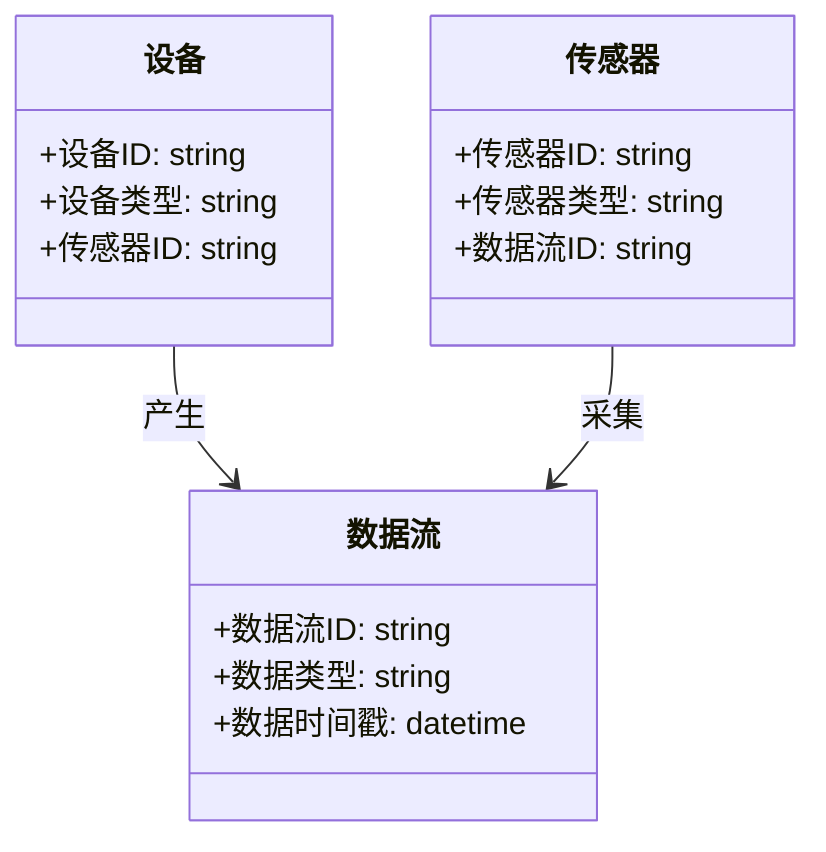

                 


# 《企业AI Agent的物联网(IoT)数据分析与应用》

---

## 关键词
企业AI Agent, 物联网(IoT), 数据分析, 应用, 人工智能, 实时数据处理

---

## 摘要
企业AI Agent与物联网(IoT)的结合为企业提供了智能化的数据分析与应用解决方案。本文将详细介绍物联网的基本概念、AI Agent的核心原理及其在物联网数据分析中的应用，通过实际案例分析，展示如何利用AI Agent实现物联网数据的实时处理、预测分析和智能决策。文章内容涵盖背景介绍、核心概念、算法原理、系统设计、项目实战以及最佳实践，旨在为企业技术决策者和开发人员提供深入的技术指导。

---

# 正文

## 第一部分: 企业AI Agent与物联网数据分析的背景介绍

### 第1章: 物联网(IoT)与AI Agent概述

#### 1.1 物联网(IoT)的基本概念
物联网（Internet of Things，IoT）是指通过各种信息传感设备，如传感器、RFID、红外感应器等，按照约定的协议，将物品与互联网连接起来，实现信息交换和通信的网络。物联网的体系结构通常分为感知层、网络层和应用层。

- **感知层**：负责数据的采集，包括传感器和RFID等设备。
- **网络层**：负责数据的传输，包括互联网、无线通信网络等。
- **应用层**：负责数据的处理和应用，如数据分析、决策支持等。

物联网的特点包括：
1. **实时性**：能够实时采集和传输数据。
2. **数据量大**：海量设备和数据点的连接导致数据量巨大。
3. **多样性**：数据类型多样，包括结构化和非结构化数据。

#### 1.2 AI Agent的基本概念
AI Agent（人工智能代理）是一种智能实体，能够感知环境并采取行动以实现目标。AI Agent可以分为以下几类：
1. **反应式AI Agent**：根据当前感知的信息采取行动，不依赖历史数据。
2. **认知式AI Agent**：具有推理和规划能力，能够处理复杂任务。
3. **学习式AI Agent**：能够通过机器学习算法不断优化自身行为。

AI Agent的核心功能模块包括：
1. **感知模块**：负责接收和解析环境中的信息。
2. **决策模块**：基于感知信息做出决策。
3. **行动模块**：执行决策结果。

#### 1.3 物联网数据分析的背景与意义
随着物联网的快速发展，数据的实时性和多样性对企业提出了更高的要求。传统的数据分析方法难以处理海量物联网数据，而AI Agent的引入为企业提供了智能化的数据处理解决方案。

物联网数据分析的意义：
1. **实时监控**：通过实时数据分析，企业可以及时发现并解决问题。
2. **预测性维护**：利用机器学习模型预测设备故障，减少停机时间。
3. **优化运营**：通过数据分析优化生产流程，降低成本。

#### 1.4 本章小结
本章介绍了物联网和AI Agent的基本概念，并探讨了物联网数据分析的背景和意义，为后续内容奠定了基础。

---

## 第二部分: 核心概念与联系

### 第2章: 物联网与AI Agent的核心概念与联系

#### 2.1 物联网体系结构与数据流模型
物联网的体系结构通常分为感知层、网络层和应用层。数据流模型描述了数据从采集到处理的流程。

- **感知层**：数据采集，如传感器读取温度值。
- **网络层**：数据传输，如通过无线网络将数据传输到云端。
- **应用层**：数据分析，如使用机器学习模型预测设备状态。

数据流模型的特点：
1. **实时性**：数据采集和传输需要实时完成。
2. **多样性**：数据类型多样，包括数值、文本、图像等。
3. **高通量**：数据量大，对处理能力要求高。

#### 2.2 AI Agent的原理与功能模块
AI Agent通过感知环境、做出决策并采取行动来实现目标。其核心功能模块包括：
1. **感知模块**：接收环境中的数据，如传感器读数。
2. **决策模块**：基于感知数据做出决策，如判断设备是否需要维护。
3. **行动模块**：执行决策，如发送维护指令。

AI Agent的优势：
1. **自主性**：能够自主决策，减少人工干预。
2. **适应性**：能够根据环境变化调整行为。
3. **高效性**：能够快速处理数据并做出决策。

#### 2.3 物联网与AI Agent的结合
物联网与AI Agent的结合使得企业能够更高效地处理海量数据，实现智能化的决策支持。

物联网与AI Agent结合的优势：
1. **实时性**：AI Agent能够实时处理物联网数据，快速做出决策。
2. **智能化**：通过机器学习算法，AI Agent能够发现数据中的隐含规律。
3. **可扩展性**：AI Agent能够轻松扩展，适应不同规模的物联网系统。

#### 2.4 核心概念对比与ER实体关系图
通过对比物联网与传统IT系统的区别，可以更好地理解物联网的特点。

| 特性 | 物联网 | 传统IT系统 |
|------|--------|------------|
| 数据量 | 海量    | 较小        |
| 实时性 | 高      | 较低        |
| 设备连接 | 多样性 | 较少        |
| 数据类型 | 多样性 | 结构化为主   |

ER实体关系图展示了物联网中的主要实体及其关系，如设备、传感器、数据流等。

```mermaid
er
    %% 物联网实体关系图
    entity 设备 {
        key 属性: 设备ID
        属性: 设备类型, 设备品牌
    }
    entity 传感器 {
        key 属性: 传感器ID
        属性: 传感器类型, 传感器位置
    }
    entity 数据流 {
        key 属性: 数据流ID
        属性: 数据类型, 数据时间戳
    }
    设备 -> 数据流: 产生
    传感器 -> 数据流: 采集
```

---

## 第三部分: 算法原理

### 第3章: 物联网数据采集与预处理

#### 3.1 数据采集
数据采集是物联网数据分析的第一步，通常使用Kafka、Flume等工具。

使用Kafka进行数据采集的代码示例：

```python
from kafka import KafkaProducer
import json

producer = KafkaProducer(bootstrap_servers=['localhost:9092'])
for _ in range(10):
    data = {'temperature': 25.5, 'humidity': 60}
    producer.send('iot_data', json.dumps(data).encode('utf-8'))
producer.close()
```

#### 3.2 数据预处理
数据预处理是确保数据质量的重要步骤，包括数据清洗和转换。

数据清洗代码示例：

```python
import pandas as pd

# 加载数据
data = pd.read_csv('raw_data.csv')

# 删除缺失值
data.dropna(inplace=True)

# 标准化数据
data['temperature'] = (data['temperature'] - data['temperature'].mean()) / data['temperature'].std()
```

#### 3.3 数据分析与预测
使用机器学习算法进行数据分析和预测。

随机森林回归模型代码示例：

```python
from sklearn.ensemble import RandomForestRegressor

# 训练模型
model = RandomForestRegressor(n_estimators=100)
model.fit(X_train, y_train)

# 预测
y_pred = model.predict(X_test)
```

#### 3.4 数据反馈与优化
根据预测结果优化系统参数，如调整阈值。

```python
threshold = 0.95
predicted_value = 0.9

if predicted_value > threshold:
    send_alert()
```

---

## 第四部分: 系统分析与架构设计

### 第4章: 系统功能设计与架构

#### 4.1 功能设计
系统功能模块包括数据采集、数据处理、数据分析和数据可视化。



#### 4.2 架构设计
系统架构采用微服务架构，使用Spring Cloud进行服务管理。


---

## 第五部分: 项目实战

### 第5章: 项目环境与核心实现

#### 5.1 环境安装
安装Kafka、Flume、Spark等工具。

```bash
# 安装Kafka
wget https://downloads.apache.org/kafka/2.13.0/kafka_2.13-2.13.0.tgz
tar -zxvf kafka_2.13-2.13.0.tgz
cd kafka_2.13-2.13.0
bin/zookeeper-server-start.sh config/zookeeper.properties
```

#### 5.2 核心实现
实现数据采集、处理、分析和可视化。

数据处理代码：

```python
from pyspark.sql import SparkSession

spark = SparkSession.builder \
    .appName("iot_data_analysis") \
    .getOrCreate()

data = spark.read.csv('data.csv', header=True, inferSchema=True)
data.show()
```

---

## 第六部分: 最佳实践与拓展阅读

### 第6章: 最佳实践与小结

#### 6.1 最佳实践
1. 数据安全：确保物联网数据的安全性，防止数据泄露。
2. 系统扩展性：设计可扩展的架构，支持大规模数据处理。
3. 模型优化：定期优化机器学习模型，提高预测准确性。

#### 6.2 项目小结
本文详细介绍了企业AI Agent在物联网数据分析中的应用，从背景介绍到项目实战，为读者提供了全面的技术指导。

---

## 拓展阅读
1. 《机器学习实战》
2. 《Spring Cloud微服务架构实战》
3. 《Kafka权威指南》

---

## 结束语
企业AI Agent与物联网的结合为企业提供了智能化的数据分析解决方案。通过本文的学习，读者可以掌握物联网数据分析的核心技术，并将其应用于实际项目中。

