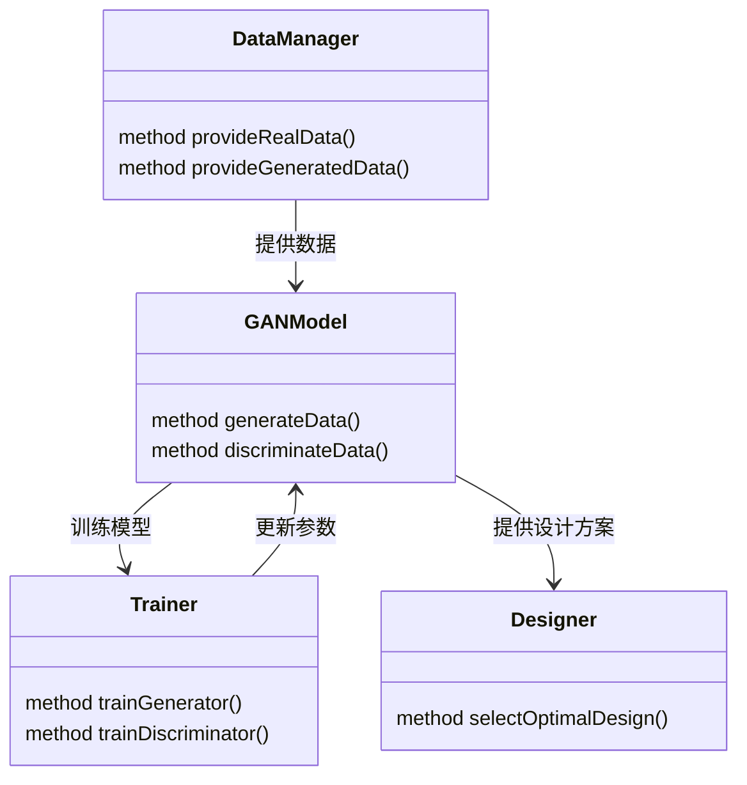
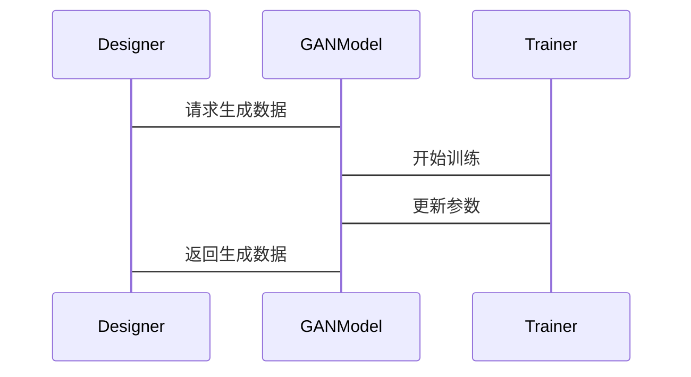

                 


---

# 企业AI Agent的生成对抗网络在产品设计中的创新应用

> 关键词：生成对抗网络（GAN）、企业AI Agent、产品设计、创新应用、深度学习

> 摘要：本文探讨了生成对抗网络（GAN）在企业AI Agent中的创新应用，特别是在产品设计中的潜力。通过分析GAN的核心原理、系统架构设计和实际案例，展示了如何利用GAN优化和加速产品设计过程。文章详细介绍了GAN的数学模型、算法实现、系统设计以及项目实战，为技术读者提供了深入的理解和实践指导。

---

## 第一部分: 企业AI Agent的生成对抗网络概述

### 第1章: 生成对抗网络（GAN）基础

#### 1.1 GAN的起源与概念

##### 1.1.1 生成对抗网络的定义
生成对抗网络（GAN）是一种深度学习模型，由生成器和判别器两个部分组成。生成器负责生成数据，判别器负责区分真实数据与生成数据。两者的对抗训练使得生成器能够生成逼真的数据，而判别器不断提升识别能力。

##### 1.1.2 GAN的核心原理
GAN的核心在于对抗训练机制。生成器通过最大化判别器的损失函数来生成高质量数据，而判别器则通过最小化生成器的损失函数来提高识别能力。这种博弈过程使GAN能够生成与真实数据难以区分的样本。

##### 1.1.3 GAN与传统生成模型的对比
与传统生成模型（如马尔可夫链模型）相比，GAN的优势在于其对抗训练机制，能够生成更高质量的数据。传统模型通常依赖于数据分布的明确建模，而GAN通过对抗训练自动优化生成过程。

#### 1.2 GAN在企业AI Agent中的应用潜力

##### 1.2.1 GAN的基本特点与优势
- **多样性**：GAN能够生成多样化的产品设计方案，突破传统方法的限制。
- **高效性**：通过对抗训练，GAN能够在较短时间内生成高质量的数据。
- **创新性**：GAN能够创造出新颖的设计，为企业产品创新提供新思路。

##### 1.2.2 GAN在企业AI Agent中的创新应用
- **产品设计优化**：利用GAN生成多种设计方案，帮助企业在产品设计阶段快速迭代。
- **个性化推荐**：通过GAN生成个性化的产品推荐，提升用户体验。
- **市场预测**：利用GAN预测产品设计趋势，帮助企业制定更精准的市场策略。

##### 1.2.3 GAN与其他生成模型的对比分析
与其他生成模型（如变分自编码器VAE）相比，GAN在生成高质量数据方面表现更优，但训练过程更为复杂，容易出现模式坍缩等问题。

### 第2章: 生成对抗网络（GAN）的核心概念与原理

#### 2.1 GAN的数学模型与公式

##### 2.1.1 GAN的损失函数
生成器的损失函数：  
$$ L_G = \log P(D(x) \leq \epsilon) $$  
判别器的损失函数：  
$$ L_D = \log P(D(x) \geq 1 - \epsilon) $$  

##### 2.1.2 生成器和判别器的数学表达
生成器的输出：  
$$ G(z) = x $$  
判别器的输出：  
$$ D(x) = y $$  

##### 2.1.3 GAN的训练过程
1. 初始化生成器和判别器的参数。
2. 训练判别器，使其能够区分真实数据和生成数据。
3. 训练生成器，使其生成的数据能够欺骗判别器。
4. 重复步骤2和3，直到生成器和判别器的损失函数达到平衡。

#### 2.2 GAN的实体关系与流程图

##### 2.2.1 GAN的实体关系图（ER图）
```mermaid
erDiagram
    GAN_MODEL {
        actor TrainedData
        actor GeneratedData
        actor Discriminator
        actor Generator
        Generator -> Discriminator :欺骗判别器
        TrainedData -> Discriminator :训练判别器
        TrainedData -> Generator :生成数据
    }
```

##### 2.2.2 GAN的训练流程图
```mermaid
graph TD
    A[开始] -> B[初始化生成器和判别器]
    B -> C[训练判别器]
    C -> D[训练生成器]
    D -> E[检查损失函数]
    E -> F[损失函数收敛？]
    F -> G[收敛则结束]
    G -> H[否则继续训练]
```

#### 2.3 GAN的核心算法与实现

##### 2.3.1 GAN的训练算法
1. 随机采样真实数据和噪声数据。
2. 训练判别器，使其能够区分真实数据和生成数据。
3. 训练生成器，使其生成的数据能够欺骗判别器。
4. 重复步骤1-3，直到生成器和判别器的损失函数达到平衡。

##### 2.3.2 GAN的优化策略
- **调整学习率**：适当降低生成器和判别器的学习率，避免模型发散。
- **标签平滑**：在判别器的输入中添加平滑项，防止判别器过于自信。
- **对抗训练平衡**：通过交替训练生成器和判别器，保持两者之间的平衡。

##### 2.3.3 GAN的实现步骤
1. 定义生成器和判别器的网络结构。
2. 定义损失函数和优化器。
3. 进行对抗训练，生成器和判别器交替优化。
4. 生成数据并进行评估。

### 第3章: 生成对抗网络（GAN）在产品设计中的创新应用

#### 3.1 产品设计中的问题与挑战

##### 3.1.1 传统产品设计的痛点
- 设计周期长：传统设计过程需要多次迭代，耗时耗力。
- 创新不足：设计人员受限于经验和知识，难以快速生成多样化的方案。
- 成本高昂：需要大量的人力和资源投入，尤其是在初期阶段。

##### 3.1.2 GAN在产品设计中的优势
- 快速生成多样化方案：GAN能够快速生成多种设计方案，帮助设计人员快速找到最优解。
- 提高设计效率：通过自动化生成和优化，缩短设计周期。
- 创新能力强：GAN能够生成新颖的设计，突破传统设计的局限。

##### 3.1.3 GAN在产品设计中的边界与外延
- 边界：GAN主要用于生成设计数据，无法直接替代人类设计师的创意和判断。
- 外延：GAN可以应用于产品设计的多个阶段，如概念设计、功能优化和市场预测。

#### 3.2 GAN在产品设计中的核心应用

##### 3.2.1 生成产品设计方案
利用GAN生成多种产品设计方案，供设计人员选择和优化。

##### 3.2.2 优化产品设计细节
通过GAN对已有的设计方案进行细节优化，提升设计质量。

##### 3.2.3 预测产品设计趋势
利用GAN预测未来的设计趋势，帮助企业提前布局市场。

#### 3.3 GAN在产品设计中的实际案例

##### 3.3.1 案例一：生成产品原型
- **案例背景**：某企业需要设计一个新的智能家居产品。
- **实施过程**：利用GAN生成多种产品原型，设计人员从中选择最优方案。
- **结果**：设计周期缩短，生成的原型多样且创新。

##### 3.3.2 案例二：优化产品功能
- **案例背景**：某企业希望优化现有产品的功能布局。
- **实施过程**：利用GAN生成多种功能布局方案，进行优化和选择。
- **结果**：功能布局更加合理，用户体验提升。

##### 3.3.3 案例三：预测产品市场表现
- **案例背景**：某企业计划推出新产品，希望通过GAN预测市场表现。
- **实施过程**：利用GAN生成多种设计方案，分析其市场潜力。
- **结果**：预测准确率高，帮助企业制定更精准的市场策略。

### 第4章: 企业AI Agent的系统分析与架构设计

#### 4.1 系统功能设计

##### 4.1.1 领域模型设计（Mermaid类图）


##### 4.1.2 系统架构设计（Mermaid架构图）


#### 4.2 系统接口设计

##### 4.2.1 API接口设计
- **生成数据接口**：API用于生成新的设计方案。
- **判别数据接口**：API用于判别数据的真实性。
- **训练接口**：API用于训练生成器和判别器。

##### 4.2.2 数据接口设计
- **输入接口**：接收真实数据和生成数据。
- **输出接口**：输出生成数据和判别结果。

#### 4.3 系统交互设计

##### 4.3.1 交互流程图（Mermaid序列图）


### 第5章: 项目实战

#### 5.1 环境安装与配置

##### 5.1.1 安装Python和相关库
- 安装Python：确保Python版本为3.6以上。
- 安装库：使用pip安装tensorflow、numpy、matplotlib等库。

##### 5.1.2 安装GAN框架
- 安装TensorFlow：`pip install tensorflow-gpu`（支持GPU加速）。
- 安装Keras：`pip install keras`。

#### 5.2 系统核心实现源代码

##### 5.2.1 生成器和判别器的实现
```python
import tensorflow as tf
from tensorflow.keras.layers import Dense, Input
from tensorflow.keras.models import Model

def build_generator(input_dim):
    inputs = Input(shape=(input_dim,))
    x = Dense(256, activation='relu')(inputs)
    x = Dense(128, activation='relu')(x)
    outputs = Dense(2, activation='sigmoid')(x)
    return Model(inputs=inputs, outputs=outputs)

def build_discriminator(input_dim):
    inputs = Input(shape=(input_dim,))
    x = Dense(128, activation='relu')(inputs)
    x = Dense(64, activation='relu')(x)
    outputs = Dense(1, activation='sigmoid')(x)
    return Model(inputs=inputs, outputs=outputs)
```

##### 5.2.2 GAN的训练过程
```python
def train_gan(generator, discriminator, input_dim, epochs=100, batch_size=32):
    generator.compile(loss='binary_crossentropy', optimizer='adam')
    discriminator.compile(loss='binary_crossentropy', optimizer='adam')
    
    for epoch in range(epochs):
        # 生成假数据
        noise = np.random.randn(batch_size, input_dim)
        generated = generator.predict(noise)
        
        # 训练判别器
        real_data = np.random.randn(batch_size, input_dim)
        d_loss_real = discriminator.train_on_batch(real_data, np.ones((batch_size, 1)))
        d_loss_fake = discriminator.train_on_batch(generated, np.zeros((batch_size, 1)))
        d_loss = 0.5 * (d_loss_real + d_loss_fake)
        
        # 训练生成器
        noise = np.random.randn(batch_size, input_dim)
        g_loss = generator.train_on_batch(noise, np.ones((batch_size, 1)))
        
        print(f'Epoch {epoch}, D loss: {d_loss}, G loss: {g_loss}')
```

#### 5.3 代码应用解读与分析

##### 5.3.1 生成器的代码解读
生成器网络结构包括两层全连接层，激活函数为ReLU，最后一层输出为sigmoid函数，用于生成二分类数据。

##### 5.3.2 判别器的代码解读
判别器网络结构包括两层全连接层，激活函数为ReLU，最后一层输出为sigmoid函数，用于判别数据的真实性。

##### 5.3.3 GAN的训练过程解读
GAN的训练过程包括交替训练生成器和判别器。生成器的目标是生成能够欺骗判别器的数据，而判别器的目标是准确区分真实数据和生成数据。

#### 5.4 实际案例分析

##### 5.4.1 案例分析：生成产品原型
- **输入数据**：产品设计的相关参数和特征。
- **训练过程**：利用GAN生成多种产品原型，设计人员从中选择最优方案。
- **结果展示**：生成的多种产品原型及其对比分析。

##### 5.4.2 案例分析：优化产品功能
- **输入数据**：产品功能布局的参数和特征。
- **训练过程**：利用GAN生成多种功能布局方案，进行优化和选择。
- **结果展示**：优化后的功能布局及其效果评估。

#### 5.5 项目小结

##### 5.5.1 项目总结
通过GAN生成多种设计方案，优化产品设计过程，提高设计效率和质量。

##### 5.5.2 项目经验
- GAN的训练过程需要耐心和细心，容易出现模式坍缩等问题。
- 生成器和判别器的参数设置对模型性能影响较大，需要进行多次实验和调整。

##### 5.5.3 项目注意事项
- 数据质量对GAN的性能影响很大，需要确保输入数据的多样性和代表性。
- GAN的训练过程需要大量的计算资源，建议使用GPU加速训练。

## 第六章: 结论与展望

### 6.1 结论

#### 6.1.1 GAN在产品设计中的重要性
GAN能够快速生成多样化的设计方案，帮助设计人员优化产品设计，提高设计效率和质量。

#### 6.1.2 本文的核心观点
本文通过分析GAN的核心原理和系统架构，展示了其在产品设计中的创新应用，为企业AI Agent的设计提供了新的思路和方法。

#### 6.1.3 GAN对企业AI Agent的未来影响
GAN的应用将推动企业AI Agent的发展，使其在产品设计中的作用更加重要和广泛。

### 6.2 未来展望

#### 6.2.1 GAN的优化方向
- 提高生成数据的质量和多样性。
- 解决训练过程中的模式坍缩问题。
- 提高GAN的训练速度和效率。

#### 6.2.2 企业AI Agent的未来发展趋势
- 更广泛的应用场景：GAN将应用于更多领域，如市场预测、用户行为分析等。
- 更智能的系统架构：企业AI Agent将更加智能化，能够自主学习和优化。
- 更紧密的跨学科结合：GAN将与更多学科结合，推动企业AI Agent的发展。

### 6.3 最佳实践 tips

#### 6.3.1 GAN的调参技巧
- 适当调整学习率，避免模型发散。
- 使用标签平滑，防止判别器过于自信。
- 交替训练生成器和判别器，保持模型平衡。

#### 6.3.2 数据质量的重要性
- 确保输入数据的多样性和代表性。
- 清洗数据，去除噪声和异常值。
- 数据预处理，提高模型性能。

#### 6.3.3 计算资源的优化
- 使用GPU加速训练过程。
- 优化模型结构，减少计算量。
- 并行计算，提高训练效率。

### 6.4 小结

通过本文的分析和探讨，我们看到了GAN在企业AI Agent中的巨大潜力，特别是在产品设计中的创新应用。未来，随着技术的不断进步，GAN将在更多领域展现出其独特的优势，为企业创造更大的价值。

---

## 结束语

企业AI Agent的生成对抗网络在产品设计中的创新应用，不仅展示了GAN的强大能力，也为企业的智能化转型提供了新的思路。希望本文能够为读者提供有价值的参考，帮助他们在实际应用中更好地利用GAN技术，推动企业AI Agent的发展。

---

以上是完整的技术博客文章的详细内容，涵盖了从理论到实践的各个方面，结合了技术分析和实际案例，为读者提供了全面的指导和深入的见解。

