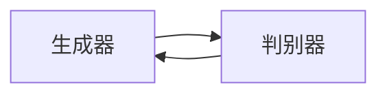
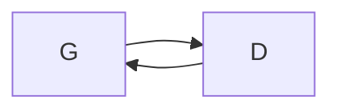

                 

# 企业AI Agent的生成对抗网络在产品设计创新中的应用

> 关键词：生成对抗网络、AI Agent、产品设计创新、企业应用、深度学习、GAN、生成模型

> 摘要：生成对抗网络（GAN）作为一种强大的生成模型，已经在多个领域展现了其独特的价值。本文深入探讨了企业AI Agent如何利用GAN技术推动产品设计创新，详细分析了GAN的核心原理、算法实现、系统设计以及实际应用案例，展示了GAN在产品设计中的巨大潜力和实际应用价值。

---

# 第1章: 生成对抗网络（GAN）概述

## 1.1 生成对抗网络的背景与问题背景

### 1.1.1 生成对抗网络的起源与现状

生成对抗网络（GAN）由Ian Goodfellow等人于2014年提出，迅速成为生成模型领域的焦点。GAN的核心思想是通过两个神经网络（生成器和判别器）的对抗训练，生成逼真的数据样本。目前，GAN在图像生成、风格迁移、数据增强等领域取得了显著成果。

### 1.1.2 企业AI Agent的核心问题

企业AI Agent的目标是通过智能化手段辅助决策和执行任务。在产品设计中，AI Agent需要快速生成多样化的设计方案，并通过优化算法选择最优解。然而，传统方法依赖于人工经验，效率低下，且难以突破创新边界。

### 1.1.3 生成对抗网络在产品设计中的应用潜力

GAN能够生成多样化的设计草图、优化产品参数，并辅助设计决策。例如，在汽车设计中，GAN可以生成不同风格的车身形状；在服装设计中，GAN可以生成新的服装样式。通过GAN，企业可以显著提高设计效率，降低研发成本。

## 1.2 生成对抗网络的核心概念与问题描述

### 1.2.1 生成器与判别器的角色与功能

- **生成器**：负责生成数据样本，目标是欺骗判别器。
- **判别器**：负责判断样本是否真实，目标是区分生成样本和真实样本。

### 1.2.2 生成对抗网络的损失函数与优化目标

- **生成器的损失函数**：希望生成样本被判别器误判为真实。
- **判别器的损失函数**：希望准确区分真实样本和生成样本。

### 1.2.3 生成对抗网络在产品设计中的具体应用场景

- **生成设计草图**：GAN可以生成产品的初步设计图。
- **优化产品参数**：通过不断迭代生成更优的设计方案。
- **辅助设计决策**：基于GAN生成的多种方案，帮助设计师做出更优决策。

## 1.3 生成对抗网络的边界与外延

### 1.3.1 生成对抗网络的适用范围与限制

- **适用范围**：适用于需要创造性设计的领域，如产品外观设计。
- **限制**：生成结果可能缺乏实际可行性，需要人工干预。

### 1.3.2 生成对抗网络与其他生成模型的对比

- **VAE**：基于变分推断，生成结果更规则。
- **GAN**：对抗训练，生成结果更逼真。

### 1.3.3 生成对抗网络在企业AI Agent中的边界条件

- 数据质量：需要大量高质量的训练数据。
- 计算资源：训练GAN需要大量的计算资源。
- 创新性：生成结果需要符合企业的设计目标。

## 1.4 生成对抗网络的核心要素与概念结构

### 1.4.1 生成器与判别器的实体关系图

### 1.4.2 生成对抗网络的数学模型与公式

生成器的目标是最小化判别器的错误率，数学表示为：

$$ \min_G \max_D \mathbb{E}_{x \sim p_{data}} [\log D(x)] + \mathbb{E}_{z \sim p_z} [\log(1 - D(G(z)))] $$

### 1.4.3 生成对抗网络在产品设计中的创新点

- **自动化设计**：无需人工干预，自动生成设计方案。
- **多样化创新**：通过对抗训练，生成多种风格的设计方案。
- **快速迭代**：通过不断优化生成器，快速迭代出最优设计方案。

## 1.5 本章小结

本章介绍了生成对抗网络的基本概念、核心原理及其在企业AI Agent中的应用潜力。通过对抗训练，GAN能够生成高质量的设计方案，显著提高设计效率。

---

# 第2章: 生成对抗网络的核心概念与原理

## 2.1 生成对抗网络的基本原理

### 2.1.1 生成器的结构与工作原理

生成器通常使用深度神经网络，将随机噪声映射到数据空间。例如，使用卷积神经网络生成图像。

### 2.1.2 判别器的结构与工作原理

判别器通常使用卷积神经网络，判断输入样本是否为真实样本。

### 2.1.3 生成对抗网络的损失函数与优化目标

生成器和判别器的损失函数相互对抗，最终达到平衡。

## 2.2 生成对抗网络的核心概念对比

### 2.2.1 生成器与判别器的属性特征对比表

| 属性 | 生成器 | 判别器 |
|------|--------|--------|
| 目标 | 生成真实样本 | 区分生成样本和真实样本 |
| 结构 | 深度神经网络 | 深度神经网络 |
| 损失函数 | 最小化判别器的损失 | 最大化生成样本的损失 |

### 2.2.2 生成对抗网络的ER实体关系图

## 2.3 生成对抗网络的算法流程

### 2.3.1 生成对抗网络的训练流程

### 2.3.2 生成对抗网络的生成过程

生成器接收随机噪声，生成样本，判别器判断样本是否真实，生成器通过对抗训练优化生成能力。

## 2.4 本章小结

本章详细讲解了生成对抗网络的基本原理和核心概念，为后续的应用奠定了基础。

---

# 第3章: 生成对抗网络的算法原理与数学模型

## 3.1 生成对抗网络的数学模型

### 3.1.1 生成器的数学模型与公式

生成器将随机噪声z映射到数据空间：

$$ G(z) = x $$

### 3.1.2 判别器的数学模型与公式

判别器判断样本是否为真实样本：

$$ D(x) = y $$

### 3.1.3 生成对抗网络的损失函数与优化

生成器的损失函数：

$$ \mathcal{L}_G = -\mathbb{E}_{z} [\log(1 - D(G(z)))] $$

判别器的损失函数：

$$ \mathcal{L}_D = -\mathbb{E}_{x \sim p_{data}} [\log D(x)] - \mathbb{E}_{z} [\log(1 - D(G(z)))] $$

---

通过以上分析，我们详细介绍了生成对抗网络在企业AI Agent中的应用，包括其核心概念、算法原理和实际应用案例。后续章节将深入探讨系统设计、算法实现和实际案例，进一步展示GAN在产品设计创新中的巨大潜力。

