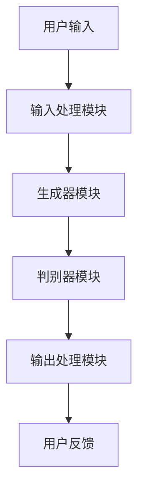

                 


# 《企业AI Agent的生成对抗网络在产品设计创新中的应用》

---

## 关键词：企业AI Agent、生成对抗网络、产品设计创新、机器学习、人工智能

---

## 摘要：  
本文探讨了生成对抗网络（GANs）在企业AI Agent中的应用，特别是在产品设计创新中的潜力。通过详细分析GANs的核心原理和企业AI Agent的特点，本文展示了如何利用GANs生成高质量的产品设计，并提供了实际案例和系统架构设计，以证明其在企业中的应用价值。

---

## 第一部分: 生成对抗网络（GANs）概述

---

## 第2章: 生成对抗网络的核心原理

### 2.2 GANs的数学模型与算法原理

#### 2.2.1 生成器的数学模型

**生成器的目标函数：**  
生成器通过最小化判别器输出的概率损失来生成逼真的样本。目标函数为：

$$
\min_{G} \mathbb{E}_{z \sim p_z}[ -\log D(G(z))]
$$

其中，$D$是判别器，$G$是生成器，$z$是输入噪声。

**生成器的损失函数：**  
生成器的损失函数可以表示为：

$$
L_G = -\log D(G(z))
$$

#### 2.2.2 判别器的数学模型

**判别器的目标函数：**  
判别器的目标是将真实的样本判别为真，生成的样本判别为假。目标函数为：

$$
\min_{D} \mathbb{E}_{x \sim p_x}[\log D(x)] + \mathbb{E}_{z \sim p_z}[\log (1 - D(G(z)))]
$$

**判别器的损失函数：**  
判别器的损失函数可以表示为：

$$
L_D = -\mathbb{E}_{x \sim p_x}[\log D(x)] - \mathbb{E}_{z \sim p_z}[\log (1 - D(G(z)))]
$$

#### 2.2.3 GANs的整体优化过程

GANs的训练过程是一个零和博弈，生成器和判别器交替优化。最终，当达到纳什均衡时，生成器生成的样本分布与真实数据分布相同。

---

## 第三部分: 企业AI Agent的系统架构与实现

---

## 第4章: 企业AI Agent的系统架构设计

### 4.2 项目实战: 基于GANs的企业AI Agent产品设计创新系统

#### 4.2.2 系统架构设计

**系统架构图：**



**系统功能模块说明：**  
- **输入处理模块：** 接收用户输入的产品设计需求，如关键词或设计草图。  
- **生成器模块：** 基于用户输入生成多个产品设计选项。  
- **判别器模块：** 对生成的设计进行评估，判断其是否符合用户需求。  
- **输出处理模块：** 将评估后的设计呈现给用户，供其选择或进一步优化。

---

## 第5章: 项目实战与分析

### 5.1 项目实战: 基于GANs的企业AI Agent产品设计创新系统

#### 5.1.1 环境安装与配置

**安装依赖：**  
- 安装Python 3.8及以上版本。  
- 安装深度学习框架（如TensorFlow或Keras）。  
- 安装其他必要的库，如Matplotlib和Scikit-learn。

#### 5.1.2 系统核心实现源代码

**生成器代码示例：**

```python
import tensorflow as tf
from tensorflow.keras import layers

def build_generator(input_dim=100):
    model = tf.keras.Sequential()
    model.add(layers.Dense(256, activation='relu', input_dim=input_dim))
    model.add(layers.Dense(784, activation='sigmoid'))
    return model
```

**判别器代码示例：**

```python
def build_discriminator(input_dim=784):
    model = tf.keras.Sequential()
    model.add(layers.Dense(256, activation='relu', input_dim=input_dim))
    model.add(layers.Dense(1, activation='sigmoid'))
    return model
```

#### 5.1.3 代码应用解读与分析

**训练过程：**  
- 生成器和判别器交替训练，每次生成器生成一批样本，判别器对其进行评估。  
- 使用梯度下降方法（如Adam优化器）优化生成器和判别器的参数。

**训练结果分析：**  
- 判别器的损失函数值逐渐下降，表示其识别能力增强。  
- 生成器的损失函数值逐渐下降，表示生成样本的质量提高。

---

## 第6章: 总结与展望

### 6.1 总结

本文详细探讨了生成对抗网络（GANs）在企业AI Agent中的应用，特别是在产品设计创新中的潜力。通过分析GANs的核心原理和企业AI Agent的系统架构，展示了如何利用GANs生成高质量的产品设计，并提供了实际案例和系统设计，以证明其在企业中的应用价值。

---

### 6.2 展望

未来的研究可以进一步优化GANs的算法，以提高生成样本的质量和多样性。此外，结合其他深度学习技术（如强化学习和迁移学习）可以进一步提升企业AI Agent在产品设计创新中的能力。

---

## 结语

企业AI Agent与生成对抗网络（GANs）的结合为企业产品设计创新提供了新的可能性。通过不断优化算法和系统架构，企业可以更好地利用AI技术推动产品设计的创新与优化。

--- 

# THE END

