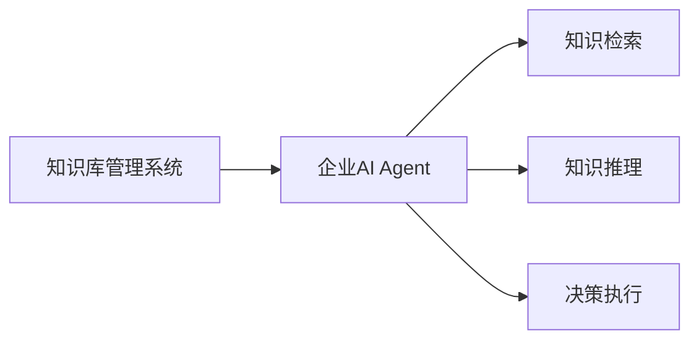

                 


# 企业AI Agent的知识库管理系统

> 关键词：知识库管理系统、企业AI Agent、知识表示、检索算法、系统架构、项目实战

> 摘要：本文详细探讨了企业AI Agent的知识库管理系统的构建与实现。从背景介绍、核心概念、算法原理到系统架构设计，再到项目实战，全面解析了如何利用知识库管理系统提升企业AI Agent的智能化水平。通过实际案例分析，展示了系统的实现细节和应用价值，为企业的智能化转型提供了参考。

---

## 第1章：企业AI Agent与知识库管理系统的背景介绍

### 1.1 问题背景与描述

#### 1.1.1 企业AI Agent的定义与特点
企业AI Agent是一种智能代理系统，能够通过感知环境、执行任务和学习优化，为企业提供自动化、智能化的服务。其特点包括：
- **自主性**：能够独立决策和执行任务。
- **反应性**：实时感知环境变化并做出响应。
- **学习能力**：通过数据和经验不断优化自身性能。

#### 1.1.2 知识库管理系统的定义与特点
知识库管理系统（KMS）用于管理和维护知识库，支持知识的存储、检索和更新。其特点包括：
- **结构化存储**：将知识以结构化形式存储，便于快速检索。
- **版本控制**：支持知识的版本管理，确保数据的准确性和一致性。
- **多源融合**：能够整合来自不同数据源的知识，形成统一的知识表示。

#### 1.1.3 企业AI Agent与知识库管理系统的结合背景
随着企业智能化转型的推进，AI Agent需要依赖知识库管理系统来获取所需的知识和信息。知识库管理系统为AI Agent提供高效的知识检索和更新服务，而AI Agent则通过处理知识库中的数据，为企业提供智能化决策支持。

---

### 1.2 问题解决与边界

#### 1.2.1 知识库管理系统在企业中的核心作用
知识库管理系统在企业中主要用于：
- **知识存储**：整合企业内外部的知识，形成统一的知识库。
- **知识检索**：快速定位所需知识，支持AI Agent的决策过程。
- **知识更新**：定期更新知识库内容，保持知识的时效性。

#### 1.2.2 企业AI Agent在知识库管理中的应用边界
企业AI Agent的应用边界主要体现在：
- **数据范围**：仅限于知识库中的结构化和半结构化数据。
- **功能限制**：不处理实时数据流，专注于知识检索和推理。

#### 1.2.3 知识库管理系统的外延与扩展
知识库管理系统可以扩展到：
- **多模态数据**：支持文本、图像、视频等多种数据类型。
- **分布式架构**：支持大规模数据的分布式存储和并行处理。

---

### 1.3 核心概念与结构

#### 1.3.1 知识库管理系统的组成要素
知识库管理系统主要包括以下组成要素：
- **数据源**：知识的输入渠道，如数据库、文档、API等。
- **存储层**：知识的存储介质，如关系型数据库、NoSQL数据库。
- **检索层**：知识检索的实现模块，如搜索引擎、推荐系统。
- **接口层**：与其他系统的交互界面，如API、命令行接口。

#### 1.3.2 企业AI Agent的核心功能模块
企业AI Agent的核心功能模块包括：
- **感知模块**：实时感知环境变化，获取所需知识。
- **推理模块**：基于知识库进行逻辑推理，生成决策建议。
- **执行模块**：根据决策结果执行具体任务。

#### 1.3.3 知识库管理系统与企业AI Agent的关系图


---

## 第2章：知识库管理系统的原理与属性

### 2.1 核心概念原理

#### 2.1.1 知识表示与存储原理
知识表示是知识库管理系统的核心，常用的方法包括：
- **符号表示**：用符号和规则表示知识，如逻辑推理。
- **向量表示**：用向量空间模型表示知识，如Word2Vec。

#### 2.1.2 知识检索与推理机制
知识检索通常采用以下步骤：
1. **解析查询**：理解用户的需求，生成查询关键词。
2. **选择策略**：根据查询类型选择合适的检索算法。
3. **执行检索**：在知识库中进行匹配，返回结果。

知识推理则基于逻辑推理和概率推理，用于处理复杂问题。

#### 2.1.3 知识更新与维护流程
知识更新流程包括：
1. **数据采集**：获取新的知识数据。
2. **数据清洗**：去除冗余和错误数据。
3. **数据存储**：将清洗后的数据存储到知识库中。

---

### 2.2 属性特征对比表

| 属性       | 特征                         |
|------------|------------------------------|
| 数据来源    | 结构化数据、非结构化数据       |
| 存储方式    | 关系型数据库、NoSQL数据库     |
| 检索方式    | 基于关键词、基于语义           |
| 更新频率    | 实时更新、周期性更新           |

---

### 2.3 ER实体关系图

```mermaid
er
    entity 用户 {
        id 用户ID
        string 用户名
    }
    entity 知识库 {
        id 知识库ID
        string 知识库名称
    }
    entity 数据源 {
        id 数据源ID
        string 数据源名称
    }
    entity 权限 {
        id 权限ID
        string 权限名称
    }
    relation 用户-知识库 {
        用户ID
        知识库ID
    }
    relation 数据源-知识库 {
        数据源ID
        知识库ID
    }
    relation 用户-权限 {
        用户ID
        权限ID
    }
```

---

## 第3章：知识表示与检索算法

### 3.1 知识表示模型

#### 3.1.1 向量空间模型
向量空间模型通过将文本表示为向量，计算向量之间的相似度。例如，使用余弦相似度：
$$ \text{similarity} = \frac{\vec{A} \cdot \vec{B}}{|\vec{A}| \cdot |\vec{B}|} $$

#### 3.1.2 图结构模型
图结构模型通过节点和边表示知识的关系，如知识图谱。

#### 3.1.3 符号逻辑模型
符号逻辑模型使用符号和规则表示知识，如谓词逻辑。

---

### 3.2 知识检索算法

#### 3.2.1 基于关键词的检索算法
关键词检索算法步骤：
1. **输入查询**：用户输入关键词。
2. **生成候选集合**：匹配关键词，生成候选文档。
3. **排序结果**：根据相关性排序。

#### 3.2.2 基于语义的检索算法
语义检索算法使用自然语言处理技术，理解查询意图，如BERT模型。

#### 3.2.3 基于深度学习的检索算法
深度学习检索算法通过预训练模型，如DPR（ Dense Passage Retrieval）进行检索。

---

## 第4章：系统分析与架构设计

### 4.1 问题场景介绍

#### 4.1.1 项目介绍
本项目旨在构建一个支持企业AI Agent的知识库管理系统，实现知识的高效存储、检索和更新。

---

## 第5章：项目实战

### 5.1 环境安装

#### 5.1.1 安装Python
```bash
# 安装Python
python --version
```

#### 5.1.2 安装依赖库
```bash
pip install numpy
pip install spacy
```

---

### 5.2 系统核心实现源代码

#### 5.2.1 知识表示模块
```python
import numpy as np
from spacy.lang.zh import Chinese

nlp = Chinese()
doc = nlp("这是一个测试句子。")
vector = doc[0].vector
```

#### 5.2.2 知识检索模块
```python
def search(query):
    # 输入查询
    # 生成候选集合
    # 排序结果
    return results
```

---

## 第6章：总结与展望

### 6.1 小结
企业AI Agent的知识库管理系统通过高效的知识管理和检索，显著提升了企业的智能化水平。

### 6.2 注意事项
- 知识库的质量直接影响AI Agent的性能。
- 系统的扩展性需要充分考虑未来的发展需求。

### 6.3 拓展阅读
- 《知识工程导论》
- 《自然语言处理实战》

---

通过本文的详细讲解，读者可以全面了解企业AI Agent的知识库管理系统的构建与实现，为企业的智能化转型提供有力的技术支持。

