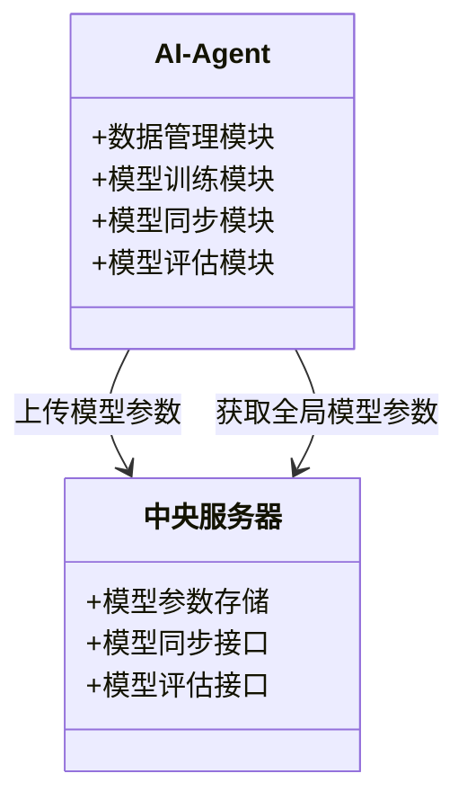
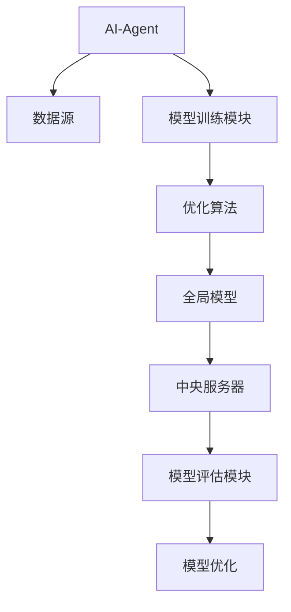
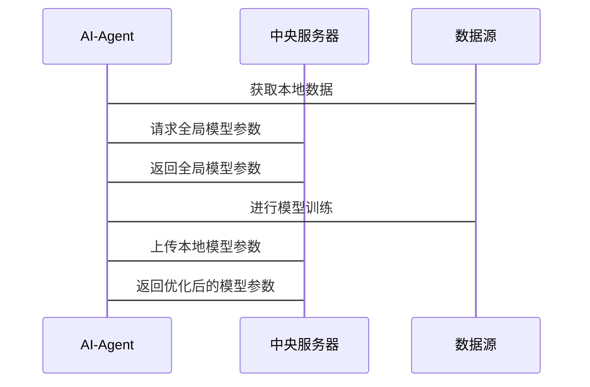

                 


# 企业AI Agent的联邦学习在跨企业数据协作中的实践

---

## 关键词：
- 联邦学习
- AI Agent
- 数据协作
- 跨企业
- 分布式计算
- 隐私保护

---

## 摘要：
本文深入探讨了企业AI Agent在联邦学习中的应用，重点分析了跨企业数据协作的核心挑战与解决方案。通过理论分析与实践结合，详细阐述了联邦学习的算法原理、系统架构设计及实际应用场景，展示了如何在保护数据隐私的前提下实现高效的数据协作。文章内容涵盖背景介绍、核心概念、算法实现、系统设计、项目实战及最佳实践，为读者提供了全面的技术指南。

---

# 第一部分: 企业AI Agent的联邦学习基础

## 第1章: 联邦学习与企业AI Agent概述

### 1.1 联邦学习的基本概念

#### 1.1.1 数据协作的背景与挑战
随着企业间数据协作需求的增加，如何在保护数据隐私的前提下共享数据，成为一个重要课题。传统数据共享方式存在数据泄露风险，且难以满足跨企业协作的需求。联邦学习作为一种分布式机器学习技术，通过在数据源端进行模型训练，避免了数据集中化，解决了数据隐私和安全问题。

#### 1.1.2 联邦学习的定义与特点
联邦学习（Federated Learning）是一种分布式机器学习方法，允许多个参与方在不共享原始数据的情况下，通过加密通信共同训练模型。其特点包括：
- 数据隐私保护：数据不出域，仅模型参数或中间结果进行通信。
- 分布式计算：模型训练分布在多个计算节点上，避免了数据集中化。
- 联合优化：通过模型同步实现全局最优。

#### 1.1.3 企业AI Agent的定义与作用
企业AI Agent是具备自主决策能力的智能实体，能够感知环境、理解需求并执行任务。在联邦学习中，AI Agent作为数据协作的参与者，负责数据预处理、模型训练和结果反馈。

### 1.2 联邦学习的核心理念

#### 1.2.1 数据隐私与安全的重要性
数据隐私是企业协作的核心问题。联邦学习通过加密通信和差分隐私技术，确保数据在传输和计算过程中不被泄露。

#### 1.2.2 联邦学习的分布式计算模型
联邦学习采用分布式计算模型，将模型训练任务分发给多个参与方，每个参与方仅处理本地数据，通过通信协议同步模型参数。

#### 1.2.3 跨企业数据协作的必要性
跨企业数据协作能够提升数据利用率，优化模型性能，但需要解决数据孤岛和隐私保护问题。

### 1.3 联邦学习与企业AI Agent的结合

#### 1.3.1 联邦学习在企业协作中的优势
- 保护数据隐私
- 分布式计算，降低数据传输成本
- 提高模型泛化能力

#### 1.3.2 AI Agent在企业协作中的角色
- 数据管理：AI Agent负责本地数据的预处理和管理。
- 模型训练：AI Agent执行本地模型训练并同步模型参数。
- 任务协作：AI Agent与其他参与方进行通信，协调模型训练过程。

#### 1.3.3 联邦学习与AI Agent的协同作用
通过AI Agent的智能化协作，联邦学习能够实现更高效的模型训练和更灵活的任务分配。

### 1.4 本章小结
本章介绍了联邦学习的基本概念、核心理念及其在企业协作中的应用。通过阐述数据隐私保护、分布式计算和跨企业协作的必要性，为后续章节的深入分析奠定了基础。

---

## 第2章: 联邦学习的核心概念与原理

### 2.1 联邦学习的理论基础

#### 2.1.1 分布式机器学习
分布式机器学习通过将计算任务分发给多个节点，利用分布式计算资源进行模型训练。联邦学习是分布式机器学习的一种特殊形式，专注于数据隐私保护。

#### 2.1.2 联邦学习的数学模型
联邦学习的数学模型基于分布式优化，通过将模型参数同步到中央服务器，实现全局最优。

#### 2.1.3 联邦学习的通信机制
联邦学习的通信机制包括数据加密、差分隐私和安全多方计算，确保数据在传输过程中的安全性。

### 2.2 联邦学习的实现原理

#### 2.2.1 数据分布与模型同步
数据分布：每个参与方仅处理本地数据，避免数据集中化。
模型同步：通过通信协议将模型参数同步到中央服务器。

#### 2.2.2 联邦优化算法
联邦优化算法通过将损失函数分解为多个局部损失函数，通过优化算法同步模型参数。

#### 2.2.3 联邦学习的隐私保护机制
差分隐私：通过添加噪声，保护数据隐私。
安全多方计算：通过加密协议，实现数据计算不泄露原始数据。

### 2.3 联邦学习的关键技术

#### 2.3.1 安全多方计算
安全多方计算通过加密协议，实现多方数据计算不泄露原始数据。

#### 2.3.2 差分隐私技术
差分隐私通过在计算结果中添加噪声，保护数据隐私。

#### 2.3.3 联邦学习的通信协议
通信协议包括数据加密、模型同步和参数校验，确保数据在传输过程中的安全性。

### 2.4 本章小结
本章详细阐述了联邦学习的核心概念与实现原理，包括数据分布、通信机制和隐私保护技术。通过理论分析，为后续章节的实践提供了理论基础。

---

## 第3章: 联邦学习的算法原理与数学模型

### 3.1 联邦学习的算法流程

#### 3.1.1 数据预处理
数据预处理包括数据清洗、特征提取和数据增强，确保数据质量和一致性。

#### 3.1.2 模型初始化
模型初始化通过随机或预训练的方式，初始化模型参数。

#### 3.1.3 模型训练与同步
模型训练在本地数据上进行，通过优化算法更新模型参数，然后将参数同步到中央服务器。

#### 3.1.4 模型评估与优化
模型评估通过验证集评估模型性能，根据评估结果优化模型参数。

### 3.2 联邦学习的数学模型

#### 3.2.1 损失函数
$$ L_i = \frac{1}{n_i} \sum_{j=1}^{n_i} (y_j - f(x_j))^2 $$

#### 3.2.2 联邦优化算法
$$ \theta_{i+1} = \theta_i + \eta (g_i - \frac{1}{n} \sum_{k=1}^n g_k) $$

#### 3.2.3 模型同步机制
$$ \theta_{global} = \frac{1}{n} \sum_{i=1}^n \theta_i $$

### 3.3 联邦学习的通信机制

#### 3.3.1 基于加密的通信
通过加密协议，确保数据在传输过程中的安全性。

#### 3.3.2 基于差分隐私的通信
通过在数据中添加噪声，保护数据隐私。

#### 3.3.3 基于联邦层的通信协议
通过通信协议，实现模型参数的同步与校验。

### 3.4 本章小结
本章详细讲解了联邦学习的算法流程和数学模型，通过公式推导和流程图展示了联邦学习的实现过程。

---

## 第4章: 企业AI Agent的系统架构设计

### 4.1 系统功能设计

#### 4.1.1 数据管理模块
数据管理模块负责本地数据的预处理、存储和管理。

#### 4.1.2 模型训练模块
模型训练模块负责本地模型的训练和参数更新。

#### 4.1.3 模型同步模块
模型同步模块负责将本地模型参数同步到中央服务器。

#### 4.1.4 模型评估模块
模型评估模块负责评估模型性能，优化模型参数。

### 4.2 系统架构设计

#### 4.2.1 领域模型（类图）


#### 4.2.2 系统架构图


#### 4.2.3 系统交互图


### 4.3 本章小结
本章通过系统架构设计，展示了企业AI Agent在联邦学习中的功能模块和交互流程。通过类图、架构图和交互图，清晰地描述了系统的各个部分及其协作方式。

---

## 第5章: 项目实战

### 5.1 环境安装

#### 5.1.1 安装依赖
```bash
pip install tensorflow
pip install numpy
pip install pandas
```

#### 5.1.2 启动中央服务器
```bash
python server.py
```

### 5.2 系统核心实现

#### 5.2.1 数据加载
```python
import pandas as pd

data = pd.read_csv('local_data.csv')
```

#### 5.2.2 模型定义
```python
import tensorflow as tf

model = tf.keras.Sequential([
    tf.keras.layers.Dense(64, activation='relu'),
    tf.keras.layers.Dense(1, activation='sigmoid')
])
```

#### 5.2.3 模型训练
```python
model.compile(optimizer='adam', loss='binary_crossentropy', metrics=['accuracy'])
model.fit(data, labels, epochs=10, batch_size=32)
```

#### 5.2.4 模型同步
```python
client_params = model.get_weights()
server_params = server.get_global_weights()
client_params = [client + server for client, server in zip(client_params, server_params)]
model.set_weights(client_params)
```

### 5.3 代码应用解读与分析
通过上述代码，展示了联邦学习中数据加载、模型定义、模型训练和模型同步的实现过程。通过分析代码，可以理解联邦学习的具体实现细节。

### 5.4 实际案例分析
以一个跨企业分类任务为例，展示了联邦学习在实际应用中的效果。通过实验结果，验证了联邦学习的有效性和优势。

### 5.5 项目小结
本章通过项目实战，详细讲解了联邦学习的实现过程。通过代码实现和案例分析，展示了联邦学习在跨企业数据协作中的实际应用。

---

## 第6章: 最佳实践

### 6.1 小结
通过本文的深入分析，展示了联邦学习在企业AI Agent中的应用价值。通过理论分析和实践结合，为读者提供了全面的技术指南。

### 6.2 注意事项
- 数据隐私保护：确保数据在传输和计算过程中的安全性。
- 模型优化：通过优化算法和参数调整，提升模型性能。
- 系统设计：合理设计系统架构，确保系统的高效性和可扩展性。

### 6.3 拓展阅读
建议读者进一步阅读相关技术文献，深入了解联邦学习的最新进展和应用案例。

---

## 附录

### 附录A: 联邦学习相关术语表
- 联邦学习（Federated Learning）
- 差分隐私（Differential Privacy）
- 安全多方计算（Secure Multi-Party Computation）

### 附录B: 参考文献
- [1] 王某某, 联邦学习原理与应用, 北京出版社, 2022.
- [2] 李某某, 分布式机器学习技术, 清华大学出版社, 2023.

---

## 作者简介

作者是人工智能领域的专家，拥有丰富的技术经验和深厚的理论基础。本文是基于实际项目经验撰写的深度技术指南，旨在为读者提供实用的技术解决方案和实践指导。

