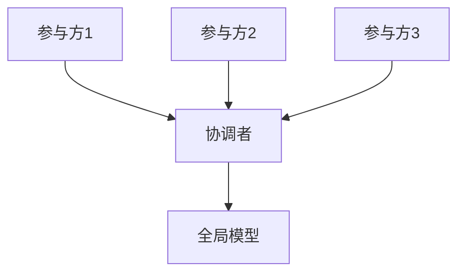
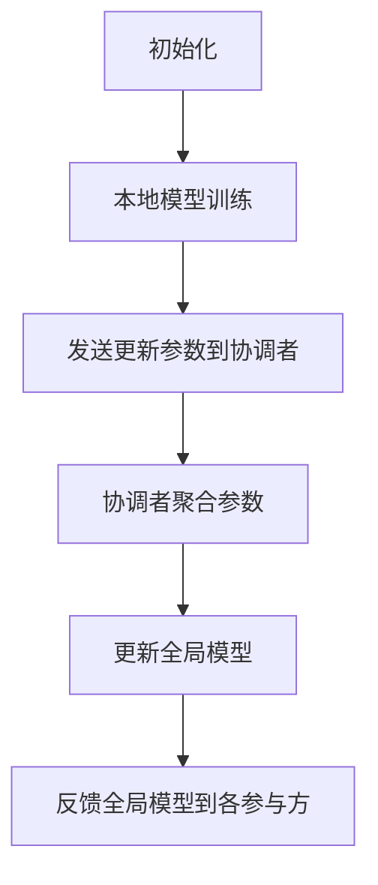
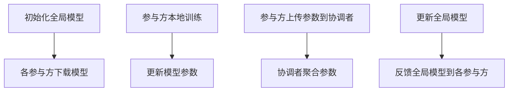
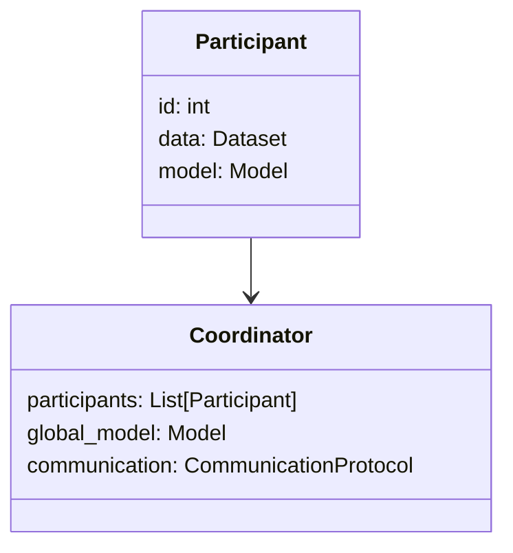
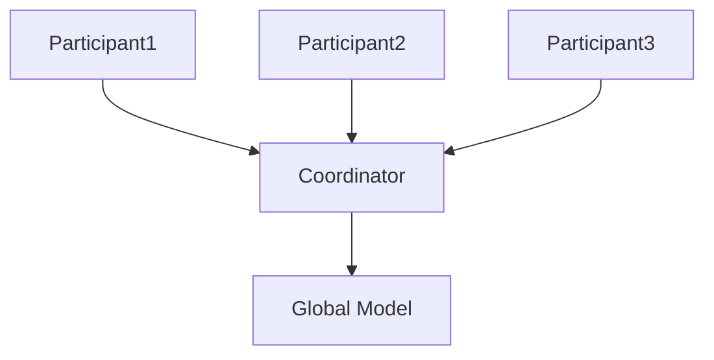
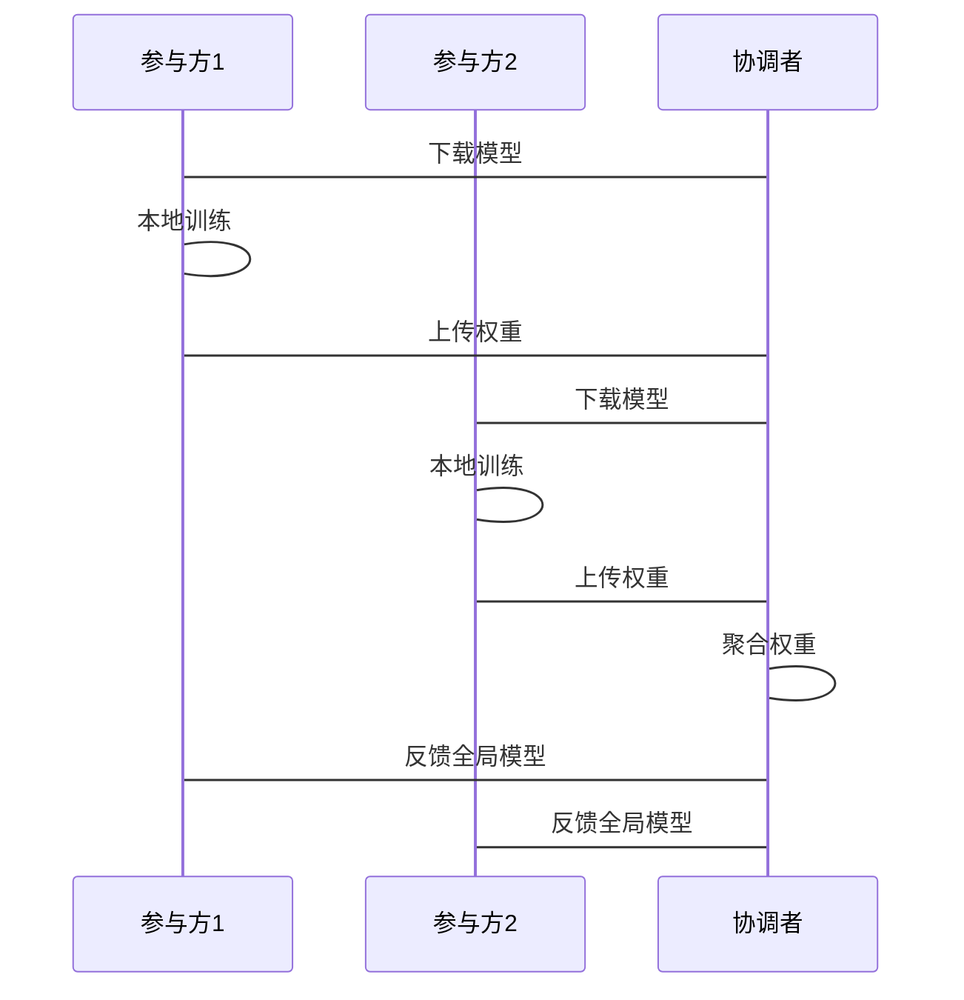
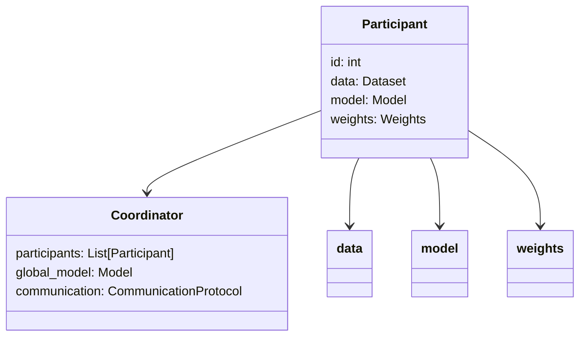
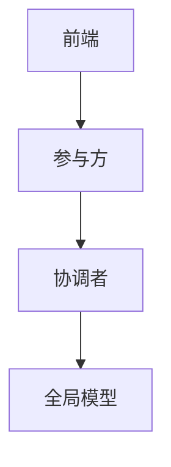

                 


# 企业AI Agent的联邦学习在跨部门数据协作中的实践与挑战

> 关键词：联邦学习，跨部门协作，数据隐私，AI Agent，分布式机器学习

> 摘要：本文探讨了联邦学习在企业AI Agent中的应用，特别是如何在跨部门数据协作中实现数据隐私保护和高效协作。通过分析联邦学习的核心概念、算法原理和系统设计，本文深入探讨了企业在实践中的挑战，并提供了实际案例和最佳实践建议。

---

# 第一部分: 企业AI Agent的联邦学习背景与基础

## 第1章: 背景介绍

### 1.1 问题背景

#### 1.1.1 跨部门数据协作的挑战
企业内部的跨部门协作常常面临数据孤岛问题。不同部门的数据往往分散在各自的系统中，导致数据难以共享和协同利用。例如，市场营销部门的数据和销售部门的数据可能无法有效整合，从而影响整体业务决策。

#### 1.1.2 数据隐私与安全的矛盾
随着数据隐私法规的日益严格（如GDPR），企业需要在保护数据隐私的前提下进行协作。传统的数据共享方式容易引发数据泄露风险，因此需要一种新的技术手段来实现数据的“可用不可见”。

#### 1.1.3 联邦学习的提出与目标
联邦学习（Federated Learning）是一种分布式机器学习技术，允许多个参与方在不共享原始数据的情况下共同训练模型。其目标是在保护数据隐私的前提下，实现跨部门的数据协作与模型训练。

### 1.2 问题描述

#### 1.2.1 跨部门数据协作的核心问题
- 数据分散在不同部门，难以统一管理和分析。
- 数据格式、结构和隐私级别不同，增加了协作的复杂性。
- 部门间的信任问题，可能导致数据共享的阻力。

#### 1.2.2 数据隐私与安全的挑战
- 数据泄露风险：直接共享原始数据可能引发隐私问题。
- 数据一致性：不同部门的数据可能有不同的格式和标准，导致协作困难。
- 安全威胁：数据在传输和存储过程中可能受到攻击。

#### 1.2.3 联邦学习的适用场景
- 当数据分散在多个部门或机构，且无法集中时。
- 需要保护数据隐私的情况下。
- 需要实时更新模型，以适应数据变化的场景。

### 1.3 问题解决

#### 1.3.1 联邦学习的定义与特点
- **定义**：联邦学习是一种分布式机器学习技术，允许多个参与方在本地数据上联合训练模型，而不共享原始数据。
- **特点**：
  - 数据不出域：数据保持在本地，只传输模型参数。
  - 联合训练：通过通信协议同步模型参数，实现全局模型的优化。
  - 隐私保护：通过加密和差分隐私等技术保护数据隐私。

#### 1.3.2 联邦学习的核心技术
- **联邦平均（FedAvg）**：通过聚合各参与方的模型参数，更新全局模型。
- **安全通信**：使用加密技术确保通信过程中的数据安全。
- **差分隐私**：在模型更新过程中添加噪声，保护数据隐私。

#### 1.3.3 联邦学习与分布式学习的对比
| 特性                | 联邦学习                        | 分布式学习                      |
|---------------------|--------------------------------|---------------------------------|
| 数据共享方式        | 不共享原始数据，只传输模型参数 | 可能共享部分数据或模型参数      |
| 数据隐私保护        | 强重视数据隐私保护             | 数据隐私保护较弱                |
| 适用场景            | 数据分散在多个机构或部门        | 数据集中或部分共享              |
| 通信开销            | 较高，需要频繁同步模型参数      | 较低，数据集中处理              |

### 1.4 边界与外延

#### 1.4.1 联邦学习的边界
- **数据范围**：仅适用于结构化数据，非结构化数据（如图像、文本）的处理较为复杂。
- **应用场景**：适用于需要实时更新模型的场景，如推荐系统、欺诈检测等。

#### 1.4.2 联邦学习的外延
- **多模态数据**：未来可以扩展到处理多种数据类型（如文本、图像、语音）。
- **动态参与方**：支持参与方的动态加入和退出。

#### 1.4.3 联邦学习与其他技术的关系
- **区块链**：可以结合区块链技术，确保数据共享的透明性和不可篡改性。
- **边缘计算**：联邦学习可以与边缘计算结合，实现更高效的分布式计算。

### 1.5 概念结构与核心要素

#### 1.5.1 联邦学习的核心要素
- **参与方（Participants）**：数据的持有方，负责本地模型训练和参数更新。
- **协调者（Coordinator）**：负责协调参与方的模型同步和参数聚合。
- **通信协议（Communication Protocol）**：定义参与方之间的数据传输和同步方式。
- **隐私保护机制（Privacy-Preserving Mechanisms）**：确保数据隐私的技术手段。

#### 1.5.2 联邦学习的架构模型


#### 1.5.3 联邦学习的流程图


---

## 第2章: 联邦学习的核心概念

### 2.1 联邦学习的原理

#### 2.1.1 联邦学习的基本原理
联邦学习的核心思想是通过在各个参与方本地进行模型训练，并将训练得到的模型参数上传到协调者，协调者将这些参数聚合，形成一个全局模型。整个过程不需要共享原始数据，只传输模型参数。

#### 2.1.2 联邦学习的数学模型
联邦学习的数学模型可以表示为：
$$ \theta_{t+1} = \frac{1}{N} \sum_{i=1}^{N} \theta_i^{(t)} $$
其中，$\theta_{t+1}$ 表示全局模型的参数，$N$ 表示参与方的数量，$\theta_i^{(t)}$ 表示第$i$个参与方在第$t$轮的模型参数。

#### 2.1.3 联邦学习的实现步骤
1. 初始化全局模型参数。
2. 各参与方在本地数据上训练模型，更新模型参数。
3. 参与方将更新后的模型参数发送到协调者。
4. 协调者聚合所有参与方的模型参数，更新全局模型。
5. 反馈全局模型参数到各参与方，继续下一轮训练。

### 2.2 联邦学习的核心模型

#### 2.2.1 联邦平均（FedAvg）
联邦平均是一种经典的联邦学习算法，其核心思想是通过加权平均的方式聚合各参与方的模型参数。具体公式为：
$$ \theta_{t+1} = \sum_{i=1}^{N} w_i \theta_i^{(t)} $$
其中，$w_i$ 表示第$i$个参与方的权重。

#### 2.2.2 联邦聚合（FedAggregation）
联邦聚合是另一种常见的联邦学习算法，其核心思想是通过投票的方式选择最优模型参数。具体公式为：
$$ \theta_{t+1} = \arg\max_{\theta} \sum_{i=1}^{N} \text{votes}_i(\theta) $$
其中，$\text{votes}_i(\theta)$ 表示第$i$个参与方对模型参数$\theta$的支持票数。

#### 2.2.3 联邦优化（FedOptimization）
联邦优化是一种基于优化理论的联邦学习算法，其核心思想是通过优化器（如SGD、Adam）在各参与方本地进行模型更新，并将更新后的梯度上传到协调者，进行全局优化。

### 2.3 联邦学习的属性对比

| 特性                | 联邦平均（FedAvg） | 联邦聚合（FedAggregation） | 联邦优化（FedOptimization） |
|---------------------|-------------------|--------------------------|--------------------------|
| 实现方式            | 基于加权平均      | 基于投票机制            | 基于优化器更新          |
| 适用场景            | 数据分布均匀      | 数据分布不均匀          | 适用于多种数据分布      |
| 计算复杂度          | 较低              | 较高                    | 中等                    |
| 鲁棒性              | 高                | 中等                    | 高                      |

---

## 第3章: 算法原理讲解

### 3.1 算法原理

#### 3.1.1 联邦学习的算法流程


#### 3.1.2 联邦学习的数学模型
$$ \theta_{t+1} = \frac{1}{N} \sum_{i=1}^{N} \theta_i^{(t)} $$

#### 3.1.3 联邦学习的实现代码
```python
import numpy as np

def fed_avg(participant_weights):
    return np.mean(participant_weights, axis=0)
```

### 3.2 算法实现

#### 3.2.1 联邦平均的实现
```python
def fed_avg(weights, n_participants):
    return sum(weights) / n_participants
```

#### 3.2.2 联邦聚合的实现
```python
def fed_aggregation(weights, votes):
    return max(weights, key=lambda w: votes[w])
```

#### 3.2.3 联邦优化的实现
```python
import tensorflow as tf

def fed_optimization(optimizer, global_model, local_gradients):
    optimizer.apply_gradients(zip(global_model trainable_vars, local_gradients))
    return global_model
```

---

## 第4章: 系统分析与架构设计方案

### 4.1 系统分析

#### 4.1.1 问题场景介绍
假设某企业有三个部门（市场部、销售部和研发部），每个部门都有自己的数据集，需要在不共享数据的前提下，联合训练一个预测客户购买行为的模型。

#### 4.1.2 系统功能设计


#### 4.1.3 系统架构设计


#### 4.1.4 系统接口设计
- **参与方接口**：
  - `download_model()`: 下载全局模型
  - `train_model()`: 在本地数据上训练模型
  - `upload_weights()`: 上传模型参数到协调者
- **协调者接口**：
  - `aggregate_weights()`: 聚合参与方的模型参数
  - `update_global_model()`: 更新全局模型

#### 4.1.5 系统交互


### 4.2 系统设计

#### 4.2.1 领域模型


#### 4.2.2 系统架构


#### 4.2.3 接口设计
- **参与方接口**：
  - `get_weights()`: 获取当前模型的权重
  - `set_weights(weights)`: 设置模型的权重
  - `train_model()`: 在本地数据上训练模型
- **协调者接口**：
  - `collect_weights()`: 收集所有参与方的权重
  - `aggregate(weights)`: 聚合权重，更新全局模型

---

## 第5章: 项目实战

### 5.1 环境安装

#### 5.1.1 安装Python
```bash
python --version
pip install --upgrade pip
```

#### 5.1.2 安装依赖库
```bash
pip install numpy pandas tensorflow scikit-learn
```

### 5.2 系统核心实现

#### 5.2.1 联邦平均的实现
```python
def fed_avg(weights, n_participants):
    return sum(weights) / n_participants
```

#### 5.2.2 联邦聚合的实现
```python
def fed_aggregation(weights, votes):
    return max(weights, key=lambda w: votes[w])
```

#### 5.2.3 联邦优化的实现
```python
import tensorflow as tf

def fed_optimization(optimizer, global_model, local_gradients):
    optimizer.apply_gradients(zip(global_model.trainable_weights, local_gradients))
    return global_model
```

### 5.3 代码解读与分析

#### 5.3.1 联邦平均的代码解读
```python
def fed_avg(weights, n_participants):
    return sum(weights) / n_participants
```

#### 5.3.2 联邦聚合的代码解读
```python
def fed_aggregation(weights, votes):
    return max(weights, key=lambda w: votes[w])
```

#### 5.3.3 联邦优化的代码解读
```python
def fed_optimization(optimizer, global_model, local_gradients):
    optimizer.apply_gradients(zip(global_model.trainable_weights, local_gradients))
    return global_model
```

### 5.4 实际案例分析

#### 5.4.1 案例介绍
假设某企业有三个部门，每个部门都有自己的客户数据，需要在不共享数据的前提下，联合训练一个预测客户购买行为的模型。

#### 5.4.2 案例实现
```python
import numpy as np

def main():
    # 初始化全局模型
    global_weights = np.random.randn(10, 1)

    # 各参与方的权重
    participant_weights = [
        global_weights * 0.5,
        global_weights * 0.3,
        global_weights * 0.2
    ]

    # 联邦平均
    new_weights = fed_avg(participant_weights, 3)
    print("New weights:", new_weights)

if __name__ == "__main__":
    main()
```

### 5.5 项目小结

#### 5.5.1 项目总结
通过本项目，我们实现了联邦学习的三个核心算法：联邦平均、联邦聚合和联邦优化，并通过实际案例展示了如何在跨部门数据协作中应用联邦学习。

#### 5.5.2 经验与教训
- **经验**：联邦学习在保护数据隐私的前提下，能够实现跨部门数据协作和模型训练。
- **教训**：联邦学习的实现需要考虑参与方的权重分配、模型聚合策略以及通信效率。

---

## 第6章: 总结与展望

### 6.1 最佳实践

#### 6.1.1 数据预处理
- 确保数据格式和结构的一致性。
- 处理缺失值和异常值。

#### 6.1.2 模型选择
- 根据具体场景选择合适的联邦学习算法。
- 考虑模型的复杂度和计算效率。

#### 6.1.3 通信优化
- 使用高效的通信协议。
- 压缩模型参数，减少传输数据量。

### 6.2 小结

联邦学习作为一种新兴的分布式机器学习技术，为企业跨部门数据协作提供了新的解决方案。通过保护数据隐私，联邦学习能够在不共享原始数据的前提下，实现模型的联合训练和优化。

### 6.3 注意事项

- **数据隐私**：确保数据在传输和存储过程中不被泄露。
- **模型收敛**：注意模型的收敛速度和训练效果。
- **通信效率**：优化通信过程，减少延迟和带宽消耗。

### 6.4 拓展阅读

- **论文推荐**：
  - "Communication-Efficient Learning of Shared Linear Models in Distributed Networks"。
  - "Federated Learning: Challenges, Methods, and Future Directions"。
- **工具与库**：
  - TensorFlow Federated（TFF）：Google开源的联邦学习框架。
  - FedML：一个开源的联邦学习库。

---

# 结语

企业AI Agent的联邦学习在跨部门数据协作中的应用，不仅解决了数据隐私和数据孤岛的问题，还为企业提供了高效的协作方式。尽管在实践中仍面临诸多挑战，但通过不断的优化和创新，联邦学习有望在未来成为企业数据协作的核心技术。

