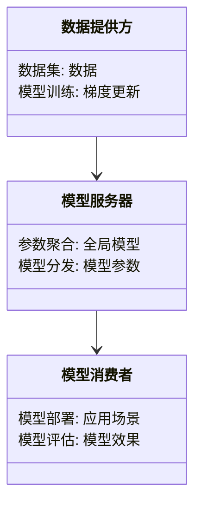
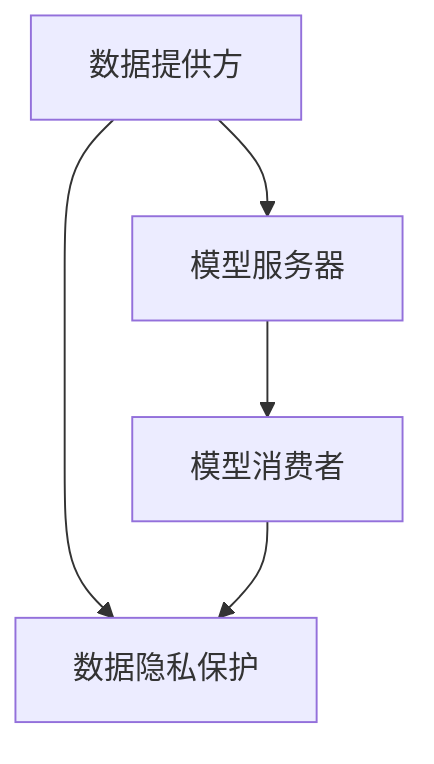
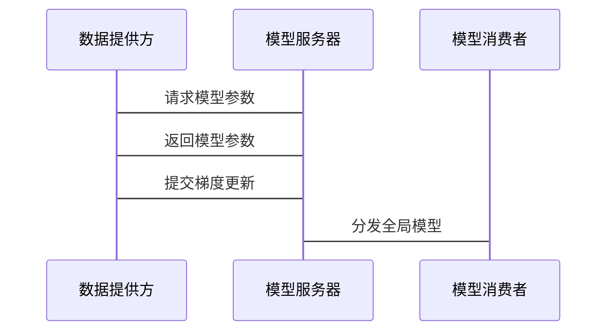

                 


# 企业AI Agent的联邦学习平台设计

## 关键词：联邦学习、企业AI Agent、数据隐私、分布式协作、机器学习平台

## 摘要：  
随着人工智能技术的快速发展，企业AI Agent的应用场景日益广泛。联邦学习作为一种新兴的分布式机器学习范式，能够在保护数据隐私的前提下，实现多个机构之间的协作学习。本文将深入探讨企业AI Agent的联邦学习平台设计，涵盖联邦学习的核心概念、算法原理、系统架构以及实际应用案例，为读者提供全面的技术解析和实践指导。

---

# 第1章: 企业AI Agent与联邦学习的背景

## 1.1 企业AI Agent的定义与作用  
企业AI Agent是指在企业环境中运行的智能代理，能够通过感知环境、自主决策并执行任务，从而优化企业运营效率。AI Agent的核心能力包括数据采集、分析、决策和执行，其广泛应用在客服、供应链管理、风险管理等领域。

## 1.2 联邦学习的定义与特点  
联邦学习（Federated Learning）是一种分布式机器学习技术，允许多个参与方在不共享原始数据的情况下共同训练模型。其核心特点包括数据隐私保护、去中心化协作和模型共享。

## 1.3 联邦学习在企业AI Agent中的应用价值  
通过联邦学习，企业AI Agent可以在保护数据隐私的前提下，实现跨机构、跨部门的协作学习，提升模型的泛化能力和应用场景的多样性。

---

# 第2章: 联邦学习的核心概念与联系

## 2.1 联邦学习的核心原理  
联邦学习通过在各个参与方本地进行模型训练，并将模型参数上传到中央服务器进行聚合，最终生成全局模型。其核心流程包括数据分布、模型更新和参数聚合。

## 2.2 联邦学习与企业AI Agent的关联  
企业AI Agent的联邦学习平台需要结合联邦学习的技术特点，设计高效的协作机制和数据安全策略，确保模型训练的准确性和隐私性。

## 2.3 联邦学习的核心要素对比  
| 对比维度 | 数据提供方 | 模型服务器 | 模型消费者 |
|----------|------------|------------|------------|
| 数据特征 | 特定领域数据 | 模型参数 | 应用场景数据 |
| 计算能力 | 本地计算 | 中央计算 | 本地计算 |
| 数据隐私 | 数据加密 | 参数聚合 | 数据隔离 |

---

# 第3章: 联邦学习的算法原理

## 3.1 联邦平均算法（FedAvg）  
### 3.1.1 算法流程  
1. 中央服务器将初始模型分发给各个参与方。  
2. 各参与方在本地数据上训练模型，更新参数。  
3. 参与方将更新后的模型参数上传至中央服务器。  
4. 中央服务器聚合所有参数，生成全局模型。  

### 3.1.2 算法公式  
全局模型参数更新公式：$$\theta_{\text{new}} = \frac{1}{N}\sum_{i=1}^{N}\theta_i$$  

### 3.1.3 代码实现示例  
```python
import numpy as np

# 初始化模型参数
theta = np.random.randn(10, 1)

# 模型更新过程
for _ in range(100):
    theta = theta - learning_rate * (1/N) * sum(grad_i)
```

## 3.2 联邦学习的通信机制  
### 3.2.1 数据分布与模型更新  
各参与方在本地数据上训练模型，生成梯度更新，通过安全通道上传至中央服务器。  

### 3.2.2 梯度聚合策略  
中央服务器根据参与方的权重，对梯度更新进行加权平均，生成全局模型。  

---

# 第4章: 联邦学习的系统架构设计

## 4.1 问题场景介绍  
企业AI Agent的联邦学习平台需要支持多个机构协作训练模型，同时确保数据隐私和通信效率。  

## 4.2 系统功能设计  
### 4.2.1 领域模型类图  


### 4.2.2 系统架构图  


## 4.3 系统接口设计  
### 4.3.1 接口功能  
- 数据提供方接口：接收模型参数，返回梯度更新。  
- 模型服务器接口：分发模型参数，聚合梯度更新。  
- 模型消费者接口：部署模型，评估模型效果。  

### 4.3.2 交互流程图  


---

# 第5章: 联邦学习的项目实战

## 5.1 环境安装与配置  
### 5.1.1 安装依赖  
```bash
pip install numpy matplotlib tensorflow
```

## 5.2 核心代码实现  
### 5.2.1 数据提供方实现  
```python
import numpy as np

classDataProvider:
    def __init__(self, data):
        self.data = data
```

### 5.2.2 模型服务器实现  
```python
classModelServer:
    def __init__(self):
        self.models = []
```

### 5.2.3 模型消费者实现  
```python
classModelConsumer:
    def __init__(self, model):
        self.model = model
```

## 5.3 代码解读与案例分析  
通过实际案例分析，展示联邦学习在企业AI Agent中的具体应用，例如跨机构的客户服务优化。

---

# 第6章: 总结与展望

## 6.1 本章总结  
总结联邦学习在企业AI Agent中的设计与实现，强调其在数据隐私保护和协作学习中的优势。

## 6.2 未来展望  
探讨联邦学习的进一步优化方向，包括模型安全、通信效率和扩展性。

---

# 第7章: 最佳实践与注意事项

## 7.1 最佳实践 tips  
- 数据隐私保护是核心，需设计严格的加密机制。  
- 通信效率是关键，需优化数据传输和模型聚合流程。  

## 7.2 注意事项  
- 确保数据分布的合理性，避免数据倾斜。  
- 定期进行模型评估和优化，提升模型性能。  

---

# 参考文献与拓展阅读

## 参考文献  
1.《联邦学习：隐私保护下的分布式机器学习》  
2.《企业AI Agent的设计与实现》  

## 拓展阅读  
- 联邦学习的数学模型与优化算法研究  
- 跨机构协作的联邦学习平台设计  

---

# 附录：索引与术语表  

---

以上是《企业AI Agent的联邦学习平台设计》的技术博客文章的完整目录与内容框架。文章以逻辑清晰、结构紧凑的方式，系统地介绍了联邦学习的核心概念、算法原理、系统架构以及实际应用案例，为读者提供了一套完整的企业AI Agent的联邦学习平台设计方法论。

