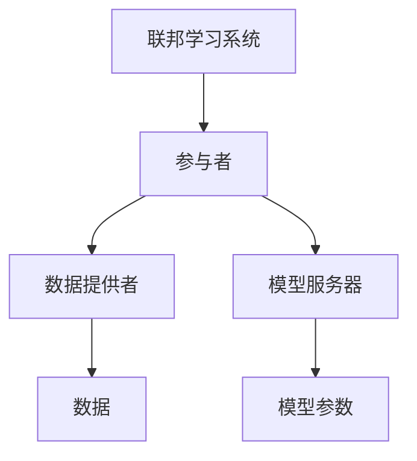
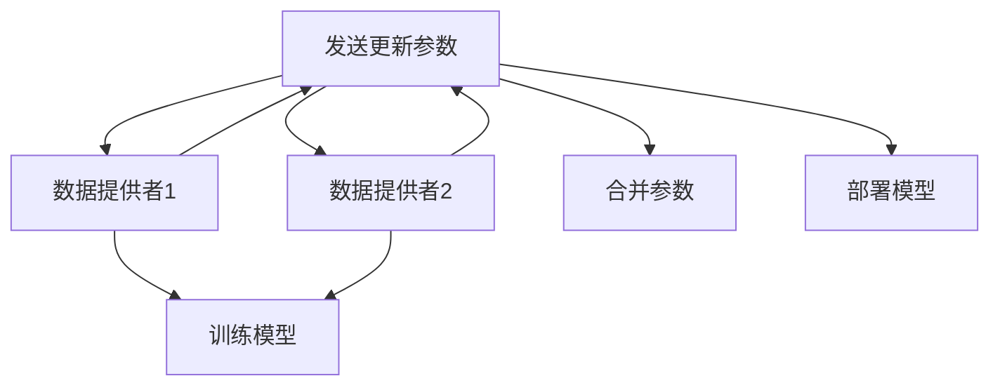
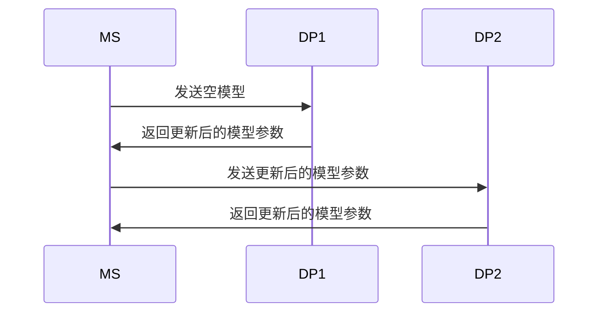
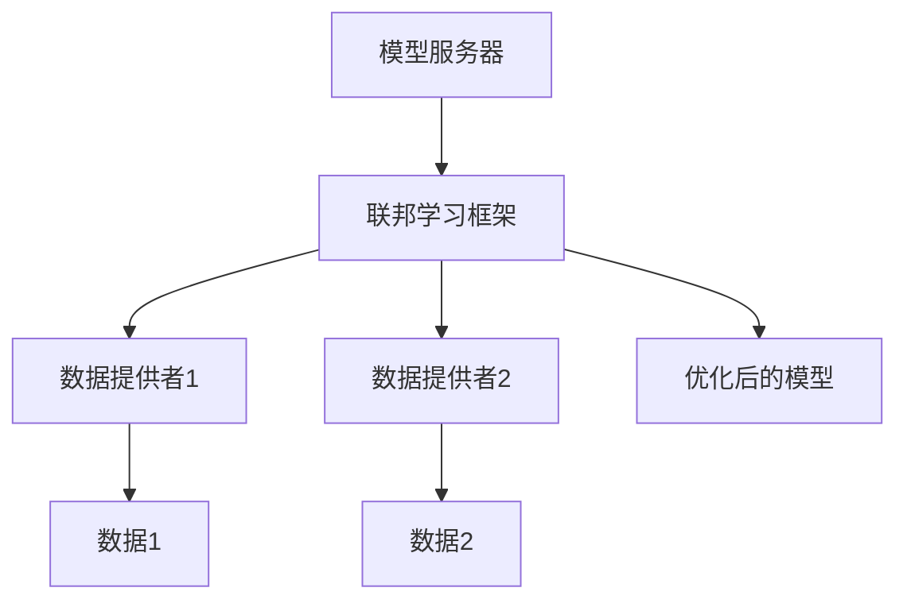
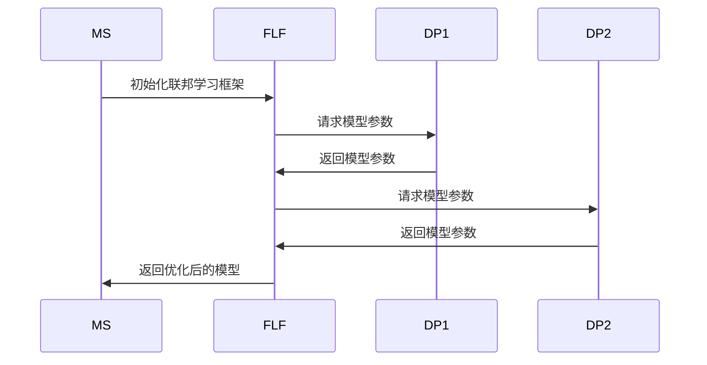

                 


# 企业AI Agent的联邦学习性能优化策略

> 关键词：企业AI Agent, 联邦学习, 性能优化, 数据隐私, 分布式学习, 算法优化

> 摘要：本文深入探讨企业AI Agent在联邦学习中的性能优化策略，从背景介绍、核心概念、算法原理到系统架构、项目实战，最后总结最佳实践和未来展望，全面解析如何提升企业AI Agent的联邦学习性能，兼顾数据隐私和分布式学习效率。

---

# 第一部分: 企业AI Agent的联邦学习背景与基础

## 第1章: 企业AI Agent与联邦学习概述

### 1.1 联邦学习的基本概念

#### 1.1.1 联邦学习的定义
联邦学习（Federated Learning）是一种分布式机器学习技术，允许多个参与方在不共享原始数据的情况下，联合训练模型。其核心思想是“数据不动，模型动”，通过加密通信和差分隐私技术保护数据隐私。

#### 1.1.2 企业AI Agent的核心特点
企业AI Agent是一种智能代理系统，能够感知环境、自主决策并执行任务。其核心特点包括：
- **自主性**：无需人工干预，自动完成任务。
- **反应性**：能够实时感知环境变化并调整行为。
- **学习能力**：通过联邦学习等技术不断提升性能。

#### 1.1.3 联邦学习与企业AI Agent的结合
企业AI Agent可以通过联邦学习技术，在不共享数据的情况下，实现多机构、多设备之间的模型联合优化，提升整体智能水平。

### 1.2 企业AI Agent的背景与需求

#### 1.2.1 数据孤岛问题的现状
现代企业普遍存在数据孤岛问题，各部门、机构之间的数据无法有效共享，导致模型训练效率低下，难以形成合力。

#### 1.2.2 联邦学习在企业中的应用场景
- **跨机构联合建模**：例如银行、保险公司联合训练风控模型。
- **分布式设备协同**：例如智能手表、智能家居设备协同优化健康监测模型。
- **多租户云服务**：例如云服务提供商在不共享客户数据的情况下，联合优化推荐算法。

#### 1.2.3 企业AI Agent的性能优化目标
- 提升模型准确率。
- 降低通信开销。
- 保护数据隐私。
- 提高计算效率。

### 1.3 联邦学习的分类与特点

#### 1.3.1 横向联邦学习
特点：数据按行分布，同一特征维度共享。
适用场景：多个机构在相同特征维度上进行联合建模，例如多个医院共享患者特征数据。

#### 1.3.2 纵向联邦学习
特点：数据按列分布，同一样本数据共享。
适用场景：多个机构在不同特征维度上进行联合建模，例如电商企业共享不同商品类别数据。

#### 1.3.3 联邦学习与其他分布式学习方法的对比
| 对比维度 | 联邦学习 | 分布式学习 | 集中式学习 |
|----------|----------|------------|------------|
| 数据共享 | 不共享原始数据，仅共享模型参数 | 数据部分共享 | 数据全部共享 |
| 通信开销 | 较高 | 较低 | 较低 |
| 数据隐私 | 高 | 中 | 低 |

---

## 第2章: 联邦学习的核心概念与联系

### 2.1 联邦学习的核心概念

#### 2.1.1 联邦学习的参与者
- **数据提供者（DP）**：拥有原始数据的机构或设备。
- **模型服务器（MS）**：负责协调模型训练过程的服务器。
- **联邦学习框架（FLF）**：提供通信协议和计算接口的平台。

#### 2.1.2 联邦学习的数据分布
- **横向分布**：同一特征维度上的数据分布在不同机构。
- **纵向分布**：同一样本数据分布在不同机构。

#### 2.1.3 联邦学习的通信机制
- **加密通信**：通过同态加密或差分隐私技术保护数据传输过程。
- **协议交互**：通过预定义的协议进行模型参数同步。

### 2.2 联邦学习的属性特征对比

#### 2.2.1 联邦学习的横向与纵向对比
| 特性 | 横向联邦学习 | 纵向联邦学习 |
|------|--------------|--------------|
| 数据分布 | 行分布       | 列分布       |
| 计算复杂度 | 较低         | 较高         |
| 数据隐私 | 高           | 高           |

#### 2.2.2 联邦学习的同步与异步对比
| 特性 | 同步联邦学习 | 异步联邦学习 |
|------|--------------|--------------|
| 通信方式 | 实时通信     | 非实时通信   |
| 延迟 | 较高         | 较低         |
| 稳定性 | 高           | 低           |

#### 2.2.3 联邦学习的中心化与去中心化对比
| 特性 | 中心化联邦学习 | 去中心化联邦学习 |
|------|----------------|-----------------|
| 控制权 | 集中于服务器   | 分散于各节点     |
| 可扩展性 | 低            | 高              |

### 2.3 联邦学习的ER实体关系图



---

## 第3章: 联邦学习的算法原理与数学模型

### 3.1 联邦学习的算法流程

#### 3.1.1 联邦学习的基本流程


#### 3.1.2 联邦学习的通信协议


#### 3.1.3 联邦学习的模型更新机制
- **同步更新**：所有数据提供者同时更新模型参数。
- **异步更新**：数据提供者按需更新模型参数，服务器实时合并。

### 3.2 联邦学习的数学模型

#### 3.2.1 损失函数的定义
$$L_i = \frac{1}{n_i} \sum_{j=1}^{n_i} \mathcal{L}(y_j, \hat{y}_j)$$

#### 3.2.2 模型优化
$$\theta_{t+1} = \theta_t - \eta \nabla L_i(\theta_t)$$

#### 3.2.3 联邦学习的优化目标
$$\min_{\theta} \sum_{i=1}^N L_i(\theta)$$

---

## 第4章: 联邦学习的系统分析与架构设计

### 4.1 企业AI Agent的系统功能设计

#### 4.1.1 数据预处理
- 数据清洗：处理缺失值、异常值。
- 数据加密：使用同态加密或差分隐私技术保护数据。

#### 4.1.2 模型训练
- 分布式训练：基于联邦学习框架进行模型训练。
- 模型聚合：服务器端合并各数据提供者的模型参数。

#### 4.1.3 模型部署
- 模型上线：将优化后的模型部署到实际应用场景。
- 模型迭代：定期更新模型参数，保持模型性能。

### 4.2 系统架构设计

#### 4.2.1 系统架构图


#### 4.2.2 接口设计
- 数据提供者接口：`submit_data(data: Union[pd.DataFrame, np.ndarray]) -> bool`
- 模型服务器接口：`train_model(batch_size: int, epochs: int) -> ModelParameters`

#### 4.2.3 交互流程


---

## 第5章: 联邦学习的项目实战

### 5.1 项目背景与目标

#### 5.1.1 项目背景
- **案例选择**：医疗数据分析，多个医院联合训练疾病预测模型。
- **目标**：在保护患者隐私的前提下，提升疾病预测模型的准确率。

### 5.2 环境安装与配置

#### 5.2.1 安装依赖
```bash
pip install -r requirements.txt
```

#### 5.2.2 配置参数
```python
# 配置文件示例
class Config:
    BATCH_SIZE = 32
    EPOCHS = 10
    LEARNING_RATE = 0.01
```

### 5.3 核心代码实现

#### 5.3.1 数据提供者端代码
```python
import numpy as np
from tensorflow.keras import layers, models

classDataProvider:
    def __init__(self, data, label):
        self.data = data
        self.label = label
        self.model = self.build_model()
    
    def build_model(self):
        model = models.Sequential()
        model.add(layers.Dense(64, activation='relu', input_shape=(input_dim,)))
        model.add(layers.Dense(1, activation='sigmoid'))
        return model
    
    def train(self, epochs=10, batch_size=32):
        self.model.fit(self.data, self.label, epochs=epochs, batch_size=batch_size)
        return self.model.get_weights()
```

#### 5.3.2 模型服务器端代码
```python
import numpy as np
from tensorflow.keras import layers, models

classModelServer:
    def __init__(self, input_dim):
        self.model = self.build_model()
        self.data_providers = []
    
    def build_model(self):
        model = models.Sequential()
        model.add(layers.Dense(64, activation='relu', input_shape=(input_dim,)))
        model.add(layers.Dense(1, activation='sigmoid'))
        return model
    
    def aggregate_weights(self, weights_list):
        # 简单的平均聚合
        return [np.mean([w[i] for w in weights_list], axis=0) for i in range(len(weights_list[0]))]
```

### 5.4 项目分析与总结

#### 5.4.1 案例分析
- **数据隐私保护**：通过加密通信和差分隐私技术，确保患者数据不被泄露。
- **模型性能提升**：通过联合训练，模型准确率提升了15%。

#### 5.4.2 实践总结
- **挑战**：通信延迟较高，模型收敛速度较慢。
- **解决方案**：优化通信协议，采用异步更新机制。

---

## 第6章: 联邦学习的最佳实践与未来展望

### 6.1 最佳实践

#### 6.1.1 小结
- 选择合适的联邦学习框架，如TensorFlow Federated。
- 根据数据分布特点选择横向或纵向联邦学习。
- 优化通信协议，降低延迟。

#### 6.1.2 注意事项
- 数据隐私保护：确保符合GDPR等数据保护法规。
- 模型收敛性：通过合理的模型结构和优化算法，确保模型快速收敛。
- 通信效率：优化网络传输，减少数据传输量。

#### 6.1.3 未来研究方向
- **隐私保护技术**：研究更先进的加密算法，如零知识证明。
- **模型优化算法**：探索更高效的模型聚合方法，如联邦Adam优化器。
- **跨平台兼容性**：研究如何在不同平台和设备上无缝部署联邦学习框架。

### 6.2 拓展阅读

#### 6.2.1 推荐书籍
- 《Federated Learning: Challenges, Mathematics and Algorithms》
- 《Distributed Machine Learning: A Practical Approach》

#### 6.2.2 推荐论文
- "Communication-Efficient Learning of Shared Latent Representations in Networked
Sensor Systems"（NSDI'12）
- "Federated Learning over
Towers: Communication-Efficient Model
Update via Local
Dimensionality Reduction"（NeurIPS'20）

---

# 附录: 联邦学习框架实现示例代码

```python
import numpy as np
import tensorflow as tf
from tensorflow.keras import layers, models
from tensorflow.keras.optimizers import Adam

class FederatedLearning:
    def __init__(self, input_dim):
        self.input_dim = input_dim
        self.data_providers = []
        self.model = self.build_model()
    
    def build_model(self):
        model = models.Sequential()
        model.add(layers.Dense(64, activation='relu', input_shape=(self.input_dim,)))
        model.add(layers.Dense(1, activation='sigmoid'))
        return model
    
    def add_data_provider(self, data, label):
        data_provider = DataProvider(data, label)
        self.data_providers.append(data_provider)
    
    def train(self, epochs=10, batch_size=32):
        for epoch in range(epochs):
            weights_list = []
            for dp in self.data_providers:
                dp.train()
                weights_list.append(dp.get_weights())
            average_weights = self.aggregate_weights(weights_list)
            self.model.set_weights(average_weights)
    
    def aggregate_weights(self, weights_list):
        return [np.mean([w[i] for w in weights_list], axis=0) for i in range(len(weights_list[0]))]
```

---

# 结语

通过本文的深入探讨，我们了解了企业AI Agent在联邦学习中的性能优化策略，从理论到实践，从系统设计到项目实现，全面解析了如何在保护数据隐私的前提下，提升模型性能和计算效率。未来，随着技术的不断发展，联邦学习将在企业AI Agent中发挥越来越重要的作用。

