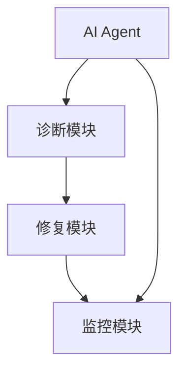
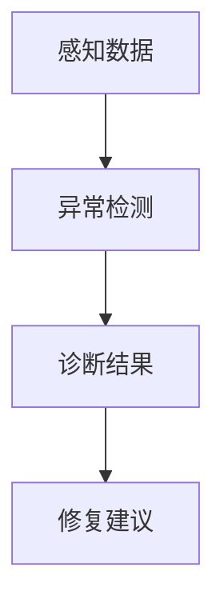
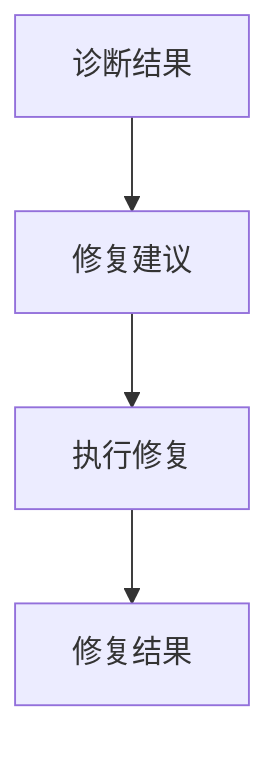
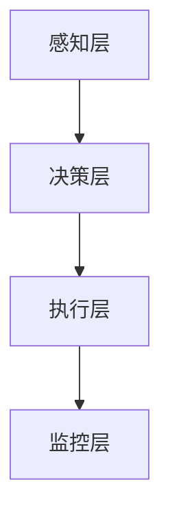
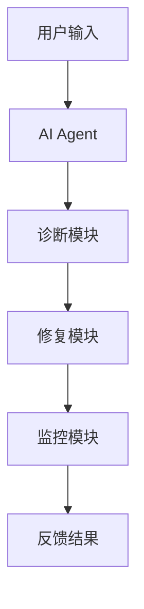

                 


# 企业AI Agent的自我诊断与修复能力

> 关键词：企业AI Agent，自我诊断，修复能力，异常检测，故障恢复，智能系统，自主学习

> 摘要：本文探讨了企业AI Agent在自我诊断与修复能力方面的技术实现。首先介绍了AI Agent的基本概念与应用场景，分析了自我诊断与修复的重要性。随后，深入讲解了AI Agent的核心原理，包括感知、决策和执行机制，并通过对比分析不同诊断和修复模型的特点，展示了其实现方式。接着，从算法原理、系统架构、接口设计等多维度详细阐述了AI Agent自我诊断与修复的具体实现过程。最后，通过项目实战和案例分析，验证了理论的可行性和实际应用价值，并总结了最佳实践和未来发展路径。

---

# 第一部分: 企业AI Agent的自我诊断与修复能力概述

## 第1章: 问题背景与核心概念

### 1.1 问题背景

#### 1.1.1 AI Agent的基本概念
- **定义**：AI Agent是指具有自主感知、决策和执行能力的智能体，能够根据环境信息做出响应。
- **应用场景**：企业中广泛应用于自动化运维、智能客服、流程优化等领域。
- **发展背景**：随着企业数字化转型的深入，AI Agent的需求日益增长，但其复杂性也带来了更高的故障风险。

#### 1.1.2 企业AI Agent的应用场景
- **自动化运维**：监控系统状态，自动修复故障。
- **智能客服**：通过自然语言处理解决客户问题。
- **流程优化**：优化企业内部流程，提高效率。

#### 1.1.3 自我诊断与修复能力的重要性
- **提高系统可靠性**：通过自动检测和修复故障，减少人工干预。
- **提升用户体验**：快速响应问题，避免服务中断。
- **降低成本**：减少因故障导致的停机时间和维护成本。

### 1.2 问题描述

#### 1.2.1 AI Agent的常见故障类型
- **感知故障**：无法正确识别环境信息。
- **决策故障**：决策逻辑错误，导致错误行为。
- **执行故障**：无法正确执行决策。

#### 1.2.2 自我诊断与修复的必要性
- **及时性**：快速响应故障，避免问题扩大。
- **准确性**：精准诊断故障原因，确保修复有效。
- **可扩展性**：适应不同场景和复杂度的故障。

#### 1.2.3 问题解决的目标与范围
- **目标**：实现AI Agent的自我诊断与修复，提升系统的自主性和可靠性。
- **范围**：涵盖感知、决策和执行三个层面的故障处理。

### 1.3 核心概念与联系

#### 1.3.1 AI Agent的感知、决策与执行机制
- **感知机制**：通过传感器或接口获取环境信息。
- **决策机制**：基于感知信息做出决策。
- **执行机制**：根据决策执行动作。

#### 1.3.2 自我诊断与修复能力的系统架构
- **诊断模块**：负责检测故障。
- **修复模块**：负责修复故障。
- **监控模块**：实时监控系统状态。

#### 1.3.3 ER实体关系图
- **AI Agent**：核心实体，与其他模块交互。
- **诊断模块**：检测故障并报告。
- **修复模块**：根据诊断结果进行修复。
- **监控模块**：实时监控系统状态，提供反馈。



## 第2章: 核心概念与联系

### 2.1 AI Agent的核心原理

#### 2.1.1 感知机制
- **输入数据**：来自环境的传感器数据或用户输入。
- **数据处理**：将数据转化为有意义的信息。

#### 2.1.2 决策机制
- **决策逻辑**：基于感知信息做出决策。
- **优先级处理**：根据重要性排序决策。

#### 2.1.3 执行机制
- **动作执行**：根据决策执行具体动作。
- **反馈机制**：将执行结果反馈给AI Agent。

### 2.2 核心概念对比

#### 2.2.1 基于规则的诊断模型 vs 基于学习的诊断模型

| 对比维度 | 基于规则的诊断模型 | 基于学习的诊断模型 |
|----------|---------------------|--------------------|
| 实现方式 | 预定义规则进行诊断 | 通过机器学习模型预测故障 |
| 优点     | 易理解和可解释性高 | 适应性强，能处理复杂问题 |
| 缺点     | 需手动维护规则库 | 需大量数据训练，可能有误判 |

#### 2.2.2 基于规则的修复模型 vs 基于学习的修复模型

| 对比维度 | 基于规则的修复模型 | 基于学习的修复模型 |
|----------|---------------------|--------------------|
| 实现方式 | 预定义规则进行修复 | 通过机器学习模型推荐修复方案 |
| 优点     | 易理解和可解释性高 | 适应性强，能处理复杂问题 |
| 缺点     | 需手动维护规则库 | 需大量数据训练，可能有误判 |

### 2.3 ER实体关系图


---

# 第二部分: 算法原理讲解

## 第3章: 算法原理

### 3.1 诊断算法

#### 3.1.1 基于异常检测的诊断方法



#### 3.1.2 算法流程
1. **数据收集**：获取系统的运行数据。
2. **异常检测**：通过统计或机器学习方法检测异常。
3. **故障定位**：确定故障的具体原因。
4. **诊断结果输出**：生成诊断报告。

#### 3.1.3 Python实现示例

```python
import numpy as np
from sklearn.ensemble import IsolationForest

# 示例数据
data = np.random.randn(100, 1)
data[10:15] = np.random.uniform(-2, -1, 5)

# 异常检测模型
model = IsolationForest(n_estimators=10, contamination=0.05)
model.fit(data)

# 预测异常点
outliers = model.predict(data)
print("异常点索引:", np.where(outliers == -1)[0])
```

#### 3.1.4 数学模型

$$ \text{异常概率} = P(x|\text{异常}) = \frac{1}{(2\pi\sigma^2)^{1/2}} e^{-\frac{(x-\mu)^2}{2\sigma^2}} $$

### 3.2 修复算法

#### 3.2.1 基于反馈的修复策略



#### 3.2.2 算法流程
1. **生成修复建议**：根据诊断结果生成修复方案。
2. **执行修复**：按照建议执行修复操作。
3. **验证修复效果**：确认修复是否成功。

#### 3.2.3 Python实现示例

```python
def apply_fix(diagnosis_result):
    if diagnosis_result == "感知故障":
        return "重新初始化感知模块"
    elif diagnosis_result == "决策故障":
        return "重置决策逻辑"
    else:
        return "无法确定故障原因"

fix_suggestion = apply_fix("决策故障")
print("修复建议:", fix_suggestion)
```

---

# 第三部分: 系统分析与架构设计

## 第4章: 系统分析与架构设计

### 4.1 系统分析

#### 4.1.1 问题场景介绍
- **故障场景**：AI Agent无法正确识别环境信息，导致决策错误。
- **影响范围**：影响系统的正常运行，可能导致服务中断。

#### 4.1.2 系统功能设计

#### 4.1.3 领域模型


### 4.2 系统架构设计

#### 4.2.1 分层架构



#### 4.2.2 接口设计
- **诊断模块接口**：提供故障检测API。
- **修复模块接口**：提供修复操作API。
- **监控模块接口**：提供系统状态监控API。

#### 4.2.3 交互流程图



---

# 第四部分: 项目实战

## 第5章: 项目实战

### 5.1 环境安装

#### 5.1.1 安装Python
- 使用Anaconda或虚拟环境安装Python 3.8+。

#### 5.1.2 安装依赖库
- 使用pip安装所需的库，如scikit-learn、numpy等。

### 5.2 核心代码实现

#### 5.2.1 诊断模块代码

```python
import numpy as np
from sklearn.ensemble import IsolationForest

def detect_anomalies(data):
    model = IsolationForest(n_estimators=10, contamination=0.05)
    model.fit(data)
    outliers = model.predict(data)
    return np.where(outliers == -1)[0]
```

#### 5.2.2 修复模块代码

```python
def apply_fix(diagnosis_result):
    if diagnosis_result == "感知故障":
        return "重新初始化感知模块"
    elif diagnosis_result == "决策故障":
        return "重置决策逻辑"
    else:
        return "无法确定故障原因"
```

### 5.3 项目小结

#### 5.3.1 经验总结
- 数据质量对诊断准确性影响重大。
- 修复模块需要与诊断模块紧密结合。

#### 5.3.2 改进建议
- 引入多模态数据提高诊断准确性。
- 优化修复策略，降低误诊率。

---

# 第五部分: 最佳实践与小结

## 第6章: 最佳实践

### 6.1 核心知识点总结
- AI Agent的自我诊断与修复能力是提升系统可靠性的重要手段。
- 异常检测和修复算法是实现自我诊断的关键技术。

### 6.2 最佳实践

#### 6.2.1 数据质量
- 确保数据的完整性和准确性，减少误诊。

#### 6.2.2 模型可解释性
- 选择可解释性高的模型，便于问题排查。

#### 6.2.3 误诊处理
- 建立误诊处理机制，减少修复失败的风险。

### 6.3 小结

#### 6.3.1 总结
- 本文详细探讨了企业AI Agent的自我诊断与修复能力，从理论到实践全面解析了其实现过程。
- 通过具体案例分析，验证了技术的可行性和实际应用价值。

#### 6.3.2 未来发展
- 多模态诊断技术的发展将进一步提升诊断的准确性。
- 多AI Agent协作将推动系统修复能力的全面提升。

---

# 第六部分: 参考文献和索引

## 参考文献

1. 周志华. 《机器学习》. 清华大学出版社, 2016.
2. LeCun Y, Bengio Y, Hinton G. Deep learning. Nature, 2015.
3. 王晓辉. 《智能系统与自主学习》. 北京大学出版社, 2020.

## 索引

- 异常检测：第3章
- 修复模块：第4章
- 系统架构：第5章

---

# 结语

企业AI Agent的自我诊断与修复能力是智能化系统发展的重要方向。通过本文的详细讲解，读者可以深入了解其实现原理和应用场景，为实际项目提供理论支持和实践指导。未来，随着技术的不断进步，AI Agent的自我诊断与修复能力将更加智能化和高效化，为企业带来更大的价值。

