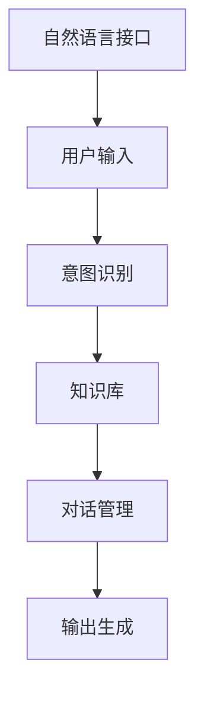
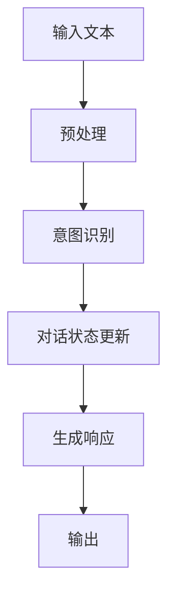
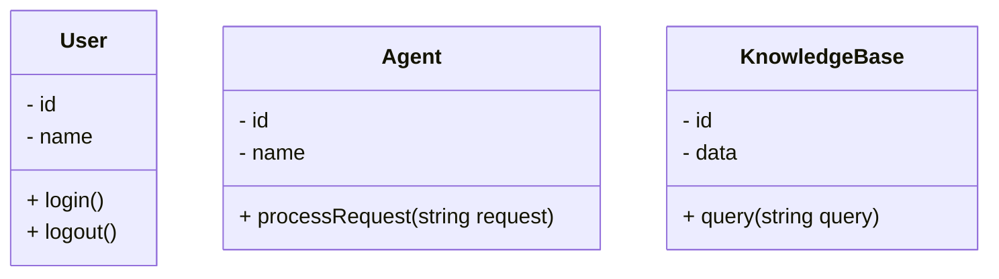
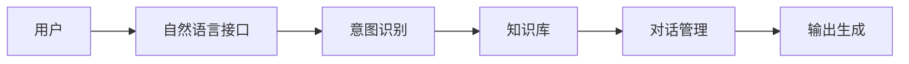
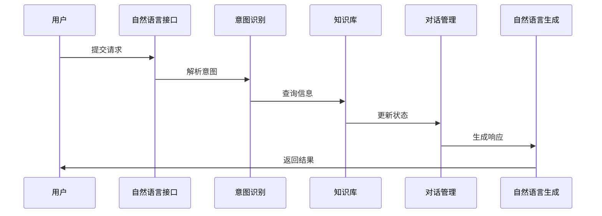

                 


# 企业AI Agent的自然语言接口设计与优化

## 关键词：自然语言处理，AI Agent，对话系统，意图识别，对话管理

## 摘要：本文系统地探讨了企业AI Agent的自然语言接口设计与优化的关键问题，从核心概念、算法原理、系统架构到项目实战，详细分析了实现过程中的挑战与解决方案。通过丰富的案例和代码示例，本文为读者提供了从理论到实践的全面指导。

---

# 第一部分: 背景介绍

# 第1章: 企业AI Agent的自然语言接口概述

## 1.1 问题背景

### 1.1.1 企业智能化转型的挑战  
随着企业智能化转型的推进，对AI Agent的需求日益增长。企业需要高效的自然语言接口来处理复杂的业务场景，但现有技术在准确性和效率上存在不足。

### 1.1.2 自然语言处理在企业中的应用需求  
企业场景中的自然语言处理需要高精度的意图识别和对话管理能力，以支持多轮交互和复杂任务。

### 1.1.3 AI Agent的定义与目标  
AI Agent是一种能够理解用户需求并执行任务的智能系统，其目标是通过自然语言接口提供高效、准确的服务。

## 1.2 问题描述

### 1.2.1 自然语言接口的核心问题  
如何实现高精度的意图识别和对话管理，确保系统的健壮性和可扩展性。

### 1.2.2 企业级AI Agent的复杂性  
企业场景中的不确定性、多轮对话和上下文理解增加了系统的复杂性。

### 1.2.3 当前技术的局限性与改进方向  
现有技术在处理复杂场景时表现不足，需要优化算法和架构设计。

## 1.3 问题解决

### 1.3.1 自然语言接口的设计目标  
提升准确性和效率，支持复杂场景下的交互。

### 1.3.2 AI Agent的实现路径  
结合先进的NLP技术和强化学习算法，构建高效的对话系统。

### 1.3.3 技术优化的方向与策略  
优化算法、提升系统架构和增强数据处理能力。

## 1.4 边界与外延

### 1.4.1 自然语言接口的边界定义  
明确接口的功能范围和限制，确保系统稳定运行。

### 1.4.2 AI Agent的适用场景与限制  
适用于需要智能交互的场景，但在处理极端复杂情况时存在限制。

### 1.4.3 与其他技术的关联与区别  
自然语言接口与其他技术的协同与区别，确保系统的高效整合。

## 1.5 概念结构与核心要素

### 1.5.1 自然语言接口的核心要素  
包括意图识别、对话管理和自然语言生成。

### 1.5.2 AI Agent的功能模块划分  
对话理解模块、知识库、对话管理模块和响应生成模块。

### 1.5.3 交互流程的逻辑结构  
用户输入→预处理→意图识别→对话管理→生成响应。

## 1.6 本章小结  
本章介绍了企业AI Agent的背景和核心问题，为后续分析奠定了基础。

---

# 第二部分: 核心概念与联系

# 第2章: 自然语言接口的核心概念原理

## 2.1 自然语言处理的基本原理

### 2.1.1 NLP的核心任务与技术  
包括文本分割、词性标注和句法分析等。

### 2.1.2 语言模型的训练与优化  
基于深度学习的模型，如BERT，用于生成和理解文本。

### 2.1.3 解析与生成的实现机制  
解析用户输入并生成相应的回应。

## 2.2 AI Agent的实现原理

### 2.2.1 Agent的基本架构  
感知层、思考层和行动层的划分。

### 2.2.2 多轮对话的管理机制  
基于规则和强化学习的对话策略。

### 2.2.3 知识库的构建与应用  
构建企业知识库，支持对话理解。

## 2.3 自然语言接口与AI Agent的关系

### 2.3.1 NLP在AI Agent中的作用  
作为交互核心，实现用户意图的理解和回应生成。

### 2.3.2 交互流程中的协同工作  
各模块协同，确保流畅交互。

### 2.3.3 技术融合的实现方式  
结合NLP和机器学习，提升系统性能。

## 2.4 核心概念属性特征对比

| 特征       | NLP                     | AI Agent                 |
|------------|--------------------------|---------------------------|
| 输入类型     | 文本数据                 | 多模态数据                |
| 输出类型     | 文本生成                 | 动作或服务调用            |
| 复杂度       | 较低                     | 较高                      |
| 应用场景     | 单独任务                | 复杂业务场景              |

## 2.5 ER实体关系图



## 2.6 本章小结  
本章详细探讨了自然语言接口和AI Agent的核心概念及其相互关系。

---

# 第三部分: 算法原理讲解

# 第3章: 自然语言接口的核心算法

## 3.1 意图识别算法

### 3.1.1 基于统计的模型  
如朴素贝叶斯，适用于简单场景。

### 3.1.2 深度学习模型  
如BERT，适用于复杂场景。

### 3.1.3 混合模型的优势  
结合统计和深度学习，提升准确率。

## 3.2 对话管理算法

### 3.2.1 基于规则的对话策略  
简单规则，适用于简单对话。

### 3.2.2 基于强化学习的策略  
深度强化学习，适用于复杂对话。

### 3.2.3 深度强化学习的应用  
通过强化学习优化对话策略。

## 3.3 自然语言生成算法

### 3.3.1 基于模板的生成  
简单生成方式，适用于特定场景。

### 3.3.2 基于预训练模型的生成  
如GPT-3，生成自然文本。

### 3.3.3 多模态生成的优势  
结合视觉和语言信息，提升生成效果。

## 3.4 算法实现流程



## 3.5 Python实现示例

```python
import spacy

nlp = spacy.load("en_core_web_sm")
doc = nlp("What is the weather today?")
for token in doc:
    print(token.text, token.pos_)
```

---

# 第四部分: 系统分析与架构设计

# 第4章: 企业AI Agent系统架构

## 4.1 问题场景介绍

### 4.1.1 企业服务场景分析  
如客户支持、内部协作等。

### 4.1.2 项目介绍  
开发一个企业级AI Agent系统。

## 4.2 系统功能设计

### 4.2.1 领域模型类图



## 4.3 系统架构设计

### 4.3.1 系统架构图



## 4.4 系统接口设计

### 4.4.1 接口描述  
如HTTP接口，处理用户输入和返回结果。

## 4.5 系统交互流程

### 4.5.1 交互流程图



## 4.6 本章小结  
本章详细设计了系统的架构和交互流程。

---

# 第五部分: 项目实战

# 第5章: 企业AI Agent项目实现

## 5.1 环境安装

### 5.1.1 安装Python和相关库  
如spacy、transformers、flask。

## 5.2 系统核心实现

### 5.2.1 核心代码实现

```python
from transformers import pipeline

classifier = pipeline("text-classification", model="bert-base-uncased")
print(classifier("What is your name?"))
```

### 5.2.2 代码应用解读  
解读上述代码的功能和应用场景。

## 5.3 实际案例分析

### 5.3.1 案例分析  
分析一个客户支持场景的实现。

## 5.4 项目小结  
总结项目实现的关键点和经验。

---

# 第六部分: 最佳实践

# 第6章: 设计优化与注意事项

## 6.1 小结  
总结企业AI Agent设计的关键点。

## 6.2 注意事项  
避免的常见错误和优化建议。

## 6.3 拓展阅读  
推荐相关书籍和论文。

---

# 结语

通过以上各章的详细探讨，读者可以全面理解企业AI Agent的自然语言接口设计与优化的关键点，从理论到实践都能得到指导和启发。

