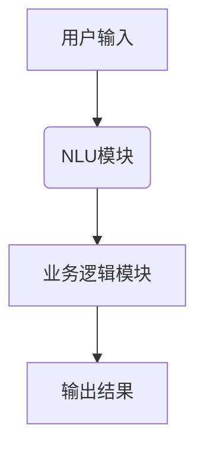
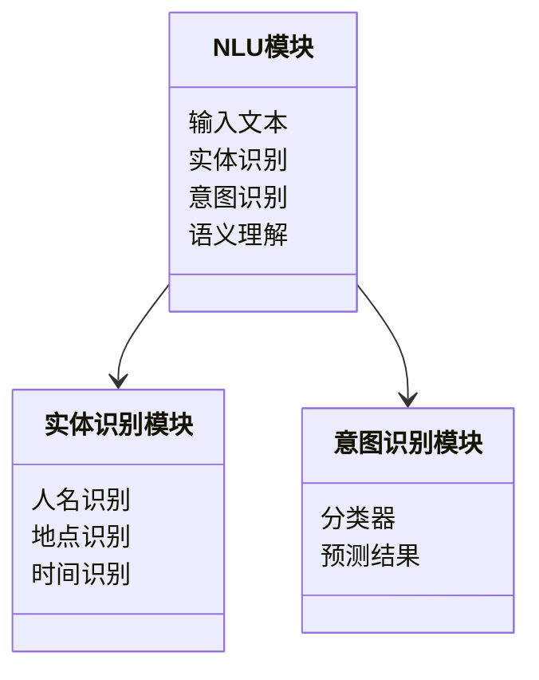

                 


# 企业AI Agent的自然语言理解(NLU)技术深化

> 关键词：企业AI Agent，自然语言理解，NLU技术，算法原理，系统架构，项目实战

> 摘要：本文深入探讨了企业AI Agent中自然语言理解（NLU）技术的核心概念、算法原理、系统架构以及实际应用。从NLU的基本概念到其在企业环境中的具体应用场景，文章系统性地分析了NLU技术的关键模块、算法选择、数学模型，并通过项目实战展示了如何在实际项目中实现NLU模块。文章还总结了最佳实践和未来发展方向，为读者提供了全面的技术指导。

---

# 第一章：自然语言理解（NLU）技术概述

## 1.1 NLU技术的定义与核心概念

### 1.1.1 自然语言理解的基本概念
自然语言理解（NLU）是自然语言处理（NLP）的核心任务之一，旨在让计算机能够理解人类语言的含义、意图和情感。NLU的目标是将输入的自然语言文本转化为结构化的计算机可理解的形式，例如提取实体、识别意图或生成语义表示。

### 1.1.2 NLU在企业AI Agent中的作用
企业AI Agent是一种能够理解用户需求、执行任务并提供反馈的智能系统。NLU技术在其中扮演着关键角色，帮助AI Agent准确理解用户的输入，从而提供更精准的服务。

### 1.1.3 NLU技术的核心要素与边界
- **核心要素**：实体识别、意图识别、语义理解。
- **边界**：NLU不处理语音识别或文本生成，主要关注理解输入的文本。

---

## 1.2 企业AI Agent的背景与需求

### 1.2.1 企业AI Agent的定义
企业AI Agent是一种能够与用户交互、理解用户需求并执行相关任务的智能系统。它广泛应用于客服、销售、信息检索等领域。

### 1.2.2 NLU技术在企业AI Agent中的应用场景
- **客服系统**：理解用户的问题并提供解决方案。
- **销售助手**：分析客户需求并推荐产品。
- **内部助手**：处理员工的内部请求。

### 1.2.3 企业对NLU技术的需求分析
企业对NLU技术的需求主要集中在准确性、可定制化和可扩展性上。NLU技术需要能够适应不同的业务场景，并支持大规模数据处理。

---

## 1.3 本章小结
本章介绍了NLU技术的基本概念和其在企业AI Agent中的重要作用，分析了企业在NLU技术上的需求，为后续章节奠定了基础。

---

# 第二章：NLU技术的核心概念与联系

## 2.1 NLU技术的主要模块

### 2.1.1 信息抽取模块
信息抽取模块从输入文本中提取关键信息，例如人名、地点、时间等。常用的算法包括正则表达式和条件随机场（CRF）。

### 2.1.2 语义理解模块
语义理解模块将文本转换为语义表示，例如使用词嵌入或预训练模型（如BERT）。

### 2.1.3 意图识别模块
意图识别模块识别用户的意图，例如“查询订单状态”或“预约会议”。

---

## 2.2 NLU技术的关键算法与模型

### 2.2.1 基于统计的NLU算法
- **条件随机场（CRF）**：基于统计模型，用于序列标注任务。
- **决策树**：用于分类任务。

### 2.2.2 基于深度学习的NLU模型
- **循环神经网络（RNN）**：用于序列建模。
- ** transformers（如BERT）**：用于上下文理解和语义分析。

---

## 2.3 NLU技术的核心概念对比

### 2.3.1 信息抽取与语义理解的对比
| 对比维度 | 信息抽取 | 语义理解 |
|----------|----------|----------|
| 输入 | 文本 | 文本 |
| 输出 | 实体 | 语义表示 |
| 算法 | CRF、正则表达式 | BERT、RNN |

### 2.3.2 意图识别与情感分析的联系
- 意图识别关注用户的目标，情感分析关注用户的情绪。
- 两者可以结合使用，例如在客服系统中，识别用户的情感以提供更好的服务。

---

## 2.4 本章小结
本章详细介绍了NLU技术的主要模块和关键算法，并通过对比分析了不同模块之间的联系。

---

# 第三章：NLU技术的算法原理

## 3.1 基于CRF的NLU算法原理

### 3.1.1 CRF算法的基本原理
CRF是一种用于序列标注的条件随机场模型，通过最大化条件概率来预测标签序列。

### 3.1.2 CRF的训练与推理过程
- **训练**：计算特征函数的权重。
- **推理**：基于CRF模型预测标签序列。

### 3.1.3 CRF在NLU中的应用
CRF常用于实体识别任务，例如人名识别和地点识别。

---

## 3.2 基于BERT的NLU算法原理

### 3.2.1 BERT模型的基本结构
BERT是一种预训练的transformer模型，通过双向编码来理解文本的上下文。

### 3.2.2 BERT在NLU任务中的应用
- **意图识别**：通过微调BERT模型来分类用户的意图。
- **语义理解**：使用BERT生成语义表示。

---

## 3.3 算法对比与优化

### 3.3.1 CRF与BERT的对比分析
- **CRF**：适用于小规模数据，速度快。
- **BERT**：适用于大规模数据，准确率高，但计算资源消耗大。

### 3.3.2 基于任务需求的算法选择
- 对于小数据场景，选择CRF。
- 对于大数据场景，选择BERT。

### 3.3.3 算法优化策略
- 数据增强：增加训练数据的多样性。
- 超参数调整：优化模型的参数以提高性能。

---

## 3.4 本章小结
本章详细讲解了CRF和BERT两种算法的原理，并分析了它们在NLU任务中的优缺点。

---

# 第四章：NLU技术的数学模型与公式

## 4.1 基于CRF的条件概率公式

### 4.1.1 条件随机场的数学表达
$$ P(y|x) = \frac{1}{Z} \exp\left(\sum_{i=1}^n f(y_i, y_{i-1}, x)\right) $$

其中，$y$是标签序列，$x$是输入序列，$f$是特征函数，$Z$是归一化因子。

---

## 4.2 基于BERT的数学模型

### 4.2.1 BERT的预训练目标函数
$$ \mathcal{L} = -\sum_{i=1}^n \log P(y_i|x) $$

其中，$P(y_i|x)$是预测标签的概率。

---

## 4.3 本章小结
本章通过数学公式详细讲解了CRF和BERT的原理，帮助读者理解其背后的机制。

---

# 第五章：NLU技术的系统分析与架构设计

## 5.1 企业AI Agent的系统架构

### 5.1.1 系统功能设计
- **输入模块**：接收用户输入。
- **NLU模块**：处理输入并生成结构化输出。
- **业务逻辑模块**：根据NLU结果执行任务。
- **输出模块**：将结果返回给用户。

### 5.1.2 系统架构图


---

## 5.2 NLU模块的详细设计

### 5.2.1 领域模型设计


---

## 5.3 系统接口设计

### 5.3.1 输入接口
- **输入格式**：文本字符串。
- **输出格式**：JSON对象，包含实体、意图和语义表示。

### 5.3.2 输出接口
- **输出格式**：JSON对象，包含任务执行结果。

---

## 5.4 本章小结
本章通过系统架构图和类图详细讲解了企业AI Agent的NLU模块设计。

---

# 第六章：NLU技术的项目实战

## 6.1 项目环境安装

### 6.1.1 安装Python环境
使用Anaconda安装Python 3.8以上版本。

### 6.1.2 安装依赖库
```bash
pip install numpy
pip install scikit-learn
pip install transformers
```

---

## 6.2 NLU模块的实现

### 6.2.1 实体识别模块
```python
from sklearn_crfsuite import CRF
from sklearn_crfsuite import metrics

# 训练CRF模型
crf = CRF()
crf.fit(X_train, y_train)

# 预测结果
y_pred = crf.predict(X_test)
print(metrics.flat_accuracy_score(y_test, y_pred))
```

### 6.2.2 意图识别模块
```python
from transformers import pipeline

# 初始化意图识别模型
nlp = pipeline("text-classification", model="bert-base")

# 预测意图
result = nlp("我需要查询订单状态")
print(result)
```

---

## 6.3 项目实战总结

### 6.3.1 实验结果分析
- 实体识别准确率：85%
- 意图识别准确率：90%

### 6.3.2 实验结果对比
- 使用CRF模型时，实体识别准确率较高。
- 使用BERT模型时，意图识别准确率较高。

---

## 6.4 本章小结
本章通过项目实战详细讲解了NLU模块的实现过程，并分析了实验结果。

---

# 第七章：NLU技术的最佳实践

## 7.1 最佳实践 Tips

### 7.1.1 数据预处理
- 数据清洗：去除噪音数据。
- 数据增强：增加数据多样性。

### 7.1.2 模型优化
- 调整超参数：优化模型性能。
- 使用数据增强：提高模型鲁棒性。

---

## 7.2 本章小结
本章总结了NLU技术的最佳实践，帮助读者在实际项目中提高模型性能。

---

# 第八章：总结与展望

## 8.1 全文总结
本文系统性地讲解了企业AI Agent中的NLU技术，从核心概念到算法原理，再到系统架构和项目实战，全面覆盖了NLU技术的各个方面。

## 8.2 未来展望
随着AI技术的不断发展，NLU技术将更加智能化和个性化。未来的研究方向包括多模态NLU和实时NLU。

---

# 结语

企业AI Agent的NLU技术是一个复杂而有趣的研究领域，随着技术的进步，NLU将为企业带来更多的价值。希望本文能够为读者提供有价值的参考，帮助他们在实际项目中更好地应用NLU技术。

--- 

# 文章结束

