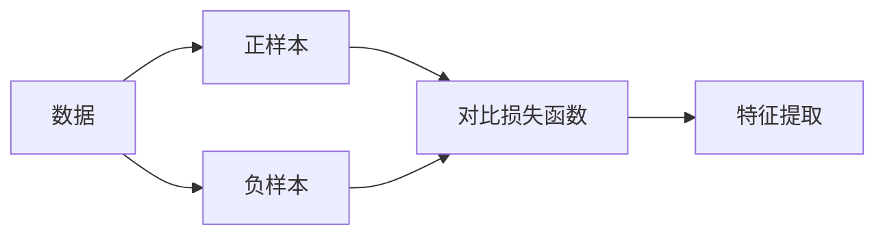
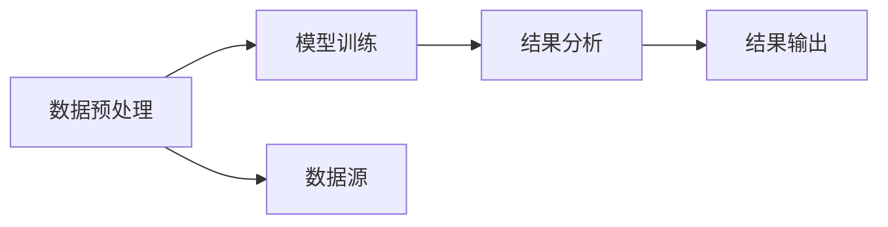

                 


```markdown
# 企业AI Agent的自监督学习在非标准数据利用中的突破性实践

> 关键词：企业AI Agent，自监督学习，非标准数据，对比学习，生成对抗网络

> 摘要：本文系统阐述了自监督学习在企业AI Agent中的应用，特别是在处理非标准数据方面的突破性实践。通过对比学习和生成对抗网络等技术，探索了非结构化数据的高效利用方法，为企业AI Agent的开发提供了理论支持和实践指导。

---

## 第一部分: 企业AI Agent的自监督学习背景与概述

### 第1章: 问题背景与描述

#### 1.1 问题背景
企业AI Agent在处理非标准数据时面临巨大挑战。传统监督学习依赖大量标注数据，而企业环境中数据往往结构混乱、格式多样，难以满足监督学习的需求。此外，标注成本高昂，且难以保证数据质量。

#### 1.2 问题描述
非标准数据具有以下特点：
- **格式多样性**：数据可能以文本、图像、音频等多种形式存在。
- **结构不规则**：数据缺乏统一的结构化规范。
- **噪声干扰**：数据中可能存在大量干扰信息。

传统监督学习在面对这些数据时显得力不从心，主要体现在：
- **标注成本高**：需要大量人工标注。
- **适用性差**：难以处理多种数据格式。
- **泛化能力弱**：模型难以适应不同数据结构。

#### 1.3 问题解决与边界
自监督学习通过利用未标注数据中的内在结构信息，无需人工标注，从而解决了上述问题。其核心目标是通过对比学习或生成对抗网络等方式，提取数据特征并进行分类或预测。

### 第2章: 核心概念与联系

#### 2.1 自监督学习的核心概念
自监督学习通过对比学习和生成对抗网络等方法，利用数据本身的结构信息进行特征提取。对比学习通过正样本和负样本对比，学习数据的表征；生成对抗网络通过生成器和判别器的博弈，生成高质量数据。

#### 2.2 核心概念对比
| 对比项 | 对比学习 | 生成对抗网络 |
|-------|----------|--------------|
| 核心思想 | 利用数据间的对比关系 | 生成器与判别器的对抗训练 |
| 优势 | 数据利用率高，特征提取能力强 | 数据生成能力强，可以丰富数据集 |
| 适用场景 | 数据量大但标注困难 | 数据生成与增强 |



---

## 第二部分: 算法原理与数学模型

### 第3章: 对比学习算法

#### 3.1 对比学习的数学模型
对比学习的目标是通过最大化正样本对的相似性，同时最小化负样本对的相似性。其损失函数如下：

$$ L = -\sum_{i=1}^{N}\left[\log\left(\frac{e^{s_i}}{\sum_{j \neq i} e^{s_j}}\right)\right] $$

其中，$s_i$ 表示第i对样本的相似度分数。

#### 3.2 实际案例
以图像分类为例，对比学习可以通过增强技术（如随机裁剪、旋转等）生成正样本对和负样本对，从而学习到更鲁棒的图像特征。

---

## 第三部分: 系统分析与架构设计

### 第4章: 系统架构设计

#### 4.1 系统功能设计
系统功能模块包括：
- 数据预处理模块：处理非标准数据，提取特征。
- 模型训练模块：利用对比学习或生成对抗网络进行训练。
- 结果分析模块：对模型输出进行分析和解释。

#### 4.2 系统架构图


---

## 第四部分: 项目实战

### 第5章: 项目实战

#### 5.1 环境安装
安装Python、TensorFlow、Keras等工具。

#### 5.2 核心代码实现
```python
# 数据预处理代码
import tensorflow as tf
import numpy as np

def preprocess_data(data):
    # 数据增强代码
    def augment_image(image):
        image = tf.image.random_crop(image, size=(224, 224, 3))
        image = tf.image.random_flip_left_right(image)
        return image
    # 数据分割
    train_dataset = ...  # 训练数据
    test_dataset = ...    # 测试数据
    train_dataset = train_dataset.map(lambda x: (augment_image(x['image']), x['label']))
    test_dataset = test_dataset.map(lambda x: (augment_image(x['image']), x['label']))
```

#### 5.3 实际案例分析
通过对比学习模型，对企业数据进行特征提取，提升分类准确率。

---

## 第五部分: 最佳实践与总结

### 第6章: 最佳实践与总结

#### 6.1 经验总结
- 数据预处理是关键，需仔细处理数据噪声。
- 模型调参需结合实际场景，避免过拟合。

#### 6.2 未来展望
结合大语言模型（如GPT）的生成能力，进一步提升数据处理能力。

#### 6.3 注意事项
- 数据质量直接影响模型性能。
- 模型选择需结合具体场景。
- 模型部署需考虑计算资源和实时性。

#### 6.4 拓展阅读
- 建议阅读《Deep Learning》和《Generative Adversarial Nets》。

---

# 结语

企业AI Agent的自监督学习在非标准数据利用中具有重要价值。通过对比学习和生成对抗网络等技术，可以有效处理结构混乱的数据，为企业智能化转型提供技术支持。
```

