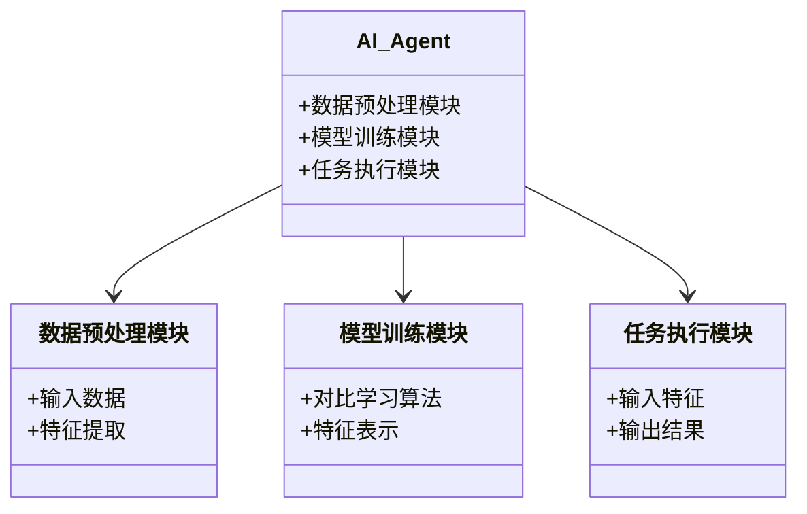

                 


# 企业AI Agent的自监督学习在非结构化数据挖掘中的实践

> 关键词：AI Agent，自监督学习，非结构化数据，数据挖掘，机器学习

> 摘要：本文探讨了企业AI Agent在非结构化数据挖掘中的应用，重点分析了自监督学习技术在其中的核心作用。通过系统性地介绍自监督学习的原理、算法实现、系统架构设计以及实际案例分析，本文为读者提供了从理论到实践的全面指导，帮助企业在复杂的非结构化数据环境中实现高效的数据挖掘与分析。

---

## 第一部分: 企业AI Agent的自监督学习概述

### 第1章: 问题背景与核心概念

#### 1.1 问题背景
在企业信息化建设中，非结构化数据的处理是一个长期存在的挑战。企业每天都会产生大量的非结构化数据，包括文本、图像、音频、视频等。这些数据通常缺乏明确的结构和标签，难以直接用于传统的机器学习模型。与此同时，企业AI Agent的需求日益增长，它需要能够理解、分析和处理这些非结构化数据，以支持决策、优化流程和提升用户体验。

#### 1.2 核心概念与定义
- **AI Agent（人工智能代理）**：AI Agent是一种智能实体，能够感知环境、自主决策并执行任务。它通常具备学习、推理和自适应能力。
- **自监督学习**：自监督学习是一种无监督学习的变体，通过利用数据本身的结构信息，设计一种“自我监督”的任务来指导模型学习有用的特征表示。
- **非结构化数据**：非结构化数据是指没有固定结构、难以用传统数据库模型表示的数据类型，如文本、图像、音频等。

#### 1.3 问题描述与解决思路
非结构化数据的挖掘难点在于其缺乏明确的标签和结构，导致传统的监督学习方法难以直接应用。自监督学习通过引入对比学习、知识蒸馏等技术，能够在无标签或弱标签的情况下，挖掘数据中的潜在结构和关系，从而为AI Agent提供高质量的特征表示。

---

## 第二部分: 自监督学习的核心原理与算法

### 第2章: 自监督学习的原理与机制

#### 2.1 自监督学习的原理
自监督学习的核心思想是通过构造“伪标签”或“对比任务”，利用数据本身的特性来监督模型学习。例如，在文本挖掘中，可以通过词嵌入技术（如Word2Vec）生成单词的上下文关系，作为模型的监督信号。

#### 2.2 自监督学习的核心算法
- **对比学习**：通过将同一数据的两种不同表示（如原始和扰动后的表示）进行对比，学习数据的相似性。
- **知识蒸馏**：通过教师模型指导学生模型，将知识迁移到学生模型中。

#### 2.3 算法的数学模型与公式
对比学习的目标函数可以表示为：
$$ L = -\frac{1}{N}\sum_{i=1}^{N}\log\left(\frac{\exp(s_i)}{\sum_{j=1}^{N}\exp(s_j)}}\right) $$
其中，$s_i$是第i对样本的相似度得分。

#### 2.4 算法实现代码示例
```python
import torch

def contrastive_loss(x1, x2, temperature=0.1):
    # 计算相似度
    similarity = (x1 @ x2.T) / temperature
    # 计算损失
    loss = -torch.mean(torch.log(torch.exp(similarity) / (torch.exp(similarity).sum(dim=1).unsqueeze(1))))
    return loss
```

---

## 第三部分: AI Agent的系统架构与实现

### 第3章: 系统架构设计

#### 3.1 系统功能设计
- **数据预处理**：包括清洗、分词、特征提取等。
- **模型训练**：利用自监督学习算法训练模型，提取非结构化数据的特征表示。
- **任务执行**：AI Agent根据训练好的模型，执行具体的任务，如问答、推荐等。

#### 3.2 系统架构设计（Mermaid图）


---

通过以上内容，读者可以系统地理解企业AI Agent的自监督学习在非结构化数据挖掘中的应用。从理论到实践，本文为技术从业者提供了丰富的指导和参考。

