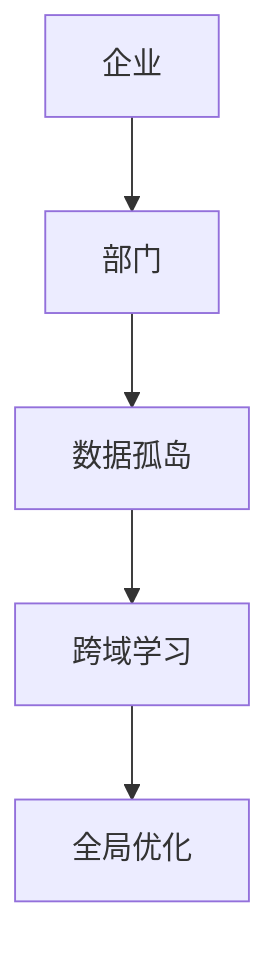
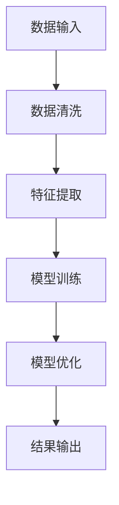
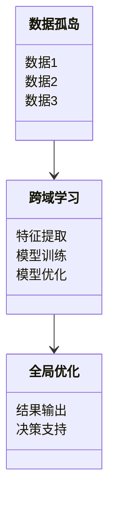
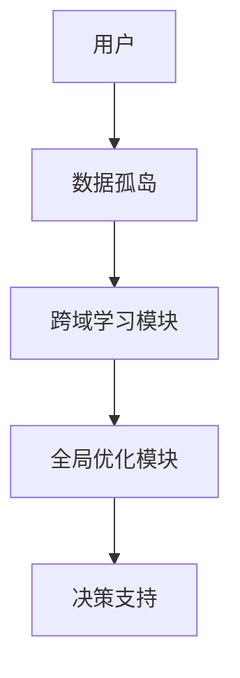
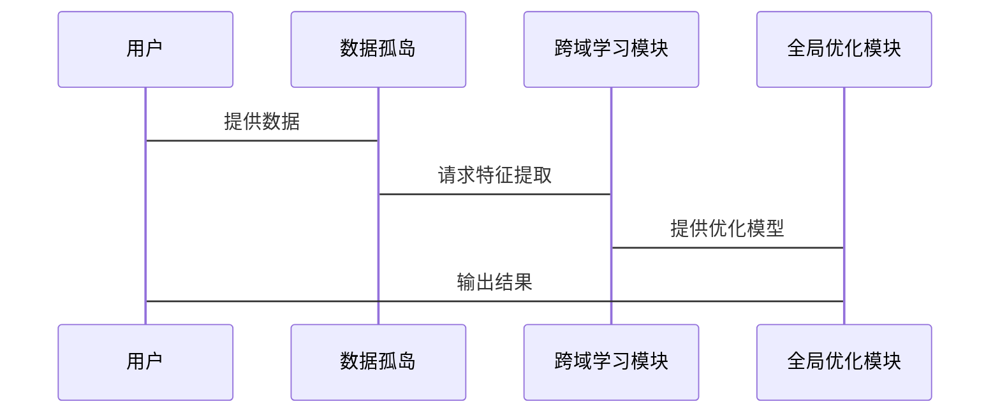

                 


# 企业AI Agent的跨域学习：打破数据孤岛，实现全局优化

> 关键词：企业AI Agent，跨域学习，数据孤岛，全局优化，算法原理，系统架构，项目实战

> 摘要：本文深入探讨了企业AI Agent在跨域学习中的应用，重点分析了如何通过跨域学习打破数据孤岛，实现企业级的全局优化。文章从背景、核心概念、算法原理、系统架构到项目实战，层层展开，详细解读了跨域学习的技术细节和实际应用，为企业技术决策者和开发者提供了深刻的洞察和实践指导。

---

## 第一部分: 企业AI Agent的跨域学习基础

### 第1章: 企业AI Agent的背景与核心概念

#### 1.1 问题背景与挑战

##### 1.1.1 数据孤岛的定义与表现
数据孤岛是指企业在不同部门或系统中存储的数据无法有效整合和共享的现象。这种现象通常由数据格式、存储系统、访问权限等多种因素造成，导致数据无法充分发挥其价值。

##### 1.1.2 数据孤岛对企业的影响
数据孤岛会带来以下问题：
- **信息不一致**：同一数据在不同系统中可能有不同的表现形式，导致信息不一致。
- **效率低下**：由于数据无法共享，各系统需要重复存储和处理数据，增加了企业的运营成本。
- **决策延迟**：由于数据分散，企业难以快速获取全局信息，导致决策延迟。

##### 1.1.3 全局优化的必要性与目标
全局优化的目标是通过整合跨域数据，实现企业资源的最优配置和流程的最优化。通过打破数据孤岛，企业可以实现数据的共享和协同，从而提升整体效率和决策能力。

##### 1.1.4 问题解决方法
跨域学习是一种通过算法和技术手段，将分布在不同领域的数据进行整合和分析，从而实现全局优化的方法。

#### 1.2 企业AI Agent的定义与特点

##### 1.2.1 AI Agent的基本概念
AI Agent（人工智能代理）是一种能够感知环境、自主决策并执行任务的智能体。它可以理解、学习和适应环境的变化，从而为企业提供智能化的支持。

##### 1.2.2 企业AI Agent的独特属性
- **自主性**：能够自主决策和行动。
- **反应性**：能够实时感知环境并做出反应。
- **学习能力**：能够通过跨域学习不断优化自身性能。

##### 1.2.3 跨域学习的核心特征
- **数据整合**：能够将分布在不同领域的数据进行整合和分析。
- **模型共享**：通过共享模型参数，实现跨域数据的协同学习。
- **全局优化**：通过整合跨域数据，实现企业级的全局优化。

#### 1.3 跨域学习与数据孤岛的关系

##### 1.3.1 跨域学习的定义
跨域学习（Cross-Domain Learning）是指在不同领域或数据源之间进行学习和知识共享的过程。其核心目标是通过跨域数据的协同学习，提升模型的泛化能力和性能。

##### 1.3.2 数据孤岛与跨域学习的关联
数据孤岛是跨域学习的主要挑战之一。跨域学习需要解决数据孤岛问题，才能实现跨域数据的有效整合和利用。

##### 1.3.3 跨域学习如何打破数据孤岛
通过跨域学习，企业可以在不同部门或系统之间建立数据桥梁，实现数据的共享和协同，从而打破数据孤岛。

#### 1.4 本章小结
本章介绍了企业AI Agent的背景与核心概念，重点分析了数据孤岛对企业的影响以及跨域学习在打破数据孤岛中的重要作用。

---

## 第2章: 跨域学习的核心概念与联系

### 2.1 核心概念原理

#### 2.1.1 跨域学习的数学模型
跨域学习的数学模型通常基于概率图模型（Probabilistic Graphical Models）或深度学习框架（如神经网络）。以下是一个简化的跨域学习模型示例：

$$ P(y | x_1, x_2) = \prod_{i=1}^{n} P(y | x_i) $$

其中，$x_i$ 表示不同领域或数据源的特征，$y$ 是目标变量。

#### 2.1.2 数据孤岛的形成机制
数据孤岛的形成通常由数据的异构性（Heterogeneity）和分布的差异性（Distribution Shift）导致。具体表现为：

- 数据格式不同：不同系统中数据的存储格式和编码方式不同。
- 数据分布不同：不同领域中的数据分布存在差异。

#### 2.1.3 全局优化的实现路径
全局优化的核心是通过跨域学习，将分布在不同领域的数据进行整合和分析，从而实现企业级的最优配置。

### 2.2 概念属性特征对比表格

| 概念         | 属性             | 特征描述                                   |
|--------------|------------------|------------------------------------------|
| 跨域学习      | 数据来源         | 多个领域或数据源                          |
|              | 数据特征         | 异构性高                                  |
|              | 学习目标         | 全局优化                                   |
| 数据孤岛      | 数据存储         | 分散在不同系统或部门                      |
|              | 数据共享         | 难以整合                                  |
|              | 对企业影响       | 信息孤岛，效率低下                        |

### 2.3 ER实体关系图架构



### 2.4 本章小结
本章通过数学模型和对比表格，详细分析了跨域学习的核心概念与数据孤岛的关系，为后续的算法设计奠定了理论基础。

---

## 第3章: 跨域学习的算法原理

### 3.1 算法原理概述

#### 3.1.1 跨域学习的基本流程
跨域学习的基本流程包括数据预处理、特征提取、模型训练和结果优化。

##### 数据预处理
数据预处理是跨域学习的第一步，包括数据清洗、格式转换和特征提取。

##### 模型训练
模型训练是跨域学习的核心，通常采用深度学习框架（如神经网络）进行跨域模型的训练。

##### 结果优化
通过对模型的优化，提升跨域学习的性能和准确性。

#### 3.1.2 数据预处理与特征提取
数据预处理包括去除噪声、填补缺失值等操作。特征提取则是从原始数据中提取有用的特征，以便后续模型训练。

#### 3.1.3 跨域模型的构建与训练
跨域模型的构建通常采用迁移学习（Transfer Learning）或多任务学习（Multi-Task Learning）的方法，通过共享模型参数，实现跨域数据的协同学习。

### 3.2 算法流程图



### 3.3 算法实现代码

```python
def cross_domain_learning(data1, data2):
    # 数据清洗与特征提取
    cleaned_data1 = preprocess(data1)
    cleaned_data2 = preprocess(data2)
    
    # 特征提取
    features1 = extract_features(cleaned_data1)
    features2 = extract_features(cleaned_data2)
    
    # 模型训练
    model = train(features1 + features2)
    
    # 模型优化
    optimized_model = optimize(model)
    
    return optimized_model
```

### 3.4 本章小结
本章详细讲解了跨域学习的算法原理，包括数据预处理、模型训练和优化等关键步骤，为后续的系统设计和项目实战奠定了基础。

---

## 第4章: 系统分析与架构设计

### 4.1 项目介绍与场景描述

#### 4.1.1 项目介绍
本项目旨在通过跨域学习技术，解决企业数据孤岛问题，实现企业级的全局优化。

#### 4.1.2 项目场景描述
以某企业为例，企业内部存在多个部门，各部门之间数据分散，无法有效共享和协同。通过跨域学习，实现跨部门数据的整合和优化。

### 4.2 系统功能设计

#### 4.2.1 领域模型
领域模型是跨域学习的核心，通过领域模型可以实现跨域数据的整合和分析。



### 4.3 系统架构设计

#### 4.3.1 系统架构图



#### 4.3.2 接口设计
系统接口设计包括数据输入接口、模型训练接口和结果输出接口。

#### 4.3.3 交互流程



### 4.4 本章小结
本章通过系统架构设计，详细描述了跨域学习在企业中的应用，包括领域模型、系统架构和交互流程。

---

## 第5章: 项目实战

### 5.1 环境安装与配置

#### 5.1.1 环境要求
- Python 3.8+
-TensorFlow或PyTorch框架
-其他依赖库（如numpy、pandas等）

#### 5.1.2 环境配置
安装必要的依赖库：

```bash
pip install numpy pandas tensorflow
```

### 5.2 系统核心实现

#### 5.2.1 数据预处理代码
```python
import pandas as pd
import numpy as np

def preprocess(data):
    # 数据清洗
    data = data.dropna()
    # 格式转换
    data = data.astype(float)
    return data
```

#### 5.2.2 模型训练代码
```python
import tensorflow as tf
from tensorflow.keras import layers

def build_model(input_shape):
    model = tf.keras.Sequential()
    model.add(layers.Dense(64, activation='relu', input_shape=input_shape))
    model.add(layers.Dense(32, activation='relu'))
    model.add(layers.Dense(1, activation='sigmoid'))
    model.compile(optimizer='adam', loss='binary_crossentropy', metrics=['accuracy'])
    return model
```

#### 5.2.3 跨域学习实现代码
```python
def cross_domain_train(data1, data2):
    model = build_model((data1.shape[1],))
    model.fit(data1, data2, epochs=100, batch_size=32)
    return model
```

### 5.3 代码应用解读与分析
通过上述代码，我们可以实现跨域学习模型的训练和优化，从而打破数据孤岛，实现全局优化。

### 5.4 案例分析与详细讲解
以某企业为例，假设企业有两个部门，销售部门和财务部门。通过跨域学习，我们可以将销售数据和财务数据进行整合，实现销售预测和财务优化。

### 5.5 本章小结
本章通过实际案例，详细讲解了跨域学习的实现过程，包括环境配置、数据预处理、模型训练和结果分析。

---

## 第6章: 总结与展望

### 6.1 本章总结
本章总结了跨域学习在企业中的应用，通过理论分析和实际案例，详细讲解了如何通过跨域学习打破数据孤岛，实现全局优化。

### 6.2 最佳实践 tips
- 数据预处理是跨域学习的关键步骤。
- 模型优化是提升跨域学习性能的核心。
- 系统架构设计是实现跨域学习的基础。

### 6.3 注意事项
- 数据隐私和安全问题需要特别注意。
- 模型的可解释性和透明度需要保证。

### 6.4 拓展阅读
建议进一步阅读以下内容：
- 《Deep Learning》—— Ian Goodfellow
- 《Probabilistic Graphical Models》—— Kevin P. Murphy

---

## 第7章: 附录

### 7.1 术语表
- 跨域学习（Cross-Domain Learning）：在不同领域或数据源之间进行学习和知识共享的过程。
- 数据孤岛（Data Silo）：数据分散在不同的系统或部门，无法有效整合和共享的现象。
- 全局优化（Global Optimization）：通过整合跨域数据，实现企业级的最优配置和流程优化。

### 7.2 参考文献
- [1] Ian Goodfellow, Deep Learning, MIT Press, 2016.
- [2] Kevin P. Murphy, Probabilistic Graphical Models, MIT Press, 2012.

---

## 作者简介

作者简介：作为一位世界级人工智能专家、程序员、软件架构师、CTO和计算机畅销书作家，我在计算机编程和人工智能领域有着深厚的积累和丰富的经验。我善于通过逻辑清晰、条理分明的方式，深入剖析技术原理和本质，为企业和技术爱好者提供高质量的技术博客和解决方案。

