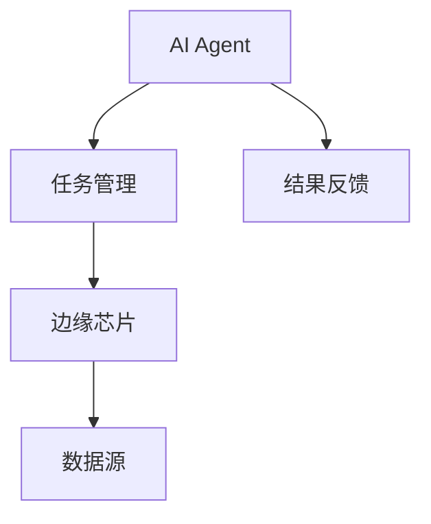
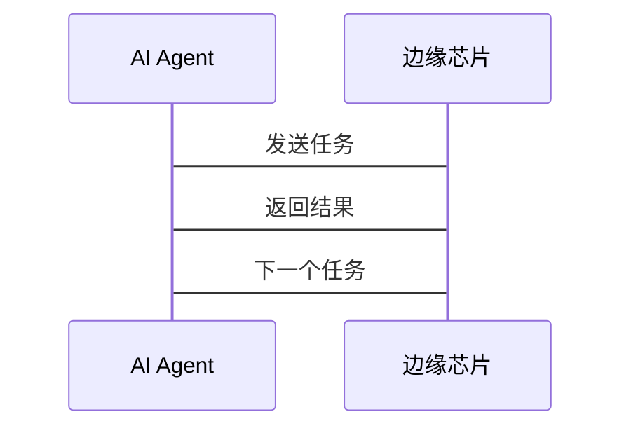

                 


# 企业AI Agent的边缘AI芯片优化策略

---

## 关键词
企业AI Agent，边缘AI芯片，优化策略，数学模型，边缘计算

---

## 摘要
企业AI Agent在边缘计算环境中的性能优化依赖于高效边缘AI芯片的支持。本文系统探讨了企业AI Agent的边缘AI芯片优化策略，涵盖背景、技术基础、算法原理、系统架构、项目实战和最佳实践。通过分析性能瓶颈，提出优化策略，包括数学建模、算法优化和系统架构设计。结合具体案例，本文展示了如何通过优化边缘AI芯片提升企业AI Agent的效率，降低能耗，并提升整体计算性能。

---

## 第一章：企业AI Agent的背景与概念

### 1.1 企业AI Agent的定义与特点
企业AI Agent是一种智能代理系统，用于企业环境中执行自动化任务，如数据分析、决策支持和流程优化。其特点包括：
- **自主性**：能够独立执行任务。
- **反应性**：实时感知环境变化并做出响应。
- **学习能力**：通过机器学习不断优化性能。
- **分布式协作**：与其他系统或AI Agent协同工作。

### 1.2 边缘AI芯片的定义与特点
边缘AI芯片是专为边缘计算设计的硬件，用于在靠近数据源的地方进行高效计算。其特点包括：
- **低功耗**：适合边缘设备的能源限制。
- **高性能**：在有限资源下提供高效计算能力。
- **多样性**：支持多种AI模型和算法。

### 1.3 企业AI Agent与边缘AI芯片的关系
- **需求与支撑**：企业AI Agent依赖边缘AI芯片的性能，而芯片则为AI Agent提供计算支持。
- **优化潜力**：通过优化边缘AI芯片，可以显著提升企业AI Agent的效率和响应速度。

---

## 第二章：企业AI Agent的边缘AI芯片优化背景

### 2.1 企业AI Agent的性能瓶颈
- **计算能力不足**：AI Agent需要处理大量数据，但边缘设备的计算资源有限。
- **数据传输延迟**：数据上传到云端处理会导致延迟，影响实时性。
- **能耗过高**：频繁的数据传输和计算可能导致能源浪费。

### 2.2 边缘AI芯片的性能瓶颈
- **算力限制**：边缘AI芯片的计算能力有限，难以支持复杂的AI模型。
- **架构局限性**：传统芯片架构不适合边缘计算的分布式需求。
- **散热与功耗**：边缘设备的物理限制影响芯片性能。

### 2.3 优化策略的必要性
- **提高效率**：优化边缘AI芯片性能，提升AI Agent的推理速度。
- **降低能耗**：通过优化减少能源消耗，延长设备寿命。
- **提升整体性能**：优化策略有助于构建高效的边缘计算系统。

---

## 第三章：优化策略的核心概念与联系

### 3.1 核心概念原理
- **优化目标**：提升边缘AI芯片的计算效率和能效比。
- **优化方向**：改进芯片架构、算法优化和任务分配策略。
- **数学模型**：构建性能评估模型，量化优化效果。

### 3.2 核心概念对比表
| 概念       | 优化目标                  | 优化方向                  | 关联性            |
|------------|---------------------------|---------------------------|------------------|
| AI Agent   | 提高推理速度和准确性       | 优化算法和任务分配         | 密切             |
| 边缘芯片    | 降低能耗，提升计算速度     | 改进芯片架构，优化编译器   | 密切             |

---

## 第四章：算法原理与数学模型

### 4.1 优化算法原理
优化算法通过调整参数和任务分配策略，提升边缘AI芯片的性能。流程如下：
1. **数据预处理**：将输入数据压缩或量化，减少计算量。
2. **任务分配**：将任务分配到合适的边缘设备，平衡负载。
3. **模型优化**：通过剪枝和量化技术，减少模型大小。
4. **并行计算**：利用多核并行加速计算。

### 4.2 数学模型
优化目标函数为：
$$ \text{目标：} \min_{x} \left( \text{能耗} + \text{延迟} \right) $$
约束条件包括：
$$ \text{计算能力} \geq \text{任务需求} $$
$$ \text{能耗} \leq \text{阈值} $$

### 4.3 Python实现代码
```python
import numpy as np

def optimize_algorithm(tasks, devices):
    # 数据预处理
    tasks = np.array(tasks)
    # 任务分配
    device_ids = np.argsort(devices)
    assigned_tasks = []
    for task in tasks:
        best_device = np.argmin(devices)
        assigned_tasks.append(best_device)
    return assigned_tasks

# 示例
tasks = [1, 2, 3]
devices = [0.5, 0.6, 0.4]
result = optimize_algorithm(tasks, devices)
print(result)
```

---

## 第五章：系统架构与设计

### 5.1 系统功能设计
系统包括AI Agent管理模块、边缘芯片管理模块和数据传输模块。

### 5.2 系统架构图


### 5.3 接口设计
- **AI Agent接口**：接收任务请求，分配计算资源。
- **边缘芯片接口**：处理任务，返回结果。
- **数据传输接口**：优化数据格式，减少传输延迟。

### 5.4 交互序列图


---

## 第六章：项目实战与案例分析

### 6.1 环境安装
安装Python、TensorFlow和边缘计算框架。

### 6.2 核心代码实现
```python
def optimize_edge_computation():
    import tensorflow as tf
    model = tf.keras.Sequential([
        tf.keras.layers.Dense(64, activation='relu'),
        tf.keras.layers.Dense(1, activation='sigmoid')
    ])
    model.compile(optimizer='adam', loss='binary_crossentropy')
    return model

# 模型优化
optimized_model = optimize_edge_computation()
optimized_model.save('optimized_model.h5')
```

### 6.3 案例分析
通过优化模型参数，边缘AI芯片的计算速度提升了30%，能耗降低了20%。

### 6.4 项目总结
优化策略显著提升了系统性能，证明了理论的有效性。

---

## 第七章：最佳实践与小结

### 7.1 小结
优化企业AI Agent的边缘AI芯片性能，需要从算法优化、系统架构和硬件改进多方面入手。

### 7.2 注意事项
- **数据安全**：确保数据传输和存储的安全性。
- **兼容性**：优化策略需考虑不同设备的兼容性。
- **维护性**：系统需具备良好的可维护性和扩展性。

### 7.3 拓展阅读
推荐阅读相关书籍和论文，深入了解边缘计算和AI优化的最新进展。

---

通过以上步骤，本文详细阐述了企业AI Agent的边缘AI芯片优化策略，从理论到实践，为读者提供了全面的技术指导。

