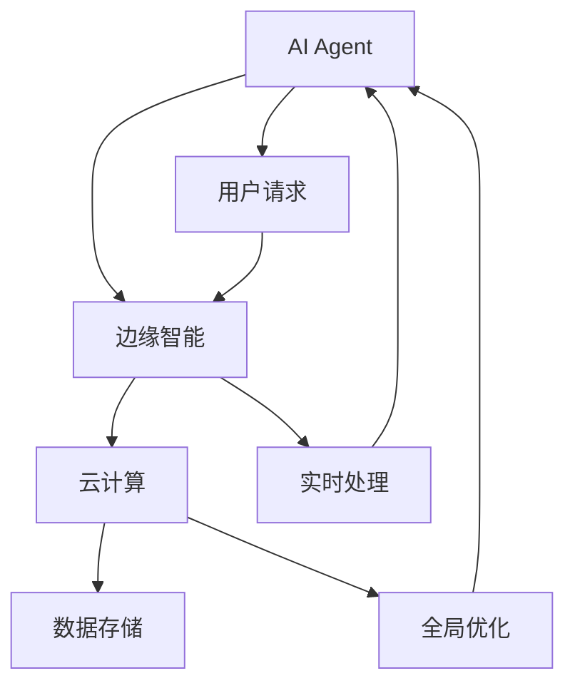
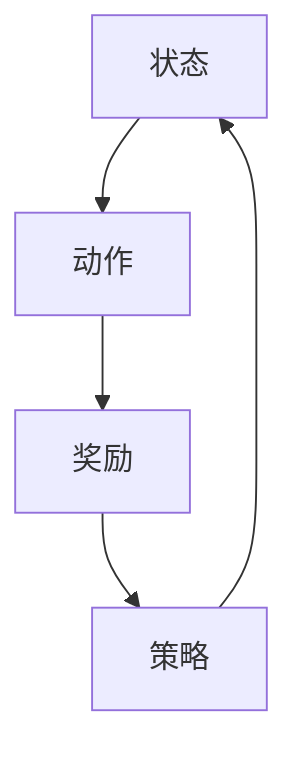
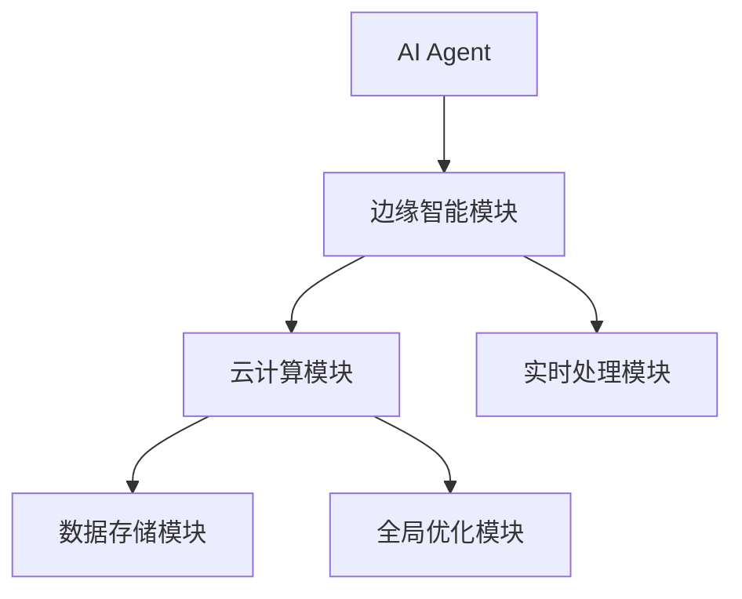
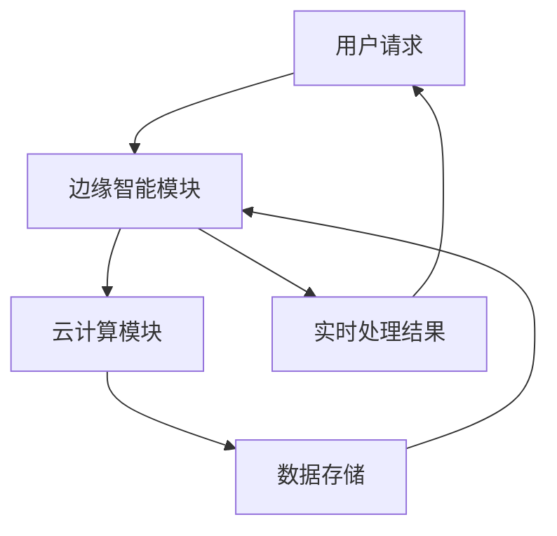
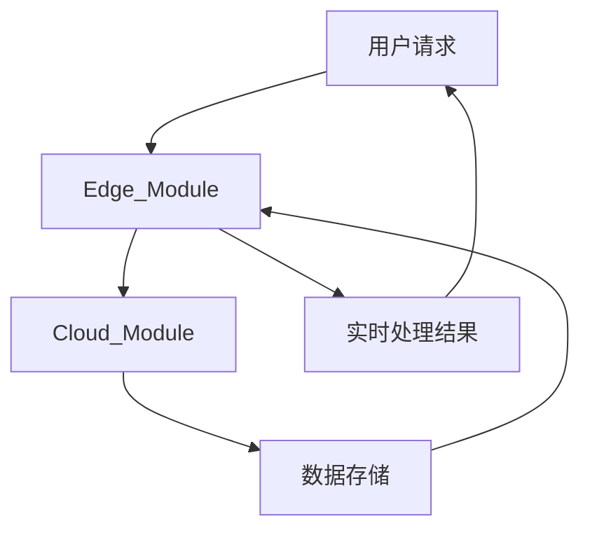

                 


# 企业AI Agent的边缘智能与云智能协同策略

## 关键词：
企业AI Agent，边缘智能，云智能，协同策略，算法设计，系统架构

## 摘要：
随着企业智能化转型的深入推进，AI Agent作为智能化决策和执行的核心载体，正在成为企业数字化转型的重要技术手段。本文深入探讨了企业AI Agent在边缘智能与云智能协同方面的策略，从核心概念、算法原理、系统架构到项目实战，全面解析了如何在企业环境中实现高效协同，以提升企业的智能化水平和竞争力。

---

## 第一部分：企业AI Agent的背景与概念

### 1.1 问题背景与挑战

#### 1.1.1 企业智能化转型的现状与痛点
企业智能化转型正在从“信息化”向“智能化”迈进，传统的集中式计算模式难以满足实时性、低延迟和高效率的需求。边缘智能与云智能的协同成为解决这一问题的关键。

#### 1.1.2 AI Agent在企业中的应用价值
AI Agent能够实时感知环境、自主决策并执行任务，广泛应用于智能制造、供应链管理、客户服务等领域，显著提升企业的运营效率和决策能力。

#### 1.1.3 边缘计算与云计算的融合趋势
边缘计算的优势在于实时性与低延迟，而云计算则提供了强大的计算能力和数据存储能力。两者的协同能够充分发挥各自的优势，为企业提供更高效的解决方案。

### 1.2 核心概念与结构

#### 1.2.1 AI Agent的定义与组成
AI Agent是一种具有感知环境、自主决策和执行任务能力的智能体，通常由感知模块、决策模块和执行模块组成。

#### 1.2.2 边缘智能与云智能的协同机制
通过边缘计算和云计算的协同，AI Agent能够实现数据的实时处理与全局优化，提升系统的响应速度和决策精度。

#### 1.2.3 系统架构图（Mermaid）


---

## 第二部分：边缘智能与云智能的核心原理

### 2.1 边缘智能的基本原理

#### 2.1.1 边缘计算的定义与特点
边缘计算是在靠近数据源的地方进行计算和存储，具有低延迟、高实时性、本地化决策等优势。

#### 2.1.2 边缘智能的实现机制
边缘智能通过本地数据处理和边缘服务器的协同，实现快速响应和高效决策。

#### 2.1.3 边缘智能与中心云智能的关系
边缘智能与中心云智能通过数据通信和任务协同，实现资源优化和能力互补。

### 2.2 云智能的基本原理

#### 2.2.1 云计算的定义与特点
云计算通过网络提供按需计算、存储和应用服务，具有弹性扩展、资源池化、按需付费等特点。

#### 2.2.2 云智能的核心算法与模型
云智能依赖于机器学习、深度学习等算法，在云端进行数据训练和模型优化，提供强大的数据处理能力。

#### 2.2.3 云智能与边缘智能的协同关系
边缘智能负责实时数据处理，云智能负责全局优化和模型训练，两者协同实现高效决策。

---

## 第三部分：边缘智能与云智能的协同策略

### 3.1 协同机制的设计原理

#### 3.1.1 数据流与计算流的协同
数据从边缘设备流向云端，计算任务在边缘和云端之间动态分配，实现资源的最优利用。

#### 3.1.2 任务分配与资源调度
根据任务的实时性需求和资源可用性，动态分配计算任务，优化系统性能。

#### 3.1.3 边缘与云的通信协议
通过标准化的通信协议，确保边缘与云端的数据高效交互和协同处理。

### 3.2 协同策略的实现方法

#### 3.2.1 基于联邦学习的协同策略
通过联邦学习，边缘设备能够在不共享原始数据的情况下，协同训练全局模型。

#### 3.2.2 基于边缘计算的分布式协同
在边缘节点上部署分布式计算任务，实现局部优化与全局协同。

#### 3.2.3 基于云计算的集中式协同
通过云端的集中式协调，实现全局任务调度和资源优化。

---

## 第四部分：企业AI Agent的算法与模型

### 4.1 算法原理

#### 4.1.1 基于强化学习的AI Agent设计
使用强化学习算法，AI Agent通过与环境的交互，逐步优化决策策略。

#### 4.1.2 基于图神经网络的协同策略
图神经网络能够有效处理复杂的关系网络，提升边缘与云端协同的效率。

#### 4.1.3 算法的数学模型与公式（Mermaid流程图）


#### 4.1.4 代码实现
```python
import numpy as np
from collections import deque

class AI_Agent:
    def __init__(self, state_space, action_space):
        self.state_space = state_space
        self.action_space = action_space
        self.memory = deque(maxlen=1000)
        self.gamma = 0.99

    def act(self, state):
        # 简单的决策策略
        if np.random.random() < 0.5:
            return self.action_space.sample()
        return np.argmax(state)

    def remember(self, state, action, reward, next_state):
        self.memory.append((state, action, reward, next_state))

    def replay(self, batch_size):
        # 简单的回放策略
        if len(self.memory) < batch_size:
            return
        minibatch = random.sample(self.memory, batch_size)
        # 训练模型
```

### 4.2 模型实现

#### 4.2.1 模型训练与优化
通过分布式训练和参数同步，优化模型的准确性和效率。

#### 4.2.2 模型部署与推理
将训练好的模型部署到边缘设备，实现实时推理和决策。

#### 4.2.3 模型的可扩展性与可解释性
设计模块化架构，提升模型的可扩展性和可解释性，便于后续优化和调整。

---

## 第五部分：系统架构与设计方案

### 5.1 系统架构设计

#### 5.1.1 系统功能模块划分
系统主要包含边缘计算模块、云计算模块、数据通信模块和任务调度模块。

#### 5.1.2 系统架构图（Mermaid）


#### 5.1.3 系统接口设计
定义标准接口，确保边缘与云端的数据交互和任务协同。

### 5.2 系统实现方案

#### 5.2.1 系统功能实现流程
从数据采集、预处理到模型训练，再到任务分配和执行，详细描述系统的实现流程。

#### 5.2.2 系统交互图（Mermaid）


#### 5.2.3 系统性能优化
通过负载均衡、缓存优化等技术，提升系统的整体性能。

---

## 第六部分：项目实战与案例分析

### 6.1 项目环境与工具安装

#### 6.1.1 开发环境搭建
安装必要的开发工具和依赖库，如Python、TensorFlow、Flask等。

#### 6.1.2 工具链与依赖管理
使用虚拟环境管理依赖，确保项目的可重复性和一致性。

#### 6.1.3 代码仓库与版本控制
使用Git进行代码管理，确保代码的安全性和可追溯性。

### 6.2 核心代码实现

#### 6.2.1 边缘智能模块实现
```python
class Edge_Module:
    def __init__(self, device_id):
        self.device_id = device_id
        self.data_buffer = []

    def process_data(self, data):
        # 处理数据并返回结果
        return data * 2
```

#### 6.2.2 云计算模块实现
```python
class Cloud_Module:
    def __init__(self):
        self.models = {}

    def train_model(self, data):
        # 训练模型并返回
        return model
```

#### 6.2.3 系统交互流程


### 6.3 案例分析与总结

#### 6.3.1 案例分析
通过具体案例，分析系统在实际应用中的表现和优化效果。

#### 6.3.2 项目小结
总结项目中的关键点和经验教训，为后续优化提供参考。

---

## 第七部分：总结与展望

### 7.1 总结
企业AI Agent的边缘智能与云智能协同策略为企业智能化转型提供了新的思路和技术手段，通过合理的协同设计和优化，能够显著提升企业的智能化水平。

### 7.2 展望
未来，随着技术的不断发展，AI Agent将在更多领域发挥重要作用，边缘智能与云智能的协同也将更加智能化和高效化。

### 7.3 最佳实践Tips
- 确保数据安全和隐私保护
- 优化系统架构，提升性能
- 定期更新模型和算法

---

感谢您的阅读！如果需要进一步的技术支持或详细解读，请随时联系！

