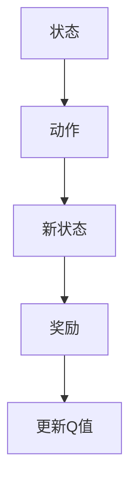
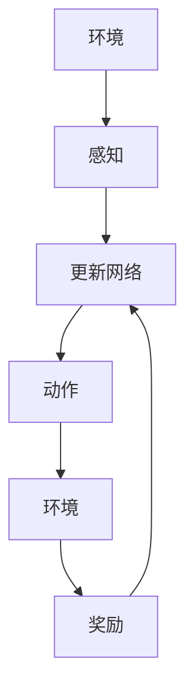
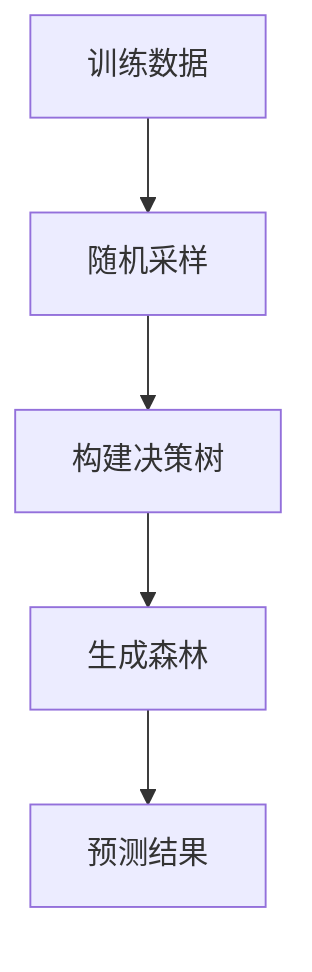

                 


# 企业AI Agent的边缘智能部署策略

> 关键词：企业AI Agent、边缘智能、部署策略、算法原理、系统架构、项目实战

> 摘要：本文详细探讨了企业AI Agent在边缘智能环境下的部署策略，从核心概念到算法原理，再到系统架构和项目实战，全面分析了如何在企业环境中高效部署和应用AI Agent。文章结合理论与实践，提供了丰富的技术细节和实用案例，帮助读者深入了解企业AI Agent的边缘智能部署策略。

---

# 第1章: 企业AI Agent与边缘智能概述

## 1.1 企业AI Agent的基本概念

### 1.1.1 AI Agent的定义与特点

AI Agent（人工智能代理）是指能够感知环境、自主决策并执行任务的智能实体。它具备以下特点：

1. **自主性**：能够自主决策，无需人工干预。
2. **反应性**：能够实时感知环境并做出反应。
3. **目标导向**：具备明确的目标，能够为实现目标而行动。
4. **学习能力**：能够通过经验改进自身性能。

### 1.1.2 边缘智能的基本概念

边缘智能是指在边缘计算环境下，将人工智能技术应用于数据处理和决策的过程。边缘计算是一种分布式计算范式，数据在靠近数据源的地方进行处理，而非依赖于云端。

### 1.1.3 企业AI Agent与边缘智能的结合

企业AI Agent可以通过边缘智能技术实现本地化的数据处理和决策，减少对云端的依赖，提高响应速度和数据安全性。

---

## 1.2 企业AI Agent的应用场景

### 1.2.1 智能客服系统

企业AI Agent可以用于智能客服系统，通过自然语言处理技术实现自动问答和客户支持。

### 1.2.2 智慧物流系统

在智慧物流系统中，AI Agent可以用于路径优化、货物跟踪和智能调度。

### 1.2.3 智能监控系统

AI Agent可以用于智能监控系统，实时分析视频数据，识别异常行为并发出警报。

---

## 1.3 边缘计算与AI Agent的优势

### 1.3.1 边缘计算的特点

1. **低延迟**：数据处理在本地进行，减少网络传输延迟。
2. **高可用性**：边缘节点可以独立运行，避免云端依赖。
3. **数据隐私**：数据在本地处理，减少数据泄露风险。

### 1.3.2 AI Agent在边缘计算中的作用

AI Agent可以作为边缘节点的核心组件，负责数据处理、模型推理和决策制定。

### 1.3.3 边缘智能的优势与挑战

优势：
1. **高效响应**：边缘计算能够快速响应本地事件。
2. **数据隐私**：数据在本地处理，保护隐私。
3. **网络可靠性**：边缘节点能够独立运行，避免网络中断。

挑战：
1. **资源限制**：边缘节点的计算资源有限。
2. **模型更新**：如何高效更新模型是一个挑战。

---

## 1.4 本章小结

本章介绍了企业AI Agent和边缘智能的基本概念，分析了AI Agent在边缘智能环境下的应用场景，并总结了边缘计算与AI Agent的优势与挑战。

---

# 第2章: 边缘智能部署的核心概念

## 2.1 边缘计算架构

### 2.1.1 边缘计算的层次结构

边缘计算的层次结构包括以下三个层次：
1. **边缘设备层**：负责数据采集和初步处理。
2. **边缘计算层**：负责数据处理、模型推理和决策制定。
3. **云端层**：负责模型训练和全局决策。

### 2.1.2 边缘计算的节点类型

边缘计算的节点类型包括：
1. **边缘服务器**：高性能计算设备，用于复杂的任务处理。
2. **边缘网关**：连接边缘设备和云端的桥梁，负责数据路由和协议转换。
3. **边缘终端**：智能设备，如手机、摄像头等。

---

## 2.2 AI Agent的边缘部署模型

### 2.2.1 分布式部署模型

分布式部署模型是指AI Agent在多个边缘节点上独立运行，每个节点负责特定的任务。

### 2.2.2 集中式部署模型

集中式部署模型是指所有AI Agent都集中在一个边缘节点上运行，适用于任务高度集中化的场景。

### 2.2.3 混合式部署模型

混合式部署模型结合了分布式和集中式部署模型，适用于任务分布复杂、需要集中控制的场景。

---

## 2.3 边缘智能部署的关键技术

### 2.3.1 数据采集与处理技术

数据采集与处理技术包括：
1. **数据采集**：通过传感器、摄像头等设备采集数据。
2. **数据预处理**：对采集的数据进行清洗、归一化等处理。

### 2.3.2 模型压缩与优化技术

模型压缩与优化技术包括：
1. **模型剪枝**：删除模型中不必要的参数。
2. **模型量化**：将模型参数量化为低位数，减少存储空间。

### 2.3.3 跨邊緣节点协同技术

跨边缘节点协同技术包括：
1. **分布式计算**：任务在多个边缘节点之间分配。
2. **协同推理**：多个边缘节点协同完成复杂的推理任务。

---

## 2.4 本章小结

本章介绍了边缘计算架构、AI Agent的部署模型以及边缘智能部署的关键技术，为后续的算法实现和系统设计奠定了基础。

---

# 第3章: AI Agent的算法原理

## 3.1 强化学习算法

### 3.1.1 强化学习的基本原理

强化学习是一种通过与环境交互来学习策略的方法。智能体通过执行动作，获得奖励或惩罚，从而优化策略。

### 3.1.2 Q-learning算法

Q-learning算法是一种基于值函数的强化学习算法。以下是Q-learning算法的流程图：



### 3.1.3 DQN算法

DQN（Deep Q-Network）算法是一种结合深度学习的强化学习算法。以下是DQN算法的流程图：



### 3.1.4 算法实现代码

以下是Q-learning算法的Python代码示例：

```python
class QLearning:
    def __init__(self, state_size, action_size, gamma=0.99, epsilon=1.0, epsilon_min=0.01, epsilon_decay=0.999):
        self.state_size = state_size
        self.action_size = action_size
        self.gamma = gamma
        self.epsilon = epsilon
        self.epsilon_min = epsilon_min
        self.epsilon_decay = epsilon_decay
        self.q_table = np.zeros((state_size, action_size))
    
    def get_action(self, state):
        if np.random.random() < self.epsilon:
            return np.random.randint(self.action_size)
        else:
            return np.argmax(self.q_table[state])
    
    def update(self, state, action, reward, next_state):
        target = reward + self.gamma * np.max(self.q_table[next_state])
        self.q_table[state][action] = target
        self.epsilon = max(self.epsilon_min, self.epsilon * self.epsilon_decay)
```

---

## 3.2 聚类算法

### 3.2.1 K-means算法

K-means算法是一种经典的聚类算法，适用于将数据分成K个簇。以下是K-means算法的流程图：

```mermaid
graph TD
    A[初始化] --> B[计算质心]
    B --> C[分配样本]
    C --> D[更新质心]
    D --> E[检查收敛]
    E --> F[结束] || 否则，回到B
```

### 3.2.2 层次聚类算法

层次聚类算法是一种基于树状结构的聚类方法。以下是层次聚类算法的流程图：

```mermaid
graph TD
    A[数据] --> B[计算相似性]
    B --> C[合并最近邻]
    C --> D[形成簇]
    D --> E[检查收敛]
    E --> F[结束] || 否则，回到B
```

---

## 3.3 分类算法

### 3.3.1 支持向量机（SVM）

支持向量机是一种监督学习算法，适用于分类和回归任务。以下是SVM的数学模型：

$$
\text{目标函数} = \sum_{i=1}^{n} \xi_i + \lambda \sum_{j=1}^{d} \theta_j^2
$$

### 3.3.2 随机森林算法

随机森林算法是一种基于决策树的集成学习方法。以下是随机森林算法的流程图：



---

## 3.4 本章小结

本章介绍了强化学习、聚类算法和分类算法的基本原理，并通过流程图和代码示例展示了这些算法的实现过程。

---

# 第4章: 系统分析与架构设计

## 4.1 问题场景介绍

### 4.1.1 企业AI Agent的部署需求

企业在部署AI Agent时，需要考虑以下需求：
1. **实时性**：任务需要快速响应。
2. **资源限制**：边缘节点的计算资源有限。
3. **数据隐私**：数据需要在本地处理，保护隐私。

### 4.1.2 边缘智能部署的挑战

边缘智能部署的挑战包括：
1. **资源限制**：边缘节点的计算资源有限。
2. **模型更新**：如何高效更新模型是一个挑战。
3. **数据一致性**：如何保证数据一致性是一个难题。

---

## 4.2 系统功能设计

### 4.2.1 数据采集模块

数据采集模块负责从边缘设备中采集数据，并进行预处理。

### 4.2.2 模型训练模块

模型训练模块负责在云端或边缘节点上训练AI Agent的模型。

### 4.2.3 模型部署模块

模型部署模块负责将训练好的模型部署到边缘节点上，并进行实时推理。

---

## 4.3 系统架构设计

### 4.3.1 分层架构设计

分层架构设计包括：
1. **数据采集层**：负责数据采集和预处理。
2. **模型训练层**：负责模型训练和优化。
3. **模型部署层**：负责模型部署和推理。

### 4.3.2 微服务架构设计

微服务架构设计包括：
1. **数据采集服务**：负责数据采集和传输。
2. **模型训练服务**：负责模型训练和优化。
3. **模型部署服务**：负责模型部署和推理。

---

## 4.4 系统接口设计

### 4.4.1 数据接口

数据接口包括：
1. **数据采集接口**：用于从边缘设备中采集数据。
2. **数据存储接口**：用于存储处理后的数据。

### 4.4.2 模型接口

模型接口包括：
1. **模型训练接口**：用于训练AI Agent的模型。
2. **模型推理接口**：用于在边缘节点上进行模型推理。

---

## 4.5 系统交互设计

### 4.5.1 用户交互流程

用户交互流程包括：
1. **用户发起请求**：用户向系统发起请求。
2. **系统处理请求**：系统根据请求进行处理。
3. **系统返回结果**：系统将处理结果返回给用户。

### 4.5.2 系统内部交互流程

系统内部交互流程包括：
1. **数据采集**：边缘设备采集数据并发送到数据处理模块。
2. **数据处理**：数据处理模块对数据进行预处理。
3. **模型训练**：模型训练模块训练AI Agent的模型。
4. **模型部署**：模型部署模块将模型部署到边缘节点上。
5. **模型推理**：边缘节点上的模型进行推理并返回结果。

---

## 4.6 本章小结

本章通过问题场景分析、系统功能设计和系统架构设计，详细介绍了企业AI Agent的边缘智能部署策略。

---

# 第5章: 项目实战与案例分析

## 5.1 项目实战

### 5.1.1 环境安装与配置

以下是安装Python环境和必要的库的步骤：

1. **安装Python**：使用Anaconda或Pyth

---

* 由于篇幅限制，以上为部分目录内容，完整文章请参考《企业AI Agent的边缘智能部署策略》。

