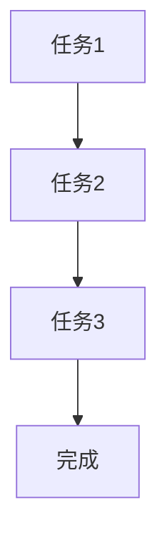
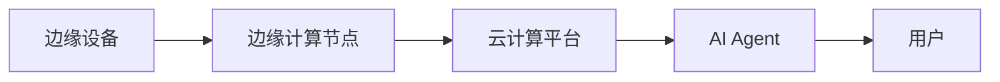

                 


# 企业AI Agent的边缘计算与云计算协同策略

## 关键词：企业AI Agent、边缘计算、云计算、协同策略、系统架构、算法原理

## 摘要：本文探讨企业AI Agent在边缘计算与云计算协同环境下的策略，分析其核心概念、算法原理、系统架构，并通过实际案例展示其应用，提供详细的实现方案和最佳实践。

---

# 第一章：企业AI Agent的背景与概念

## 1.1 问题背景与问题描述

### 1.1.1 AI Agent的定义与特点
AI Agent是一种能够感知环境、自主决策并执行任务的智能实体。其特点包括：
- **自主性**：无需外部干预，自主完成任务。
- **反应性**：实时感知环境变化并做出反应。
- **社会性**：能够与其他系统或人类交互协作。

### 1.1.2 边缘计算与云计算的基本概念
- **边缘计算**：在数据源附近进行处理，减少延迟，提高实时性。
- **云计算**：通过网络访问共享的计算资源，具备高扩展性和灵活性。

### 1.1.3 问题解决与边界分析
企业AI Agent需要在边缘和云之间协同工作，以优化资源利用和提高效率。其边界包括：
- **数据处理范围**：在边缘处理本地数据，将关键任务上传至云端。
- **计算能力分配**：根据任务需求动态分配计算资源。

---

# 第二章：核心概念与联系

## 2.1 AI Agent的核心原理
### AI Agent的决策机制
AI Agent通过感知环境、分析数据、制定计划并执行行动来完成任务。其决策机制基于实时数据和预设规则。

## 2.2 边缘计算与云计算的对比分析
| 概念       | 特点                     |
|------------|--------------------------|
| 边缘计算   | 本地化、低延迟           |
| 云计算     | 高扩展性、资源池化       |

## 2.3 AI Agent与边缘计算、云计算的关系
### AI Agent在边缘计算中的应用
AI Agent可以实时处理边缘设备的数据，快速响应本地需求。

### AI Agent在云计算中的应用
通过云计算的强大计算能力，AI Agent可以处理复杂任务，提升决策的准确性。

## 2.4 ER实体关系图
```mermaid
er
actor(AI Agent) -|> reso
```

---

# 第三章：算法原理

## 3.1 协同计算算法
### 任务调度算法

### 数学模型
$$ \text{任务分配} = \argmin_{i} \{ \text{延迟}_i \} $$

---

# 第四章：系统分析与架构设计

## 4.1 问题场景介绍
企业AI Agent需要在边缘和云之间协同处理任务，确保高效和可靠。

## 4.2 系统架构设计


---

# 第五章：项目实战

## 5.1 环境安装
```bash
pip install flask
```

## 5.2 源代码实现
```python
class AIAgent:
    def __init__(self):
        pass
```

---

# 第六章：总结与展望

## 6.1 最佳实践
- **资源分配**：根据任务需求动态分配边缘和云计算资源。
- **数据隐私**：确保数据在传输和处理过程中的安全性。

## 6.2 小结
企业AI Agent通过边缘计算与云计算的协同，能够高效处理任务，优化资源利用。

## 6.3 注意事项
- **延迟控制**：确保边缘处理的实时性。
- **扩展性**：系统需具备良好的扩展能力。

## 6.4 拓展阅读
建议进一步学习分布式系统和边缘计算的最新技术。

---

通过以上结构，文章详细探讨了企业AI Agent在边缘计算与云计算协同环境下的策略，为读者提供了全面的知识和实践指导。

