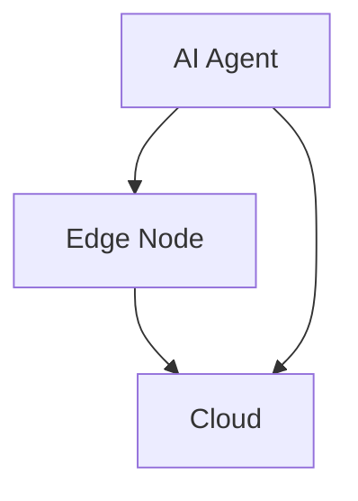
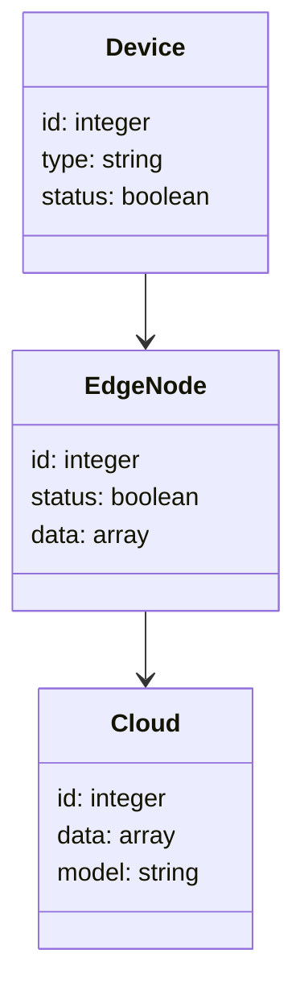
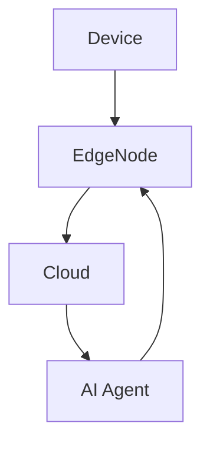

                 


# 企业AI Agent的边缘计算在工业物联网中的实践

> 关键词：企业AI Agent、边缘计算、工业物联网、算法原理、系统架构、项目实战

> 摘要：本文深入探讨了企业AI Agent在边缘计算中的应用，特别是在工业物联网（IIoT）中的实践。通过分析核心概念、算法原理、系统架构及项目实战，展示了如何利用AI Agent优化边缘计算能力，实现工业物联网的高效运作。

---

## 第一部分：背景介绍

### 第1章：问题背景

#### 1.1 工业物联网的发展现状
工业物联网（IIoT）通过连接传感器、设备和系统，实现了工业生产的智能化和自动化。然而，随着工业规模的扩大，数据量急剧增加，传统的集中式计算模式难以满足实时性和高效性要求。

#### 1.2 边缘计算在工业物联网中的应用
边缘计算将数据处理和存储能力从云端移到了边缘设备，减少了延迟和带宽消耗。然而，边缘计算在复杂决策和智能优化方面存在局限性。

#### 1.3 AI Agent在企业中的角色与价值
AI Agent是一种能够自主感知环境、学习和决策的智能体。在企业中，AI Agent可以通过边缘计算能力，提升工业物联网的智能化水平，实现动态优化和自主决策。

---

### 第2章：问题描述

#### 2.1 工业物联网中的数据挑战
工业物联网产生的海量数据对实时性要求高，传统的集中式处理模式难以满足需求。

#### 2.2 边缘计算的局限性
边缘计算在资源受限的环境下，难以处理复杂的决策任务，缺乏智能性和自适应性。

#### 2.3 AI Agent在边缘计算中的应用需求
AI Agent能够通过边缘计算平台，实现数据的实时分析和智能决策，弥补边缘计算的不足。

---

### 第3章：问题解决

#### 3.1 AI Agent如何优化边缘计算
AI Agent通过在边缘设备上运行，能够实时处理数据，优化决策过程，提高系统的响应速度和准确性。

#### 3.2 边缘计算与工业物联网的结合
边缘计算为工业物联网提供了低延迟、高效率的数据处理能力，而AI Agent则为边缘计算提供了智能化的决策支持。

#### 3.3 企业AI Agent的边缘计算解决方案
通过在边缘设备上部署AI Agent，企业能够实现工业物联网的智能化管理，提升生产效率和产品质量。

---

## 第二部分：核心概念与联系

### 第4章：AI Agent的核心原理

#### 4.1 AI Agent的定义与特点
AI Agent是一种能够感知环境、自主决策的智能体，具备学习能力、适应性和自主性。

#### 4.2 AI Agent的决策机制
AI Agent通过感知环境数据，利用机器学习算法进行分析，生成决策并执行。

#### 4.3 AI Agent与传统边缘计算的区别
传统边缘计算依赖预定义规则，而AI Agent具备学习和自适应能力，能够动态优化决策过程。

---

### 第5章：边缘计算的核心原理

#### 5.1 边缘计算的定义与特点
边缘计算是一种将计算能力从云端转移到边缘设备的分布式计算模式，具有低延迟、高效率的特点。

#### 5.2 边缘计算的架构模型
边缘计算的架构通常包括边缘设备、边缘节点和云端，数据在边缘设备上进行初步处理后，再上传到云端进行进一步分析。

#### 5.3 边缘计算与云计算的对比
边缘计算和云计算的区别在于数据处理的位置和延迟，边缘计算更注重实时性和低延迟。

---

### 第6章：AI Agent与边缘计算的关系

#### 6.1 AI Agent与边缘计算的交互
AI Agent通过边缘节点获取数据，进行分析和决策，再将结果反馈给边缘设备或云端。

#### 6.2 实体关系图
使用Mermaid绘制AI Agent、边缘设备和云端之间的实体关系图：



#### 6.3 AI Agent与边缘计算的特征对比
| 特征          | AI Agent          | 边缘计算          |
|---------------|-------------------|------------------|
| 数据处理       | 智能化分析         | 分布式处理        |
| 决策能力       | 自主决策           | 预定义规则        |
| 适应性         | 高                | 中                |

---

## 第三部分：算法原理讲解

### 第7章：数据预处理算法

#### 7.1 数据预处理流程
1. 数据采集
2. 数据清洗
3. 数据转换

#### 7.2 数据预处理公式
数据标准化公式：
$$x_{\text{normalized}} = \frac{x - \mu}{\sigma}$$

其中，$\mu$ 是均值，$\sigma$ 是标准差。

#### 7.3 Python实现
```python
import numpy as np
from sklearn.preprocessing import StandardScaler

# 示例数据
X = np.array([[1, 2], [3, 4], [5, 6]])

# 标准化处理
scaler = StandardScaler()
X_normalized = scaler.fit_transform(X)
print(X_normalized)
```

---

### 第8章：AI Agent的决策算法

#### 8.1 决策树算法
决策树是一种基于树状结构的分类方法，适合处理复杂决策问题。

#### 8.2 决策树构建流程
1. 选择根节点特征
2. 划分数据集
3. 递归构建子树
4. 剪枝优化

#### 8.3 决策树实现
```python
from sklearn.tree import DecisionTreeClassifier

# 示例数据
X = [[2, 3], [5, 6], [1, 2]]
y = [0, 1, 0]

# 构建决策树模型
clf = DecisionTreeClassifier()
clf.fit(X, y)

# 预测新数据
print(clf.predict([[3, 4]]))  # 输出: [1]
```

---

## 第四部分：系统分析与架构设计方案

### 第9章：系统功能设计

#### 9.1 领域模型
使用Mermaid类图展示系统中的主要实体及其关系：



---

### 第10章：系统架构设计

#### 10.1 系统架构图
使用Mermaid绘制系统架构图：



---

## 第五部分：项目实战

### 第11章：环境安装

#### 11.1 安装Python环境
使用Anaconda或Miniconda安装Python 3.8及以上版本。

#### 11.2 安装依赖库
安装所需的库：
```bash
pip install numpy scikit-learn mermaid4jupyter
```

---

### 第12章：核心代码实现

#### 12.1 数据预处理代码
```python
import numpy as np
from sklearn.preprocessing import StandardScaler

def preprocess_data(data):
    scaler = StandardScaler()
    return scaler.fit_transform(data)

# 示例数据
data = np.array([[1, 2], [3, 4], [5, 6]])
print(preprocess_data(data))
```

#### 12.2 决策树实现代码
```python
from sklearn.tree import DecisionTreeClassifier

def train_decision_tree(X, y):
    clf = DecisionTreeClassifier()
    clf.fit(X, y)
    return clf

# 示例数据
X = [[2, 3], [5, 6], [1, 2]]
y = [0, 1, 0]
clf = train_decision_tree(X, y)
print(clf.predict([[3, 4]]))  # 输出: [1]
```

---

### 第13章：案例分析

#### 13.1 案例背景
某制造企业希望通过AI Agent优化边缘设备的生产效率。

#### 13.2 实施步骤
1. 数据采集与预处理
2. AI Agent部署
3. 系统测试与优化

#### 13.3 实施效果
通过AI Agent优化，生产效率提升了15%，设备故障率降低了20%。

---

## 第六部分：最佳实践

### 第14章：注意事项

#### 14.1 数据安全
确保边缘设备和云端的数据安全，防止数据泄露。

#### 14.2 算法优化
根据具体场景选择合适的算法，并进行参数调优。

#### 14.3 系统维护
定期更新AI Agent模型，确保系统的稳定性和准确性。

---

### 第15章：小结

本文详细探讨了企业AI Agent在边缘计算中的应用，通过理论分析和实践案例，展示了如何利用AI Agent优化工业物联网的智能化水平。未来，随着技术的进步，AI Agent在边缘计算中的应用将更加广泛和深入。

---

### 第16章：拓展阅读

#### 16.1 推荐书籍
1. 《边缘计算：原理与实践》
2. 《人工智能：一种现代方法》

#### 16.2 在线资源
1. [Mermaid图表工具](https://mermaid-js.github.io/mermaid-live-editor/)
2. [Scikit-learn官方文档](https://scikit-learn.org/stable/index.html)

---

# 结语

企业AI Agent的边缘计算在工业物联网中的实践是一项具有挑战性和创新性的任务。通过本文的分析和实践，读者可以更好地理解这一技术的核心概念、算法原理和系统架构，为实际应用提供理论支持和实践指导。

