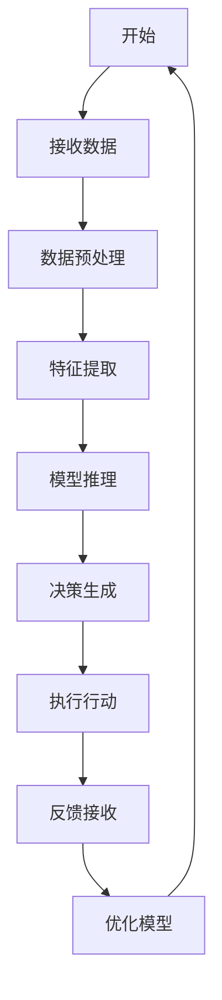
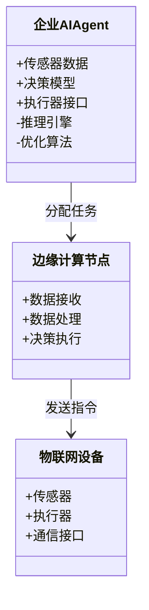

                 


# 企业AI Agent的边缘计算在物联网场景中的低延迟决策实践

> 关键词：企业AI Agent，边缘计算，物联网，低延迟决策，实时处理，分布式系统，智能决策

> 摘要：本文探讨了企业AI Agent如何利用边缘计算在物联网环境中实现低延迟决策。通过分析边缘计算与AI Agent的结合，结合理论与实践，详细阐述了其技术原理和应用场景，展示了如何通过边缘计算优化物联网中的实时决策过程。

---

## 第1章：背景介绍

### 1.1 问题背景

#### 1.1.1 企业AI Agent的核心概念
企业AI Agent是一种能够感知环境、自主决策并执行任务的智能体。它利用机器学习、自然语言处理等技术，为企业提供自动化和智能化的解决方案。

#### 1.1.2 边缘计算在物联网中的重要性
边缘计算将数据处理从云端转移到靠近数据源的边缘设备，减少了延迟，提高了实时响应能力。在物联网中，边缘计算能够快速处理数据，支持本地决策，减少对中心服务器的依赖。

#### 1.1.3 低延迟决策的必要性
在物联网场景中，实时决策对于及时响应和高效操作至关重要。低延迟决策能够确保在关键时刻做出快速反应，避免潜在风险。

### 1.2 问题描述

#### 1.2.1 物联网场景中的实时决策需求
物联网系统通常涉及大量设备和数据，需要实时处理和决策，以优化资源利用和提升用户体验。

#### 1.2.2 边缘计算在低延迟决策中的作用
边缘计算通过将数据处理转移到边缘设备，减少了数据传输到云端的时间，从而实现低延迟决策。

#### 1.2.3 企业AI Agent的定义与目标
企业AI Agent是一种能够理解上下文、分析数据并做出决策的智能系统，目标是在复杂环境中实现自主、高效的决策和执行。

### 1.3 问题解决

#### 1.3.1 AI Agent如何实现低延迟决策
AI Agent通过边缘计算快速处理数据，结合本地决策算法，实现实时响应和高效决策。

#### 1.3.2 边缘计算如何优化物联网数据处理
边缘计算通过分布式数据处理和本地存储，减少了数据传输的延迟和带宽消耗。

#### 1.3.3 企业AI Agent与边缘计算的结合
企业AI Agent利用边缘计算的能力，实现数据的实时处理和决策，提升系统的响应速度和效率。

### 1.4 边界与外延

#### 1.4.1 企业AI Agent的边界条件
企业AI Agent通常在特定范围内处理任务，依赖于边缘设备的数据和计算能力。

#### 1.4.2 边缘计算的适用范围与限制
边缘计算适用于需要实时响应和本地处理的场景，但受限于设备资源和数据隐私问题。

#### 1.4.3 低延迟决策的实现边界
低延迟决策需要在设备性能和延迟要求之间找到平衡，确保在满足延迟要求的前提下，保证决策的准确性和可靠性。

### 1.5 概念结构与核心要素组成

#### 1.5.1 企业AI Agent的核心要素
- 数据感知：通过传感器和设备获取数据。
- 数据处理：利用边缘计算进行实时数据处理。
- 决策与执行：基于处理结果做出决策并执行操作。

#### 1.5.2 边缘计算的关键组成部分
- 边缘设备：如边缘服务器、网关等。
- 数据处理框架：如分布式计算框架、流处理引擎。
- 通信协议：如MQTT、HTTP等。

#### 1.5.3 低延迟决策的实现要素
- 快速数据处理：采用高效的算法和优化的数据结构。
- 本地决策机制：基于边缘设备的计算能力进行决策。
- 实时反馈：通过快速迭代优化决策过程。

---

## 第2章：核心概念与联系

### 2.1 AI Agent的核心原理

#### 2.1.1 AI Agent的基本原理
AI Agent通过感知环境、分析数据、制定策略和执行操作来实现目标。它能够根据反馈不断优化自身的决策过程。

#### 2.1.2 AI Agent的决策机制
AI Agent基于当前状态、目标和环境信息，利用机器学习模型生成多种决策方案，并选择最优的行动方案。

#### 2.1.3 AI Agent的自适应能力
AI Agent能够根据环境变化和反馈调整自身的模型和策略，提高适应性和灵活性。

### 2.2 边缘计算的核心原理

#### 2.2.1 边缘计算的基本原理
边缘计算将数据处理和存储功能从云端转移到靠近数据源的边缘设备，减少延迟和带宽消耗。

#### 2.2.2 边缘计算的分布式架构
边缘计算采用分布式架构，每个边缘节点负责特定区域的数据处理和决策，提高系统的可靠性和可扩展性。

#### 2.2.3 边缘计算的数据处理流程
数据在边缘设备处进行预处理、分析和存储，仅将关键信息传输到云端进行进一步处理或存储。

### 2.3 核心概念属性特征对比

| 特性       | AI Agent                     | 边缘计算                     | 低延迟决策                 |
|------------|------------------------------|-------------------------------|----------------------------|
| 处理位置    | 中心服务器或边缘设备         | 边缘设备                     | 边缘设备                   |
| 响应时间    | 较低延迟                     | 极低延迟                     | 极低延迟                   |
| 数据依赖    | 高，依赖于云端数据           | 中等，依赖于边缘数据         | 高，依赖于实时数据           |
| 自主性      | 高，能够自主决策             | 中等，支持本地决策           | 高，能够自主决策             |
| 适应性      | 高，能够根据反馈优化策略     | 中等，能够调整处理流程       | 高，能够根据反馈优化决策     |

### 2.4 ER实体关系图架构

```mermaid
er
actor: 用户
agent: 企业AI Agent
edge: 边缘计算节点
iot_device: 物联网设备
action: 行动
data: 数据
```

---

## 第3章：算法原理讲解

### 3.1 边缘计算中的低延迟算法

#### 3.1.1 基于边缘节点的实时处理算法
该算法将数据处理任务分配到边缘节点，每个节点负责特定类型的数据处理，减少数据传输到云端的延迟。

#### 3.1.2 分布式计算算法
分布式计算算法通过将任务分解到多个边缘节点，利用并行计算提高处理效率，降低整体延迟。

#### 3.1.3 本地优化算法
本地优化算法在边缘设备上进行数据预处理和优化，减少需要传输到云端的数据量，降低网络延迟。

### 3.2 AI Agent的决策算法

#### 3.2.1 基于强化学习的决策算法
强化学习通过不断试错，学习最优的决策策略，适用于动态变化的环境。

#### 3.2.2 基于规则的决策算法
基于规则的决策算法利用预定义的规则进行判断，适用于场景简单、规则明确的决策任务。

#### 3.2.3 基于模型预测的决策算法
基于模型预测的决策算法利用机器学习模型进行预测，并根据预测结果做出决策，适用于复杂场景。

### 3.3 算法实现流程



---

### 3.4 算法实现代码示例

#### Python代码示例：边缘计算中的实时处理

```python
import time
import numpy as np

def edge_processing(data):
    # 数据预处理
    processed_data = data.reshape(-1, 100)
    # 特征提取
    features = processed_data.mean(axis=1)
    # 模型推理
    model = load_model()
    predictions = model.predict(features)
    # 决策生成
    decisions = [1 if pred > 0.5 else 0 for pred in predictions]
    return decisions

# 模拟数据流
data_stream = np.random.randn(1000, 20)
start_time = time.time()
decisions = edge_processing(data_stream)
print(f"处理完成，耗时：{time.time() - start_time}s")
```

---

### 3.5 数学模型与公式推导

#### 边缘计算中的低延迟数据处理模型

$$ \text{延迟} = \frac{\text{数据量}}{\text{带宽}} + \text{处理时间} $$

通过优化数据压缩和处理算法，可以降低延迟。

#### AI Agent的强化学习决策模型

$$ Q(s, a) = r + \gamma \max_{a'} Q(s', a') $$

其中，$s$是状态，$a$是动作，$r$是奖励，$\gamma$是折扣因子。

---

## 第4章：系统分析与架构设计

### 4.1 问题场景介绍

在智能工厂中，多个传感器实时监测设备状态，企业AI Agent需要快速分析数据，做出维护决策，避免设备故障。

### 4.2 系统功能设计



---

### 4.3 系统架构设计


---

## 第5章：项目实战

### 5.1 环境安装

- 安装Python和相关库（如NumPy、TensorFlow）
- 安装边缘计算框架（如Kafka、Flink）

### 5.2 核心代码实现

```python
import time
import numpy as np
from kafka import KafkaProducer

def producer():
    producer = KafkaProducer(bootstrap_servers=['localhost:9092'])
    for _ in range(100):
        data = np.random.randn(10).tolist()
        producer.send('sensor_data', value=data)
        time.sleep(1)

if __name__ == "__main__":
    producer()
```

### 5.3 案例分析

在智能交通系统中，AI Agent通过边缘计算快速分析交通流量，实时调整信号灯，减少拥堵。

### 5.4 项目总结

通过边缘计算和AI Agent的结合，实现了低延迟决策，提升了系统的实时响应能力和效率。

---

## 第6章：最佳实践与总结

### 6.1 小结

企业AI Agent与边缘计算的结合在物联网场景中实现了低延迟决策，提高了系统的实时响应能力和效率。

### 6.2 注意事项

- 数据隐私和安全问题需要特别关注。
- 边缘设备的计算能力和网络条件影响决策效果。
- 系统需要定期优化和更新模型，以适应环境变化。

### 6.3 未来展望

随着5G和AI技术的发展，企业AI Agent在边缘计算中的应用将更加广泛，实现更智能、更高效的决策。

---

## 总结

企业AI Agent的边缘计算在物联网中的低延迟决策实践不仅提升了系统的实时响应能力，还为企业智能化转型提供了新的思路。通过不断优化算法和架构设计，未来将实现更高效、更智能的决策系统。

