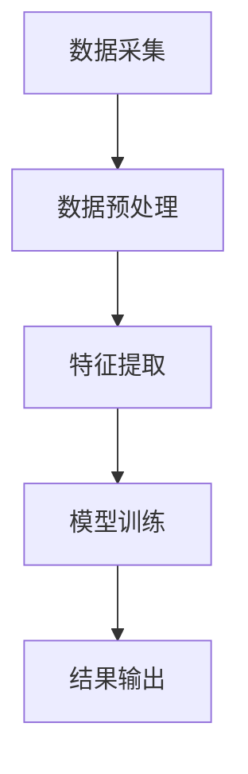
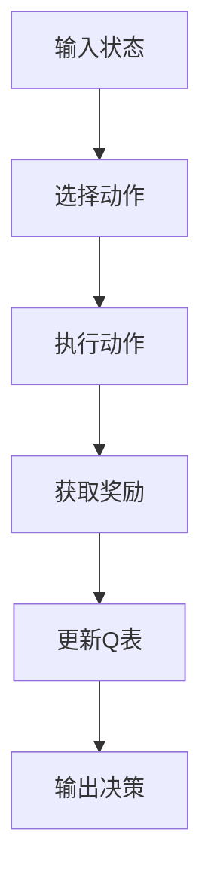
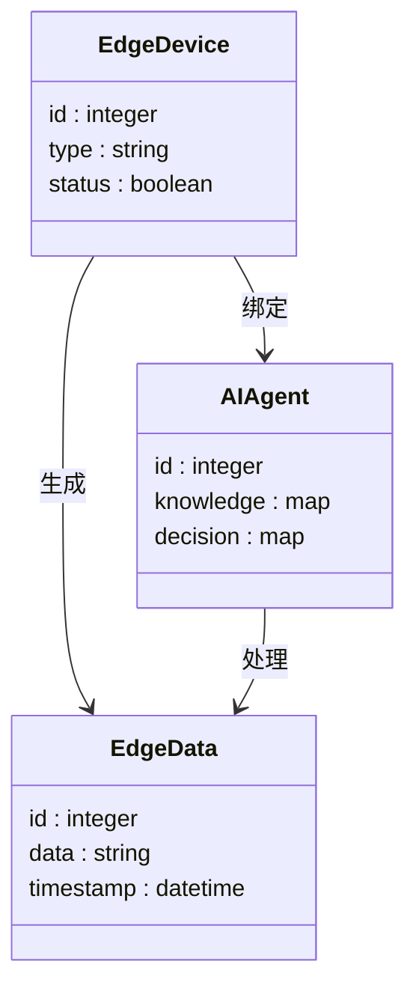
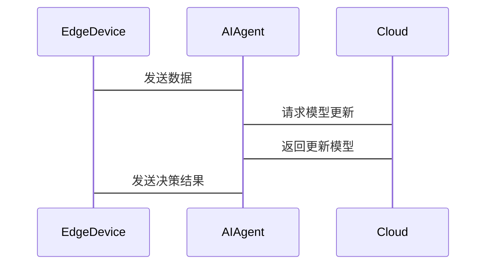

                 


# 企业AI Agent的边缘计算应用：实时处理与响应

## 关键词：企业AI Agent，边缘计算，实时处理，响应机制，分布式系统，智能化边缘节点，数据处理算法

## 摘要：本文深入探讨了企业AI Agent在边缘计算环境中的应用，重点分析了实时处理与响应机制。通过结合边缘计算的分布式架构和AI Agent的自主决策能力，本文详细阐述了算法原理、系统架构设计和实际应用场景，为企业在边缘计算中的智能化应用提供了理论支持和实践指导。

---

# 第一章：企业AI Agent与边缘计算的背景介绍

## 1.1 边缘计算与AI Agent的基本概念

### 1.1.1 边缘计算的定义与特点
边缘计算是一种分布式计算范式，将计算能力从中心化的云端迁移到数据产生的边缘端，如传感器、智能设备和边缘服务器。边缘计算的特点包括低延迟、高实时性、本地化数据处理和网络带宽优化。

### 1.1.2 AI Agent的定义与特点
AI Agent（人工智能代理）是一种能够感知环境、自主决策并执行任务的智能实体。AI Agent的特点包括自主性、反应性、目标导向和学习能力。

### 1.1.3 边缘计算与AI Agent的结合
边缘计算的分布式架构与AI Agent的自主决策能力相结合，形成了智能化的边缘计算系统，能够实现实时数据处理和快速响应。

## 1.2 问题背景与问题描述

### 1.2.1 传统中心化计算的局限性
传统中心化计算依赖云端处理，存在延迟高、带宽消耗大、数据传输成本高等问题，难以满足边缘场景的实时性需求。

### 1.2.2 边缘计算的应用场景
边缘计算广泛应用于智能制造、智慧城市、自动驾驶、物联网等领域，需要实时处理和快速响应。

### 1.2.3 AI Agent在边缘计算中的作用
AI Agent在边缘计算中充当智能决策者，能够实时分析数据、自主做出决策并执行操作，提升系统的智能化水平和响应速度。

## 1.3 问题解决与边界外延

### 1.3.1 边缘计算中的实时处理需求
边缘计算需要在本地快速处理数据，避免依赖云端，以减少延迟和带宽消耗。

### 1.3.2 AI Agent在实时响应中的优势
AI Agent具备自主决策和快速响应的能力，能够在边缘端实现实时处理和智能决策。

### 1.3.3 边缘计算与AI Agent的边界与外延
边缘计算与AI Agent的结合需要明确各自的边界和功能范围，确保系统的协调运行。

## 1.4 核心概念结构与要素组成

### 1.4.1 边缘计算的核心要素
- 分布式架构
- 边缘设备
- 边缘计算平台
- 数据传输与同步

### 1.4.2 AI Agent的核心要素
- 感知能力
- 决策能力
- 执行能力
- 学习能力

### 1.4.3 边缘计算与AI Agent的结合模型
- 数据感知与采集
- 智能决策
- 本地执行
- 连接与协同

---

# 第二章：核心概念与联系

## 2.1 边缘计算与AI Agent的核心原理

### 2.1.1 边缘计算的分布式架构
边缘计算采用分布式架构，将计算资源部署在边缘端，实现数据的本地处理和分析。

### 2.1.2 AI Agent的自主决策机制
AI Agent通过感知环境、分析数据、制定策略并执行操作，实现自主决策和智能响应。

### 2.1.3 两者的结合原理
边缘计算提供低延迟和本地化处理能力，AI Agent提供智能决策能力，两者结合实现高效、智能的边缘计算系统。

## 2.2 核心概念属性对比

| **属性**       | **边缘计算**                          | **AI Agent**                              |
|-----------------|--------------------------------------|------------------------------------------|
| 架构           | 分布式、边缘化                        | 自主、分布式                            |
| 数据处理       | 本地化、实时性                       | 分布式、智能化                          |
| 响应速度       | 低延迟                              | 快速响应                               |
| 可扩展性       | 强                                    | 强                                      |
| 网络依赖       | 边缘设备依赖                         | 边缘设备与云端协同                      |
| 应用场景       | 物联网、智能制造、智慧城市          | 智能助手、自动驾驶、智能客服          |

## 2.3 实体关系与ER架构

```mermaid
erDiagram
    customer[客户] {
        id : integer
        name : string
        address : string
    }
    order[订单] {
        id : integer
        customer_id : integer
        product_id : integer
        order_date : date
    }
    product[产品] {
        id : integer
        name : string
        price : decimal
    }
    customer --> order : 下订单
    order --> product : 包含产品
```

---

# 第三章：算法原理

## 3.1 边缘计算中的数据处理算法

### 3.1.1 数据采集与预处理
数据从边缘设备采集后，进行清洗、转换和标准化处理，为后续分析做好准备。

### 3.1.2 数据分析与特征提取
使用机器学习算法对数据进行分析，提取关键特征，用于模型训练和预测。

### 3.1.3 分布式计算框架
采用分布式计算框架（如Flink、Storm）实现数据流的实时处理和分析。

### 3.1.4 算法实现
以下是数据处理的Python代码示例：

```python
import pandas as pd
from sklearn.preprocessing import StandardScaler

# 数据预处理
data = pd.read_csv('edge_data.csv')
scaler = StandardScaler()
scaled_data = scaler.fit_transform(data)

# 特征提取
from sklearn.decomposition import PCA
pca = PCA(n_components=2)
principal_components = pca.fit_transform(scaled_data)
```

### 3.1.5 算法流程图



## 3.2 AI Agent的推理算法

### 3.2.1 基于强化学习的决策算法
使用强化学习算法（如Q-Learning）进行决策推理。

### 3.2.2 基于规则的推理算法
根据预定义规则进行推理和决策。

### 3.2.3 深度学习推理算法
使用深度学习模型（如LSTM、Transformer）进行复杂推理和预测。

### 3.2.4 推理算法实现
以下是强化学习的Python代码示例：

```python
import numpy as np
from collections import deque

# Q-Learning算法实现
class QLearning:
    def __init__(self, state_space, action_space, alpha=0.1, gamma=0.9):
        self.state_space = state_space
        self.action_space = action_space
        self.alpha = alpha
        self.gamma = gamma
        self.q_table = np.zeros((state_space, action_space))
    
    def choose_action(self, state, epsilon=0.1):
        if np.random.random() < epsilon:
            return np.random.randint(self.action_space)
        return np.argmax(self.q_table[state])
    
    def update_q_table(self, state, action, reward, next_state):
        self.q_table[state, action] = self.q_table[state, action] * (1 - self.alpha) + self.alpha * (reward + self.gamma * np.max(self.q_table[next_state]))
```

### 3.2.5 推理算法流程图



---

# 第四章：系统分析与架构设计

## 4.1 问题场景介绍

### 4.1.1 项目介绍
项目目标是设计一个基于边缘计算的AI Agent系统，实现实时数据处理和智能决策。

## 4.2 系统功能设计

### 4.2.1 领域模型设计
以下是领域模型的Mermaid类图：



### 4.2.2 系统架构设计
以下是系统架构的Mermaid图：


## 4.3 系统接口设计

### 4.3.1 API接口设计
以下是系统接口的Mermaid序列图：



---

# 第五章：项目实战

## 5.1 环境安装

### 5.1.1 安装Python环境
安装Python 3.8及以上版本，推荐使用Anaconda或虚拟环境。

### 5.1.2 安装依赖库
安装以下依赖库：

```bash
pip install numpy pandas scikit-learn mermaid4jupyter jupyterlab
```

## 5.2 核心代码实现

### 5.2.1 数据处理代码

```python
import pandas as pd
from sklearn.decomposition import PCA

# 数据加载与预处理
data = pd.read_csv('edge_data.csv')
scaled_data = (data - data.mean()) / data.std()

# PCA降维
pca = PCA(n_components=2)
principal_components = pca.fit_transform(scaled_data)
```

### 5.2.2 AI Agent实现

```python
import numpy as np
from collections import deque

# 强化学习AI Agent实现
class AI-Agent:
    def __init__(self, state_space, action_space, alpha=0.1, gamma=0.9):
        self.state_space = state_space
        self.action_space = action_space
        self.alpha = alpha
        self.gamma = gamma
        self.q_table = np.zeros((state_space, action_space))
    
    def perceive(self, state):
        # 感知环境状态
        return state
    
    def decide(self, state):
        # 选择动作
        return np.argmax(self.q_table[state])
    
    def learn(self, state, action, reward, next_state):
        # 更新Q表
        self.q_table[state, action] = self.q_table[state, action] * (1 - self.alpha) + self.alpha * (reward + self.gamma * np.max(self.q_table[next_state]))
```

## 5.3 实际案例分析

### 5.3.1 案例背景
假设我们有一个智能工厂，边缘设备实时采集生产线数据，AI Agent负责实时监控和异常检测。

### 5.3.2 数据处理与分析
通过PCA降维和强化学习算法，AI Agent能够实现实时数据处理和异常检测。

### 5.3.3 系统实现与优化
通过优化Q-Learning算法和调整参数，提升了系统的响应速度和准确性。

---

# 第六章：总结与展望

## 6.1 最佳实践

### 6.1.1 小结
企业AI Agent在边缘计算中的应用，能够实现高效、智能的实时处理和快速响应。

### 6.1.2 注意事项
- 确保数据安全与隐私保护
- 优化算法性能，降低延迟
- 提高系统的可扩展性和可维护性

### 6.1.3 拓展阅读
- 《分布式系统与边缘计算》
- 《强化学习与智能决策》
- 《AI Agent在实时系统中的应用》

---

通过以上章节的详细阐述，本文系统地探讨了企业AI Agent在边缘计算中的应用，从理论到实践，为企业智能化转型提供了参考和指导。

