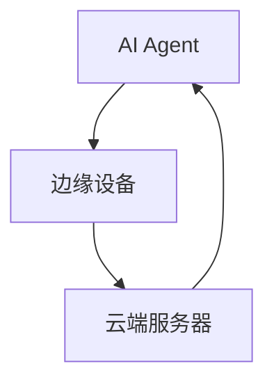
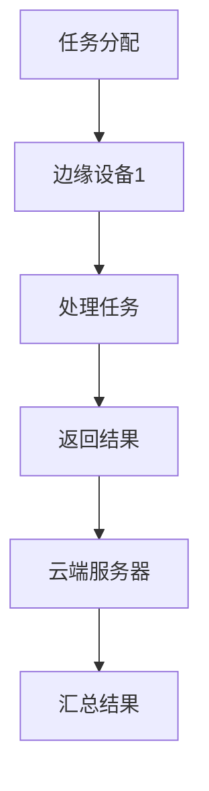
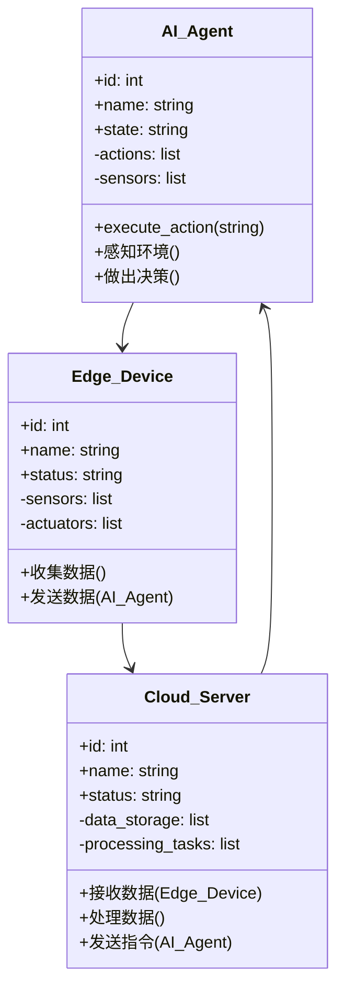
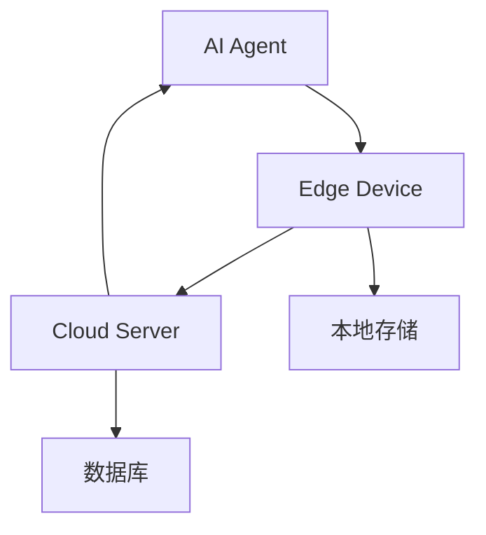

                 


# 企业AI Agent的边缘计算应用：提升响应速度

## 关键词：
企业AI Agent、边缘计算、响应速度、分布式计算、数据处理、系统架构

## 摘要：
本文探讨了企业AI Agent在边缘计算中的应用，分析了如何通过边缘计算提升AI Agent的响应速度。文章详细介绍了AI Agent和边缘计算的核心概念，分析了它们的协同工作原理，讲解了相关的算法和系统架构设计，并通过实际案例展示了如何在企业中实施这些技术。最后，文章总结了最佳实践和注意事项，为企业在AI Agent的边缘计算应用中提供了指导。

---

## 正文

### 第一部分：背景介绍

#### 1. AI Agent的基本概念
AI Agent（人工智能代理）是一种能够感知环境、自主决策并执行任务的智能实体。它可以是一个软件程序、一个机器人或任何能够与环境交互的智能系统。AI Agent的核心功能包括感知、推理、规划和执行。它能够根据环境反馈不断优化自身行为，广泛应用于自动化控制、智能推荐、机器人等领域。

#### 2. 边缘计算的基本概念
边缘计算是一种分布式计算范式，将计算能力从云端移到数据源附近，减少数据传输延迟。边缘计算的核心特点包括分布式架构、低延迟、高实时性和资源受限。它在物联网（IoT）、实时数据分析和边缘设备管理等领域有广泛应用。

#### 3. 企业AI Agent与边缘计算的结合
在企业环境中，AI Agent通常依赖于云端计算资源进行数据处理和决策。然而，随着实时性和响应速度要求的提高，仅依赖云端计算已无法满足需求。边缘计算的出现为AI Agent提供了更高效的解决方案。通过将AI Agent部署在边缘设备上，企业可以显著提升数据处理速度和决策响应时间。

### 第二部分：核心概念与联系

#### 1. AI Agent与边缘计算的核心原理
AI Agent在边缘计算中的工作原理可以分为以下几个步骤：
1. 数据感知：AI Agent通过边缘设备收集环境数据。
2. 数据处理：在边缘设备上对数据进行预处理和分析。
3. 决策制定：AI Agent基于处理后的数据做出决策。
4. 行动执行：根据决策结果，AI Agent执行相应的操作。

#### 2. AI Agent与边缘计算的对比与联系
以下是AI Agent和边缘计算在核心属性上的对比：

| 属性            | AI Agent                          | 边缘计算                          |
|-----------------|-----------------------------------|-----------------------------------|
| 数据处理位置    | 可以在边缘或云端                  | 主要在边缘设备                    |
| 响应速度        | 较快（依赖边缘计算）              | 较快（减少数据传输延迟）          |
| 资源消耗        | 较高（依赖AI算法）                | 较低（边缘设备通常资源受限）      |
| 应用场景        | 自动化控制、智能推荐              | 物联网、实时数据分析              |

#### 3. ER实体关系图与Mermaid流程图
以下是AI Agent与边缘计算协同工作的实体关系图：

```mermaid
er
actor: AI Agent
edge_device: 边缘设备
cloud_server: 云端服务器
```

以下是协同工作的流程图：



### 第三部分：算法原理

#### 1. 分布式计算算法
分布式计算算法是边缘计算的核心之一。以下是分布式计算的流程图：



#### 2. 数据处理算法
以下是数据处理算法的数学模型：

$$
\text{处理后数据} = f(\text{原始数据})
$$

其中，\( f \) 是一种数据处理函数，如过滤、归约或转换。

### 第四部分：系统分析与架构设计

#### 1. 系统功能设计
以下是系统功能的领域模型类图：



#### 2. 系统架构设计
以下是系统架构图：



### 第五部分：项目实战

#### 1. 环境安装
为了实现AI Agent的边缘计算应用，需要以下环境：
- 操作系统：Linux或Windows
- 编程语言：Python
- 框架：TensorFlow、Keras
- 开发工具：Jupyter Notebook或VS Code

#### 2. 核心代码实现
以下是AI Agent在边缘设备上处理数据的核心代码：

```python
import numpy as np
from tensorflow import keras

# 加载预训练模型
model = keras.models.load_model('model.h5')

# 数据预处理
def preprocess_data(data):
    return data / 255.0

# 数据处理
def process_data(raw_data):
    processed_data = preprocess_data(raw_data)
    predictions = model.predict(processed_data)
    return predictions

# 执行动作
def execute_action(prediction):
    if prediction[0][0] > 0.5:
        print("执行动作1")
    else:
        print("执行动作2")

# 主函数
def main():
    raw_data = np.random.rand(1, 28, 28, 1)
    predictions = process_data(raw_data)
    execute_action(predictions)

if __name__ == "__main__":
    main()
```

#### 3. 代码解读与分析
该代码实现了AI Agent在边缘设备上的数据处理和决策过程。`preprocess_data`函数对输入数据进行归一化处理，`process_data`函数使用预训练模型进行预测，`execute_action`函数根据预测结果执行相应的动作。

### 第六部分：最佳实践

#### 1. 小结
通过将AI Agent部署在边缘设备上，企业可以显著提升数据处理速度和决策响应时间。边缘计算的分布式架构和低延迟特性为AI Agent的应用提供了强有力的支持。

#### 2. 注意事项
- 确保边缘设备的安全性，防止数据泄露。
- 定期更新AI模型，保持其性能和准确性。
- 合理分配计算资源，避免资源瓶颈。

#### 3. 拓展阅读
- 《边缘计算：原理与实践》
- 《人工智能代理：算法与应用》
- 《分布式系统：概念与设计》

---

通过本文的详细讲解，读者可以深入了解企业AI Agent在边缘计算中的应用，掌握相关算法和系统架构设计，并通过实际案例分析提升对技术的理解和应用能力。

