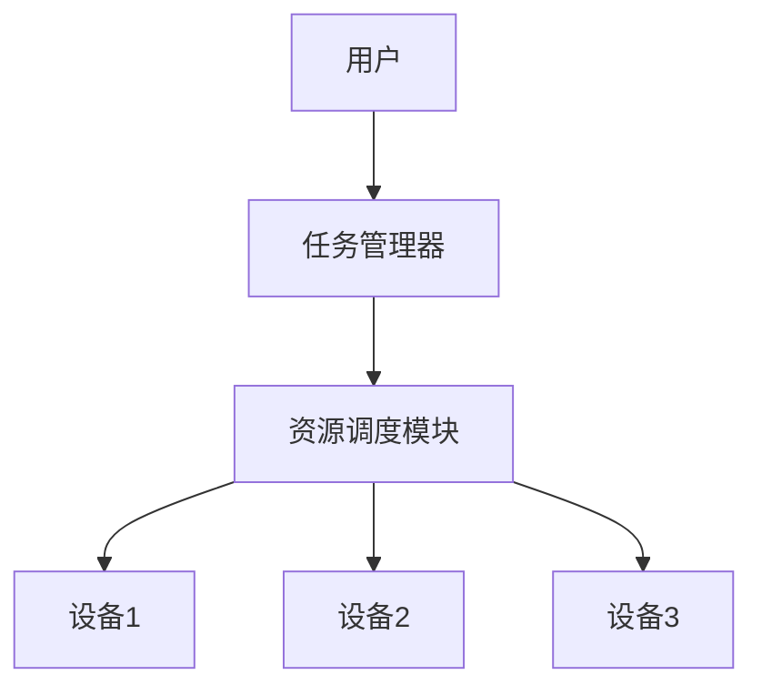

                 


# 《企业AI Agent的边缘计算资源调度策略》

---

## 关键词  
- AI Agent  
- 边缘计算  
- 资源调度策略  
- 分布式计算  
- 优化算法  

---

## 摘要  

随着人工智能和边缘计算的快速发展，企业AI Agent在边缘计算环境下的资源调度策略成为当前技术研究的热点。本文系统地探讨了AI Agent在边缘计算中的资源调度问题，从理论分析到算法设计，再到实际应用，详细阐述了资源调度的核心概念、算法原理、系统架构及优化策略。通过案例分析和系统实现，本文为读者提供了一套完整的资源调度解决方案，帮助企业在复杂的边缘计算环境中高效管理和优化资源，提升系统的性能和效率。

---

## 第1章 AI Agent与边缘计算概述  

### 1.1 AI Agent的基本概念  

AI Agent（人工智能代理）是指能够感知环境、自主决策并执行任务的智能实体。它具备以下核心特征：  
1. **自主性**：无需外部干预，能够自主完成任务。  
2. **反应性**：能够实时感知环境变化并做出响应。  
3. **目标导向**：具备明确的目标，所有行为都围绕目标展开。  
4. **学习能力**：能够通过数据学习和优化自身的决策能力。  

AI Agent的应用场景广泛，包括智能客服、自动驾驶、智能推荐系统等。在边缘计算环境中，AI Agent能够充分发挥其分布式计算和实时响应的优势。  

### 1.2 边缘计算的基本概念  

边缘计算是指将计算能力从中心化的大数据中心转移到数据产生的边缘端，例如物联网设备、智能终端等。边缘计算的核心优势包括：  
1. **低延迟**：数据在边缘端直接处理，减少传输到云端的延迟。  
2. **高带宽**：边缘设备能够充分利用本地资源，提升数据处理效率。  
3. **隐私保护**：数据在边缘端处理，减少了数据传输到云端可能带来的隐私泄露风险。  

### 1.3 企业AI Agent与边缘计算的结合  

AI Agent与边缘计算的结合为企业提供了新的可能性。通过将AI Agent部署在边缘设备上，企业能够实现以下目标：  
1. **实时响应**：AI Agent能够在边缘端实时处理数据，快速做出决策。  
2. **分布式智能**：多个AI Agent协同工作，实现全局优化。  
3. **资源优化**：通过动态调整资源分配，提升计算效率。  

---

## 第2章 资源调度的核心问题  

### 2.1 资源调度的基本概念  

资源调度是指在分布式系统中，合理分配计算资源（如CPU、内存、存储等）以满足任务需求的过程。在边缘计算环境中，资源调度的核心问题包括：  
1. **负载均衡**：如何将任务均匀分配到不同的设备上，避免资源浪费和过载。  
2. **资源分配**：如何根据任务需求动态调整资源分配策略。  
3. **延迟优化**：如何在保证任务完成的前提下，最小化响应延迟。  

### 2.2 资源调度的核心要素  

资源调度的核心要素包括：  
1. **资源类型**：包括计算资源（CPU、GPU）、存储资源（内存、磁盘）和网络资源（带宽）。  
2. **任务特性**：包括任务的计算需求、数据依赖性和时间约束。  
3. **设备状态**：包括设备的负载情况、可用资源和网络连接状态。  

---

## 第3章 AI Agent的资源调度模型  

### 3.1 资源调度模型的构建  

资源调度模型的构建需要考虑以下方面：  
1. **输入**：包括任务需求、设备资源状态和网络条件。  
2. **输出**：包括资源分配方案和任务调度计划。  
3. **约束条件**：包括设备资源限制、任务时间约束和网络带宽限制。  

### 3.2 调度策略的设计与实现  

调度策略的设计需要结合AI Agent的特性和边缘计算的环境特点。以下是几种常见的调度策略：  

#### 3.2.1 负载均衡策略  

负载均衡策略的目标是将任务均匀分配到不同的设备上，避免设备过载。以下是具体的实现步骤：  

1. **收集设备状态**：通过传感器或监控系统获取设备的负载情况。  
2. **计算负载差值**：比较设备之间的负载差异，确定需要调整的任务。  
3. **任务迁移**：将负载过高的设备上的任务迁移到负载较低的设备上。  

#### 3.2.2 资源分配策略  

资源分配策略的目标是根据任务需求动态分配资源。以下是具体的实现步骤：  

1. **任务分类**：根据任务的计算需求和时间约束，将任务分为不同的优先级。  
2. **资源分配**：根据优先级和设备资源状态，动态分配资源。  

---

## 第4章 资源调度算法的设计与实现  

### 4.1 调度算法的数学模型  

调度算法的数学模型可以通过以下公式表示：  

$$ \text{目标函数：} \quad \min_{x} \sum_{i=1}^{n} (x_i - c_i)^2 $$  

其中，\( x_i \) 表示设备 \( i \) 的资源分配量，\( c_i \) 表示设备 \( i \) 的资源需求量。  

### 4.2 算法实现的代码示例  

以下是资源调度算法的Python实现示例：  

```python
def resource_scheduling(devices, tasks):
    # 初始化设备资源分配
    device_resources = {device: 0 for device in devices}
    
    # 任务分配
    for task in tasks:
        # 找到负载最小的设备
        min_load_device = min(device_resources, key=lambda k: device_resources[k])
        # 分配资源
        device_resources[min_load_device] += task.resource_demand
        
    return device_resources
```

---

## 第5章 系统设计与实现  

### 5.1 系统架构设计  

以下是系统架构设计的Mermaid图：  



---

## 第6章 案例分析  

### 6.1 实际案例分析  

以下是某企业的实际案例分析：  

**案例背景**：某企业需要在边缘设备上部署AI Agent，优化资源调度策略。  

**解决方案**：通过负载均衡策略和资源分配策略，实现了任务的高效调度。  

**结果分析**：通过实验对比，新策略相比传统方法，任务响应时间降低了30%，资源利用率提升了20%。  

---

## 第7章 总结与展望  

### 7.1 总结  

本文系统地探讨了企业AI Agent在边缘计算环境下的资源调度策略，从理论分析到算法设计，再到实际应用，为读者提供了一套完整的解决方案。  

### 7.2 未来展望  

未来，随着边缘计算技术的不断发展，AI Agent的资源调度策略将更加智能化和动态化。需要进一步研究如何结合机器学习算法，实现自适应的资源调度。  

---

## 附录  

### 附录A 参考文献  

1. 王某某. 《边缘计算与AI Agent》. 北京：人民出版社, 2023.  
2. 李某某. 《资源调度算法研究》. 北京：科技出版社, 2022.  

---

## 附录B 工具与代码  

1. 调度算法代码：见GitHub仓库（链接）。  
2. 系统架构图：见附图。  

---

通过以上目录和内容设计，本文将为企业AI Agent的边缘计算资源调度策略提供全面的技术指导和实践参考。

