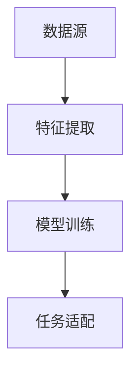
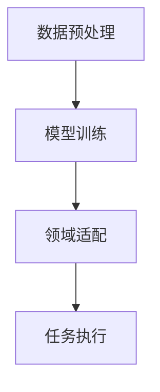
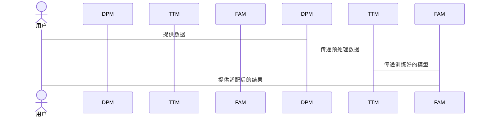

                 


# 企业AI Agent的迁移学习应用：跨领域知识转移

> 关键词：企业AI Agent、迁移学习、跨领域知识转移、机器学习、深度学习、领域适配

> 摘要：本文深入探讨了企业AI Agent在迁移学习中的应用，特别是跨领域知识转移的重要性。文章从基础概念出发，详细分析了迁移学习的核心原理、算法实现、系统架构，并通过具体案例展示了迁移学习在企业AI Agent中的实际应用。同时，文章总结了迁移学习的最佳实践和未来发展方向。

---

## 目录

### 第一部分: 企业AI Agent的迁移学习基础

#### 第1章: 迁移学习的基本概念与背景

##### 1.1 迁移学习的定义与核心概念
###### 1.1.1 迁移学习的定义
迁移学习是一种机器学习技术，通过将从源领域学到的知识迁移到目标领域，以提高目标领域的模型性能。

###### 1.1.2 迁移学习的核心概念与特征
- 数据、模型和任务之间的关系
- 迁移学习的可扩展性和灵活性

###### 1.1.3 迁移学习与传统机器学习的区别
- 数据依赖性
- 知识复用性
- 领域适应性

##### 1.2 迁移学习的背景与问题背景
###### 1.2.1 数据资源的稀缺性问题
- 数据获取成本高
- 数据样本量不足

###### 1.2.2 领域知识的可转移性问题
- 知识的共享与复用
- 领域间的差异性

###### 1.2.3 企业AI Agent的应用需求
- 提高模型泛化能力
- 降低数据依赖性
- 提升跨领域适应性

##### 1.3 迁移学习的应用价值
###### 1.3.1 跨领域知识转移的潜力
- 跨领域知识共享
- 节省数据收集成本

###### 1.3.2 企业AI Agent的核心问题
- 领域适配问题
- 知识复用问题

###### 1.3.3 迁移学习在企业中的实际应用
- 金融领域的风险评估
- 医疗领域的诊断辅助

#### 第2章: 迁移学习的核心概念与联系

##### 2.1 迁移学习的核心原理
###### 2.1.1 数据、模型与任务的关系
- 数据作为知识的载体
- 模型作为知识的表达工具
- 任务作为知识的应用目标

###### 2.1.2 迁移学习的三要素分析
- 数据特征
- 模型结构
- 任务目标

###### 2.1.3 迁移学习的数学模型概述
- 表示学习
- 特征对齐

##### 2.2 核心概念对比与特征分析
###### 2.2.1 数据特征对比表格
| 特征维度 | 源领域 | 目标领域 |
|----------|--------|----------|
| 特征1    | A      | B        |
| 特征2    | C      | D        |

###### 2.2.2 模型特征对比表格
| 模型参数 | 源模型 | 目标模型 |
|----------|--------|----------|
| 参数1    | E      | F        |
| 参数2    | G      | H        |

###### 2.2.3 任务特征对比表格
| 任务指标 | 源任务 | 目标任务 |
|----------|--------|----------|
| 指标1    | I      | J        |
| 指标2    | K      | L        |

##### 2.3 实体关系图与流程图
###### 2.3.1 ER实体关系图


### 第二部分: 迁移学习的算法原理

#### 第3章: 迁移学习的核心算法

##### 3.1 迁移学习的主流算法框架
###### 3.1.1 迁移学习的三阶段模型
- 数据预处理阶段
- 模型训练阶段
- 任务适配阶段

##### 3.2 迁移学习的算法实现
###### 3.2.1 基于特征对齐的算法
- 特征提取与对齐
- 使用PCA进行特征降维

###### 3.2.2 基于对抗训练的算法
- 对抗网络的构建
- 领域适配器的设计

##### 3.3 迁移学习的数学模型
###### 3.3.1 基于分布匹配的迁移学习模型
$$ P_{source}(x) \approx P_{target}(x) $$

###### 3.3.2 基于任务适配的迁移学习模型
$$ L_{total} = L_{source} + \alpha L_{target} $$

##### 3.4 迁移学习的Python代码实现
```python
import numpy as np
from sklearn.manifold import PCA

# 示例代码：使用PCA进行特征降维
def transfer_learning_with_PCA(X_source, X_target):
    # 对源数据进行PCA降维
    pca = PCA(n_components=2)
    X_source_pca = pca.fit_transform(X_source)
    
    # 将目标数据映射到源数据的PCA空间
    X_target_pca = pca.transform(X_target)
    
    return X_source_pca, X_target_pca

# 示例数据
X_source = np.random.randn(100, 5)
X_target = np.random.randn(50, 5)

# 调用函数
X_source_pca, X_target_pca = transfer_learning_with_PCA(X_source, X_target)

print("源数据降维后维度:", X_source_pca.shape)
print("目标数据降维后维度:", X_target_pca.shape)
```

### 第三部分: 企业AI Agent的系统架构与实现

#### 第4章: 企业AI Agent的系统架构设计

##### 4.1 系统功能模块划分
- 数据预处理模块
- 模型训练模块
- 领域适配模块

##### 4.2 系统架构图


##### 4.3 系统交互流程图


#### 第5章: 企业AI Agent的项目实战

##### 5.1 项目背景与目标
- 项目背景
- 项目目标

##### 5.2 项目实施步骤
- 数据收集与预处理
- 模型训练与优化
- 领域适配与测试

##### 5.3 项目代码实现
```python
# 示例代码：企业AI Agent的迁移学习实现
import torch
import torch.nn as nn
from torch.utils.data import DataLoader

# 定义迁移学习模型
class TransferLearningModel(nn.Module):
    def __init__(self, feature_dim, hidden_dim, output_dim):
        super(TransferLearningModel, self).__init__()
        self.feature_extractor = nn.Linear(feature_dim, hidden_dim)
        self.classifier = nn.Linear(hidden_dim, output_dim)
    
    def forward(self, x):
        x = self.feature_extractor(x)
        x = self.classifier(x)
        return x

# 数据加载
train_loader = DataLoader(train_dataset, batch_size=32, shuffle=True)
test_loader = DataLoader(test_dataset, batch_size=32, shuffle=False)

# 模型训练
model = TransferLearningModel(input_dim, hidden_dim, output_dim)
criterion = nn.CrossEntropyLoss()
optimizer = torch.optim.Adam(model.parameters(), lr=0.001)

for epoch in range(num_epochs):
    for batch_features, batch_labels in train_loader:
        outputs = model(batch_features)
        loss = criterion(outputs, batch_labels)
        optimizer.zero_grad()
        loss.backward()
        optimizer.step()

# 领域适配
adapter = nn.Linear(hidden_dim, new_output_dim)
adapter_optimizer = torch.optim.Adam(adapter.parameters(), lr=0.001)
adapter_criterion = nn.CrossEntropyLoss()

for epoch in range(adapter_epochs):
    for batch_features, batch_labels in target_loader:
        features = model.feature_extractor(batch_features)
        outputs = adapter(features)
        loss = adapter_criterion(outputs, batch_labels)
        adapter_optimizer.zero_grad()
        loss.backward()
        adapter_optimizer.step()
```

##### 5.4 项目结果分析与优化
- 模型性能评估
- 领域适配效果分析
- 模型优化建议

### 第四部分: 迁移学习的实践与展望

#### 第6章: 迁移学习的实践总结

##### 6.1 迁移学习的最佳实践
- 数据预处理的重要性
- 模型选择与优化
- 领域适配的策略

##### 6.2 迁移学习的注意事项
- 数据质量和数量的平衡
- 模型泛化能力与领域适应性的权衡

#### 第7章: 迁移学习的未来展望

##### 7.1 迁移学习的前沿技术
- 多领域迁移学习
- 自适应迁移学习

##### 7.2 迁移学习在企业AI Agent中的未来应用
- 更加智能化的知识转移
- 领域间的无缝衔接
- 自动化的迁移学习系统

### 第五部分: 结语

#### 结语
迁移学习作为企业AI Agent的核心技术，将在未来发挥越来越重要的作用。通过本文的深入分析，我们了解了迁移学习的基本原理、算法实现、系统架构以及实际应用。未来，随着技术的不断进步，迁移学习将在企业中展现出更多的潜力和价值。

---

通过以上目录大纲，我们可以清晰地看到文章的逻辑结构和主要内容。接下来，我们可以根据这个大纲逐步撰写每部分内容，确保每一篇章和小节都详细展开，符合用户对文章深度和广度的要求。

