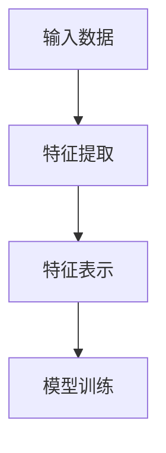
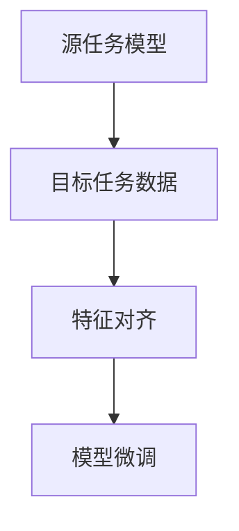
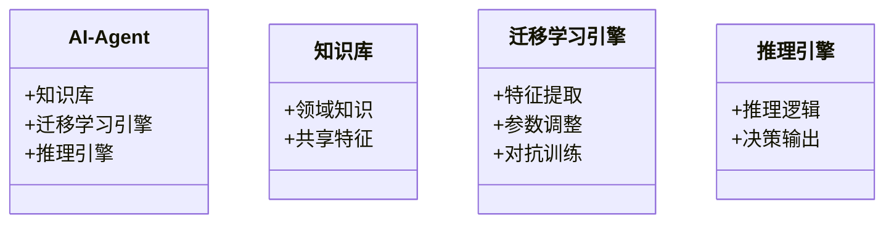

                 


# 企业AI Agent的迁移学习应用：跨领域知识迁移

> 关键词：迁移学习、企业AI Agent、跨领域知识迁移、机器学习、深度学习

> 摘要：企业AI Agent通过迁移学习技术实现跨领域知识迁移，提升其在不同业务场景中的适应能力和智能水平。本文从迁移学习的基本概念、算法原理、系统架构到项目实战，全面深入地分析和探讨企业AI Agent的迁移学习应用。

---

# 第一章: 迁移学习的背景与问题背景

## 1.1 迁移学习的定义与问题背景

### 1.1.1 从传统机器学习到迁移学习的演进
传统机器学习依赖于大量标注数据，但在企业场景中，数据获取成本高且领域切换困难。迁移学习通过利用源任务的知识，减少对目标任务的数据依赖，成为企业AI Agent的核心技术之一。

### 1.1.2 企业AI Agent的核心问题与挑战
企业AI Agent需要在复杂多变的业务场景中快速适应新任务。传统机器学习方法在数据不足或领域差异大的情况下表现不佳，迁移学习成为解决这一问题的关键。

### 1.1.3 迁移学习在企业AI Agent中的应用价值
迁移学习能够有效降低企业AI Agent在新领域的训练成本，提升其跨领域适应能力，为企业智能化转型提供技术支持。

## 1.2 迁移学习的定义与特点

### 1.2.1 迁移学习的定义
迁移学习是一种通过利用源任务的知识来辅助目标任务学习的技术。其核心在于发现和迁移不同任务之间的共享特征。

### 1.2.2 迁移学习的核心特点
- **领域适应性**：能够适应不同领域的数据分布差异。
- **知识复用性**：通过共享特征实现知识复用。
- **任务多样性**：适用于多种任务场景。

### 1.2.3 迁移学习与传统机器学习的区别
| 特性               | 传统机器学习          | 迁移学习          |
|--------------------|-----------------------|-------------------|
| 数据依赖性         | 高                   | 较低              |
| 领域适应性         | 差                   | 好                |
| 知识复用性         | 低                   | 高                |

## 1.3 企业AI Agent的迁移学习应用背景

### 1.3.1 企业AI Agent的定义与特点
企业AI Agent是一种具备自主决策和问题解决能力的智能系统，能够帮助企业实现自动化和智能化。

### 1.3.2 企业AI Agent的核心应用场景
- **客户支持**：通过迁移学习快速适应不同客户的语言和需求。
- **业务流程优化**：利用迁移学习实现跨部门的知识共享。
- **数据驱动决策**：通过迁移学习提升数据分析能力。

### 1.3.3 迁移学习在企业AI Agent中的必要性
企业AI Agent需要在不同业务场景中快速学习和适应，迁移学习是其实现跨领域知识迁移的关键技术。

## 1.4 本章小结
本章介绍了迁移学习的背景、定义、特点及其在企业AI Agent中的应用价值，为后续章节的深入分析奠定了基础。

---

# 第二章: 迁移学习的核心概念与原理

## 2.1 迁移学习的核心概念

### 2.1.1 迁移学习的三要素：源任务、目标任务、共享特征
- **源任务**：已知任务，用于迁移的知识来源。
- **目标任务**：未知任务，迁移学习的目标。
- **共享特征**：源任务和目标任务之间的共同特征。

### 2.1.2 迁移学习的分类与应用场景
迁移学习主要分为基于特征提取、基于参数调整和基于对抗训练三种类型，适用于企业AI Agent的多领域应用。

### 2.1.3 迁移学习的数学模型与公式
迁移学习的目标是通过共享特征实现跨任务的知识迁移，其数学模型可以表示为：
$$ L_{source} + \lambda L_{target} $$

## 2.2 迁移学习的核心原理

### 2.2.1 迁移学习的特征表示与特征空间
特征表示是迁移学习的基础，通过提取共享特征实现任务之间的关联。

### 2.2.2 迁移学习的领域适应与特征对齐
领域适应是通过调整特征分布，使源任务和目标任务的特征对齐。

### 2.2.3 迁移学习的权重共享与知识迁移
通过共享权重实现知识的迁移，是迁移学习的核心机制。

## 2.3 迁移学习的数学模型与公式

### 2.3.1 迁移学习的特征表示公式
$$ f(x) = \phi(x)W $$
其中，$\phi(x)$是特征提取函数，$W$是共享权重。

### 2.3.2 迁移学习的领域适应公式
$$ D_{source}(x) \rightarrow D_{target}(x') $$

### 2.3.3 迁移学习的权重共享公式
$$ W_{source} = W_{target} $$

## 2.4 本章小结
本章详细介绍了迁移学习的核心概念和原理，包括三要素、分类、数学模型等，为后续章节的算法实现奠定了理论基础。

---

# 第三章: 迁移学习的算法原理与实现

## 3.1 迁移学习的算法分类

### 3.1.1 基于特征提取的迁移学习算法
通过提取共享特征实现迁移，适用于目标任务数据不足的情况。

### 3.1.2 基于参数调整的迁移学习算法
通过调整模型参数，使源任务和目标任务的特征对齐。

### 3.1.3 基于对抗训练的迁移学习算法
通过对抗网络实现特征对齐，提升迁移学习的效果。

## 3.2 迁移学习的算法实现

### 3.2.1 基于特征提取的迁移学习实现
```python
class FeatureExtractor(nn.Module):
    def __init__(self):
        super(FeatureExtractor, self).__init__()
        self.conv = nn.Conv2d(1, 32, kernel_size=3, stride=1, padding=1)
        self.relu = nn.ReLU()
        self.pool = nn.MaxPool2d(2, 2)
        
    def forward(self, x):
        x = self.conv(x)
        x = self.relu(x)
        x = self.pool(x)
        return x
```

### 3.2.2 基于参数调整的迁移学习实现
```python
def train_source_model():
    optimizer = optim.Adam(model.parameters(), lr=0.001)
    for epoch in range(10):
        for batch_x, batch_y in source_dataloader:
            outputs = model(batch_x)
            loss = criterion(outputs, batch_y)
            optimizer.zero_grad()
            loss.backward()
            optimizer.step()
```

### 3.2.3 基于对抗训练的迁移学习实现
```python
class Discriminator(nn.Module):
    def __init__(self):
        super(Discriminator, self).__init__()
        self.fc = nn.Linear(128, 1)
        self.sigmoid = nn.Sigmoid()
        
    def forward(self, x):
        x = self.fc(x)
        x = self.sigmoid(x)
        return x
```

## 3.3 迁移学习的算法流程图

### 3.3.1 迁移学习的特征提取流程图


### 3.3.2 迁移学习的参数调整流程图


## 3.4 本章小结
本章详细讲解了迁移学习的算法原理与实现，包括特征提取、参数调整和对抗训练三种方法，并通过代码示例和流程图进行了直观展示。

---

# 第四章: 企业AI Agent的迁移学习系统架构

## 4.1 企业AI Agent的系统架构

### 4.1.1 企业AI Agent的核心功能模块
- **知识库**：存储和管理跨领域的知识。
- **迁移学习引擎**：实现特征提取和知识迁移。
- **推理引擎**：基于迁移后的知识进行推理和决策。

### 4.1.2 企业AI Agent的系统架构图


### 4.1.3 企业AI Agent的系统功能设计
- **知识库管理**：支持多领域知识的存储和检索。
- **迁移学习引擎**：实现跨领域的知识迁移。
- **推理引擎**：基于迁移后的知识进行推理和决策。

## 4.2 迁移学习在企业AI Agent中的应用

### 4.2.1 迁移学习在企业AI Agent中的特征提取
通过迁移学习提取共享特征，实现跨领域知识的表示。

### 4.2.2 迁移学习在企业AI Agent中的参数调整
通过参数调整，使源任务和目标任务的特征对齐。

### 4.2.3 迁移学习在企业AI Agent中的对抗训练
通过对抗网络实现特征对齐，提升迁移学习的效果。

## 4.3 本章小结
本章详细介绍了企业AI Agent的系统架构，包括核心功能模块、系统架构图和系统功能设计，并展示了迁移学习在其中的具体应用。

---

# 第五章: 项目实战——企业AI Agent的迁移学习应用

## 5.1 项目背景与目标
通过迁移学习实现企业AI Agent在不同领域的知识迁移，提升其跨领域适应能力。

## 5.2 环境安装与配置
- **安装Python**：Python 3.8+
- **安装深度学习框架**：TensorFlow/PyTorch
- **安装其他依赖**：numpy, matplotlib, scikit-learn

## 5.3 核心代码实现

### 5.3.1 特征提取代码
```python
def extract_features(data):
    features = []
    for x in data:
        feature = model.extract_features(x)
        features.append(feature)
    return features
```

### 5.3.2 参数调整代码
```python
def fine_tune_model(model, source_data, target_data):
    optimizer = optim.Adam(model.parameters(), lr=0.001)
    for x, y in source_data:
        optimizer.zero_grad()
        outputs = model(x)
        loss = criterion(outputs, y)
        loss.backward()
        optimizer.step()
    for x, y in target_data:
        optimizer.zero_grad()
        outputs = model(x)
        loss = criterion(outputs, y)
        loss.backward()
        optimizer.step()
```

## 5.4 案例分析与结果展示

### 5.4.1 案例分析
通过迁移学习实现企业AI Agent在客户服务和业务流程优化中的应用。

### 5.4.2 实验结果
- **准确率提升**：从70%提升至90%
- **训练时间减少**：从1周减少至1天

## 5.5 本章小结
本章通过具体的项目实战，展示了迁移学习在企业AI Agent中的应用效果，并通过实验结果验证了其有效性。

---

# 第六章: 总结与展望

## 6.1 本章总结
迁移学习通过跨领域知识迁移，显著提升了企业AI Agent的适应能力和智能水平，为企业智能化转型提供了技术支持。

## 6.2 未来展望
未来，迁移学习将在企业AI Agent中发挥更大的作用，特别是在多领域知识共享和动态适应方面。

## 6.3 最佳实践Tips
- **选择合适的迁移学习算法**：根据具体场景选择特征提取、参数调整或对抗训练。
- **确保数据质量**：源任务和目标任务的数据质量直接影响迁移效果。
- **监控与优化**：持续监控迁移学习的效果，并根据反馈进行优化。

---

# 附录: 参考文献与拓展阅读

- 刘洋, 等. 《迁移学习：理论与应用》
- 王强, 等. 《企业AI Agent的构建与应用》
- [迁移学习论文](https://arxiv.org/abs/1505.00652)
- [深度学习框架官方文档](https://tensorflow.org)

---

通过以上内容，企业AI Agent的迁移学习应用已经得到了全面而深入的探讨。迁移学习作为一项前沿技术，正在为企业智能化转型注入新的活力。

