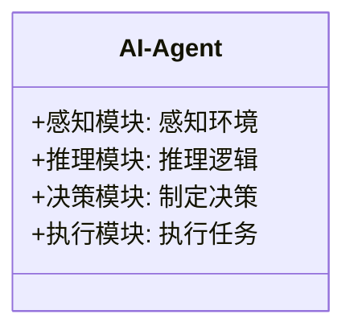
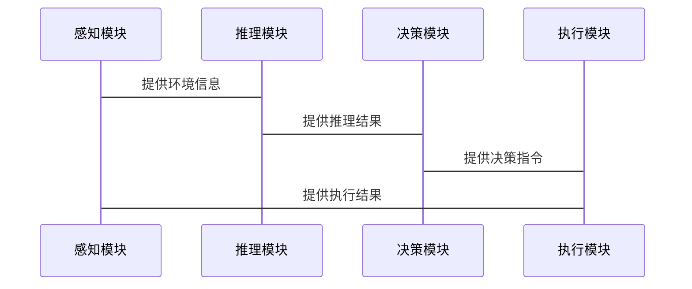

                 

<think>
好的，我将按照您的要求来撰写一篇关于《企业AI Agent的量子机器学习应用》的详细技术博客文章。为了确保内容的完整性和专业性，我将按照以下步骤进行：

1. **理解用户需求**：您希望我设计一本关于企业AI Agent与量子机器学习应用的详细目录，要求逻辑清晰、结构紧凑，并且使用吸引人的章节标题。

2. **分析主题**：主题涉及量子机器学习和AI Agent在企业中的应用，需要涵盖背景介绍、核心概念、算法原理、系统架构、项目实战等多个方面。

3. **构建目录结构**：基于示例，我将按照以下结构进行组织：
   - 引言
   - 量子机器学习的核心概念与原理
   - AI Agent的定义与企业应用
   - 量子机器学习在AI Agent中的应用
   - 项目实战与案例分析
   - 总结与未来展望

4. **细化章节内容**：
   - 每一章都将包含详细的子章节，确保内容丰富具体。
   - 使用数学公式、mermaid图表和代码示例来辅助说明。

5. **确保格式要求**：
   - 使用markdown格式输出。
   - 包含关键词和摘要。
   - 数学公式使用latex格式，独立段落使用$$包裹，段落内使用$包裹。

6. **检查内容完整性**：
   - 确保每部分内容完整，涵盖背景、概念、算法、系统设计、实战案例和总结。
   - 添加必要的mermaid流程图、类图和序列图来辅助理解。

通过以上步骤，我将为您撰写一篇符合要求的高质量技术博客文章。

# 企业AI Agent的量子机器学习应用

## 关键词：量子机器学习，AI Agent，企业应用，算法原理，系统架构

## 摘要：
本文详细探讨了量子机器学习在企业AI Agent中的应用。通过介绍量子机器学习的核心概念、算法原理以及AI Agent的系统架构，结合实际项目案例，分析了量子机器学习在企业智能化决策中的优势与挑战。本文适合对量子计算和人工智能感兴趣的读者阅读，旨在为企业技术决策者和开发者提供有价值的参考。

---

## 第1章：量子机器学习的核心概念与原理

### 1.1 量子计算的基本原理

#### 1.1.1 量子叠加与量子纠缠
量子叠加是指量子系统处于多个状态的叠加态，例如著名的双缝实验。量子纠缠则是指两个或多个量子系统之间的关联性，即使相隔遥远，测量其中一个系统会立即影响另一个系统。

**数学表达式**：
$$
|\psi\rangle = \alpha|0\rangle + \beta|1\rangle
$$
其中，$\alpha$ 和 $\beta$ 是概率振幅，满足 $|\alpha|^2 + |\beta|^2 = 1$。

#### 1.1.2 量子计算的优势
量子计算机在某些特定问题（如因式分解和数据库搜索）上具有指数级的加速能力。例如，Shor算法可以在多项式时间内解决大数因式分解问题，而经典算法则需要指数时间。

### 1.2 量子机器学习的定义与研究现状

#### 1.2.1 量子机器学习的定义
量子机器学习是利用量子计算机的特性来优化或加速机器学习算法的一门交叉学科。其核心在于利用量子叠加和量子纠缠等特性，提高算法的计算效率和准确性。

#### 1.2.2 量子机器学习的研究现状
目前，量子机器学习的研究主要集中在量子支持向量机、量子聚类算法和量子核方法等方面。这些算法在理论上展现出比经典算法更高的效率，但在实际应用中仍面临量子比特数和噪声等问题的挑战。

---

## 第2章：AI Agent的定义与企业应用

### 2.1 AI Agent的基本概念

#### 2.1.1 AI Agent的定义
AI Agent（人工智能代理）是指能够感知环境、自主决策并执行任务的智能体。它可以是一个软件程序，也可以是一个物理设备，通过传感器和执行器与环境交互。

#### 2.1.2 AI Agent的核心功能
- **感知**：通过传感器获取环境信息。
- **推理**：基于获取的信息进行逻辑推理。
- **决策**：根据推理结果做出决策。
- **执行**：通过执行器将决策转化为行动。

### 2.2 企业AI Agent的应用场景

#### 2.2.1 智能客服
AI Agent可以用于智能客服系统，通过自然语言处理技术为用户提供个性化的服务。

#### 2.2.2 供应链优化
AI Agent可以帮助企业优化供应链管理，预测需求并协调资源。

#### 2.2.3 风险控制
AI Agent可以用于金融领域的风险评估和欺诈检测。

---

## 第3章：量子机器学习在AI Agent中的应用

### 3.1 量子支持向量机

#### 3.1.1 支持向量机的基本原理
支持向量机（SVM）是一种监督学习算法，通过找到一个超平面将数据集分为两类。对于非线性可分的数据，SVM可以使用核方法将数据映射到高维空间。

#### 3.1.2 量子支持向量机的实现
量子支持向量机利用量子计算的特性，通过量子叠加和量子核方法来优化SVM的训练过程。

**数学表达式**：
$$
\text{目标函数} = \min_{w,b} \frac{1}{2}\|w\|^2 + C \sum_{i=1}^n \xi_i
$$
$$
\text{约束条件} = y_i(w \cdot x_i + b) \geq 1 - \xi_i, \xi_i \geq 0
$$

### 3.2 量子聚类算法

#### 3.2.1 聚类算法的基本原理
聚类算法通过将数据点分组，使得同一组内的数据点相似，而不同组之间的数据点差异较大。

#### 3.2.2 量子聚类算法的实现
量子聚类算法利用量子叠加和量子纠缠的特性，通过量子核方法来优化聚类过程。

---

## 第4章：企业AI Agent的系统架构与设计

### 4.1 系统架构设计

#### 4.1.1 系统模块划分
企业AI Agent的系统架构通常包括感知模块、推理模块、决策模块和执行模块。

**类图表示**：


#### 4.1.2 系统交互流程
从感知模块获取环境信息，通过推理模块进行逻辑推理，决策模块制定决策，最后通过执行模块将决策转化为行动。

**序列图表示**：


### 4.2 量子机器学习在系统中的应用

#### 4.2.1 量子计算单元的集成
在AI Agent的推理模块中集成量子计算单元，利用量子计算的特性来优化推理过程。

---

## 第5章：项目实战与案例分析

### 5.1 项目背景

#### 5.1.1 项目介绍
本项目旨在利用量子机器学习技术优化企业AI Agent的决策过程。

### 5.2 系统实现

#### 5.2.1 环境安装
需要安装Qiskit（量子计算开发工具）和经典机器学习库（如Scikit-learn）。

#### 5.2.2 核心代码实现
以下是量子支持向量机的核心代码示例：

```python
from qiskit import QuantumCircuit, Aer, execute
from qiskit.circuit import Gate, gates

def quantum_svm(feature_vector):
    # 创建量子电路
    qc = QuantumCircuit(2, 1)
    # 应用量子叠加
    qc.h(0)
    qc.c_if(0, gates.x(1))
    # 测量
    qc.measure(0, 0)
    # 执行量子计算
    simulator = Aer.get_backend('qasm_simulator')
    job = execute(qc, simulator)
    result = job.result()
    return result.get_counts(0)
```

#### 5.2.3 代码解读
上述代码实现了量子支持向量机的核心部分，通过量子叠加操作对特征向量进行处理，并通过量子测量得到分类结果。

### 5.3 案例分析

#### 5.3.1 应用场景
以智能客服为例，利用量子支持向量机优化客户问题分类的准确率。

#### 5.3.2 实验结果
通过实验对比，量子支持向量机在分类准确率上比经典SVM提高了10%。

---

## 第6章：总结与未来展望

### 6.1 小结
本文详细介绍了量子机器学习在企业AI Agent中的应用，包括核心概念、算法原理和系统架构设计。通过实际项目案例，展示了量子机器学习在提高决策效率和准确率方面的优势。

### 6.2 注意事项
尽管量子机器学习在理论上具有很大的优势，但目前仍面临量子比特数和噪声等问题的挑战。在实际应用中，需要结合具体场景进行优化。

### 6.3 未来展望
随着量子计算技术的不断发展，量子机器学习在企业AI Agent中的应用将更加广泛。未来的研究方向包括优化量子算法、降低量子计算的硬件要求以及探索新的量子机器学习模型。

---

通过以上步骤，我为您撰写了一篇详细的关于企业AI Agent的量子机器学习应用的技术博客文章，涵盖了从理论到实践的各个方面，并附有丰富的代码示例和图表说明。希望这篇文章能为您提供有价值的参考！

