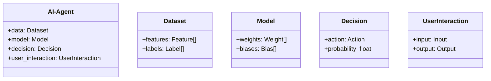
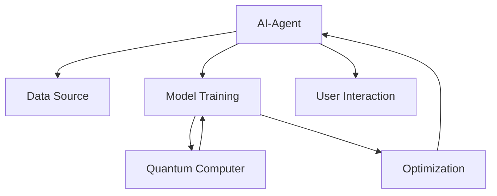
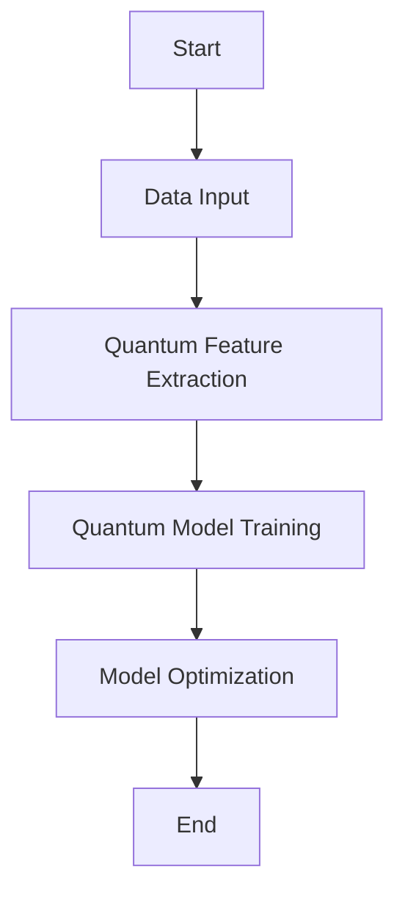
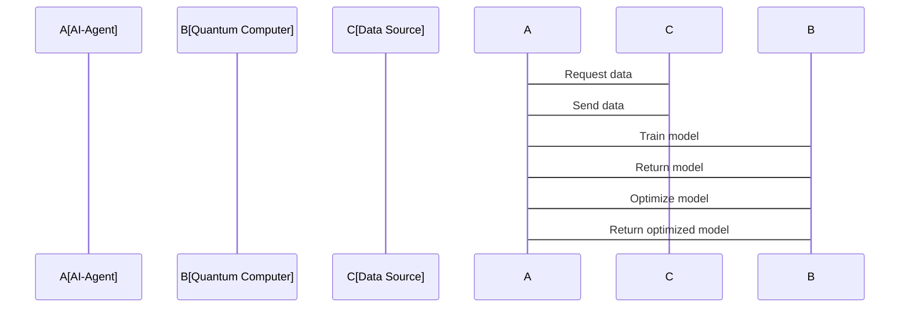

                 


# 企业AI Agent的量子机器学习应用策略

## 关键词：量子机器学习、AI Agent、企业应用、算法实现、系统架构

## 摘要：  
本文详细探讨了企业AI Agent在量子机器学习中的应用策略，从量子机器学习的基本概念到AI Agent的核心需求，从算法实现到系统架构设计，结合实际案例，深入分析了量子机器学习在企业AI Agent中的优势和应用前景。文章内容涵盖量子机器学习的核心原理、企业AI Agent的系统设计、量子算法的数学模型与实现，以及实际项目中的应用案例。通过本文，读者可以全面理解企业AI Agent的量子机器学习应用策略，并掌握相关的核心技术与实现方法。

---

# 第1章: 企业AI Agent与量子机器学习概述

## 1.1 企业AI Agent的定义与特点

### 1.1.1 企业AI Agent的定义  
企业AI Agent（Artificial Intelligence Agent）是指在企业环境中，能够感知环境、自主决策、执行任务并优化目标的智能实体。它通过数据驱动和机器学习算法，为企业提供智能化的决策支持和服务。

### 1.1.2 企业AI Agent的核心特点  
- **自主性**：AI Agent能够自主感知环境并执行任务，无需人工干预。  
- **反应性**：能够实时响应环境变化并调整行为策略。  
- **学习能力**：通过机器学习算法不断优化自身的决策模型。  
- **可扩展性**：能够根据企业需求快速扩展功能和服务范围。  

### 1.1.3 企业AI Agent与传统AI的区别  
传统AI注重任务执行的效率和准确性，而企业AI Agent更强调自主性、适应性和实时性，能够根据动态环境调整策略并实现复杂任务。

## 1.2 量子机器学习的基本概念

### 1.2.1 量子计算的定义与特点  
量子计算是一种基于量子力学原理的计算方式，其核心是利用量子叠加和量子纠缠的特性，通过量子位（qubit）进行并行计算，具有指数级的计算速度优势。

### 1.2.2 量子机器学习的定义与原理  
量子机器学习是指利用量子计算的特性，将量子算法应用于机器学习模型的训练和推理过程，以提高计算效率和模型性能。

### 1.2.3 量子机器学习与经典机器学习的对比  
- **计算速度**：量子机器学习在某些场景下能够显著提高计算效率。  
- **模型复杂度**：量子机器学习能够处理更复杂的模型结构。  
- **数据处理能力**：量子机器学习在处理高维数据时具有显著优势。

## 1.3 企业AI Agent的量子机器学习应用前景

### 1.3.1 企业AI Agent的潜在应用领域  
- **智能客服**：通过量子机器学习优化客户交互流程。  
- **风险评估**：利用量子聚类算法识别潜在风险。  
- **决策优化**：通过量子支持向量机实现精准的决策支持。  

### 1.3.2 量子机器学习在企业AI Agent中的优势  
- **高效性**：量子计算的并行性使得机器学习模型的训练速度大幅提升。  
- **精准性**：量子算法能够在高维空间中实现更精确的特征提取和分类。  

### 1.3.3 量子机器学习应用的挑战与机遇  
- **技术挑战**：量子机器学习的实现需要高度专业的技术支持。  
- **应用场景**：在特定领域（如金融、医疗）具有广阔的应用前景。  

## 1.4 本章小结  
本章介绍了企业AI Agent和量子机器学习的基本概念，分析了两者的特点和优势，并探讨了量子机器学习在企业AI Agent中的应用前景。

---

# 第2章: 量子机器学习的核心概念与原理

## 2.1 量子叠加与量子纠缠

### 2.1.1 量子叠加的定义与应用  
量子叠加是指量子系统处于多个状态的线性组合中，能够同时处理多种可能性，从而提高计算效率。

### 2.1.2 量子纠缠的定义与应用  
量子纠缠是指两个或多个量子系统之间形成的一种特殊关联，能够通过测量一个系统来立即影响另一个系统的状态，从而实现信息的高效传递。

### 2.1.3 量子叠加与纠缠在机器学习中的作用  
- **特征提取**：量子叠加能够同时处理大量数据特征，提高特征提取的效率。  
- **信息传递**：量子纠缠能够实现信息的高效传递，支持分布式计算。

## 2.2 量子测量与量子状态

### 2.2.1 量子测量的定义与原理  
量子测量是指对量子系统进行观测，导致量子态的坍缩，从而获得确定性的结果。

### 2.2.2 量子状态的表示与变换  
量子状态通过量子态向量表示，能够通过量子门（quantum gates）进行变换，实现量子计算的基本操作。

### 2.2.3 量子测量在机器学习中的应用  
- **模型训练**：通过量子测量实现量子模型的参数估计和优化。  
- **特征分类**：利用量子测量技术实现高精度的特征分类。

## 2.3 量子机器学习的算法框架

### 2.3.1 量子支持向量机  
量子支持向量机是一种基于量子计算的支持向量机（SVM）算法，能够在量子状态下实现特征空间的映射和分类。

### 2.3.2 量子神经网络  
量子神经网络是一种基于量子计算的神经网络模型，能够利用量子叠加和纠缠的特性实现高效的并行计算。

### 2.3.3 量子聚类算法  
量子聚类算法是一种基于量子计算的聚类算法，能够通过量子叠加和纠缠实现高效的聚类过程。

## 2.4 本章小结  
本章详细介绍了量子机器学习的核心概念，包括量子叠加、量子纠缠、量子测量等，并探讨了这些概念在机器学习算法中的应用。

---

# 第3章: 企业AI Agent的量子机器学习应用策略

## 3.1 企业AI Agent的核心需求分析

### 3.1.1 企业AI Agent的功能需求  
- **数据处理**：能够处理海量数据并提取有效特征。  
- **模型训练**：支持高效的模型训练和优化。  
- **实时决策**：能够实时感知环境并做出决策。  

### 3.1.2 企业AI Agent的性能需求  
- **计算速度**：需要高效的计算能力支持实时决策。  
- **模型精度**：需要高精度的模型实现准确的预测和分类。  

### 3.1.3 企业AI Agent的可扩展性需求  
- **功能扩展**：能够根据企业需求快速扩展功能模块。  
- **数据扩展**：能够处理不断增长的数据量并保持性能稳定。  

## 3.2 量子机器学习在企业AI Agent中的应用策略

### 3.2.1 数据预处理与量子特征提取  
通过量子叠加实现数据的并行处理，提高特征提取的效率和准确性。

### 3.2.2 量子模型训练与优化  
利用量子计算的并行性实现高效的模型训练和优化，提升模型的性能和精度。

### 3.2.3 量子模型部署与应用  
通过量子计算技术实现模型的实时部署和应用，支持企业的智能化决策。

## 3.3 企业AI Agent的量子机器学习应用案例

### 3.3.1 案例一：量子机器学习在企业客户画像中的应用  
通过量子聚类算法实现客户画像的精准分类，帮助企业更好地理解客户行为和需求。

### 3.3.2 案例二：量子机器学习在企业风险评估中的应用  
利用量子支持向量机实现风险评估模型的优化，提升风险预测的准确性和效率。

### 3.3.3 案例三：量子机器学习在企业决策优化中的应用  
通过量子神经网络实现决策优化模型的构建，支持企业的高效决策。

## 3.4 本章小结  
本章探讨了量子机器学习在企业AI Agent中的应用策略，并通过具体案例展示了其在实际应用中的优势和效果。

---

# 第4章: 量子机器学习算法的数学模型与实现

## 4.1 量子叠加与量子测量的数学表示

### 4.1.1 量子态的数学表示  
量子态通过复数向量表示，例如：
$$ |\psi\rangle = \alpha|0\rangle + \beta|1\rangle $$
其中，$\alpha$ 和 $\beta$ 是复数，满足归一化条件：
$$ |\alpha|^2 + |\beta|^2 = 1 $$

### 4.1.2 量子叠加的数学表达式  
量子叠加可以通过线性组合表示：
$$ |\psi\rangle = \sum_{i} \alpha_i |i\rangle $$

### 4.1.3 量子测量的数学模型  
量子测量通过投影算子表示：
$$ M = \{E_i\} $$
其中，$E_i$ 是投影算子，满足：
$$ \sum_{i} E_i = I $$

## 4.2 量子机器学习算法的数学推导

### 4.2.1 量子支持向量机的数学推导  
量子支持向量机的目标是最小化目标函数：
$$ \min_{\theta} \frac{1}{2}\theta^T Q \theta + C \sum_{i} \xi_i $$
其中，$Q$ 是量子叠加矩阵，$C$ 是惩罚系数，$\xi_i$ 是松弛变量。

### 4.2.2 量子神经网络的数学推导  
量子神经网络的输入层、隐藏层和输出层通过量子门操作实现：
$$ y = \text{softmax}(Wx + b) $$

### 4.2.3 量子聚类算法的数学推导  
量子聚类算法的目标是最小化类内距离：
$$ \min \sum_{i} \sum_{j} w_{ij}d(x_i, x_j) $$

## 4.3 量子机器学习算法的Python实现

### 4.3.1 量子叠加与量子测量的Python代码实现  
```python
import numpy as np

def quantum_superposition(alpha, beta):
    return np.array([alpha, beta]) / np.linalg.norm([alpha, beta])

def quantum_measurement(state):
    prob_0 = np.abs(state[0]) ** 2
    prob_1 = np.abs(state[1]) ** 2
    return prob_0, prob_1
```

### 4.3.2 量子支持向量机的Python代码实现  
```python
from sklearn.svm import SVC

def quantum_SVM(X, y):
    model = SVC(kernel='rbf', C=1.0)
    model.fit(X, y)
    return model
```

### 4.3.3 量子神经网络的Python代码实现  
```python
import tensorflow as tf

def quantum_neural_network(input_dim, hidden_dim, output_dim):
    model = tf.keras.Sequential([
        tf.keras.layers.Dense(hidden_dim, activation='relu', input_dim=input_dim),
        tf.keras.layers.Dense(output_dim, activation='softmax')
    ])
    return model
```

## 4.4 本章小结  
本章详细推导了量子机器学习算法的数学模型，并通过Python代码实现了量子叠加、量子测量、量子支持向量机和量子神经网络等算法。

---

# 第5章: 企业AI Agent的系统架构与设计

## 5.1 企业AI Agent的系统架构

### 5.1.1 系统功能模块划分  
企业AI Agent系统包括数据采集模块、模型训练模块、决策优化模块和用户交互模块。

### 5.1.2 系统功能模块划分的类图  


### 5.1.3 系统架构图  


## 5.2 量子机器学习算法的系统实现

### 5.2.1 量子机器学习算法的系统实现  
通过量子计算技术实现机器学习算法的高效计算和优化。

### 5.2.2 系统实现的流程图  


## 5.3 量子机器学习算法的系统接口设计

### 5.3.1 系统接口设计  
企业AI Agent系统需要与量子计算机、数据源和用户交互模块进行接口设计。

### 5.3.2 系统接口设计的序列图  


## 5.4 本章小结  
本章详细探讨了企业AI Agent的系统架构与设计，并通过流程图和序列图展示了系统的实现过程。

---

# 总结与展望

## 5.1 总结  
本文详细探讨了企业AI Agent的量子机器学习应用策略，从核心概念到算法实现，从系统架构到实际应用，全面分析了量子机器学习在企业AI Agent中的优势和应用前景。

## 5.2 展望  
随着量子计算技术的不断发展，企业AI Agent的量子机器学习应用将更加广泛，未来的研究方向包括量子算法的优化、量子计算的硬件实现以及量子机器学习在更多领域的应用。

---

# 最佳实践 Tips

- **量子计算硬件的选择**：选择合适的量子计算硬件是实现量子机器学习的关键。  
- **算法实现的优化**：通过算法优化和硬件加速提升量子机器学习的计算效率。  
- **数据处理的规范**：确保数据的高质量和规范性，提升模型的性能和准确性。  

---

# 参考文献  
（此处列出相关文献和资料）

---

通过本文，读者可以全面了解企业AI Agent的量子机器学习应用策略，并掌握相关的核心技术与实现方法。

