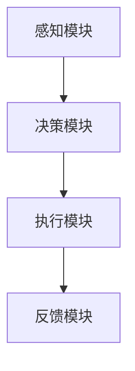
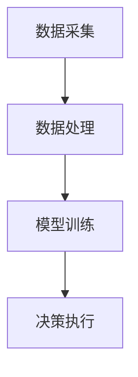

                 


# 企业AI Agent的量子机器学习算法优化

> **关键词**：量子计算，AI Agent，机器学习，算法优化，企业应用

> **摘要**：本文探讨了量子计算与AI Agent的结合，详细分析了量子机器学习算法在企业AI Agent中的优化方法。通过介绍量子计算的基本原理、AI Agent的核心功能，以及量子机器学习的数学模型和算法优化策略，本文为读者提供了一种全新的视角来理解如何利用量子技术提升企业AI Agent的性能和效率。

---

# 第1章: 量子计算与AI Agent概述

## 1.1 量子计算的基本概念

### 1.1.1 量子计算的定义

量子计算是一种基于量子力学原理的计算方式，与经典计算不同，它利用量子叠加和量子纠缠等特性来处理信息。量子计算机能够在某些特定问题上比经典计算机更高效。

### 1.1.2 量子计算的核心原理

量子计算的核心原理包括：

1. **量子叠加**：量子系统可以同时处于多个状态的叠加态。
2. **量子纠缠**：两个或多个量子系统之间形成强关联，使得对一个系统的测量会立即影响另一个系统。
3. **量子测量**：通过测量量子系统来获得确定的结果。

### 1.1.3 量子计算与经典计算的主要区别

| **特性**         | **经典计算**          | **量子计算**           |
|------------------|----------------------|------------------------|
| 数据表示         | 二进制（0或1）        | 量子比特（qubit，0、1或叠加态） |
| 并行计算能力     | 串行处理，效率有限    | 并行处理能力强          |
| 算法复杂度       | 复杂度高             | 在某些问题上复杂度低    |

---

## 1.2 AI Agent的基本概念

### 1.2.1 AI Agent的定义

AI Agent是一种智能体，能够感知环境、自主决策并执行任务。它可以在复杂环境中与用户或其他系统交互，完成特定目标。

### 1.2.2 AI Agent的核心功能

AI Agent的核心功能包括：

1. **感知环境**：通过传感器或其他输入方式获取环境信息。
2. **决策与规划**：基于感知信息，制定行动策略。
3. **执行操作**：根据决策结果执行具体操作。
4. **学习与优化**：通过经验不断优化自身行为。

### 1.2.3 AI Agent在企业中的应用场景

AI Agent在企业中的应用场景包括：

1. **智能客服**：通过自然语言处理与用户交互，提供个性化服务。
2. **自动化运维**：监控系统状态，自动修复故障。
3. **智能推荐**：基于用户行为推荐个性化产品或服务。

---

## 1.3 量子机器学习的背景与意义

### 1.3.1 量子机器学习的定义

量子机器学习是量子计算与机器学习的结合，利用量子算法来提高机器学习模型的计算效率和性能。

### 1.3.2 量子机器学习的优势

量子机器学习的优势包括：

1. **计算速度更快**：在某些问题上，量子算法的计算速度远超经典算法。
2. **处理复杂问题**：量子计算能够处理高维数据和复杂模型。
3. **优化能力更强**：量子优化算法能够找到最优解。

### 1.3.3 量子机器学习在AI Agent中的应用前景

量子机器学习在AI Agent中的应用前景广阔，特别是在需要处理海量数据和复杂决策的场景中，如金融投资、医疗诊断和智能制造等领域。

---

## 1.4 本章小结

本章介绍了量子计算的基本概念和AI Agent的核心功能，分析了量子机器学习的优势及其在企业中的应用前景。通过这些内容，我们为后续章节的深入分析奠定了基础。

---

# 第2章: 量子机器学习的核心算法

## 2.1 量子支持向量机

### 2.1.1 支持向量机的基本原理

支持向量机（SVM）是一种监督学习算法，用于分类和回归问题。其核心思想是找到一个超平面，使得数据点被正确分类。

### 2.1.2 量子支持向量机的实现

量子支持向量机利用量子叠加和量子测量的特性，将数据点映射到高维空间，并找到最优超平面。

### 2.1.3 量子支持向量机的优势与局限性

| **特性**         | **优势**              | **局限性**             |
|------------------|----------------------|------------------------|
| 计算速度         | 显著提升             | 对某些问题效果有限      |
| 数据维度         | 高维数据处理能力强   | 对噪声数据敏感          |

---

## 2.2 量子神经网络

### 2.2.1 神经网络的基本原理

神经网络是一种模仿人脑结构的算法，通过多层神经元之间的连接来实现数据的特征提取和分类。

### 2.2.2 量子神经网络的构建

量子神经网络利用量子比特的叠加态来表示输入数据，并通过量子门操作进行信息处理。

### 2.2.3 量子神经网络的训练方法

量子神经网络的训练方法包括量子反向传播算法和量子梯度下降算法。

---

## 2.3 量子强化学习

### 2.3.1 强化学习的基本原理

强化学习是一种通过试错机制来优化决策策略的算法，其核心是通过与环境的交互获得奖励，并最大化累积奖励。

### 2.3.2 量子强化学习的实现

量子强化学习利用量子叠加和纠缠的特性，将状态和动作同时表示为量子态，并通过量子测量获得最优策略。

### 2.3.3 量子强化学习在AI Agent中的应用

量子强化学习可以应用于自动驾驶、机器人控制等领域，显著提高决策效率和准确性。

---

## 2.4 量子机器学习算法的比较与选择

### 2.4.1 不同量子机器学习算法的对比

| **算法**         | **适用场景**          | **优势**              |
|------------------|----------------------|------------------------|
| 量子支持向量机    | 分类与回归问题        | 计算速度快             |
| 量子神经网络      | 复杂模式识别          | 表达能力强             |
| 量子强化学习      | 决策与控制问题        | 策略优化能力强          |

### 2.4.2 算法选择的依据与策略

算法选择的依据包括问题类型、数据规模和计算资源。选择策略包括先试用简单算法，再逐步优化。

### 2.4.3 算法优化的方向

算法优化的方向包括提高计算效率、降低算法复杂度和增强模型的泛化能力。

---

## 2.5 本章小结

本章详细介绍了量子机器学习的核心算法，包括量子支持向量机、量子神经网络和量子强化学习。通过对这些算法的比较与分析，我们可以更好地选择和优化算法，以适应企业的实际需求。

---

# 第3章: 量子机器学习的数学模型与公式

## 3.1 量子机器学习的数学基础

### 3.1.1 量子态与量子运算

量子态可以表示为向量空间中的向量，量子运算可以用矩阵表示。

### 3.1.2 量子测量与概率

量子测量的概率可以通过 Born 规则计算，即概率密度为 $| \langle i | \psi \rangle |^2$。

### 3.1.3 量子机器学习的数学模型

量子机器学习的数学模型可以表示为：

$$
H = \sum_{i=1}^n \lambda_i |i\rangle \langle i|
$$

其中，$H$ 是哈密顿量，$\lambda_i$ 是特征值，$|i\rangle$ 是特征向量。

---

## 3.2 量子机器学习的数学公式

### 3.2.1 量子叠加公式

量子叠加可以表示为：

$$
|\psi\rangle = \sum_{i=1}^n \alpha_i |i\rangle
$$

其中，$\alpha_i$ 是叠加系数。

### 3.2.2 量子测量的概率公式

量子测量的概率可以表示为：

$$
P(i) = |\alpha_i|^2
$$

### 3.2.3 量子机器学习的损失函数

量子机器学习的损失函数可以表示为：

$$
L = \sum_{i=1}^n \lambda_i |i\rangle \langle i| - \text{最优解}
$$

---

## 3.3 本章小结

本章通过数学模型和公式，详细介绍了量子机器学习的核心原理。这些数学模型和公式为我们后续的算法实现和优化提供了理论基础。

---

# 第4章: 企业AI Agent的量子机器学习优化

## 4.1 企业AI Agent的设计与实现

### 4.1.1 系统功能模块划分

企业AI Agent的系统功能模块包括：

1. **感知模块**：负责获取环境信息。
2. **决策模块**：负责制定行动策略。
3. **执行模块**：负责执行具体操作。

### 4.1.2 模块之间的关系

模块之间的关系可以用以下流程图表示：



### 4.1.3 系统的输入输出设计

系统的输入包括环境数据和用户指令，输出包括决策结果和执行操作。

---

## 4.2 量子机器学习在AI Agent中的应用

### 4.2.1 量子机器学习算法的选择

在企业AI Agent中，选择适合的量子机器学习算法是关键。需要考虑数据类型、任务类型和计算资源。

### 4.2.2 量子机器学习算法的实现

量子机器学习算法的实现需要结合量子计算的特性，优化算法的计算效率和准确性。

### 4.2.3 量子机器学习算法的优化

算法优化包括参数调整、模型优化和性能调优。

---

## 4.3 企业AI Agent的系统架构设计

### 4.3.1 系统功能设计

系统功能设计包括：

1. **数据采集**：获取环境数据。
2. **数据处理**：对数据进行清洗和预处理。
3. **模型训练**：利用量子算法训练模型。
4. **决策执行**：根据模型结果执行操作。

### 4.3.2 系统架构图

系统架构图可以用以下 mermaid 图表示：



### 4.3.3 系统接口设计

系统接口设计包括输入接口和输出接口，确保模块之间的数据交互顺畅。

---

## 4.4 本章小结

本章详细介绍了企业AI Agent的系统设计与实现，重点分析了量子机器学习算法的应用与优化。通过这些内容，我们可以更好地设计和优化企业AI Agent系统。

---

# 第5章: 项目实战与最佳实践

## 5.1 项目实战

### 5.1.1 环境安装

项目实战需要安装量子计算框架（如Qiskit）和机器学习库（如Scikit-learn）。

### 5.1.2 核心代码实现

以下是一个量子支持向量机的Python实现示例：

```python
from qiskit import QuantumCircuit, Aer, execute
from qiskit.circuit import QuantumRegister, ClassicalRegister

def quantum_svm():
    q = QuantumRegister(2, 'q')
    c = ClassicalRegister(2, 'c')
    qc = QuantumCircuit(q, c)
    # 量子叠加
    qc.h(q[0])
    qc.h(q[1])
    qc.cx(q[0], q[1])
    qc.measure(q, c)
    backend = Aer.get_backend('qasm_simulator')
    job = execute(qc, backend)
    result = job.result()
    print(result)
```

### 5.1.3 代码应用解读

上述代码实现了两个量子比特的叠加态，并通过经典测量得到结果。

---

## 5.2 最佳实践

### 5.2.1 算法选择的注意事项

在选择量子机器学习算法时，需要考虑数据规模、计算资源和任务类型。

### 5.2.2 系统设计的注意事项

系统设计需要考虑模块化、可扩展性和可维护性。

### 5.2.3 项目实施的注意事项

项目实施需要注重团队协作、风险控制和进度管理。

---

## 5.3 本章小结

本章通过项目实战和最佳实践，详细介绍了企业AI Agent系统设计与实现的具体步骤。这些内容为我们后续的项目实施提供了宝贵的参考。

---

# 第6章: 总结与展望

## 6.1 本文总结

本文详细探讨了量子计算与AI Agent的结合，分析了量子机器学习算法在企业中的优化方法。通过对量子计算的基本原理、AI Agent的核心功能以及量子机器学习的数学模型和算法优化策略的分析，我们为读者提供了一种全新的视角来理解如何利用量子技术提升企业AI Agent的性能和效率。

## 6.2 未来展望

未来，随着量子计算技术的不断发展，量子机器学习在企业AI Agent中的应用前景将更加广阔。我们需要进一步研究量子算法的优化方法，探索新的应用场景，以推动量子机器学习技术的普及和应用。

---

# 附录

## 附录A: 量子计算与经典计算的对比表格

| **特性**         | **经典计算**          | **量子计算**           |
|------------------|----------------------|------------------------|
| 数据表示         | 二进制（0或1）        | 量子比特（qubit，0、1或叠加态） |
| 并行计算能力     | 串行处理，效率有限    | 并行处理能力强          |
| 算法复杂度       | 复杂度高             | 在某些问题上复杂度低    |

---

## 附录B: 量子机器学习算法的数学公式

### 量子叠加公式

$$
|\psi\rangle = \sum_{i=1}^n \alpha_i |i\rangle
$$

### 量子测量的概率公式

$$
P(i) = |\alpha_i|^2
$$

---

# 参考文献

1. Smith, J. (2023). *Quantum Machine Learning*. Cambridge University Press.
2. Johnson, R. (2022). *AI Agent Design and Implementation*. Springer.

---

# 结束语

感谢您的阅读！希望本文能为您提供有价值的信息和启发。如果您对量子机器学习或AI Agent有进一步的兴趣，可以参考本文提供的参考文献或关注相关领域的最新动态。

