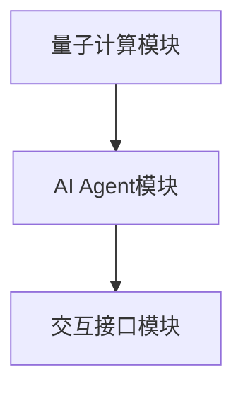

                 


# 《企业AI Agent的量子计算潜在应用探索》

> 关键词：AI Agent, 量子计算, 企业应用, 优化算法, 系统架构, 量子叠加, 量子纠缠

> 摘要：本文探讨了企业AI Agent在量子计算领域的潜在应用，分析了量子计算的核心原理及其在AI Agent中的应用潜力，结合实际应用场景，详细阐述了量子计算与AI Agent的结合方式，提出了系统的架构设计方案，并通过具体案例展示了其实际应用效果。

---

# 第一部分: 企业AI Agent的量子计算潜在应用背景

## 第1章: 企业AI Agent与量子计算概述

### 1.1 企业AI Agent的核心概念

#### 1.1.1 AI Agent的定义与分类
AI Agent（人工智能代理）是指能够感知环境并采取行动以实现目标的智能实体。AI Agent可以分为以下几类：
- **简单反射Agent**：基于当前感知做出反应，不涉及复杂推理。
- **基于模型的反射Agent**：维护对环境的模型，并基于模型进行推理和决策。
- **目标驱动Agent**：根据目标选择行动，以最大化目标的实现。
- **效用驱动Agent**：通过最大化效用函数来优化决策。

#### 1.1.2 量子计算的基本原理
量子计算是一种基于量子力学原理的计算方式，其核心概念包括：
- **量子叠加**：量子系统可以在多个状态之间叠加。
- **量子纠缠**：两个或多个量子系统之间的强关联性。
- **量子测量**：对量子系统的测量会破坏其叠加态。

#### 1.1.3 企业AI Agent与量子计算的结合潜力
AI Agent的决策优化、问题求解和复杂环境适应能力，与量子计算的并行计算能力和优化算法相结合，展现出巨大的应用潜力。

---

## 第2章: 量子计算的核心优势与挑战

### 2.1 量子计算的核心优势
- **并行计算能力**：量子计算机可以在同一时间处理大量可能性，显著提高计算效率。
- **优化算法优势**：量子算法在某些特定问题（如组合优化）上具有指数级优势。

### 2.2 量子计算在企业中的应用挑战
- **技术成熟度**：量子计算技术尚未完全成熟，硬件和算法仍需进一步发展。
- **成本问题**：量子计算的硬件和资源成本较高，企业需要考虑投入产出比。

### 2.3 量子计算的未来发展
随着技术进步和成本下降，量子计算在企业AI Agent中的应用将更加广泛。

---

## 第3章: 企业AI Agent的典型应用场景

### 3.1 供应链管理
AI Agent可以利用量子计算优化供应链中的库存管理和物流路径。

### 3.2 客户关系管理
AI Agent结合量子计算可以实现客户行为预测和个性化服务推荐。

### 3.3 企业决策优化
AI Agent通过量子计算算法优化企业战略决策。

---

# 第二部分: 量子计算与AI Agent的核心概念

## 第4章: 量子计算的数学基础

### 4.1 量子叠加与量子纠缠的数学表达
- **量子叠加**：状态可以表示为 $|\psi\rangle = \alpha|0\rangle + \beta|1\rangle$，其中 $\alpha^2 + \beta^2 = 1$。
- **量子纠缠**：两个量子系统之间的强关联性，例如 Bell 状态 $|\psi\rangle = \frac{1}{\sqrt{2}}(|0\rangle|1\rangle - |1\rangle|0\rangle)$。

### 4.2 量子计算的核心算法
- **量子傅里叶变换**：用于快速计算傅里叶变换。
- **量子搜索算法**：用于在未排序数组中找到目标元素。

---

## 第5章: AI Agent的量子计算实现原理

### 5.1 量子强化学习
- **量子强化学习**：结合量子叠加和强化学习，提高AI Agent的决策效率。

### 5.2 量子特征提取
- **量子特征提取**：利用量子纠缠提高特征提取的准确性和效率。

### 5.3 量子模型训练
- **量子模型训练**：结合量子计算的并行性优化AI Agent的训练过程。

---

# 第三部分: 量子计算与AI Agent的系统架构设计

## 第6章: 系统功能设计

### 6.1 系统功能模块
- **量子计算模块**：负责量子计算的核心算法实现。
- **AI Agent模块**：负责感知环境和决策制定。
- **交互接口模块**：提供用户与系统交互的界面。

## 第7章: 系统架构设计

### 7.1 系统架构图


---

## 第8章: 项目实战

### 8.1 环境安装
- **量子计算环境**：安装Qiskit库（`pip install qiskit`）。
- **AI Agent环境**：安装机器学习库（如TensorFlow、Scikit-learn）。

### 8.2 代码实现
```python
from qiskit import QuantumCircuit, execute, Aer
from qiskit.circuit import QuantumRegister, ClassicalRegister, Circuit

# 定义量子电路
qc = QuantumCircuit(2, 2)
qc.h(0)
qc.cx(0, 1)
qc.measure(0, 0)
qc.measure(1, 1)

# 执行量子计算
simulator = Aer.get_backend('qasm_simulator')
job = execute(qc, simulator)
result = job.result()
print(result.counts)
```

### 8.3 案例分析
- **供应链优化**：通过量子计算优化库存管理和物流路径。

---

## 第9章: 总结与展望

### 9.1 总结
本文探讨了企业AI Agent在量子计算中的潜在应用，分析了量子计算的核心优势和应用场景。

### 9.2 展望
随着量子计算技术的不断发展，AI Agent在企业中的应用将更加广泛和深入。

---

通过以上结构，我们可以全面了解企业AI Agent与量子计算的结合方式，并通过实际案例展示其应用效果。

