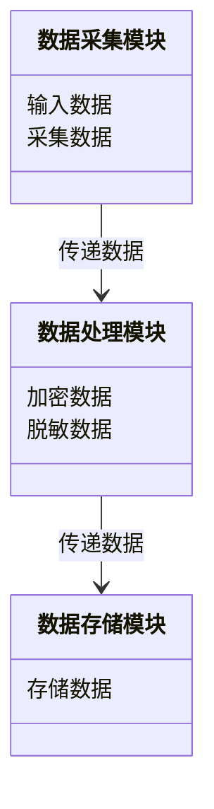
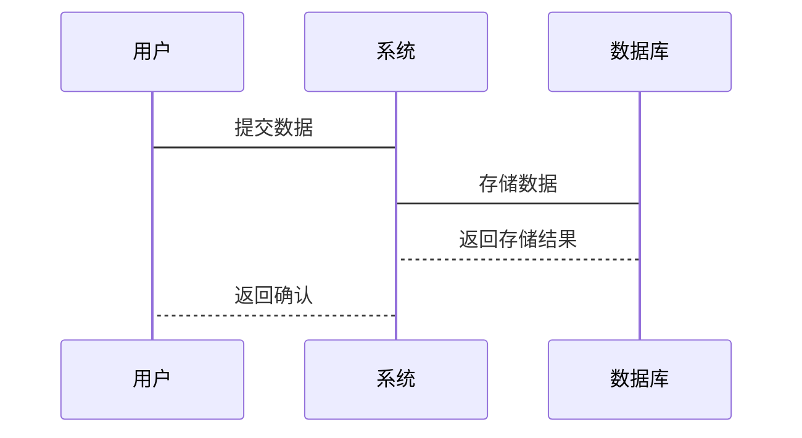

                 


# 企业AI Agent的隐私保护机制

## 关键词：
- 企业AI Agent
- 隐私保护
- 数据加密
- 隐私计算
- 数据脱敏

## 摘要：
随着人工智能技术的快速发展，企业AI Agent在各个行业中的应用越来越广泛。然而，AI Agent在处理企业数据时，也面临着隐私保护的严峻挑战。本文将深入探讨企业AI Agent的隐私保护机制，从核心概念、算法原理、系统架构到项目实战，全面解析如何在企业环境中有效保护用户隐私。通过详细分析和实际案例，本文将为企业在AI Agent的隐私保护方面提供实用的解决方案和最佳实践。

---

# 第一部分：企业AI Agent与隐私保护概述

## 第1章：企业AI Agent与隐私保护概述

### 1.1 AI Agent的基本概念
AI Agent（人工智能代理）是一种能够感知环境、自主决策并执行任务的智能实体。它通过传感器获取信息，利用算法进行分析和推理，并通过执行器完成特定任务。在企业环境中，AI Agent通常用于自动化决策支持、数据处理和业务流程优化。

#### 1.1.1 AI Agent的定义与特点
- **定义**：AI Agent是具有智能性的计算机程序，能够执行复杂任务，如数据处理、决策支持和自动化操作。
- **特点**：
  - 自主性：能够独立执行任务。
  - 反应性：能根据环境变化调整行为。
  - 智能性：具备学习和推理能力。
  - 交互性：能够与用户或其他系统进行交互。

#### 1.1.2 企业AI Agent的应用场景
- **数据分析与决策**：通过分析企业数据，提供决策支持。
- **自动化流程管理**：优化业务流程，提高效率。
- **客户交互**：通过智能客服、聊天机器人与客户互动。
- **风险管理**：实时监控企业运营中的风险。

#### 1.1.3 隐私保护的重要性
在企业AI Agent的应用中，数据隐私问题尤为突出。企业处理的大量敏感数据（如客户信息、交易记录等）可能被滥用或泄露，导致严重的法律和经济损失。

---

### 1.2 隐私保护的背景与挑战

#### 1.2.1 数据泄露的现状
近年来，数据泄露事件频发，企业面临的隐私保护压力越来越大。据统计，超过60%的企业曾经历过数据泄露事件，导致客户信任度下降和经济损失。

#### 1.2.2 企业隐私保护的法律与合规要求
全球范围内，隐私保护法规日益严格。例如：
- **欧盟GDPR**：要求企业明确数据处理目的，并获得用户授权。
- **中国《数据安全法》**：规定企业需采取技术措施保护数据安全。

#### 1.2.3 AI Agent中的隐私风险
AI Agent在处理数据时，可能面临以下隐私风险：
- 数据被未授权访问。
- 数据在传输过程中被截获。
- 数据被滥用或误用。

---

### 1.2.4 问题解决与边界
为应对上述挑战，企业需要采取多层次的隐私保护机制，包括数据加密、匿名化处理和隐私计算等。通过这些措施，可以在保证数据可用性的前提下，有效保护隐私。

---

### 1.2.5 概念结构与核心要素
以下是企业AI Agent隐私保护机制的核心要素：

```
+----------------+
| 隐私保护机制  |
+----------------+       +----------------+       +----------------+
| 数据加密       |       | 隐私计算       |       | 数据脱敏       |
+----------------+       +----------------+       +----------------+
```

---

# 第二部分：隐私保护的核心机制

## 第2章：隐私保护的核心概念与联系

### 2.1 隐私保护机制的原理
隐私保护的核心在于防止未经授权的访问和数据滥用。常见的隐私保护技术包括：
- 数据加密：通过加密算法保护数据 confidentiality。
- 数据匿名化：通过技术手段脱敏数据，使其无法关联到个人。
- 隐私计算：在数据不被完全暴露的情况下进行计算。

#### 2.1.1 数据加密与隐私保护
数据加密是通过数学算法将敏感信息转化为不可读的形式，只有授权方才能解密。常用的加密算法包括：
- 对称加密：如AES。
- 非对称加密：如RSA。

#### 2.1.2 数据匿名化与脱敏技术
数据匿名化是通过技术手段将数据中的敏感信息去掉或替换，使其无法关联到具体个体。常见的脱敏技术包括：
- 数据替换：将敏感字段替换为虚拟值。
- 数据变形：对数据进行随机化处理。

#### 2.1.3 隐私计算
隐私计算是一种在保护数据隐私的前提下进行计算的技术。常见的隐私计算方法包括：
- 分布式隐私计算：数据分布在多个节点，通过协同计算完成任务。
- 联邦学习：在数据不出域的前提下，进行模型训练。

---

### 2.2 核心概念对比表

| **技术**       | **特点**                                                                 |
|-----------------|--------------------------------------------------------------------------|
| 数据加密        | 通过加密算法保护数据 confidentiality，确保数据在传输和存储过程中的安全性。          |
| 数据脱敏        | 对敏感数据进行处理，使其无法被还原为原始数据，适用于数据共享和分析场景。          |
| 隐私计算        | 在不泄露原始数据的前提下进行计算，常用于模型训练和数据分析。                      |

---

### 2.3 ER实体关系图

以下是一个简单的隐私保护实体关系图：

```mermaid
erDiagram
    actor 用户 {
        用户ID
        用户信息
    }
    actor 企业系统 {
        系统ID
        系统功能
    }
    actor 第三方服务 {
        服务ID
        服务功能
    }
    用户 --> 企业系统 : 提供数据
    用户 --> 第三方服务 : 提供数据
    企业系统 --> 第三方服务 : 数据共享
    企业系统 --> 用户 : 提供服务
```

---

# 第三部分：隐私保护的算法原理

## 第3章：隐私保护算法的实现

### 3.1 数据加密算法

#### 3.1.1 对称加密算法
对称加密算法是一种加密速度较快的算法，适用于大量数据的加密。以下是AES加密算法的Python实现示例：

```python
from cryptography.hazmat.primitives.ciphers import Cipher, algorithms, modes
from cryptography.hazmat.primitives.asymmetric import padding
from cryptography.hazmat.primitives import hashes

# 加密密钥
key = b"this is a key"
cipher = Cipher(algorithms.AES(key), modes.ECB())
encryptor = cipher.encryptor()
# 待加密数据
data = b"hello world"
encrypted_data = encryptor.update(data) + encryptor.finalize()
print("加密后的数据:", encrypted_data)
```

#### 3.1.2 非对称加密算法
非对称加密算法使用公钥和私钥进行加密和解密。以下是RSA加密算法的Python实现示例：

```python
from cryptography.hazmat.primitives.asymmetric import rsa, padding
from cryptography.hazmat.primitives import hashes

# 生成密钥对
key = rsa.generate_private_key(
    public_exponent=65537,
    key_size=2048,
)
public_key = key.public_key()

# 加密数据
message = b"hello world"
encrypted_message = public_key.encrypt(
    message,
    padding.PaddingMode.PKCS1v1_5(),
    hashes.SHA256(),
)
print("加密后的数据:", encrypted_message)
```

#### 3.1.3 加密算法的优缺点对比
| **算法**      | **优点**                           | **缺点**                          |
|---------------|------------------------------------|------------------------------------|
| 对称加密       | 加密速度快，适合大规模数据加密     | 密钥管理复杂，容易被截获           |
| 非对称加密       | 密钥管理方便，适合公钥分发           | 加密速度较慢，适合小规模数据加密     |

---

### 3.2 隐私计算算法

#### 3.2.1 分布式隐私计算
分布式隐私计算通过将数据分布在多个节点上，进行联合计算。以下是分布式隐私计算的流程图：

```mermaid
graph TD
    A[节点1] --> B[节点2] : 数据同步
    B --> C[节点3] : 数据同步
    C --> D[节点4] : 数据同步
    D --> A : 同步结果
```

#### 3.2.2 联邦学习算法
联邦学习是一种在保护数据隐私的前提下进行模型训练的技术。以下是联邦学习的流程：

```mermaid
graph TD
    A[客户端] --> B[服务器] : 发送模型参数
    B --> C[模型训练] : 进行模型更新
    C --> B : 返回更新后的模型
    B --> A : 传输更新后的模型
```

#### 3.2.3 隐私保护的数学模型
隐私保护的数学模型通常涉及概率论和统计学。例如，在联邦学习中，模型更新可以通过以下公式实现：

$$\theta_{new} = \theta_{old} + \alpha (y - \theta_{old})$$

其中：
- $\theta_{new}$：更新后的模型参数。
- $\theta_{old}$：旧的模型参数。
- $\alpha$：学习率。
- $y$：目标值。

---

### 3.3 数据脱敏算法

#### 3.3.1 数据替换算法
数据替换算法将敏感字段替换为虚拟值。例如，将真实年龄替换为“X岁”。

#### 3.3.2 数据变形算法
数据变形算法通过对数据进行随机化处理，使其无法还原为原始数据。例如，对地址进行部分替换。

#### 3.3.3 数据脱敏的实现流程
数据脱敏的实现流程通常包括以下步骤：
1. **识别敏感数据**：确定需要脱敏的数据字段。
2. **选择脱敏方法**：根据数据类型选择合适的脱敏算法。
3. **实施脱敏**：对数据进行脱敏处理。
4. **验证脱敏效果**：确保脱敏后的数据无法还原为原始数据。

---

# 第四部分：系统架构与设计

## 第4章：隐私保护系统的设计与实现

### 4.1 系统架构概述

#### 4.1.1 系统架构的组成
隐私保护系统通常包括以下几个模块：
- 数据采集模块：负责收集原始数据。
- 数据处理模块：对数据进行加密或脱敏处理。
- 数据存储模块：存储处理后的数据。
- 数据访问模块：控制数据的访问权限。

#### 4.1.2 系统架构的优缺点对比
| **架构**      | **优点**                           | **缺点**                          |
|---------------|------------------------------------|------------------------------------|
| 分层架构       | 模块化设计，便于维护和扩展           | 跨层通信复杂，可能导致性能瓶颈     |
| 微服务架构       | 高度可扩展，服务独立性强             | 服务间通信开销较大                |

---

### 4.2 系统功能设计

#### 4.2.1 数据采集模块
数据采集模块负责从企业系统中获取原始数据。以下是数据采集模块的流程图：

```mermaid
graph TD
    A[数据源] --> B[数据采集器] : 数据采集
    B --> C[数据处理模块] : 数据传输
```

#### 4.2.2 数据处理模块
数据处理模块负责对数据进行加密或脱敏处理。以下是数据处理模块的流程图：

```mermaid
graph TD
    A[数据采集器] --> B[加密模块] : 数据加密
    B --> C[脱敏模块] : 数据脱敏
    C --> D[存储模块] : 数据存储
```

#### 4.2.3 系统功能设计
以下是系统功能模块的类图：



---

### 4.3 系统架构设计

#### 4.3.1 系统架构图
以下是隐私保护系统的架构图：

```mermaid
graph TD
    A[用户] --> B[API网关] : 请求
    B --> C[授权服务] : 认证
    C --> D[数据处理服务] : 数据处理
    D --> E[数据库] : 数据存储
    E --> D : 返回数据
    D --> B : 返回响应
    B --> A : 返回响应
```

---

### 4.4 系统接口设计

#### 4.4.1 接口定义
以下是系统接口的定义：

```http
POST /api/v1/data/process
Content-Type: application/json
{
    "data": {
        "name": "John Doe",
        "age": 30,
        "email": "john.doe@example.com"
    }
}
```

---

### 4.5 系统交互设计

以下是系统交互的序列图：



---

# 第五部分：项目实战

## 第5章：企业AI Agent隐私保护的实现

### 5.1 项目环境安装
以下是项目所需的环境和工具：
- Python 3.8+
- cryptography库
- mermaid工具

安装命令：
```bash
pip install cryptography
```

---

### 5.2 核心代码实现

#### 5.2.1 数据加密实现
以下是数据加密的Python代码：

```python
from cryptography.hazmat.primitives.ciphers import Cipher, algorithms, modes
from cryptography.hazmat.primitives.asymmetric import padding
from cryptography.hazmat.primitives import hashes

def encrypt_data(key, data):
    cipher = Cipher(algorithms.AES(key), modes.ECB())
    encryptor = cipher.encryptor()
    return encryptor.update(data) + encryptor.finalize()

# 示例
key = b"this is a key"
data = b"hello world"
encrypted_data = encrypt_data(key, data)
print("加密后的数据:", encrypted_data)
```

---

#### 5.2.2 数据脱敏实现
以下是数据脱敏的Python代码：

```python
def mask_data(data):
    masked_data = []
    for item in data:
        if item == 'name':
            masked_data.append('匿名')
        elif item == 'age':
            masked_data.append('*')
        elif item == 'email':
            masked_data.append('***@***.***')
    return masked_data

# 示例
data = {
    "name": "John Doe",
    "age": 30,
    "email": "john.doe@example.com"
}
masked_data = mask_data(data)
print("脱敏后的数据:", masked_data)
```

---

### 5.3 案例分析与解读
假设我们有一个企业客户信息管理系统，客户数据包括姓名、年龄和电子邮件。我们可以通过上述代码实现数据加密和脱敏，确保客户数据的安全性和隐私性。

---

### 5.4 项目小结
通过本项目的实现，我们掌握了数据加密和脱敏的核心技术，并将其应用于企业AI Agent的隐私保护中。通过实际案例分析，我们验证了这些技术的有效性和可行性。

---

# 第六部分：最佳实践与总结

## 第6章：最佳实践与总结

### 6.1 最佳实践
- **分层保护**：在数据的采集、处理、存储和传输过程中，分层实施隐私保护措施。
- **合规性检查**：定期检查企业数据处理是否符合相关法律法规。
- **技术选型**：根据具体需求选择合适的隐私保护技术，如加密、脱敏和隐私计算。

---

### 6.2 小结
企业AI Agent的隐私保护是一个复杂而重要的任务。通过本文的分析和实践，我们了解了隐私保护的核心机制，包括数据加密、脱敏和隐私计算等技术。同时，我们还探讨了系统的架构设计和实现方法，为企业在AI Agent的隐私保护方面提供了实用的解决方案。

---

### 6.3 注意事项
- **数据分类**：在实施隐私保护时，需根据数据的重要性和敏感程度进行分类处理。
- **技术评估**：在选择隐私保护技术时，需综合考虑安全性、性能和成本等因素。
- **持续优化**：隐私保护是一个动态过程，需持续关注技术发展和法规变化，及时优化保护措施。

---

### 6.4 拓展阅读
- **《数据加密技术与应用》**：深入探讨数据加密的基本原理和实际应用。
- **《隐私计算：原理与实践》**：详细介绍隐私计算的技术原理和实现方法。
- **《企业数据安全防护》**：系统讲解企业数据安全的防护策略和实施方法。

---

# 结语
企业AI Agent的隐私保护是一个涉及多方面的复杂问题。通过本文的系统分析和实践，我们不仅掌握了隐私保护的核心技术，还了解了如何在实际项目中应用这些技术。未来，随着人工智能技术的不断发展，隐私保护将面临更多挑战，但通过技术创新和持续努力，我们有信心为企业构建更加安全的AI Agent系统。

---

# END

