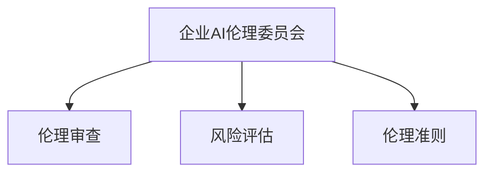
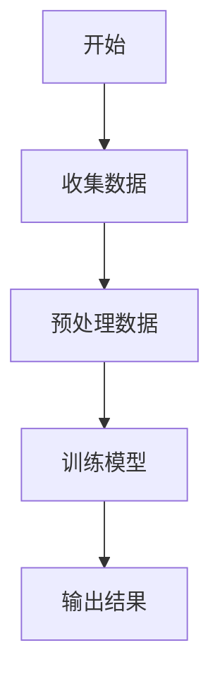
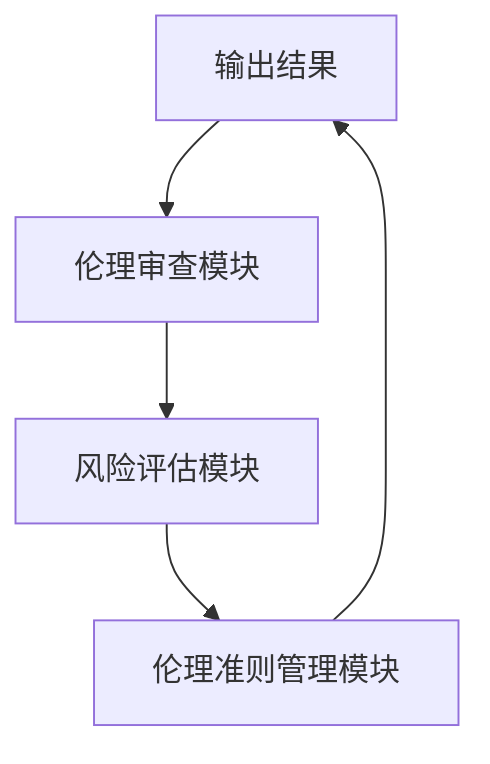
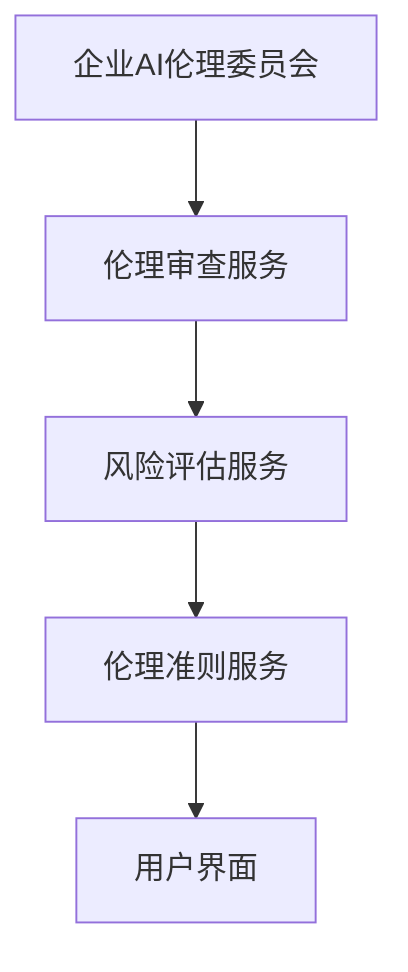

                 


# 企业AI伦理委员会：建立和运作指南

## 关键词
- 企业AI伦理委员会
- AI伦理治理
- 伦理审查
- 风险评估
- AI技术

## 摘要
在当前快速发展的AI技术背景下，企业AI伦理委员会的建立和运作已成为确保AI技术合规、透明和伦理使用的关键。本文从背景介绍、核心概念、算法原理、系统架构、项目实战等多个维度，详细阐述了企业AI伦理委员会的建立和运作指南。通过丰富的案例分析和系统化的指导，本文为读者提供了从理论到实践的全面视角，帮助企业在AI伦理治理方面实现高效运作。

---

# 第1章: 企业AI伦理委员会的背景与核心概念

## 1.1 企业AI伦理委员会的背景

### 1.1.1 AI技术的快速发展与伦理挑战
随着AI技术的飞速发展，企业AI系统的应用越来越广泛。然而，AI技术的复杂性和潜在的伦理问题也随之增加，如算法偏见、隐私保护、责任归属等。这些问题可能引发法律纠纷、公众信任危机，甚至影响企业的声誉和长期发展。

### 1.1.2 企业AI伦理委员会的定义与职责
企业AI伦理委员会是一种专门负责监督和指导企业AI技术应用中伦理问题的组织。其主要职责包括：
- 审查AI系统的伦理合规性
- 制定AI伦理准则和规范
- 监督AI系统的风险评估和应对措施
- 提供伦理相关的培训和指导

### 1.1.3 企业AI伦理委员会的边界与外延
企业AI伦理委员会的边界在于其职责范围仅限于AI技术的伦理问题，不涉及企业其他业务领域的伦理问题。其外延则包括与AI伦理相关的法律法规、行业标准、技术规范等。

## 1.2 企业AI伦理委员会的核心概念

### 1.2.1 核心概念的定义与特征
- **伦理审查**：对AI系统的伦理合规性进行评估和审核的过程。
- **风险评估**：识别、分析和评估AI系统可能带来的伦理风险。
- **伦理准则**：企业在AI技术应用中应遵循的道德规范和行为准则。

### 1.2.2 核心概念的ER实体关系图
```mermaid
er
    entity 企业AI伦理委员会 {
        key 委托方
        key 伦理审查
        key 风险评估
    }
```

### 1.2.3 核心概念的系统架构图


## 1.3 本章小结
本章从企业AI伦理委员会的背景出发，详细阐述了其定义、职责、边界以及核心概念，并通过ER图和系统架构图展示了核心概念之间的关系。

---

# 第2章: 企业AI伦理委员会的算法原理与数学模型

## 2.1 算法原理

### 2.1.1 伦理审查的算法流程
1. 数据收集与预处理
2. 伦理风险识别
3. 伦理审查模型训练
4. 伦理审查结果输出

### 2.1.2 风险评估的数学模型
$$风险值 = \sum_{i=1}^{n} (权重_i \times 风险因子_i)$$

### 2.1.3 算法的实现步骤
1. 收集AI系统的运行数据
2. 确定伦理审查的关键指标
3. 建立风险评估模型
4. 输出审查结果并提出改进建议

## 2.2 数学模型与公式

### 2.2.1 风险评估的数学公式
$$风险值 = \sum_{i=1}^{n} (权重_i \times 风险因子_i)$$

### 2.2.2 伦理审查的决策树模型


## 2.3 本章小结
本章从算法原理的角度，详细介绍了企业AI伦理委员会中伦理审查和风险评估的实现过程，并通过数学公式和流程图展示了算法的核心思想。

---

# 第3章: 企业AI伦理委员会的系统架构设计

## 3.1 系统功能设计

### 3.1.1 系统功能模块
- 伦理审查模块
- 风险评估模块
- 伦理准则管理模块

### 3.1.2 功能模块的交互流程


## 3.2 系统架构设计

### 3.2.1 系统架构图


### 3.2.2 系统接口设计
- 输入接口：AI系统运行数据
- 输出接口：伦理审查结果、风险评估报告

## 3.3 本章小结
本章从系统架构的角度，详细设计了企业AI伦理委员会的功能模块、交互流程和架构图，为系统的实际开发提供了参考。

---

# 第4章: 企业AI伦理委员会的项目实战

## 4.1 项目背景与目标
某企业计划开发一个AI客服系统，需建立伦理委员会确保系统的伦理合规性。

## 4.2 项目实施步骤

### 4.2.1 环境安装
```bash
pip install伦理审查库 风险评估库
```

### 4.2.2 核心代码实现
```python
def 伦理审查(AI系统):
    return 审查结果
```

### 4.2.3 系统测试与优化
测试伦理审查和风险评估的准确性，并根据测试结果优化系统。

## 4.3 项目案例分析
通过实际案例分析，展示了如何在企业中建立和运作AI伦理委员会，并总结了项目实施中的经验和教训。

## 4.4 本章小结
本章通过项目实战，详细介绍了企业AI伦理委员会的建立和运作过程，并提供了实际案例分析和代码实现。

---

# 第5章: 总结与展望

## 5.1 总结
本文从背景、核心概念、算法原理、系统架构和项目实战等多个维度，详细阐述了企业AI伦理委员会的建立和运作指南。

## 5.2 展望
未来，随着AI技术的进一步发展，企业AI伦理委员会将面临更多新的挑战和机遇，需要不断优化和完善其运作机制。

## 5.3 最佳实践Tips
- 定期审查AI系统的伦理合规性
- 建立完善的伦理准则和规范
- 加强AI伦理的培训和教育

## 5.4 本章小结
本文总结了企业AI伦理委员会的核心内容，并展望了未来的发展方向，同时提供了实际操作中的注意事项和最佳实践建议。

---

# 参考文献
（此处列出相关参考文献）

