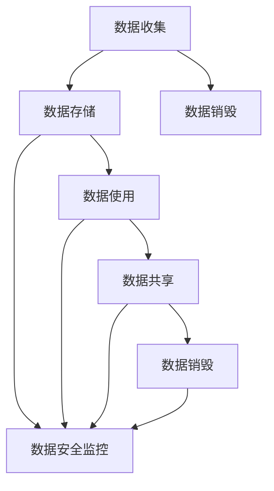

                 

# 企业AI数据安全：从收集到销毁的全生命周期管理

## 关键词：
企业数据安全、AI技术、数据生命周期、数据收集、数据存储、数据使用、数据销毁、数据共享

## 摘要：
在数字化转型的推动下，数据已成为企业的核心资产，而AI技术的广泛应用进一步加剧了数据安全的挑战。本文深入探讨了企业AI数据安全的全生命周期管理，从数据收集到销毁的每个阶段，分析了关键的安全措施和技术。通过结合实际案例和系统架构设计，本文为读者提供了全面的视角和实用的解决方案，助企业在AI时代有效保护数据安全。

---

## 第1章：数据安全的重要性与挑战

### 1.1 数据安全的基本概念
- **数据的定义与分类**：数据是企业运营和决策的基础，分为结构化数据、非结构化数据和半结构化数据。敏感数据如客户信息、财务数据需要特别保护。
- **数据安全的核心目标**：确保数据的机密性、完整性和可用性（CIA三原则）。
- **数据安全的现状与趋势**：随着AI的应用，数据量激增，数据泄露事件频发，数据安全成为企业核心竞争力的关键因素。

### 1.2 AI技术对企业数据安全的影响
- **AI在企业中的应用场景**：如智能客服、精准营销、 fraud detection等，AI依赖大量数据进行训练和推理。
- **AI带来的数据安全挑战**：模型训练可能涉及大量敏感数据，算法漏洞可能导致数据泄露，AI系统可能成为攻击目标。
- **数据安全与企业竞争力的关系**：数据安全是企业信任和合规的基础，直接影响企业的市场地位和客户信任。

### 1.3 数据全生命周期管理的概念
- **数据生命周期的定义**：数据从生成、收集、处理、存储、使用、共享到销毁的全过程。
- **数据全生命周期管理的必要性**：确保数据在每个阶段都受到适当保护，防止数据泄露和滥用。
- **数据生命周期的各阶段特点**：每个阶段有不同的安全风险和管理重点。

---

## 第2章：数据收集阶段的安全管理

### 2.1 数据收集的策略与技术
- **数据收集的合法合规性**：遵循GDPR等数据保护法规，明确数据收集的目的和范围。
- **数据收集的技术实现**：使用API接口、爬虫技术、传感器等进行数据采集，确保数据的准确性和完整性。
- **数据收集中的隐私保护**：采用匿名化技术，如只收集哈希值而非真实数据，减少隐私风险。

### 2.2 数据收集的安全威胁与防护
- **数据收集中的常见威胁**：包括数据篡改、数据丢失、未经授权的访问等。
- **数据收集的安全防护措施**：数据加密传输、数据签名、访问控制列表（ACL）等技术。
- **数据收集过程中的日志记录与审计**：记录数据收集的时间、地点、操作人员等信息，便于后续审计和追溯。

---

## 第3章：数据存储阶段的安全管理

### 3.1 数据存储的安全技术
- **数据加密技术**：使用AES-256等算法对数据进行加密，确保数据在存储过程中的安全性。
- **数据访问控制**：基于角色的访问控制（RBAC）和基于属性的访问控制（ABAC）策略，限制数据访问权限。
- **数据存储的安全架构**：采用多层次防护，如物理安全、网络防火墙、入侵检测系统等，保护存储设备免受攻击。

### 3.2 数据存储的安全威胁与应对
- **数据存储中的常见威胁**：物理设备损坏、网络攻击、内部员工恶意操作等。
- **数据存储的安全防护策略**：定期进行安全漏洞扫描、配置入侵检测系统（IDS）、实施数据备份和恢复策略。
- **数据存储的安全测试与评估**：定期进行渗透测试和安全评估，识别潜在的安全漏洞并及时修复。

---

## 第4章：数据使用阶段的安全管理

### 4.1 数据使用的安全原则
- **数据使用的最小化原则**：仅收集和使用实现业务目标所需的最小数据集，减少暴露风险。
- **数据使用的授权机制**：采用细粒度访问控制，确保数据仅被授权的用户或系统访问。
- **数据使用的审计与监控**：记录数据使用日志，监控异常行为，及时发现和应对数据滥用。

### 4.2 数据使用的安全技术
- **数据匿名化技术**：通过去除标识符或替换敏感信息，使数据无法直接关联到个人。
- **数据脱敏技术**：在数据使用前进行脱敏处理，确保数据在分析过程中不会泄露个体信息。
- **数据使用的安全协议**：制定数据使用协议，明确数据使用的目的、范围和责任，确保合规性。

---

## 第5章：数据共享阶段的安全管理

### 5.1 数据共享的安全挑战
- **数据共享中的隐私保护**：确保在共享数据时，隐私信息不被泄露，需采用匿名化或脱敏技术。
- **数据共享的法律合规性**：遵守数据保护法规，确保数据共享符合相关法律要求。
- **数据共享的安全协议设计**：设计安全协议，明确数据共享的责任、权限和操作流程，确保数据共享的安全性。

### 5.2 数据共享的安全技术
- **数据共享的匿名化处理**：在共享数据前进行匿名化处理，确保数据无法被逆向工程还原。
- **数据共享的访问控制**：采用基于属性的加密（ABE）等技术，确保数据共享仅限于授权方。
- **数据共享的安全传输技术**：使用HTTPS等安全协议进行数据传输，防止数据在传输过程中被截获或篡改。

---

## 第6章：数据销毁阶段的安全管理

### 6.1 数据销毁的必要性
- **数据销毁的定义与意义**：数据销毁是指永久删除数据，使其无法被恢复或滥用。
- **数据销毁的法律要求**：某些行业和法规要求在特定条件下销毁数据，如GDPR要求在用户请求时删除个人数据。
- **数据销毁的常见场景**：业务终止、数据过期、合规性要求等。

### 6.2 数据销毁的安全技术
- **数据销毁的技术方法**：物理销毁（如硬盘消磁、物理破坏）和逻辑销毁（如覆盖写入随机数据、加密后删除密钥）。
- **数据销毁的验证机制**：通过第三方检测或使用数据销毁工具验证数据是否被彻底删除。
- **数据销毁的日志记录与审计**：记录销毁操作的时间、操作人员、销毁数据的范围等信息，便于审计和追溯。

---

## 第7章：企业AI数据安全系统的架构设计

### 7.1 企业AI数据安全系统的概述
- **系统目标**：构建一个覆盖数据全生命周期的安全管理系统，保护企业数据在AI应用中的安全。
- **系统功能设计**：包括数据收集、存储、使用、共享、销毁等模块，每个模块都集成相应的安全措施。
- **系统架构设计**：采用分层架构，包括数据层、应用层、网络层和物理层，确保各层的安全性。

### 7.2 系统架构图

### 7.3 系统核心实现
- **数据收集模块**：集成数据加密和匿名化技术，确保数据在收集过程中的安全性。
- **数据存储模块**：采用加密存储和访问控制技术，保护数据不被未经授权的访问。
- **数据使用模块**：结合数据脱敏和访问控制，确保数据使用符合安全策略。
- **数据共享模块**：使用安全协议和加密技术，确保数据共享过程中的安全。
- **数据销毁模块**：提供物理和逻辑销毁选项，并支持销毁操作的验证和记录。

---

## 第8章：总结与展望

### 8.1 总结
企业AI数据安全的全生命周期管理是一个复杂而重要的任务，需要在数据的每个阶段实施有效的安全措施。通过合理的策略和技术手段，企业可以最大限度地降低数据安全风险，保护数据资产的安全。

### 8.2 展望
未来，随着AI技术的不断发展，数据安全将面临更多挑战。企业需要持续关注新技术和新威胁，及时更新安全策略和措施。同时，数据安全的国际合作和标准制定也将成为重要议题，推动全球数据安全治理的进步。

---

## 附录：数据安全相关工具与资源

- **数据加密工具**：如 OpenSSL、BitLocker
- **数据匿名化工具**：如 k-anonymity、DataMasker
- **数据安全框架**：如 ISO/IEC 27001、NIST
- **合规性标准**：如 GDPR、CCPA

---

通过以上结构，企业可以系统地实施数据全生命周期管理，确保AI时代的数据安全。

