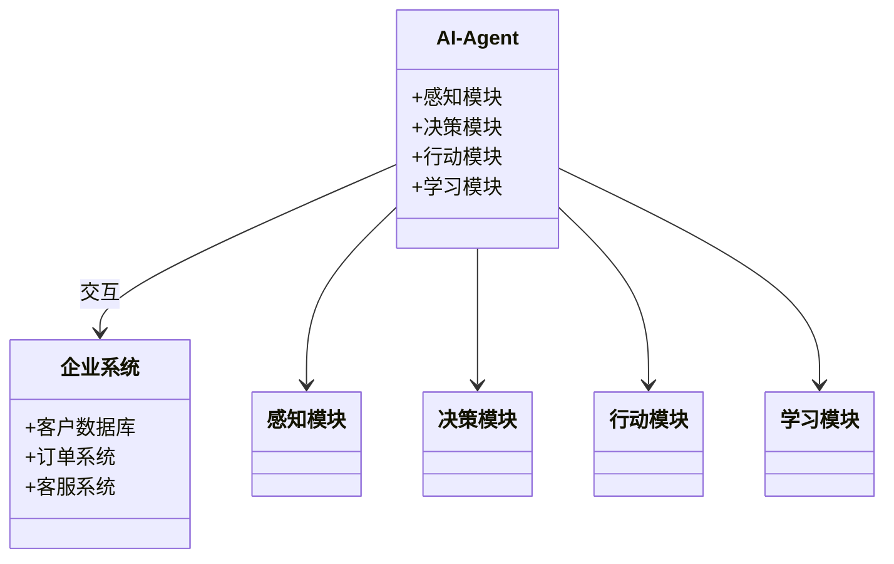

                 


# 企业AI需求分析：识别和评估AI Agent的应用机会

> 关键词：企业AI需求分析，AI Agent，应用机会，系统架构，机器学习

> 摘要：本文将详细探讨企业AI需求分析的核心概念与方法，重点分析如何识别和评估AI Agent的应用机会，通过系统化的分析流程、算法原理、数学模型和实际案例，为读者提供清晰的指导。

---

# 第1章: 企业AI需求分析概述

## 1.1 AI Agent的基本概念

### 1.1.1 AI Agent的定义与特点
AI Agent（人工智能代理）是指能够感知环境并采取行动以实现目标的智能实体。其特点包括：
- **自主性**：能够在没有外部干预的情况下运行。
- **反应性**：能够实时感知环境并做出反应。
- **目标导向**：所有行动都以实现特定目标为导向。
- **学习能力**：能够通过经验优化自身行为。

### 1.1.2 企业AI需求分析的背景
随着企业数字化转型的推进，AI技术的应用越来越广泛。企业需要通过AI Agent来优化业务流程、提升效率和用户体验。

### 1.1.3 企业AI需求分析的目标与范围
目标是识别和评估AI Agent的应用机会，范围涵盖从初步需求分析到技术实现的全过程。

---

## 1.2 企业AI需求分析的必要性

### 1.2.1 企业数字化转型的趋势
企业正面临日益复杂的市场环境，数字化转型成为必然趋势，AI技术是其中的核心驱动力。

### 1.2.2 AI技术对企业的影响
AI技术能够优化决策、提升效率、降低成本，并为企业创造新的业务模式。

### 1.2.3 识别AI Agent机会的重要性
通过识别AI Agent的应用机会，企业可以更好地利用AI技术提升竞争力。

---

## 1.3 本章小结
本章介绍了AI Agent的基本概念和企业AI需求分析的背景及必要性，为后续分析奠定了基础。

---

# 第2章: AI Agent的核心概念与原理

## 2.1 AI Agent的原理

### 2.1.1 AI Agent的基本工作原理
AI Agent通过感知环境、分析信息、制定决策并执行行动来实现目标。

### 2.1.2 AI Agent的类型与分类
AI Agent可以分为基于规则的Agent、基于模型的Agent、基于强化学习的Agent等。

### 2.1.3 AI Agent与传统软件的区别
AI Agent具有自主性和学习能力，而传统软件依赖于固定的规则和流程。

---

## 2.2 AI Agent的核心特征

### 2.2.1 智能性
AI Agent能够理解和处理复杂信息。

### 2.2.2 自适应性
AI Agent能够根据环境变化调整自身行为。

### 2.2.3 学习能力
AI Agent能够通过经验优化自身模型。

### 2.2.4 自我优化能力
AI Agent能够自我改进以提升效率和准确性。

---

## 2.3 AI Agent的系统架构

### 2.3.1 基于规则的架构
通过预定义的规则来指导行动，适用于简单场景。

### 2.3.2 基于模型的架构
通过构建模型来模拟环境并做出决策，适用于复杂场景。

### 2.3.3 基于强化学习的架构
通过不断试错和奖励机制来优化行为，适用于动态变化的环境。

---

## 2.4 本章小结
本章详细介绍了AI Agent的核心概念与原理，为后续分析提供了理论基础。

---

# 第3章: 企业AI需求分析的核心概念

## 3.1 问题背景

### 3.1.1 企业需求分析的复杂性
企业需求分析涉及多个部门和业务流程，具有复杂性。

### 3.1.2 AI Agent在企业中的应用场景
AI Agent可以应用于客户服务、供应链管理、决策支持等多个领域。

### 3.1.3 企业需求分析的边界与外延
明确需求分析的范围和边界，确保分析的准确性和可操作性。

---

## 3.2 核心概念与联系

### 3.2.1 AI Agent的核心要素组成
AI Agent由感知模块、决策模块、行动模块和学习模块组成。

### 3.2.2 企业需求分析的系统模型
构建企业需求分析的系统模型，包括目标、输入、输出和约束条件。

### 3.2.3 AI Agent与企业需求的关系
AI Agent能够满足企业需求，并通过持续优化提升企业效率。

---

## 3.3 本章小结
本章分析了企业AI需求分析的核心概念和相关联系，为后续分析提供了理论支持。

---

# 第4章: AI Agent的应用机会识别

## 4.1 识别AI Agent机会的方法

### 4.1.1 基于业务流程的识别方法
通过分析企业业务流程，识别适合AI Agent的应用场景。

### 4.1.2 基于数据驱动的识别方法
通过分析企业数据，找出适合AI Agent优化的业务环节。

### 4.1.3 基于技术能力的识别方法
根据企业现有的技术能力，评估AI Agent的应用可能性。

---

## 4.2 企业需求分析的步骤

### 4.2.1 明确业务目标
明确企业希望通过AI Agent实现的具体目标。

### 4.2.2 识别关键业务流程
识别企业中的关键业务流程，确定适合AI Agent优化的环节。

### 4.2.3 分析数据需求
分析实现AI Agent所需的 数据来源和数据质量。

### 4.2.4 评估技术可行性
评估企业现有技术能力，确保AI Agent的实现可行性。

---

## 4.3 本章小结
本章详细介绍了识别AI Agent应用机会的方法和企业需求分析的步骤，为企业提供了实用的指导。

---

# 第5章: AI Agent的评估与优化

## 5.1 AI Agent的评估指标

### 5.1.1 性能评估指标
包括响应时间、准确率、处理效率等。

### 5.1.2 用户体验评估指标
包括用户满意度、操作便捷性等。

### 5.1.3 经济效益评估指标
包括成本节约、收益增加等。

---

## 5.2 优化AI Agent的方法

### 5.2.1 基于反馈的优化方法
通过用户反馈不断优化AI Agent的行为。

### 5.2.2 基于数据增强的优化方法
通过增加数据量和数据多样性优化模型性能。

### 5.2.3 基于模型调优的优化方法
通过调整模型参数和优化算法提升性能。

---

## 5.3 本章小结
本章介绍了AI Agent的评估指标和优化方法，为企业提供了持续改进的思路。

---

# 第6章: 企业AI需求分析的系统架构设计

## 6.1 系统分析与设计

### 6.1.1 问题场景介绍
以企业客户服务为例，描述AI Agent的应用场景。

### 6.1.2 项目介绍与目标
明确项目目标为提升客户服务质量，降低人工成本。

### 6.1.3 系统功能设计（领域模型Mermaid类图）


### 6.1.4 系统架构设计（Mermaid架构图）


### 6.1.5 系统接口设计
定义AI-Agent与企业系统的接口，包括数据输入、模型调用和结果返回。

### 6.1.6 系统交互设计（Mermaid序列图）
```mermaid
sequenceDiagram
    客户发起请求
    →> AI-Agent服务
    AI-Agent服务 →> 数据库: 查询客户信息
    Database →> AI-Agent服务: 返回客户信息
    AI-Agent服务 →> 其他系统: 获取订单状态
    其他系统 →> AI-Agent服务: 返回订单状态
    AI-Agent服务 →> 客户: 返回响应
```

---

## 6.2 本章小结
本章通过系统架构设计展示了AI-Agent在企业中的具体实现方式，为后续项目实施提供了参考。

---

# 第7章: 项目实战与案例分析

## 7.1 环境安装与配置

### 7.1.1 开发环境搭建
安装Python、Jupyter Notebook、TensorFlow等工具。

### 7.1.2 工具安装与配置
安装必要的库和工具，配置开发环境。

---

## 7.2 系统核心实现

### 7.2.1 Python代码实现

```python
import tensorflow as tf
from tensorflow import keras

# 定义模型
model = keras.Sequential([
    keras.layers.Dense(64, activation='relu'),
    keras.layers.Dense(1, activation='sigmoid')
])

# 编译模型
model.compile(optimizer='adam', loss='binary_crossentropy', metrics=['accuracy'])

# 训练模型
model.fit(X_train, y_train, epochs=10, batch_size=32)
```

### 7.2.2 代码应用解读与分析
解读上述代码，说明模型的构建、编译和训练过程。

---

## 7.3 项目小结
通过实际案例分析，展示了AI-Agent在企业中的具体应用，验证了理论的可行性。

---

# 附录: 最佳实践与注意事项

## 8.1 最佳实践
- 定期优化AI-Agent模型，提升性能。
- 确保数据质量和多样性，提高模型准确率。
- 建立完善的监控机制，及时发现和解决问题。

## 8.2 注意事项
- 在实施AI-Agent前，充分评估技术可行性和数据准备情况。
- 确保数据安全和隐私保护，符合相关法律法规。
- 定期与业务部门沟通，确保AI-Agent的应用符合业务需求。

---

## 8.3 未来展望
随着AI技术的不断发展，AI-Agent将在更多领域展现出其价值，企业应持续关注技术进步，优化应用。

---

# 结语
通过本文的系统分析和实际案例，读者可以全面了解企业AI需求分析的核心内容，掌握识别和评估AI-Agent的应用机会的方法，为企业数字化转型提供有力支持。

--- 

关键词：企业AI需求分析，AI Agent，应用机会，系统架构，机器学习

