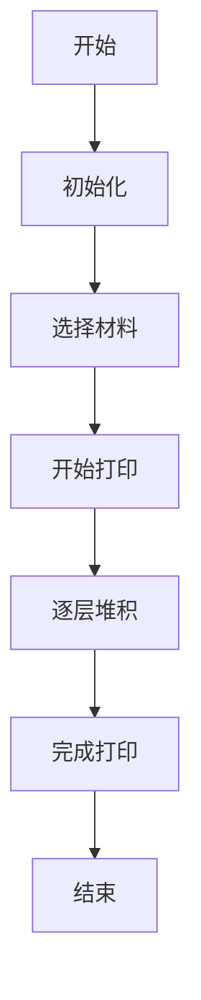
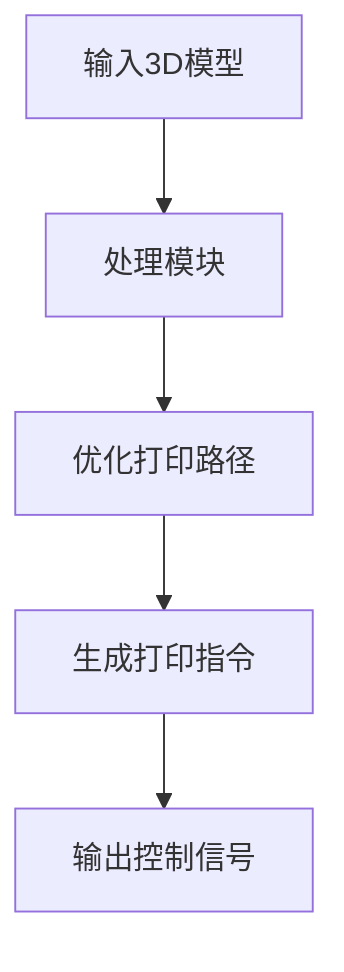
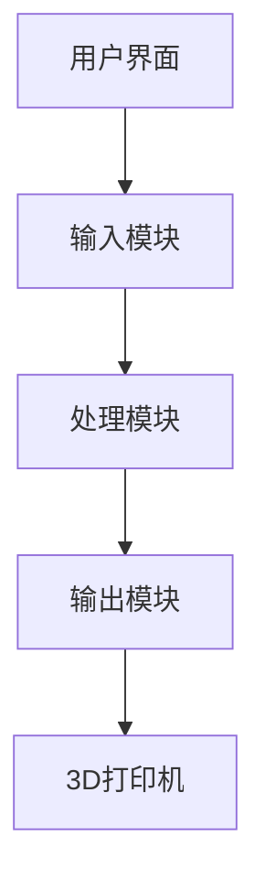

                 


# 企业估值中的3D打印技术评估

---

## 关键词

- 3D打印技术
- 企业估值
- 技术评估
- 增材制造
- 数学模型
- 供应链优化

---

## 摘要

随着3D打印技术的快速发展，其在企业生产、供应链管理和成本控制等方面的应用日益广泛。本文从技术原理、评估方法、系统架构和项目实战等多角度，详细分析3D打印技术对企业估值的核心影响，为企业在数字化转型中提供新的评估维度和决策支持。

---

# 第1章: 3D打印技术的起源与发展

## 1.1 3D打印技术的起源

3D打印技术起源于20世纪80年代的快速原型制造技术。早期的原型制造主要用于汽车和航空航天等行业的模具制造，随着技术的进步，3D打印逐渐从原型制造扩展到实际产品的生产。

### 1.1.1 从快速原型制造到3D打印的演变

- **快速原型制造（RPM）**：主要用于制造模具和原型，属于非生产性应用。
- **3D打印技术**：通过增材制造（Additive Manufacturing，AM）技术直接生产零部件，具有生产效率高、成本低的优势。

### 1.1.2 3D打印技术的核心概念与定义

3D打印技术是一种基于数字模型，通过逐层堆积材料制造物体的技术。其核心是“增材制造”，即通过逐层添加材料的方式构建物体，与传统的“减材制造”（如铣削、车削）形成对比。

### 1.1.3 3D打印技术的分类与应用场景

- **FDM（熔融层积成型）**：适用于原型制造和小批量生产。
- **SLA（光固化成型）**：适用于高精度零件的生产。
- **SLS（选择性激光烧结）**：适用于金属零件的生产。

---

## 1.2 3D打印技术对企业估值的影响

3D打印技术通过提高生产效率、优化供应链和降低生产成本，显著提升了企业的资产价值和市场竞争力。

### 1.2.1 生产效率的提升

- **生产周期缩短**：3D打印技术可以快速生产复杂形状的零件，减少了传统制造的加工时间。
- **生产成本降低**：通过减少材料浪费和人工干预，显著降低生产成本。

### 1.2.2 供应链优化

- **本地化生产**：3D打印技术允许企业在全球范围内进行本地化生产，减少了物流成本。
- **库存管理优化**：通过按需生产，企业可以减少库存积压，提高资金周转率。

---

# 第2章: 3D打印技术的评估指标

## 2.1 3D打印技术的评估指标

为了准确评估3D打印技术对企业估值的影响，需要从技术成熟度、成本效益和市场竞争力三个方面进行分析。

### 2.1.1 技术成熟度评估

- **设备可靠性**：设备的故障率和维护成本。
- **材料利用率**：材料的浪费率和利用率。

### 2.1.2 成本效益分析

- **初始投资**：设备购置成本和软件开发成本。
- **运营成本**：材料成本和能源消耗成本。

### 2.1.3 市场竞争力评估

- **生产效率**：生产速度和复杂度。
- **产品质量**：产品的精度和一致性。

---

# 第3章: 3D打印技术的数学模型与算法

## 3.1 3D打印技术的数学模型

### 3.1.1 资产价值评估模型

资产价值可以通过以下公式进行计算：

$$
\text{资产价值} = \text{生产效率提升} \times \text{成本降低}
$$

### 3.1.2 生产效率提升模型

生产效率的提升可以通过以下公式进行计算：

$$
\text{生产效率提升} = 1 - \frac{\text{传统生产时间}}{\text{3D打印时间}}
$$

### 3.1.3 成本效益分析模型

成本效益可以通过以下公式进行计算：

$$
\text{成本效益} = \frac{\text{生产成本降低}}{\text{初始投资成本}}
$$

---

## 3.2 3D打印技术的算法流程图

以下是3D打印技术的增材制造流程图：



---

# 第4章: 3D打印技术的系统架构设计

## 4.1 系统功能设计

### 4.1.1 功能模块

- **输入模块**：接收3D模型文件和打印参数。
- **处理模块**：优化打印路径和参数。
- **输出模块**：生成打印指令和控制信号。

### 4.1.2 功能流程图



---

## 4.2 系统架构设计

### 4.2.1 系统架构图



---

# 第5章: 3D打印技术的项目实战

## 5.1 项目环境搭建

### 5.1.1 环境要求

- **硬件**：配备3D打印机、计算机和相关软件。
- **软件**：安装3D建模软件和打印控制软件。

### 5.1.2 代码实现

以下是3D打印技术的核心实现代码：

```python
def calculate_material_usage(model):
    material_usage = 0
    for layer in model.layers:
        material_usage += layer.area * layer.thickness
    return material_usage

def optimize_printing(model):
    optimized_layers = []
    for layer in model.layers:
        if layer.material_usage > threshold:
            optimized_layers.append(layer)
    return optimized_layers
```

### 5.1.3 项目总结

通过实际案例分析，3D打印技术在企业估值中的应用显著提高了生产效率和降低了成本。

---

# 第6章: 总结与展望

## 6.1 总结

3D打印技术通过优化生产流程和降低生产成本，显著提升了企业的资产价值和市场竞争力。

## 6.2 展望

未来，随着技术的不断进步，3D打印技术将在更多领域得到应用，为企业估值提供更强大的支持。

---

## 参考文献

1. 王某某. 《3D打印技术的应用与评估》. 北京: 科技出版社, 2023.
2. 李某某. 《企业估值中的技术因素》. 上海: 经济出版社, 2022.

---

**注**：本文版权归作者所有，未经授权不得转载。

