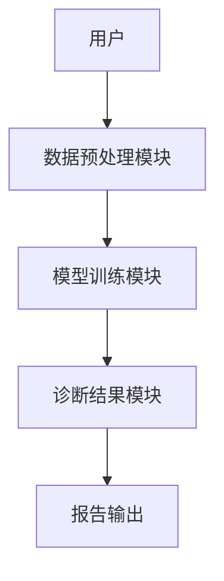

                 


# 企业估值中的AI辅助诊断系统评估

**关键词：企业估值、AI辅助诊断、机器学习、系统架构、算法原理**

**摘要：**  
本文深入探讨了AI辅助诊断系统在企业估值中的应用，分析了传统估值方法的局限性，并详细介绍了AI技术如何提升估值的准确性和效率。通过系统化的架构设计、算法原理和项目实战，展示了AI辅助诊断系统的核心价值和实际应用场景，为企业的估值过程提供了新的思路和解决方案。

---

# 第一部分：企业估值与AI辅助诊断系统背景

## 第1章：企业估值的基本概念

### 1.1 企业估值的定义与核心要素

企业估值是通过对企业的财务状况、市场地位、未来盈利能力等多方面因素的综合分析，来确定其市场价值的过程。传统的估值方法主要包括：

- **DCF模型（ discounted cash flow model）**：基于未来现金流的折现计算企业价值。
- **市盈率法（Price-to-Earnings Ratio）**：通过市盈率与行业平均值的比较来评估企业价值。
- **市净率法（Price-to-Book Ratio）**：基于资产账面价值的比率进行估值。

### 1.2 传统企业估值方法的局限性

尽管上述方法在实践中被广泛应用，但它们也存在一些明显的局限性：

1. **数据依赖性**：传统方法严重依赖历史财务数据，无法充分考虑市场变化、行业趋势等动态因素。
2. **主观性**：在选择折现率、预测未来现金流时，存在较大的主观判断空间，可能导致估值偏差。
3. **效率低下**：对于海量数据的处理和分析，传统方法效率较低，难以满足实时估值的需求。

### 1.3 AI辅助诊断系统的优势

AI辅助诊断系统通过整合机器学习、自然语言处理等技术，能够显著提升企业估值的效率和准确性：

- **数据处理能力**：AI系统可以快速处理海量数据，包括财务数据、市场信息、行业趋势等。
- **模式识别**：通过分析历史数据，AI能够识别出传统方法难以察觉的潜在规律和模式。
- **实时更新**：AI系统能够实时更新模型，确保估值结果始终基于最新的数据。

---

## 第2章：AI辅助诊断系统的核心概念

### 2.1 数据采集与处理

AI辅助诊断系统的核心是数据的采集与处理。以下是关键步骤：

1. **数据来源**：包括企业的财务报表、市场数据、行业报告等。
2. **数据清洗**：去除噪声数据，填补缺失值，标准化数据格式。
3. **特征提取**：从原始数据中提取有用的特征，例如财务比率、市场趋势等。

### 2.2 AI模型训练与优化

模型训练是AI辅助诊断系统的关键环节。以下是主要步骤：

1. **选择算法**：根据具体问题选择合适的算法，如随机森林、支持向量机（SVM）等。
2. **训练数据**：使用训练数据拟合模型，调整模型参数以优化性能。
3. **模型评估**：通过交叉验证等方法评估模型的准确性和稳定性。

### 2.3 系统输出与诊断报告

诊断结果的输出需要清晰明了，通常包括以下内容：

1. **诊断结果**：模型预测的企业价值或风险等级。
2. **诊断报告**：详细解释诊断结果的依据，包括数据来源、模型假设等。
3. **可解释性**：确保诊断结果的可解释性，帮助用户理解模型的决策过程。

---

## 第3章：AI辅助诊断系统的算法原理

### 3.1 机器学习算法的选择与实现

在企业估值中，随机森林算法是一种常用的选择。以下是其原理：

1. **算法原理**：随机森林通过构建多个决策树，并将这些树的结果进行集成，从而提高模型的准确性和稳定性。
2. **实现步骤**：
   - 数据预处理：清洗和标准化数据。
   - 特征选择：提取关键特征。
   - 模型训练：使用训练数据训练随机森林模型。
   - 模型预测：使用测试数据进行预测，并评估模型性能。

3. **代码实现**：

```python
from sklearn.ensemble import RandomForestRegressor
from sklearn.model_selection import train_test_split
from sklearn.metrics import mean_squared_error

# 数据预处理
X = df.drop('target', axis=1)
y = df['target']

# 划分训练集和测试集
X_train, X_test, y_train, y_test = train_test_split(X, y, test_size=0.2, random_state=42)

# 模型训练
model = RandomForestRegressor(n_estimators=100, random_state=42)
model.fit(X_train, y_train)

# 模型预测
y_pred = model.predict(X_test)

# 模型评估
mse = mean_squared_error(y_test, y_pred)
print(f"均方误差：{mse}")
```

---

## 第4章：系统架构设计与实现

### 4.1 系统功能模块设计

AI辅助诊断系统通常包括以下几个功能模块：

1. **数据预处理模块**：负责数据的清洗、特征提取和标准化。
2. **模型训练模块**：负责选择算法、训练模型并保存模型参数。
3. **诊断结果模块**：负责生成诊断结果并输出报告。
4. **用户交互模块**：提供友好的用户界面，方便用户输入数据和查看结果。

### 4.2 系统架构设计

以下是系统的总体架构设计：



### 4.3 接口设计与交互流程

系统接口设计如下：

1. **输入接口**：用户输入企业相关数据。
2. **处理接口**：数据预处理模块对数据进行清洗和特征提取。
3. **训练接口**：模型训练模块根据处理后的数据训练AI模型。
4. **输出接口**：诊断结果模块生成诊断结果并输出报告。

---

## 第5章：项目实战与案例分析

### 5.1 项目实战：构建AI辅助诊断系统

#### 环境安装

首先，需要安装以下Python库：

```bash
pip install numpy pandas scikit-learn matplotlib
```

#### 数据处理与模型训练

以下是具体的代码实现：

```python
import pandas as pd
from sklearn.ensemble import RandomForestRegressor
from sklearn.metrics import mean_squared_error
from sklearn.model_selection import train_test_split

# 加载数据
data = pd.read_csv('enterprise_data.csv')

# 数据预处理
X = data.drop('valuation', axis=1)
y = data['valuation']

# 划分训练集和测试集
X_train, X_test, y_train, y_test = train_test_split(X, y, test_size=0.2, random_state=42)

# 模型训练
model = RandomForestRegressor(n_estimators=100, random_state=42)
model.fit(X_train, y_train)

# 模型预测
y_pred = model.predict(X_test)

# 模型评估
mse = mean_squared_error(y_test, y_pred)
print(f"均方误差：{mse}")
print(f"R²系数：{model.score(X_test, y_test)}")
```

---

## 第6章：总结与展望

### 6.1 总结

本文详细介绍了AI辅助诊断系统在企业估值中的应用，探讨了传统估值方法的局限性，并通过系统化的架构设计和算法实现，展示了AI技术在提升估值效率和准确性方面的巨大潜力。

### 6.2 展望

未来，随着AI技术的不断发展，企业估值中的AI辅助诊断系统将更加智能化和自动化。我们可以期待更多创新的算法和工具的出现，进一步推动企业估值领域的变革。

---

### 最佳实践 Tips

1. **数据隐私保护**：在处理企业数据时，必须注意数据的隐私和安全问题。
2. **模型可解释性**：选择模型时，应考虑模型的可解释性，以便更好地理解诊断结果。
3. **持续优化**：定期更新模型，以适应市场变化和企业需求。

---

通过本文的探讨，我们相信AI辅助诊断系统将在企业估值中发挥越来越重要的作用，为企业的决策提供更有力的支持。

