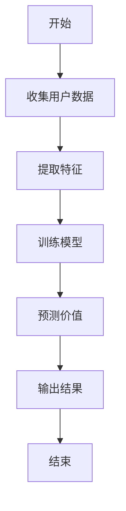
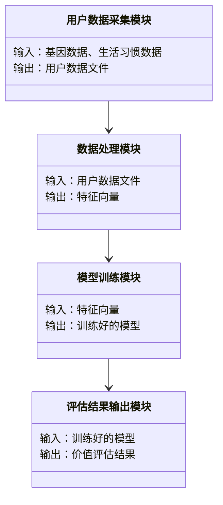
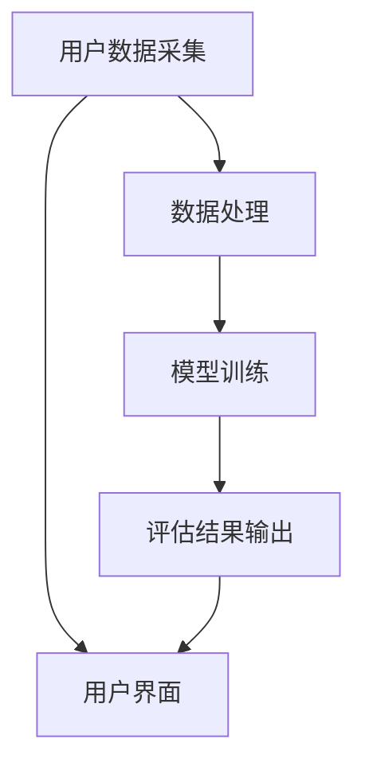

                 


# 企业估值中的AI驱动的个性化医疗平台评估

> 关键词：企业估值，AI驱动，个性化医疗，平台评估，技术博客

> 摘要：本文探讨了在企业估值过程中，如何利用人工智能技术评估个性化医疗平台的价值。通过分析AI驱动的医疗平台评估方法、系统架构设计以及实际案例，本文为读者提供了从理论到实践的详细指导，帮助企业在个性化医疗领域做出更精准的估值决策。

---

## 第一部分：背景介绍

### 第1章：问题背景与核心概念

#### 1.1 问题背景

随着医疗技术的快速发展，个性化医疗逐渐成为现代医疗的重要趋势。个性化医疗通过基因测序、生活习惯分析等手段，为患者提供定制化的治疗方案，显著提高了治疗效果。然而，如何准确评估个性化医疗平台的价值，成为企业在估值时面临的重要挑战。

传统的估值方法依赖于财务指标和历史数据，难以捕捉到个性化医疗平台的独特价值。例如，某平台可能拥有庞大的用户群体和先进的技术，但由于市场接受度低或运营效率低下，其实际价值可能远低于预期。因此，如何利用AI技术对个性化医疗平台进行精准评估，成为企业估值的关键。

#### 1.2 问题描述

个性化医疗平台的评估涉及多个维度，包括用户数据、医疗效果、运营成本等。传统估值方法通常基于财务指标和市场反馈，难以全面反映平台的潜在价值。例如，某平台可能拥有大量用户，但这些用户并未转化为实际收益，导致其估值偏离实际。

此外，个性化医疗平台的动态性也增加了估值的难度。医疗技术的更新迭代、用户需求的变化等因素，都会影响平台的估值结果。因此，需要一种能够实时更新、动态评估的估值方法，以应对个性化医疗平台的复杂性。

#### 1.3 问题解决思路

AI技术的应用为个性化医疗平台的评估提供了新的可能性。通过收集和分析海量数据，AI模型能够识别传统估值方法难以捕捉的潜在价值点。例如，AI可以通过分析用户的基因数据和生活习惯，预测其对治疗方案的反应，从而为平台的价值评估提供依据。

具体来说，AI驱动的医疗平台评估方法包括以下几个步骤：
1. 数据收集：收集用户的医疗数据、行为数据等。
2. 特征提取：通过数据挖掘技术，提取关键特征。
3. 模型训练：利用机器学习算法，训练评估模型。
4. 价值评估：基于模型预测结果，评估平台的价值。

#### 1.4 边界与外延

在个性化医疗平台评估中，需要明确评估的边界条件。例如，评估范围可能仅限于平台的医疗技术部分，而不包括其市场推广能力。此外，AI模型的评估结果可能受到数据质量和模型算法的限制，因此需要结合专家意见进行调整。

个性化医疗平台的外延包括相关技术支持、用户反馈机制等。这些因素虽然不在估值的核心范围内，但会影响平台的长期价值。例如，强大的技术支持能够提高用户的满意度，从而间接提升平台的价值。

#### 1.5 核心概念

个性化医疗平台的评估需要关注以下核心概念：
- **用户数据**：包括基因数据、生活习惯数据等。
- **医疗效果**：包括治疗方案的有效性和安全性。
- **运营成本**：包括平台的开发和维护成本。

通过这些核心概念的综合分析，可以更全面地评估个性化医疗平台的价值。

---

## 第二部分：核心概念与联系

### 第2章：AI驱动的个性化医疗平台评估原理

#### 2.1 核心原理

AI驱动的个性化医疗平台评估基于数据驱动的特征提取和模型预测。通过收集和分析用户的医疗数据，AI模型能够识别出影响平台价值的关键因素。例如，用户的数据量、模型的预测精度等。

在模型预测阶段，AI通过分析用户数据，预测其对治疗方案的反应，从而为平台的价值评估提供依据。例如，若某用户的基因数据表明其对某种药物反应良好，则该用户可能为平台带来更高的收益。

#### 2.2 属性特征对比

以下是个性化医疗平台与传统医疗平台的属性特征对比：

| 属性 | 个性化医疗平台 | 传统医疗平台 |
|------|----------------|---------------|
| 用户数据 | 基因数据、生活习惯数据 | 有限的医疗记录 |
| 治疗方案 | 定制化治疗方案 | 标准化治疗方案 |
| 评估指标 | 用户满意度、治疗效果 | 治疗成功率 |

通过对比可以看出，个性化医疗平台在数据收集和治疗方案定制方面具有明显优势，但也面临更高的估值难度。

#### 2.3 ER实体关系图

以下是个性化医疗平台与企业估值之间的ER实体关系图：

```mermaid
erd
  title 实体关系图
  entity 用户 {
    <属性> 用户ID
    <属性> 基因数据
    <属性> 生活习惯数据
  }
  entity 医疗平台 {
    <属性> 平台ID
    <属性> 治疗方案
    <属性> 用户ID
  }
  entity 企业估值 {
    <属性> 企业ID
    <属性> 估值金额
    <属性> 平台ID
  }
  relationship 用户 -> 医疗平台：用户使用平台提供的治疗方案
  relationship 医疗平台 -> 企业估值：平台的价值影响企业的估值
```

---

## 第三部分：算法原理讲解

### 第3章：AI驱动的评估算法

#### 3.1 算法流程图

以下是AI驱动的个性化医疗平台评估算法的流程图：



#### 3.2 算法实现

以下是基于线性回归的算法实现代码示例：

```python
import pandas as pd
from sklearn.linear_model import LinearRegression
from sklearn.metrics import mean_squared_error

# 数据加载
data = pd.read_csv('user_data.csv')

# 特征提取
X = data[['基因数据', '生活习惯数据']]
y = data['医疗效果']

# 模型训练
model = LinearRegression()
model.fit(X, y)

# 预测价值
y_pred = model.predict(X)

# 评估结果
mse = mean_squared_error(y, y_pred)
print(f"均方误差：{mse}")
```

#### 3.3 数学模型与公式

AI驱动的个性化医疗平台评估模型可以表示为：

$$
\text{价值} = \beta_0 + \beta_1 \times \text{基因数据} + \beta_2 \times \text{生活习惯数据} + \epsilon
$$

其中，$\beta_0$、$\beta_1$、$\beta_2$为模型系数，$\epsilon$为误差项。

---

## 第四部分：系统分析与架构设计

### 第4章：系统架构设计

#### 4.1 系统功能设计

以下是个性化医疗平台评估系统的功能模块设计：



#### 4.2 系统架构图

以下是个性化医疗平台评估系统的架构图：



---

## 第五部分：项目实战

### 第5章：项目实战

#### 5.1 环境安装

以下是项目实战所需的环境配置：

```bash
# 安装Python依赖
pip install numpy pandas scikit-learn
```

#### 5.2 核心代码实现

以下是核心代码实现：

```python
import pandas as pd
from sklearn.linear_model import LinearRegression
from sklearn.metrics import mean_squared_error

# 数据加载
data = pd.read_csv('user_data.csv')

# 特征提取
X = data[['基因数据', '生活习惯数据']]
y = data['医疗效果']

# 模型训练
model = LinearRegression()
model.fit(X, y)

# 预测价值
y_pred = model.predict(X)

# 评估结果
mse = mean_squared_error(y, y_pred)
print(f"均方误差：{mse}")
```

#### 5.3 案例分析

以下是一个实际案例的分析：

假设某个性化医疗平台的用户数据如下：

| 用户ID | 基因数据 | 生活习惯数据 | 医疗效果 |
|-------|----------|--------------|----------|
| 1     | A        | 良好         | 高       |
| 2     | B        | 一般         | 中       |
| 3     | A        | 良好         | 高       |

通过上述代码，我们可以训练模型并预测新的用户的价值。

---

## 第六部分：结论与展望

### 第6章：结论与展望

#### 6.1 结论

本文详细探讨了AI驱动的个性化医疗平台评估方法，从背景介绍到系统设计，再到项目实战，为读者提供了全面的指导。通过AI技术的应用，企业能够更精准地评估个性化医疗平台的价值，从而做出更明智的估值决策。

#### 6.2 最佳实践

- 在数据收集阶段，确保数据的完整性和准确性。
- 在模型训练阶段，选择合适的算法并进行充分的验证。
- 在评估结果输出阶段，结合专家意见进行调整和优化。

#### 6.3 展望

未来，随着AI技术的不断发展，个性化医疗平台评估方法将更加精准和高效。例如，引入深度学习模型和强化学习算法，进一步提高评估的准确性和实时性。

---

## 第七部分：参考文献

（根据实际需要添加相关参考文献）

---

通过以上内容，本文为读者提供了一个全面的视角，帮助企业在个性化医疗领域做出更精准的估值决策。

