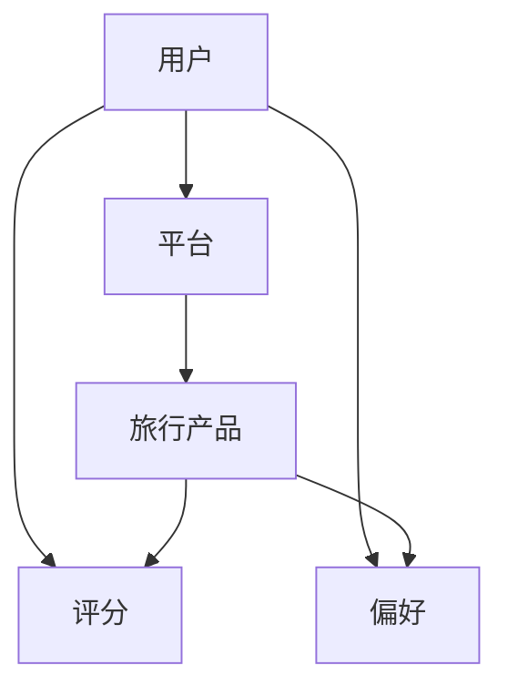
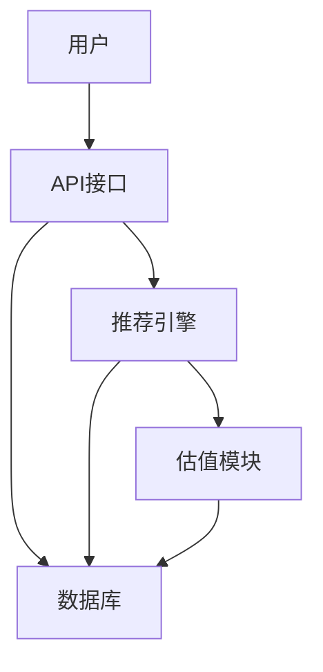
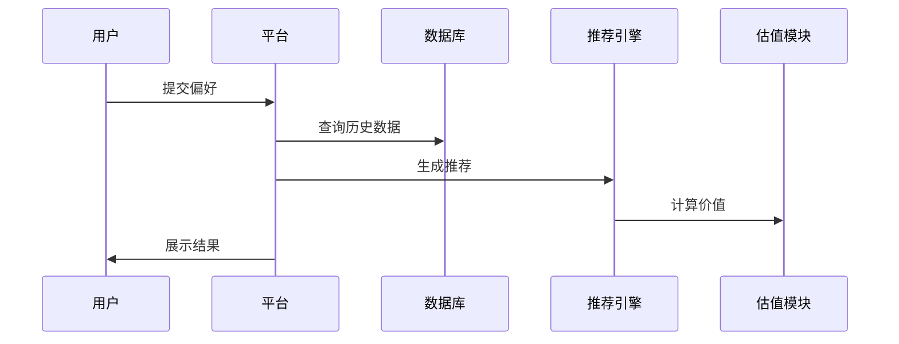

                 


# 企业估值中的AI驱动的个性化旅游规划平台评估

> 关键词：企业估值、AI驱动、个性化旅游规划、平台评估、推荐算法

> 摘要：本文探讨如何利用AI技术评估个性化旅游规划平台的价值，涵盖背景分析、算法原理、系统架构及项目实战，帮助读者理解AI在旅游规划中的应用。

---

## 第1章：背景与问题分析

### 1.1 问题背景

个性化旅游规划平台通过AI技术为用户定制旅行方案，解决了传统旅游服务的标准化问题。随着用户需求多样化，企业需要通过AI优化平台，提升用户体验和市场价值。

### 1.2 问题描述

个性化旅游规划需解决用户需求识别和资源匹配问题，涉及数据收集、处理、分析和推荐。平台评估涉及数据预处理、模型选择和结果分析。

### 1.3 边界与外延

平台评估边界包括用户数据、旅行产品和市场环境，涉及数据收集、处理、分析和结果展示。相关领域包括大数据、AI和旅游服务。

### 1.4 核心要素

用户行为数据、产品特征和市场环境是评估的核心要素，用于构建推荐模型和估值指标。

---

## 第2章：核心概念与原理

### 2.1 核心概念

AI驱动的个性化推荐和估值模型，解决用户偏好识别和资源优化配置问题。

### 2.2 概念对比

| 比较项       | 协同过滤 | 深度学习 |
| ------------ | -------- | -------- |
| 数据要求     | 低       | 高       |
| 可解释性     | 高       | 低       |
| 处理复杂性   | 低       | 高       |

### 2.3 实体关系图



---

## 第3章：算法原理与数学模型

### 3.1 协同过滤算法

协同过滤基于用户相似性推荐旅行产品，分为基于用户的协同过滤和基于物品的协同过滤。

### 3.2 深度学习推荐模型

深度学习模型通过神经网络处理复杂数据，常用模型包括基于注意力机制的模型。

### 3.3 数学模型

协同过滤的相似度计算公式：
$$ sim(i,j) = \frac{\sum_{k} r_{i,k} r_{j,k}}{\sqrt{\sum_{k} r_{i,k}^2} \sqrt{\sum_{k} r_{j,k}^2}} $$

---

## 第4章：系统分析与架构设计

### 4.1 系统功能设计

系统功能包括数据采集、推荐引擎、估值模块和用户界面。

### 4.2 系统架构设计



### 4.3 系统交互



---

## 第5章：项目实战

### 5.1 环境搭建

使用Python 3.8，安装numpy、pandas和scikit-learn库。

### 5.2 核心实现

```python
from sklearn.metrics.pairwise import cosine_similarity
import numpy as np

# 示例数据矩阵
X = np.array([[1, 2, 3],
              [4, 5, 6],
              [7, 8, 9]])

# 计算余弦相似度
similarity = cosine_similarity(X)
print(similarity)
```

### 5.3 案例分析

通过历史数据训练模型，分析用户偏好，优化推荐策略。

---

## 第6章：总结与最佳实践

### 6.1 总结

AI技术提升个性化旅游规划的效率和精准度，帮助企业优化平台估值。

### 6.2 小结

本文详细讲解了AI在旅游规划中的应用，涵盖算法、系统设计和项目实战。

### 6.3 注意事项

确保数据隐私和算法透明度，提升用户信任。

### 6.4 拓展阅读

推荐阅读《推荐系统实战》和《深度学习与推荐系统》。

---

通过以上章节，我们系统地分析了AI在个性化旅游规划中的应用，从算法到实践，帮助读者全面理解并应用相关技术。

