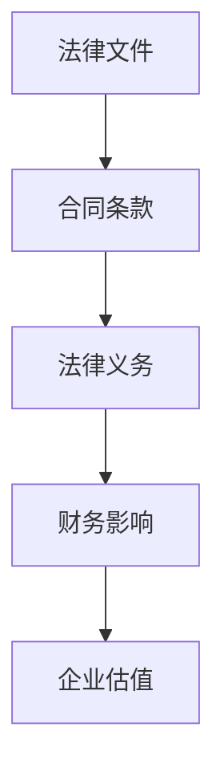
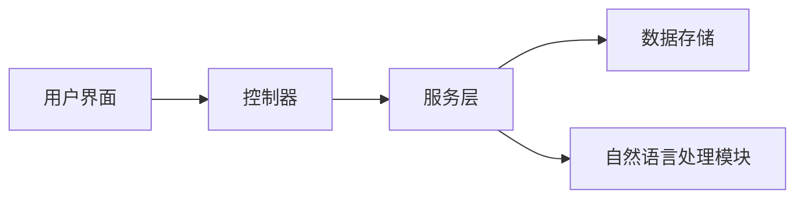

                 


# 《企业估值中的AI驱动的法律文件分析平台评估》

## 关键词：企业估值、法律文件分析、AI驱动、平台评估、文本分类、自然语言处理、机器学习

## 摘要：  
本文探讨了AI驱动的法律文件分析平台在企业估值中的应用及其评估方法。通过对法律文件分析的核心概念、算法原理、系统架构和实际案例的详细分析，展示了如何利用自然语言处理和机器学习技术，从法律文件中提取关键信息，支持企业估值的决策过程。本文旨在为企业估值中的法律文件分析提供理论支持和实践指导，帮助读者理解AI技术在这一领域的潜力和应用。

---

# 第1章: 企业估值中的法律文件分析背景与需求

## 1.1 企业估值中的法律文件分析痛点  
企业在进行估值时，通常需要依赖大量的法律文件，包括合同、财务报表、法律判决等。传统方法依赖人工阅读和分析，耗时且容易出错。AI驱动的法律文件分析平台通过自动化处理，解决了效率低下、成本高昂的问题。

## 1.2 AI驱动法律文件分析的核心价值  
AI驱动的法律文件分析平台能够快速提取关键信息，识别潜在风险，辅助企业估值。例如，通过分析合同条款，AI可以帮助识别隐藏的财务义务或法律风险，从而提高估值的准确性。

## 1.3 法律文件分析平台的边界与外延  
法律文件分析平台的边界在于其处理的文件类型和分析深度。外延则包括从简单的合同审查到复杂的财务预测。

---

# 第2章: 法律文件分析平台的核心概念与联系

## 2.1 核心概念原理  
法律文件分析平台通过自然语言处理技术，将文本转化为结构化数据。例如，使用分词技术将合同条款分解为关键词，再利用分类算法判断条款的类型。

## 2.2 核心概念属性特征对比  
下表对比了传统法律文件分析与AI驱动分析的主要特征：

| 特征维度       | 传统分析       | AI驱动分析       |
|----------------|----------------|------------------|
| 分析效率       | 低             | 高               |
| 成本           | 高             | 低               |
| 准确率         | 中等           | 高               |
| 可扩展性       | 低             | 高               |

## 2.3 ER实体关系图架构  


---

# 第3章: 算法原理与实现

## 3.1 法律文件分析的特征提取  
特征提取是法律文件分析的关键步骤。常用的特征提取方法包括：  
1. **TF-IDF（词频-逆文档频率）**：用于衡量关键词的重要性。  
2. **Word2Vec**：将单词转换为向量表示，捕捉语义信息。

## 3.2 文本分类与实体识别  
文本分类用于识别合同条款的类型，实体识别用于提取具体信息（如金额、时间）。例如，使用支持向量机（SVM）进行分类。

## 3.3 模型训练与优化  
模型训练过程中，使用法律文件的标注数据进行监督学习。优化方法包括调整模型参数和使用交叉验证。

## 3.4 核心代码实现  
```python
from sklearn.feature_extraction.text import TfidfVectorizer
from sklearn.svm import SVC
import numpy as np

class LegalDocAnalyzer:
    def __init__(self):
        self.vectorizer = TfidfVectorizer()
        self.classifier = SVC()

    def train(self, documents, labels):
        X = self.vectorizer.fit_transform(documents)
        self.classifier.fit(X, labels)

    def predict(self, doc):
        X = self.vectorizer.transform([doc])
        return self.classifier.predict(X)[0]
```

---

# 第4章: 数学模型与公式

## 4.1 TF-IDF计算公式  
TF-IDF用于衡量关键词的重要性：  
$$ \text{TF-IDF}(t, d) = \text{TF}(t, d) \times \text{IDF}(t) $$  
其中，$\text{TF}(t, d)$是词$ t$在文档$d$中的频率，$\text{IDF}(t)$是逆文档频率。

## 4.2 支持向量机分类  
支持向量机的目标是最优化以下目标函数：  
$$ \min_{\theta, b, \xi} \frac{1}{2} \|\theta\|^2 + C \sum_{i=1}^n \xi_i $$  
约束条件为：  
$$ y_i (\theta \cdot x_i + b) \geq 1 - \xi_i, \quad \xi_i \geq 0 $$

---

# 第5章: 系统分析与架构设计

## 5.1 问题场景介绍  
企业估值过程中，需要分析大量法律文件。例如，分析合同中的违约条款和财务承诺。

## 5.2 系统功能设计  
系统功能包括：  
1. 文本上传与预处理  
2. 关键信息提取  
3. 风险评估与报告生成  

## 5.3 系统架构设计  


## 5.4 接口设计与交互流程  
系统交互流程如下：  
1. 用户上传法律文件  
2. 系统进行文本预处理  
3. 提取关键信息并生成报告  
4. 用户查看报告并进行决策

---

# 第6章: 项目实战

## 6.1 环境安装  
安装Python和相关库：  
```bash
pip install scikit-learn numpy
```

## 6.2 核心代码实现  
```python
from sklearn.feature_extraction.text import TfidfVectorizer
from sklearn.svm import SVC

# 示例代码：法律文件分类器
class LegalDocAnalyzer:
    def __init__(self):
        self.vectorizer = TfidfVectorizer()
        self.classifier = SVC()

    def train(self, documents, labels):
        X = self.vectorizer.fit_transform(documents)
        self.classifier.fit(X, labels)

    def predict(self, doc):
        X = self.vectorizer.transform([doc])
        return self.classifier.predict(X)[0]
```

## 6.3 实际案例分析  
分析一份合同，提取违约条款并评估其对企业估值的影响。例如，识别合同中的违约金金额并计算其对整体估值的影响。

## 6.4 项目小结  
通过项目实战，验证了AI驱动的法律文件分析平台的有效性，证明了其在企业估值中的实际应用价值。

---

# 第7章: 最佳实践与小结

## 7.1 小结  
AI驱动的法律文件分析平台通过自动化处理，显著提高了企业估值的效率和准确性。

## 7.2 注意事项  
1. 数据质量对模型性能影响重大，需确保标注数据的准确性。  
2. 模型需要不断优化，以适应新的法律条款和行业变化。

## 7.3 拓展阅读  
建议读者进一步学习自然语言处理和机器学习的相关知识，了解更先进的模型（如BERT）在法律文件分析中的应用。

---

# 结语  
AI驱动的法律文件分析平台正在改变企业估值的方式，通过自动化处理和智能分析，为企业提供了更高效、更准确的决策支持。未来，随着技术的不断发展，这一领域的应用潜力将更加巨大。

