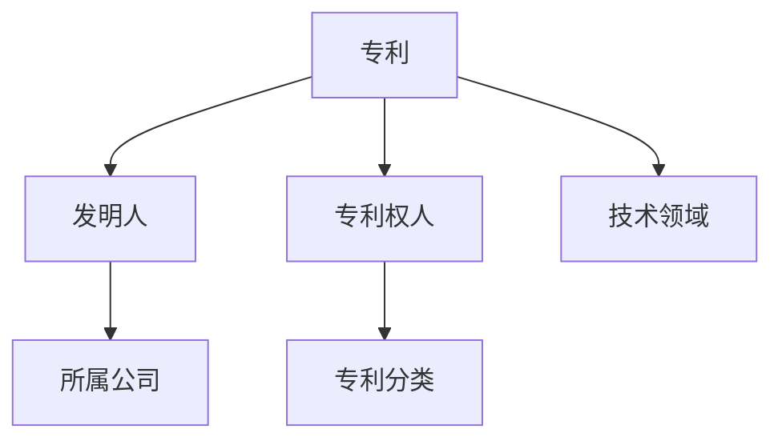
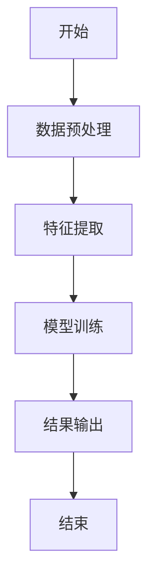
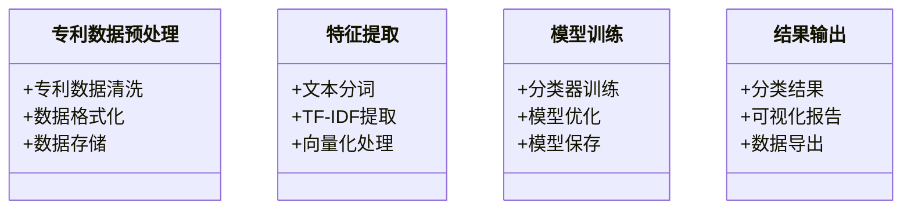
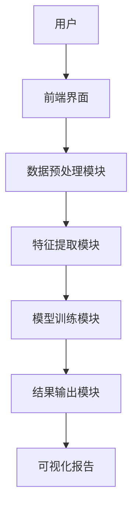
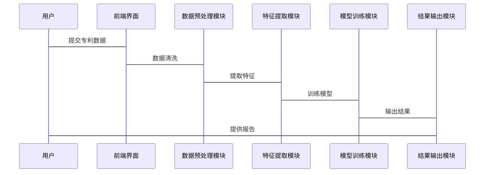

                 


# 企业估值中的AI驱动的自动化专利分析平台评估

## 关键词：
企业估值、AI驱动、专利分析、自动化、机器学习、系统架构、文本挖掘

## 摘要：
在企业估值过程中，专利分析是评估企业技术实力和市场竞争力的重要手段。传统的专利分析依赖人工操作，效率低下且容易出错。本文探讨如何利用AI驱动的自动化专利分析平台，通过文本挖掘、机器学习和大数据分析等技术，提高专利分析的效率和准确性。文章从背景介绍、核心概念、算法原理、系统架构、项目实战到最佳实践，全面阐述AI驱动的专利分析平台的构建与应用，为企业估值提供有力支持。

---

## 第一部分：背景介绍

### 第1章：企业估值与专利分析概述

#### 1.1 问题背景
企业估值是企业战略决策的重要组成部分，专利作为企业的无形资产，在估值中占据重要地位。然而，传统专利分析方法存在数据量大、复杂性高、效率低的问题。

#### 1.2 问题描述
专利分析涉及专利数据的收集、清洗、分类、检索和可视化等多个步骤，传统方法依赖人工操作，难以应对海量数据，且容易遗漏关键信息。

#### 1.3 问题解决
AI驱动的自动化专利分析平台通过自然语言处理、机器学习和大数据分析技术，自动处理专利数据，提高分析效率和准确性。

#### 1.4 边界与外延
平台专注于专利数据的自动化分析，边界包括数据清洗、分类和检索，外延则涉及与其他估值方法的结合。

#### 1.5 核心概念结构与组成
专利分析平台由数据预处理、特征提取、模型训练和结果输出组成，结合AI技术实现自动化分析。

---

## 第二部分：核心概念与联系

### 第2章：AI驱动的自动化专利分析原理

#### 2.1 核心概念原理
文本挖掘和自然语言处理用于提取专利文本中的关键信息，机器学习模型用于分类和预测。

#### 2.2 概念属性对比表格
| 传统分析 | AI驱动分析 |
|----------|-------------|
| 人工操作 | 自动化处理 |
| 低效 | 高效 |

#### 2.3 ER实体关系图


---

## 第三部分：算法原理讲解

### 第3章：文本挖掘与分类算法

#### 3.1 算法流程图


#### 3.2 Python代码实现
```python
from sklearn.feature_extraction.text import TfidfVectorizer
from sklearn.svm import SVC

vectorizer = TfidfVectorizer()
X = vectorizer.fit_transform(documents)
model = SVC()
model.fit(X, labels)
```

#### 3.3 数学公式
TF-IDF计算公式：
$$
TF_{td} = \frac{f_{td}}{N}
$$
$$
IDF_{td} = \log\left(\frac{N}{f_{td}}\right)
$$
SVM分类模型：
$$
y = \text{sign}(w \cdot x + b)
$$`

---

## 第四部分：系统分析与架构设计

### 第4章：系统功能与架构

#### 4.1 系统功能设计


#### 4.2 系统架构设计


#### 4.3 接口设计与交互


---

## 第五部分：项目实战

### 第5章：环境安装与核心代码实现

#### 5.1 环境安装
```bash
pip install scikit-learn jieba mermaid4jupyter
```

#### 5.2 核心代码实现
```python
import jieba
from sklearn.feature_extraction.text import TfidfVectorizer
from sklearn.svm import SVC
from sklearn.metrics import accuracy_score

# 数据预处理
documents = [...]  # 专利文本数据
labels = [...]     # 分类标签

# 分词处理
segmented_texts = [' '.join(jieba.cut(doc)) for doc in documents]

# 特征提取
vectorizer = TfidfVectorizer()
X = vectorizer.fit_transform(segmented_texts)

# 模型训练
model = SVC()
model.fit(X, labels)

# 模型评估
predicted = model.predict(X)
print("Accuracy:", accuracy_score(predicted, labels))
```

#### 5.3 案例分析
通过具体案例展示平台的应用，分析结果展示企业的技术优势和市场地位。

---

## 第六部分：最佳实践与总结

### 第6章：总结与展望

#### 6.1 最佳实践
- 数据清洗和特征提取是关键步骤
- 选择合适的模型和参数优化提升准确性
- 结果可视化和报告生成增强实用性

#### 6.2 小结
AI驱动的自动化专利分析平台显著提升了企业估值的效率和准确性，为企业决策提供有力支持。

#### 6.3 注意事项
- 数据质量和完整性直接影响结果
- 模型选择和调优需要根据具体场景调整
- 系统架构设计需考虑扩展性和维护性

#### 6.4 拓展阅读
推荐相关书籍和论文，深入学习AI驱动的专利分析技术。

---

## 结语
AI驱动的自动化专利分析平台是企业估值的重要工具，通过文本挖掘、机器学习和系统架构设计，实现高效准确的专利分析，为企业决策提供可靠依据。未来，随着技术进步，平台将更加智能化和人性化，为企业创造更大价值。

