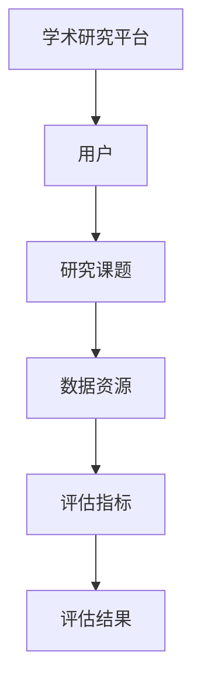
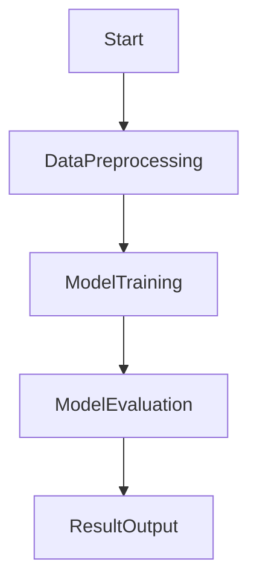

                 

# 企业估值中的AI驱动的自动化学术研究平台评估

> 关键词：企业估值，AI驱动，学术研究平台，自动化评估，机器学习

> 摘要：本文探讨了如何利用人工智能技术实现学术研究平台的自动化评估，以支持企业估值。通过分析平台的核心要素、AI算法原理、系统架构设计和项目实战，本文提出了一个基于机器学习的自动化评估方法，并通过案例展示了其实际应用价值。

---

## 第1章: 企业估值与AI驱动的学术研究平台评估背景

### 1.1 问题背景

企业在现代经济中扮演着至关重要的角色，其价值评估直接关系到投资决策、融资活动和市场表现。传统的企业估值方法依赖于财务指标、市场数据和经验判断，但这些方法往往忽略了学术研究平台的潜在价值。学术研究平台作为企业创新的核心驱动力，其评估对企业估值具有重要意义。

#### 1.1.1 企业估值的传统方法与局限性
传统的企业估值方法主要包括财务指标分析、市场比较法和现金流折现法等。然而，这些方法难以全面反映企业的创新能力、技术储备和研发投入，尤其是在学术研究平台方面存在明显不足。

#### 1.1.2 学术研究平台的重要性
学术研究平台是企业创新的核心工具，涵盖研究数据、论文发表、专利申请等多个维度。通过评估学术研究平台，可以更准确地衡量企业的创新能力和未来潜力。

#### 1.1.3 AI驱动的自动化评估的必要性
随着AI技术的快速发展，利用机器学习算法对学术研究平台进行自动化评估成为可能。这种方法能够高效处理大量数据，发现传统方法难以察觉的模式和趋势。

### 1.2 问题描述

学术研究平台评估的核心目标是通过分析平台的功能、资源分配和用户行为，量化其对企业的贡献。传统评估方法存在数据量大、维度复杂和主观性强等问题，难以满足现代企业估值的需求。

#### 1.2.1 学术研究平台评估的核心要素
学术研究平台的评估需要考虑以下关键要素：研究课题、数据资源、用户群体和评估指标。

#### 1.2.2 传统评估方法的不足
传统方法通常依赖人工分析，难以处理海量数据，且缺乏客观性。此外，传统方法难以捕捉平台的动态变化和潜在价值。

#### 1.2.3 自动化评估的需求与目标
自动化评估的需求主要来源于数据量大、评估复杂性和效率提升的需要。自动化评估的目标是通过AI技术实现高效、准确的平台价值评估。

### 1.3 问题解决

通过AI驱动的自动化评估方法，可以有效解决传统评估方法的不足。这种方法能够处理大量数据，发现潜在模式，并提供客观的评估结果。

#### 1.3.1 AI驱动的解决方案
AI驱动的解决方案主要包括数据采集、特征提取、模型训练和结果输出等步骤。这些步骤共同构成了一个完整的自动化评估流程。

#### 1.3.2 核心技术与实现路径
核心技术包括自然语言处理、机器学习和数据挖掘等。实现路径包括数据预处理、特征工程、模型训练和结果分析。

#### 1.3.3 评估结果的应用场景
评估结果可以用于企业估值、投资决策和创新管理等方面，帮助企业更好地利用学术研究平台的潜力。

### 1.4 边界与外延

学术研究平台评估的边界主要在于数据范围和评估目标。外延则包括其他类型的研究平台和未来可能的技术扩展。

#### 1.4.1 评估范围的界定
评估范围通常包括平台的功能、用户行为和资源分配等。界定清晰的范围有助于提高评估的准确性和可操作性。

#### 1.4.2 与其它评估方法的区分
AI驱动的评估方法与传统方法的主要区别在于数据处理能力、分析深度和结果客观性。

#### 1.4.3 未来扩展方向
未来可能的扩展方向包括引入更多数据源、优化模型算法和开发新的评估指标等。

### 1.5 概念结构与核心要素

学术研究平台评估的概念结构包括多个层次，各层次之间相互关联，共同构成了完整的评估体系。

#### 1.5.1 概念层次结构
从底层数据到高层评估结果，概念层次结构清晰地展示了评估过程。

#### 1.5.2 各要素之间的关系
通过对比分析，可以明确各要素之间的相互作用和影响。

#### 1.5.3 案例分析与对比
通过实际案例分析，对比不同评估方法的优缺点，进一步验证AI驱动方法的有效性。

---

## 第2章: 核心概念与联系

### 2.1 学术研究平台评估的核心要素

学术研究平台的评估需要关注多个核心要素，包括功能模块、用户群体和资源分配等。

#### 2.1.1 平台的功能模块
功能模块是平台的核心组成部分，包括数据采集、分析和可视化等。

#### 2.1.2 用户群体分析
用户群体的特征和行为模式对平台价值的评估具有重要影响。

#### 2.1.3 资源分配与管理
资源的合理分配是提高平台效率和价值的关键。

### 2.2 AI驱动的自动化评估原理

AI驱动的评估原理主要包括数据采集与预处理、特征提取与模型训练以及结果输出与反馈机制。

#### 2.2.1 数据采集与预处理
数据预处理是确保模型准确性的基础，包括清洗、转换和归一化等步骤。

#### 2.2.2 特征提取与模型训练
特征提取是关键步骤，通过提取有用的特征向量，可以提高模型的训练效果。

#### 2.2.3 结果输出与反馈机制
结果输出需要结合业务场景，提供可操作的评估结果，并通过反馈机制不断优化模型。

### 2.3 关键技术对比

不同AI技术在学术研究平台评估中的应用各有优劣，需要根据具体需求选择合适的技术。

#### 2.3.1 不同AI技术的优缺点
包括自然语言处理、机器学习和数据挖掘等技术的对比分析。

#### 2.3.2 技术在评估中的应用场景
不同技术适用于不同的评估场景，需要根据实际需求选择合适的技术。

#### 2.3.3 技术对比的特征表格
通过表格形式对比各种技术的特点，帮助读者更好地理解。

### 2.4 ER实体关系图

通过ER实体关系图，可以清晰地展示学术研究平台评估中的各实体及其关系。

---

## 第3章: 算法原理与流程

### 3.1 机器学习模型的选择与优化

机器学习模型的选择和优化是AI驱动评估的关键步骤，需要根据数据特点和业务需求进行调整。

#### 3.1.1 数据预处理与特征工程
数据预处理包括清洗、转换和归一化等步骤，特征工程则是从数据中提取有用的特征向量。

#### 3.1.2 模型选择与训练
模型选择需要考虑数据类型和评估目标，训练过程中需要进行参数调整和交叉验证。

#### 3.1.3 模型调优与评估
通过调优模型参数和评估指标，可以提高模型的准确性和鲁棒性。

### 3.2 算法流程图

AI驱动的评估算法流程图展示了从数据采集到结果输出的完整流程。

---

通过以上章节，本文详细探讨了企业估值中的AI驱动的自动化学术研究平台评估的背景、核心概念、算法原理和系统架构设计。结合实际案例，展示了如何利用AI技术实现高效的平台评估，并为未来的改进和扩展提供了参考。

