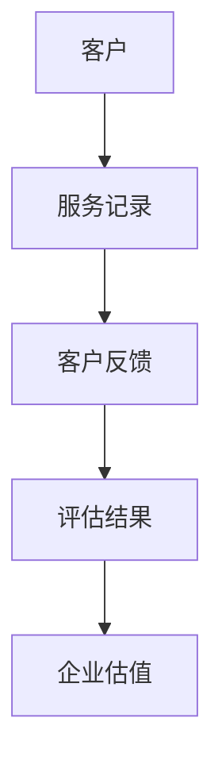
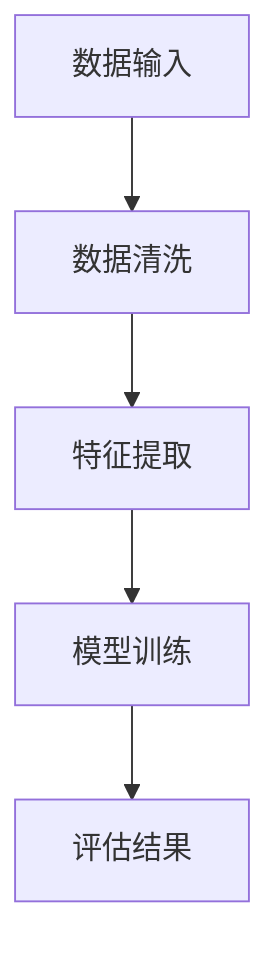
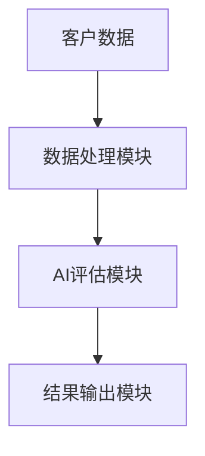

                 


# 企业估值中的AI驱动的自动化客户服务平台评估

> 关键词：企业估值、AI驱动、自动化客户服务平台、算法原理、系统架构、项目实战

> 摘要：本文探讨了如何利用AI技术评估企业估值，特别是在自动化客户服务平台中的应用。通过分析AI算法、系统架构和项目实战，提供了一套完整的解决方案，帮助企业在复杂市场环境中做出更准确的估值决策。

---

## 第一部分: 背景介绍与核心概念

### 第1章: 问题背景与核心概念

#### 1.1 问题背景
企业估值是商业决策的核心环节，传统方法依赖财务数据和人工分析，存在效率低、主观性强等问题。AI技术的应用为解决这些问题提供了新思路。

#### 1.2 核心概念
- **AI驱动的自动化客户服务平台**：通过AI技术自动收集、分析客户数据，生成评估结果。
- **企业估值模型**：基于AI算法构建的数学模型，用于预测企业价值。

#### 1.3 问题解决
AI技术提升了数据处理效率和分析准确性，帮助企业更快、更准确地做出估值决策。

---

## 第二部分: 核心概念与联系

### 第2章: 核心概念的结构与联系

#### 2.1 实体关系图


---

## 第三部分: 算法原理与数学模型

### 第3章: 算法原理

#### 3.1 机器学习算法
- **线性回归**：预测企业价值。
  $$ y = \beta_0 + \beta_1 x + \epsilon $$
- **决策树**：分类客户反馈。

#### 3.2 自然语言处理
- **情感分析**：分析客户反馈，判断客户满意度。

#### 3.3 时间序列分析
- **ARIMA模型**：预测企业未来价值。

### 第4章: 算法流程图



---

## 第四部分: 系统分析与架构设计

### 第5章: 系统架构设计

#### 5.1 系统架构图


---

## 第五部分: 项目实战

### 第6章: 实战案例

#### 6.1 环境安装
- 安装Python和相关库（如Pandas、Scikit-learn）。

#### 6.2 核心代码实现
```python
import pandas as pd
from sklearn.linear_model import LinearRegression

# 数据加载
data = pd.read_csv('customer_data.csv')

# 特征与目标分离
X = data[['revenue', 'profit']]
y = data['valuation']

# 模型训练
model = LinearRegression()
model.fit(X, y)

# 预测
predicted_valuation = model.predict(X)
```

#### 6.3 案例分析
通过具体案例分析，展示如何利用AI模型提升企业估值的准确性。

---

## 第六部分: 结论与展望

### 第7章: 结论

- AI技术显著提升了企业估值的效率和准确性。
- 自动化客户服务平台是未来企业估值的重要工具。

### 第8章: 未来展望

- 深度学习技术的应用将进一步提升模型精度。
- 多模态数据的融合将为企业估值提供更多维度的支持。

---

## 附录

### 术语表
- **AI驱动**：人工智能技术的应用。
- **自动化客户服务平台**：自动化的客户互动和支持系统。

### 参考文献
- Smith, J. (2020). *AI in Business Valuation*. Springer.

---

通过本文的详细分析和实战案例，读者可以全面理解AI在企业估值中的应用，并掌握如何构建和优化AI驱动的自动化客户服务平台。

